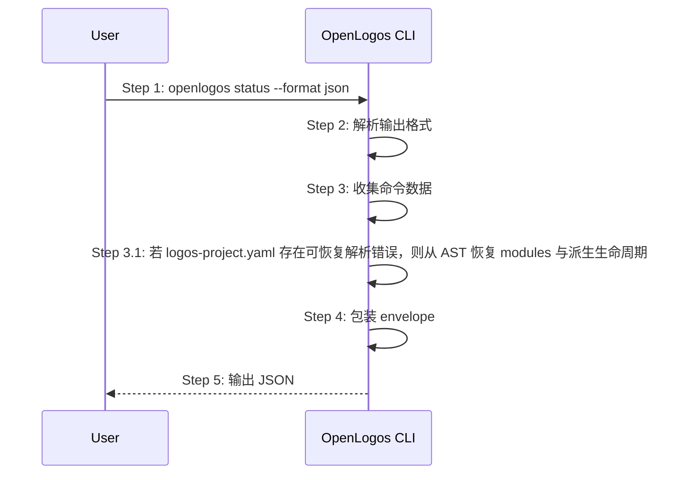

# S16: 输出机器可读 JSON 结果 — 时序图


```mermaid
sequenceDiagram
    participant U as User
    participant C as OpenLogos CLI

    U->>C: Step 1: openlogos status --format json
    C->>C: Step 2: 解析输出格式
    C->>C: Step 3: 收集命令数据
    C->>C: Step 3.1: 若 logos-project.yaml 存在可恢复解析错误，则从 AST 恢复 modules 与派生生命周期
    C->>C: Step 4: 包装 envelope
    C-->>U: Step 5: 输出 JSON
```

## 步骤说明
1. **用户或脚本**请求 JSON 输出。
2. **CLI** 解析 `--format json`。
3. **CLI** 收集真实数据；若 `logos-project.yaml` 局部损坏但 `modules` 可恢复，仍需继续输出 `modules` 与派生生命周期。
4. **CLI** 生成统一 envelope；`status` / `next` 的 `data` 顶层注入 `contract: {"version": "1.0.0"}`（语义化契约版本，独立于 CLI 版本；详见「envelope 契约版本握手（data.contract）」）。
5. **CLI** 输出 JSON。

## envelope 契约版本握手（data.contract）

本节按提案 contract-self-description（C5）定义机器契约的版本握手，S16 是 envelope / contract / schema 的定义场景（S05/S11 引用本节口径）。

- status/next 的 `data` 顶层新增 `"contract": {"version": "1.0.0"}`（语义化契约版本，独立于 CLI 版本）。envelope 既有顶层 `version`（= CLI 版本串）保持不变；二者语义不同、互不替代，flow 文件的整数 schema `version` 亦不受影响。
- **初始 `contract.version = "1.0.0"`**（本提案交付的契约形态即 1.0.0；此前无 `contract` 字段的历史输出视为「0.x 前契约时代」，消费方按缺字段保守分支处理）。
- SemVer 规则：**major** = 必填字段删除/改义、闭合枚举语义变化（含移除值）、既有字段挂出判据变更；**minor** = 向后兼容扩展（新增可选字段、闭合枚举新增值）；**patch** = 不改形态与语义的澄清。
- 版本-schema 一一映射：`spec/schema/status.schema.json`、`spec/schema/next.schema.json`（内嵌契约版本号，随 npm prepack 打包）；响应 `contract.version` 与打包 schema 版本一致，CI 校验。
- **主动破例**：破「data 顶层逐字节不变（golden 零漂移）」——`data` 顶层新增 `contract` → 全部 9 个 golden 基线快照重拍（`cli/test/golden-baseline.test.ts`）。这是本提案唯一的全量 golden 重拍点，破坏性集中在此，随大版本发布。

## JSON Schema 发布与生产者一致性校验（spec/schema/）

按提案 contract-self-description（C7）：

- CLI 仓发布 status/next 的 JSON Schema：`spec/schema/status.schema.json`、`spec/schema/next.schema.json`，版本化（内嵌契约版本号，随 `contract.version` 演进），落 `spec/schema/`，随 npm `prepack` 打包，附包内容验证测试（发布产物内 schema 完整）。
- CI 校验：
  1. 每个注册步骤/节点必须通过 schema 校验（含 step_meta/dispatch 必填，overlay-add 未声明 dispatch 走保守默认后同样过校验）；
  2. 响应 `contract.version` 与打包 schema 版本一一对应的校验（版本-schema 映射规则的 CI 落点）；
  3. **生产者一致性漂移注入测试**：在 CLI 注册全新步骤（如 `x-future-step`, `phase=pre-implement`）→ 断言 (a) 注册表/step_meta/schema 三方同步、schema 校验通过；(b) 该 pre-implement 步骤下 `loop_state` 不输出（激活判据的反面锚——`pre-implement + loop_state` 是非法组合，生产者测试断言其不存在，而非将其固化为合法夹具）。

## 未知字段与未知枚举的消费方保守语义（规范性引用）

- 消费方约定（规范性引用，验收归 runlogos R5）：driver 声明支持的 major 区间；未知 major / 缺 `contract` 字段 → 保守模式（仅 next 驱动普通推进 + 看门狗，启发式判定降级为仅观察）；契约内任何枚举遇未知值 → 保守分支。CLI 新增可选字段或闭合枚举新增值（minor）不再构成对旧消费方的破坏。
- `artifacts_hint: []` ＝「产物未知」契约语义：消费方不得据此判死，只能升级观察。
- **验收边界**：openlogos 本提案只验**生产者契约**——contract 版本字段在场、注册表/step_meta/schema 三方同步、dispatch/facts 字段来源正确、包内 schema 完整；消费方保守模式 / 零误杀 / suspect 可逆态验收归 runlogos R5 提案（用本提案发布的新生产者夹具喂旧/现役消费者做韧性测试）；双向契约测试是跨仓总方案完成定义，不是本仓单仓完成判据。
- 拍板原则：宁慢勿错杀——多等 5 分钟看门狗远好于误杀健康 run。一切措辞与设计冲突以此裁决。

## verify JSON 预跑状态
`openlogos verify --format json` 的 `data` 必须包含 `pre_run` 对象，用于表达预跑命令、阶段状态和诊断。RunLogos 只消费该对象，不复刻测试编排逻辑。

示例：

```jsonc
{
  "pre_run": {
    "mode": "two_phase",
    "commands": [
      { "stage": "regression", "command": "npm test", "status": "pass", "exit_code": 0 },
      { "stage": "incremental", "command": "npm run test:changed", "status": "pass", "exit_code": 0 }
    ],
    "result_paths": {
      "final": "logos/resources/verify/test-results.jsonl",
      "regression": "logos/resources/verify/test-results.regression.jsonl",
      "incremental": "logos/resources/verify/test-results.incremental.jsonl"
    },
    "merge_strategy": "last-write-wins",
    "diagnostics": [],
    "suggestions": []
  }
}
```

## next/status `code_required` 字段

`openlogos next` / `openlogos status --format json` 在存在活跃提案时，`modules[].active_change` 下输出布尔字段 `code_required`，表示当前提案是否需要代码实现。

- 取值等于内部谓词 `isCodeRequiredForProposal`（单一事实源），不复刻第二套判断。
- 仅当 `active_change` 非 null 时出现；无活跃提案时随整个对象不出现（零漂移边界）。
- 一致性：`code_required==false` 时 `next_node.id` 不为 `code`/`plan-slices`（slice 子流程 `when: code_required` 整段跳过）；`code_required==true` 且 `[code]` 未脱模板时维持 `ready-to-implement` / `plan-slices`。

外部消费方（如 RunLogos 驱动）应直接读取该字段判定「是否需要代码」，替代自行用关键词正则重判，避免与 CLI 派生结论分歧（见 reference `openlogos-runlogos-code-required-divergence-bug-report.md`）。契约字段定义见 `spec/cli-json-output.md` §3.11。

## 异常用例
### EX-2.1: 非 JSON 格式
- **触发条件**：未传入或传入非 json。
- **期望响应**：回退文本输出。

### EX-2.2: `logos-project.yaml` 局部损坏但 `modules` 可恢复
- **触发条件**：YAML 后半段存在语法错误，但 `modules` 节点仍可从 AST 恢复。
- **期望响应**：`detect/status --format json` 仍输出 `modules`、`lifecycle=launched`，并附带 `yaml_diagnostics.parse_status=recovered`。

### EX-2.3: `logos-project.yaml` 无法恢复
- **触发条件**：YAML 整体损坏，无法恢复任何模块信息。
- **期望响应**：返回明确的 `yaml_diagnostics.parse_status=error` 与错误摘要，不得静默回退为看起来正常的 `initial`。

### EX-2.4: verify 覆盖不足诊断
- **触发条件**：`verify --format json` 的 Gate 失败原因为 `incomplete_coverage`，且没有任何预跑命令。
- **期望响应**：JSON 输出中 `pre_run.mode="none"`，`pre_run.diagnostics[]` 包含局部测试可能性说明，`pre_run.suggestions[]` 包含配置 `verify.pre_run_command` 或 `verify.regression_command` 的建议。

### EX-2.5: 预跑命令失败
- **触发条件**：某个预跑命令返回非零退出码。
- **期望响应**：JSON 输出保留命令的 `stage`、`status="fail"`、`exit_code` 和错误摘要；verify 可继续读取已有结果，但 Gate 最终依据测试结果和覆盖度判定。

### EX-4.1: 历史输出缺 `contract` 字段（0.x 前契约时代）
- **触发条件**：消费方读取不含 `data.contract` 的旧版本 CLI 输出。
- **期望响应**（规范性引用，验收归 runlogos R5）：消费方按缺字段保守分支处理——进保守模式（仅 next 驱动普通推进 + 看门狗，启发式判定降级为仅观察），不得据此判死。
- **副作用**：无（生产者侧新版本的 status/next 恒输出 `contract`）。

### EX-4.2: `contract.version` 与打包 schema 版本不一致
- **触发条件**：响应 `contract.version` 与 `spec/schema/` 打包 schema 的内嵌契约版本号不一致。
- **期望响应**：CI 校验失败（生产者侧红线），阻止发布；不存在运行时自动降级分支。
- **副作用**：无。
