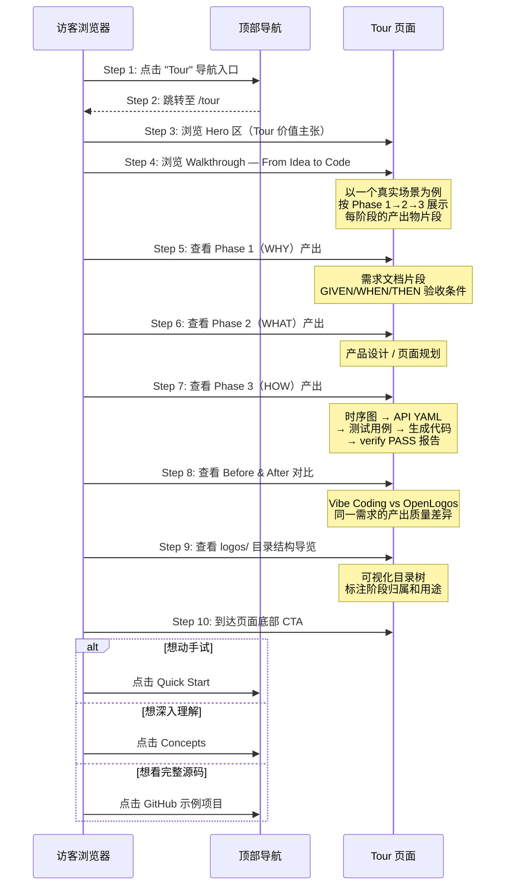

# S18: 交互式 Tour 产生体感 — 场景实现

> Phase 3 Step 1 · 场景建模

## 参与方

| 别名 | 组件 | 说明 |
|------|------|------|
| V | 访客浏览器 | 访问 openlogos.ai 的潜在用户 |
| Web | Astro 静态页面 | `website/src/pages/tour/` 下的 .astro 页面 |
| Nav | BaseLayout 导航 | 顶部导航栏（Tour 入口） |

## 场景定位

```
用户认知漏斗：

  S14 首页          →  "这东西是什么？"     （认知）
  Concepts 页       →  "为什么这样设计？"   （认同）
  ★ S18 Tour 页     →  "用起来是什么样？"   （体感）  ← 当前缺失
  S15 Quick Start   →  "我来试试"          （行动）
  Docs              →  "怎么配置/使用？"    （深入）
```

Tour 补上了 "概念认同 → 实际体感" 的关键断层，是推动用户从被动浏览到主动尝试的转化枢纽。

## 时序图



## 页面架构

### 路由结构

```
/tour                          → Tour 主页（核心 Walkthrough）
```

初期用一个完整的长页面承载所有内容，后续根据内容量可拆分为子页面：

```
/tour/before-and-after         → Vibe Coding vs OpenLogos 对比（可选）
/tour/project-anatomy          → logos/ 目录内容导览（可选）
```

### 页面分区设计

| 区域 | 内容 | 对应 AC |
|------|------|---------|
| Hero | Tour 的价值主张："See OpenLogos in action" | — |
| Walkthrough | 以真实场景展示 Phase 1→2→3 全流程产出物 | AC-S18-02 |
| Before & After | Vibe Coding vs OpenLogos 产出对比 | AC-S18-03 |
| Project Anatomy | logos/ 目录树可视化导览 | AC-S18-04 |
| CTA | Quick Start / Concepts / GitHub 示例 | AC-S18-05 |

### 导航集成

顶部导航栏新增 "Tour" 入口，位于 Concepts 和 Docs 之间：

```
Logo | Concepts v | Tour | Docs | Quick Start | GitHub | 中文
```

对应 AC-S18-01。

## 内容策略

### 示例场景选择

使用 **"用户注册"** 作为 Walkthrough 的贯穿场景，理由：

1. **普遍性**：几乎所有开发者都理解用户注册的需求
2. **完整性**：涵盖前端表单、后端 API、数据库、校验逻辑、错误处理——足以展示全流程
3. **简洁性**：单一场景足够聚焦，不会信息过载

### 每个 Phase 的展示内容

**Phase 1 · WHY — 需求文档片段**
- 用户痛点描述
- 场景 S01: 用户注册
- GIVEN/WHEN/THEN 验收条件（3-4 条）

**Phase 2 · WHAT — 产品设计片段**
- 页面列表：注册页 → 成功页
- 关键字段：email（必填、格式校验）、password（最少 8 位）
- 状态流转：空表单 → 填写中 → 提交中 → 成功/错误

**Phase 3 · HOW — 技术实现链路**
- Step 1: 时序图（浏览器 → API → DB）
- Step 2: API YAML 片段（POST /auth/register）+ DB DDL 片段（users 表）
- Step 3: 测试用例列表（UT-S01-001 ~ ST-S01-012）
- Step 4: 生成的代码片段（路由 + handler + 测试）
- Step 5: `openlogos verify` 输出（Gate 3.5: PASS）

### 与现有内容的差异化

| | Concepts | Tour | Docs |
|---|---|---|---|
| 回答的问题 | 为什么这样设计？ | 用起来是什么样？ | 怎么配置/使用？ |
| 内容类型 | 理论解释 | 真实产出物展示 | 技术参考 |
| 用户状态 | 好奇 → 认同 | 认同 → 想试试 | 决定用 → 查文档 |

## 技术实现要点

1. **路由**：`website/src/pages/tour/` 下创建 `.astro` 页面，使用 BaseLayout（与 Concepts 一致的营销页风格）
2. **导航**：在 `BaseLayout.astro` 的 `nav-links` 中新增 Tour 链接
3. **样式**：复用现有设计系统（`--color-*` 变量、card/section 组件模式），保持视觉一致性
4. **代码展示**：产出物片段使用语法高亮的代码块展示（YAML、Markdown、TypeScript、Mermaid）
5. **静态内容**：所有展示内容硬编码在 .astro 文件中（不需要从示例项目动态读取），确保展示效果可控

## 异常用例

本场景为纯静态展示页面，无异常流程。
