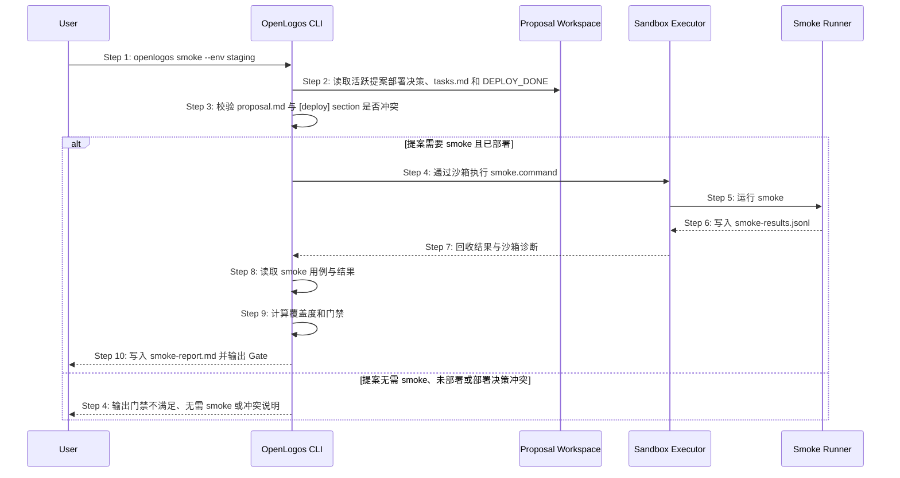
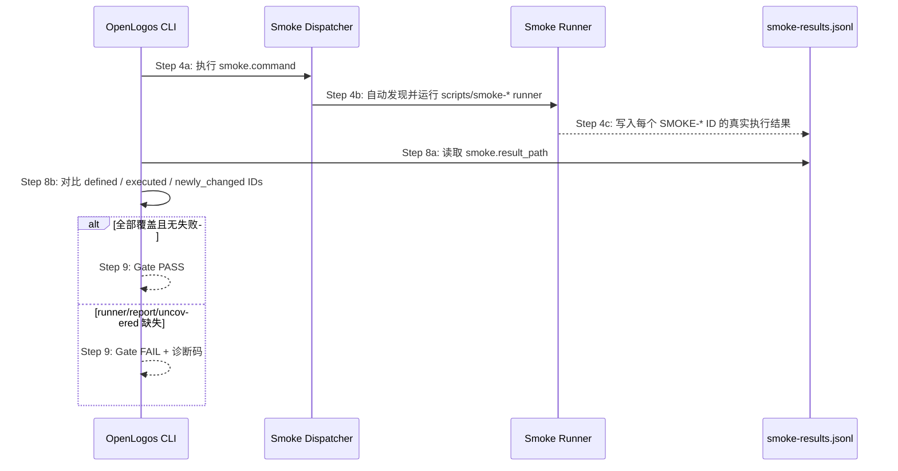

# S19: 执行部署后 smoke 门禁 — 时序图

## 步骤说明
1. **用户**明确授权运行 smoke。
2. **CLI** 读取提案级部署决策、`tasks.md` 和 `DEPLOY_DONE`。
3. **CLI** 先校验 `proposal.md` 与 `[deploy]` section 是否冲突；冲突时不得进入 smoke。
4. **CLI** 只有在 `smoke_required: true` 且 `DEPLOY_DONE` 存在时才继续；`deployment_progress` 仅用于展示，不替代 `DEPLOY_DONE` 门禁。
5. **Smoke Runner** 根据 `smoke.sandbox_mode` 决定是否通过沙箱执行。
6. **Sandbox Executor** 只回收 `smoke.result_path` 与 `smoke.report_path`，并返回沙箱诊断。
7. **CLI** 读取用例与结果。
8. **CLI** 判断 smoke 门禁。
9. **CLI** 输出报告并暴露沙箱状态。

## 异常用例
### EX-4.1: 缺少 smoke 用例
- **触发条件**：`logos/resources/test/smoke/` 没有用例。
- **期望响应**：输出错误并退出。

### EX-2.1: 提案无需 smoke
- **触发条件**：活跃提案声明 `smoke_required: false`。
- **期望响应**：不要求运行部署后 smoke，下一步应允许 archive。

### EX-3.1: 部署决策冲突
- **触发条件**：`proposal.md` 与 `tasks.md` 的部署结论不一致。
- **期望响应**：输出冲突警告并拒绝进入 smoke。

### EX-4.2: smoke sandbox always 无法隔离
- **触发条件**：`smoke.sandbox_mode=always`，但当前环境无法创建沙箱。
- **期望响应**：`openlogos smoke` 失败，输出沙箱根目录、失败原因和修复建议；不得写入通过标记。

### EX-4.3: smoke 命令写入仓库非白名单路径
- **触发条件**：`smoke.sandbox_deny_workspace_write=true`，`smoke.command` 写入仓库根目录中的非白名单路径。
- **期望响应**：`always` 模式下 smoke FAIL；`auto` 模式下若无法阻断写入必须输出 `sandbox.status=warn`，并给出改用 `always` 的建议。

## smoke 前置依赖 deploy-done

`openlogos smoke` 只能在部署完成状态明确后运行。部署完成状态由 `openlogos deploy-done` 写入的 `DEPLOY_DONE` 与已全勾的 `[deploy]` section 共同表达。

smoke 的前置校验必须保持：
- 提案声明需要 smoke。
- 提案部署决策无冲突。
- `DEPLOY_DONE` 存在。
- `[deploy]` section 已全部勾选。

`openlogos smoke` 不得替代 `openlogos deploy-done` 写入部署完成 marker；如果缺少 `DEPLOY_DONE`，应提示先完成部署并执行 `openlogos deploy-done`。

重新执行 `openlogos deploy-done` 会清理旧的 `SMOKE_PASS` / `SMOKE_FAIL`，因此 smoke 结果只对应最近一次确认完成的部署。

## smoke runner / reporter / dispatcher 覆盖检查

`openlogos smoke` 在执行 `smoke.command` 后，读取 smoke 用例与结果时必须同时检查 runner 覆盖来源：

### runner 接入要求
- `smoke.command` 可以直接执行单个 runner，也可以执行统一 dispatcher。
- 推荐 dispatcher 自动发现 `scripts/smoke-*.sh`、`scripts/smoke-*.mjs` 或项目声明的等效 runner。
- runner 必须使用配置声明的 `smoke.result_path` 写入 JSONL；不得写入硬编码路径后让 CLI 读取不到。
- runner 对每个实际执行的 smoke case 写入 `{ "id": "SMOKE-...", "status": "pass"|"fail"|"skip", ... }`。
- smoke PASS 只能来自真实执行结果；禁止为了满足覆盖率直接追加伪造 PASS。

### Gate 判定补充
- defined 来自 `logos/resources/test/smoke/*.md`。
- executed 来自 `smoke.result_path`。
- uncovered = defined 中不存在于 executed 的 ID。
- 若 uncovered 包含当前提案新增或修改的 smoke ID，`gate.reason` 应优先表达为 `smoke_cases_uncovered`，并保留 `uncovered_cases` 列表。
- 若没有结果文件或结果文件为空，诊断应区分为 `smoke_reporter_missing`。
- 若 `smoke.command` 缺失、没有 dispatcher 或无法发现 runner，诊断应区分为 `smoke_runner_missing`。

### 与 deploy-done 的关系
本检查不改变 S19 的前置门禁：仍必须先满足 `VERIFY_PASS`、`DEPLOY_DONE`、`[deploy]` 全勾和 `smoke_required=true`。runner 覆盖检查只负责判断 smoke 用例是否真的执行，不替代部署完成状态。
