# S19: 执行部署后 smoke 门禁 — 时序图

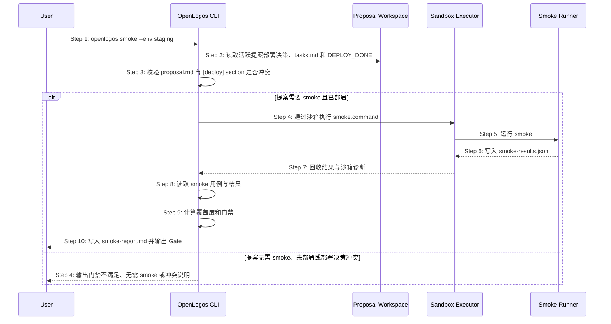
```mermaid
sequenceDiagram
    participant U as User
    participant C as OpenLogos CLI
    participant P as Proposal Workspace
    participant X as Sandbox Executor
    participant S as Smoke Runner

    U->>C: Step 1: openlogos smoke --env staging
    C->>P: Step 2: 读取活跃提案部署决策、tasks.md 和 DEPLOY_DONE
    C->>C: Step 3: 校验 proposal.md 与 [deploy] section 是否冲突
    alt 提案需要 smoke 且已部署
        C->>X: Step 4: 通过沙箱执行 smoke.command
        X->>S: Step 5: 运行 smoke
        S-->>X: Step 6: 写入 smoke-results.jsonl
        X-->>C: Step 7: 回收结果与沙箱诊断
        C->>C: Step 8: 读取 smoke 用例与结果
        C->>C: Step 9: 计算覆盖度和门禁
        C-->>U: Step 10: 写入 smoke-report.md 并输出 Gate
    else 提案无需 smoke、未部署或部署决策冲突
        C-->>U: Step 4: 输出门禁不满足、无需 smoke 或冲突说明
    end
```

## 步骤说明
1. **用户授权运行 smoke**：半自动（无 `--auto`）下由用户**明确授权**运行；全自动（`--auto`）下由 `--auto` 建立的 **standing run-scoped 授权**放行，宿主 driver 自动运行 `openlogos smoke`（约束其行为的指令文本已新增 `--auto` 例外授权），放行事件向活跃提案目录的 `GATE_AUTO_PASSED` 追加审计行。无论哪档，下文前置门禁均照常校验。
2. **CLI** 读取提案级部署决策、`tasks.md` 和 `DEPLOY_DONE`。
3. **CLI** 先校验 `proposal.md` 与 `[deploy]` section 是否冲突；冲突时不得进入 smoke。
4. **CLI** 只有在 `smoke_required: true` 且 `DEPLOY_DONE` 存在时才继续；`deployment_progress` 仅用于展示，不替代 `DEPLOY_DONE` 门禁。
5. **Smoke Runner** 根据 `smoke.sandbox_mode` 决定是否通过沙箱执行。
6. **Sandbox Executor** 只回收 `smoke.result_path` 与 `smoke.report_path`，并返回沙箱诊断。
7. **CLI** 读取用例与结果。
8. **CLI** 判断 smoke 门禁。
9. **CLI** 输出报告并暴露沙箱状态。

## --auto 全自动下的 smoke 自动运行（standing 授权）

`openlogos smoke` 是「代码已绿之后」由 CLI 驱动的盖章/发布类红线步骤之一，**非 flow gate**。其 `--auto` 行为按两档区分：

- **半自动（无 `--auto`）**：smoke 维持**人类确认点**——必须由用户明确授权后才运行 `openlogos smoke`，行为完全不变。
- **全自动（`--auto`）**：用户选 `--auto` 即对该提案建立 standing run-scoped 授权，宿主 driver **自动运行** `openlogos smoke`，无需逐步人工接入；每次放行向 `logos/changes/<slug>/GATE_AUTO_PASSED` 追加审计行（append-only，是审计、非状态源）。

**边界（强制保留）**：
- `--auto` 仅移除「人工确认运行 smoke」这一步，**不放松任何 smoke 前置门禁**：仍必须满足 `VERIFY_PASS`、`DEPLOY_DONE`、`[deploy]` 全勾、`smoke_required:true`，且 runner / reporter / dispatcher 覆盖检查与 sandbox 隔离判定一字不改。前置不满足时 `--auto` 同样不进入 smoke。
- smoke PASS 只能来自真实执行结果；`--auto` 不得为满足覆盖率追加伪造 PASS。
- smoke 不在 `loop-exhausted` 守门范围内；4 样红线（verify/smoke/archive/git push）的 standing 授权放行**不含**未收敛代码退出门。

## 异常用例
### EX-4.1: 缺少 smoke 用例
- **触发条件**：`logos/resources/test/smoke/` 没有用例。
- **期望响应**：输出错误并退出。

### EX-2.1: 提案无需 smoke
- **触发条件**：活跃提案声明 `smoke_required: false`。
- **期望响应**：不要求运行部署后 smoke，下一步应允许 archive。

### EX-3.1: 部署决策冲突
- **触发条件**：`proposal.md` 与 `tasks.md` 的部署结论不一致。
- **期望响应**：输出冲突警告并拒绝进入 smoke。

### EX-4.2: smoke sandbox always 无法隔离
- **触发条件**：`smoke.sandbox_mode=always`，但当前环境无法创建沙箱。
- **期望响应**：`openlogos smoke` 失败，输出沙箱根目录、失败原因和修复建议；不得写入通过标记。

### EX-4.3: smoke 命令写入仓库非白名单路径
- **触发条件**：`smoke.sandbox_deny_workspace_write=true`，`smoke.command` 写入仓库根目录中的非白名单路径（规范化后存在完整路径段严格等于 `node_modules` 的写入不参与本判定，见 EX-4.4；近似名称目录如 `src/node_modules-cache/**` 仍参与本判定）。
- **期望响应**：`always` 模式下 smoke FAIL；`auto` 模式下若无法阻断写入必须输出 `sandbox.status=warn`，并给出改用 `always` 的建议。

### EX-4.4: 沙箱内依赖准备写入（依赖目录豁免）
- **触发条件**：`smoke.sandbox_deny_workspace_write=true`，`smoke.command` 仅写入沙箱副本内命中豁免规则的路径——规范化并统一分隔符后存在完整路径段严格等于 `node_modules`（含 monorepo 嵌套形态如 `packages/a/node_modules/**`）。典型来源：pnpm 11 `verifyDepsBeforeRun=install` 在沙箱副本内自动 install/repair，重写 `node_modules/.bin/*`。
- **期望响应**：任一沙箱模式下均不判为非白名单写入——`always` 不因此 FAIL，`auto` 不因此 warn；`sandbox.infos` 输出一条固定信息级豁免说明，`sandbox.diagnostics` 不含该说明，文本输出以 `ℹ️` 渲染一次；`sandbox.status` 不因此改变；白名单之外的豁免路径不回收到原 workspace，快照遍历直接跳过；`smoke.result_path` 即使位于 `node_modules` 下仍被定点采集回收。沙箱执行器为 verify / smoke 共享，豁免语义、symlink 隔离与运行期写保护不变量（启动前逃逸按无法隔离处理，运行期新建/改写链接由 OS 级写保护在写入发生前阻断，写保护不可用时按能力分层 `always` 失败 / `auto` 告警，见 S13 EX-3.4）与白名单定点采集回收均与 S13 一致（见功能规格 §2.9）。豁免规则之外的非白名单写入判定不变（仍按 EX-4.3 处理）。

## smoke 前置依赖 deploy-done

`openlogos smoke` 只能在部署完成状态明确后运行。部署完成状态由 `openlogos deploy-done` 写入的 `DEPLOY_DONE` 与已全勾的 `[deploy]` section 共同表达。

smoke 的前置校验必须保持：
- 提案声明需要 smoke。
- 提案部署决策无冲突。
- `DEPLOY_DONE` 存在。
- `[deploy]` section 已全部勾选。

`openlogos smoke` 不得替代 `openlogos deploy-done` 写入部署完成 marker；如果缺少 `DEPLOY_DONE`，应提示先完成部署并执行 `openlogos deploy-done`。

重新执行 `openlogos deploy-done` 会清理旧的 `SMOKE_PASS` / `SMOKE_FAIL`，因此 smoke 结果只对应最近一次确认完成的部署。

## smoke runner / reporter / dispatcher 覆盖检查

`openlogos smoke` 在执行 `smoke.command` 后，读取 smoke 用例与结果时必须同时检查 runner 覆盖来源：

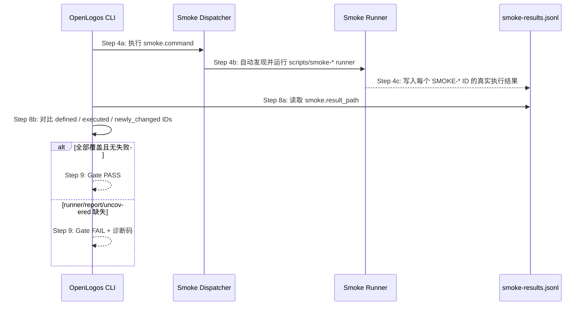
```mermaid
sequenceDiagram
    participant C as OpenLogos CLI
    participant D as Smoke Dispatcher
    participant S as Smoke Runner
    participant R as smoke-results.jsonl

    C->>D: Step 4a: 执行 smoke.command
    D->>S: Step 4b: 自动发现并运行 scripts/smoke-* runner
    S-->>R: Step 4c: 写入每个 SMOKE-* ID 的真实执行结果
    C->>R: Step 8a: 读取 smoke.result_path
    C->>C: Step 8b: 对比 defined / executed / newly_changed IDs
    alt 全部覆盖且无失败
        C-->>C: Step 9: Gate PASS
    else runner/report/uncovered 缺失
        C-->>C: Step 9: Gate FAIL + 诊断码
    end
```

### runner 接入要求

- `smoke.command` 可以直接执行单个 runner，也可以执行统一 dispatcher。
- 推荐 dispatcher 自动发现 `scripts/smoke-*.sh`、`scripts/smoke-*.mjs` 或项目声明的等效 runner。
- runner 必须使用配置声明的 `smoke.result_path` 写入 JSONL；不得写入硬编码路径后让 CLI 读取不到。
- runner 对每个实际执行的 smoke case 写入 `{ "id": "SMOKE-...", "status": "pass"|"fail"|"skip", ... }`。
- smoke PASS 只能来自真实执行结果；禁止为了满足覆盖率直接追加伪造 PASS。
- **环境不具备时必须写 skip，禁止静默零记录退出**：runner 自检发现缺第三方宿主客户端、缺历史候选制品或缺必需 env 时，必须为其**全部** owned 用例写 `status:"skip"` 记录并以成功状态退出。零记录退出会让「不适用」与「该跑没跑」在账本上同形，两者都只能表现为 uncovered。
- **skip 必须携带不适用原因**：记录中给出机器可读的缺失项（具体 env 名或制品名），供 JSON 与 `smoke-report.md` 审计；不得只写 `skip` 而不说明为何不适用。
- **一次性迁移 / 恢复类用例以终态为判据**：其被测对象是会被消费掉的外部事务，判据必须表述为「目标事务处于 completed 且 receipt 自洽」并经 `--slug` 显式寻址，不得要求目标处于某个会被消费的中间相位，也不得依赖它恰好挂在活跃 guard 下。

### Gate 判定补充
- defined 来自 `logos/resources/test/smoke/*.md`。
- executed 来自 `smoke.result_path`。
- uncovered = defined 中不存在于 executed 的 ID。
- 若 uncovered 包含当前提案新增或修改的 smoke ID，`gate.reason` 应优先表达为 `smoke_cases_uncovered`，并保留 `uncovered_cases` 列表。
- 若没有结果文件或结果文件为空，诊断应区分为 `smoke_reporter_missing`。
- 若 `smoke.command` 缺失、没有 dispatcher 或无法发现 runner，诊断应区分为 `smoke_runner_missing`。

### 与 deploy-done 的关系
本检查不改变 S19 的前置门禁：仍必须先满足 `VERIFY_PASS`、`DEPLOY_DONE`、`[deploy]` 全勾和 `smoke_required=true`。runner 覆盖检查只负责判断 smoke 用例是否真的执行，不替代部署完成状态。

## smoke skip 统计口径

`openlogos smoke` 读取 `smoke-results.jsonl` 时，`status:"skip"` 表示 smoke runner 已显式处理该用例，但当前环境缺少部署目标、外部依赖或平台能力，无法执行真实断言。

统计规则：

- skip 计入 `executed_count` 和 `skipped_count`；
- skip 对应的 `SMOKE-*` 不再计入 uncovered；
- skip 不计入 `failed_count`，不得单独导致 smoke Gate FAIL；
- `pass_rate_pct` 按有效通过数计算：`round((passed_count + skipped_count) / executed_count * 100)`；
- `skipped_cases` 必须继续在 JSON 和 `smoke-report.md` 中展示，供用户审计环境性跳过。

Gate 判定边界不变：

- 只要存在 `fail`，smoke Gate 必须 FAIL；
- 只要存在 uncovered，smoke Gate 必须 FAIL；
- runner / reporter / dispatcher 覆盖诊断仍可使 Gate FAIL；
- sandbox failure 仍可使 Gate FAIL；
- `VERIFY_PASS`、`DEPLOY_DONE`、`[deploy]` 全勾和 `smoke_required=true` 等前置门禁不因 skip 语义而放松。

该口径与 verify 保持一致：skip 是可见的有效通过，不是未覆盖，也不是失败。

## auto_execute：`--auto` 下 ready-to-smoke 的自动执行信号（auto-execute-redline-steps）

`next --auto` 在 `proposal_step==ready-to-smoke`（`DEPLOY_DONE` 在场、smoke_required=true）且未被阻塞时，输出 `auto_execute:true` + `command="openlogos smoke"`，`action`/`detail` 改为「auto: 自动执行 smoke」措辞，供无人值守 driver 自动运行 smoke。`openlogos smoke` 命令本身逻辑、smoke 门禁前置判定、smoke FAIL 硬阻塞均不变。半自动（无 `--auto`）下仍是人类确认点、不置 `auto_execute`。详见 `core-S24-auto-gate.md` 的 auto_execute 节与 `spec/cli-json-output.md` §11.2。

## `local-isolated` TRAE 负向 Smoke 门禁时序

### 目标

S19 接受字符串环境 `local-isolated`，但只为当前提案调度 OpenLogos `0.13.29` 候选 tarball 的负向 runner。它不将 TRAE 注册为 deployable，也不启动真实 TRAE 写工具。smoke 与部署仍是两个独立的人类确认点。

### 主时序

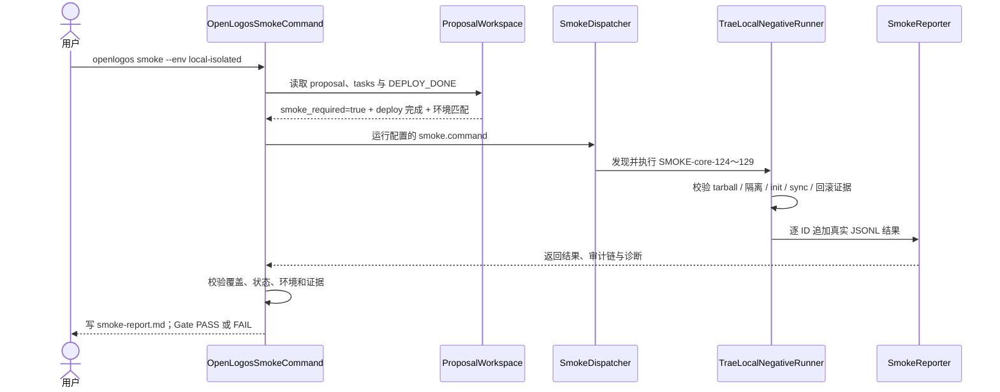
```mermaid
sequenceDiagram
    actor U as 用户
    participant C as OpenLogosSmokeCommand
    participant P as ProposalWorkspace
    participant D as SmokeDispatcher
    participant R as TraeLocalNegativeRunner
    participant J as SmokeReporter
    U->>C: openlogos smoke --env local-isolated
    C->>P: 读取 proposal、tasks 与 DEPLOY_DONE
    P-->>C: smoke_required=true + deploy 完成 + 环境匹配
    C->>D: 运行配置的 smoke.command
    D->>R: 发现并执行 SMOKE-core-124～129
    R->>R: 校验 tarball / 隔离 / init / sync / 回滚证据
    R->>J: 逐 ID 追加真实 JSONL 结果
    J-->>C: 返回结果、审计链与诊断
    C->>C: 校验覆盖、状态、环境和证据
    C-->>U: 写 smoke-report.md；Gate PASS 或 FAIL
```

### 前置门禁

1. 活跃提案必须声明 `deployment_required=true`、`smoke_required=true`，且 `[deploy]` 全部勾选。
2. `DEPLOY_DONE` 必须属于 `local-isolated`，并关联本次 `0.13.29` 候选 tarball SHA-256；缺失或环境不匹配时拒绝调度。
3. `OPENLOGOS_TRAE_LOCAL_TARBALL` 与 `OPENLOGOS_TRAE_ROLLBACK_TARBALL` 必须存在，并分别解析为版本精确的 `0.13.29` 与 `0.13.28` 真实 tarball。
4. dispatcher 必须发现覆盖 SMOKE-core-124～SMOKE-core-129 的 runner；缺失 runner/reporter 时不得将其它历史结果补位。

### 结果与失败路径

- 每个结果至少含 `id`、`status`、`timestamp`、`duration_ms`、`environment="local-isolated"`、候选/回滚 tarball SHA-256 和脱敏 evidence；status 只允许按真实执行写入。
- 任一 ID 缺失、skip、fail、重复矛盾、环境不匹配、制品 SHA 不匹配或证据链不完整，Gate 为 FAIL 并写 `SMOKE_FAIL`，不得写 `SMOKE_PASS`。
- runner 若尝试访问真实 HOME、全局 npm、仓库外用户项目、真实 `.trae/**`、TRAE 账号/记忆，或启动客户端/内置写工具，立即失败。
- wrapper 直调、项目 Hook 文件存在、Rules/MCP 软拒绝、客户端 UI 或人工确认不能作为 hard guard 结果；出现此类证据时报告 capability 误判。
- 公开发布命令不属于 runner 调用图；若检测到 publish/tag/release/官网部署意图，门禁失败。

### 追溯

- 单元测试：UT-S19-10、UT-S19-11。
- 场景测试：ST-S19-09。
- Smoke：SMOKE-core-124～SMOKE-core-129。

## OpenLogos 0.14.0 全局 candidate 与 RunLogos 后验门

### 场景目标

在 verify 通过后，用真实打包并安装到本机全局的 OpenLogos `0.14.0` 验证 transaction 合同，再把同一 candidate 交给 RunLogos 做跨仓 E2E；源码态或 mock 不能冒充部署后 smoke。

### 参与者与前置条件

- 部署执行者：按已授权部署方案构建/安装/回滚；
- 全局 OpenLogos：实际被 shell 解析的 candidate；
- OpenLogos smoke runner/reporter：逐 ID 记录安装态结果；
- RunLogos：后续真实跨仓消费者。

前置条件：`VERIFY_PASS` 有效、部署任务获得明确授权、0.13.31 命令路径/版本/安装来源和回滚命令已记录、0.14.0 tarball 与 SHA-256 已冻结。

### 成功后置条件

- 新 shell 的 `command -v openlogos` 指向目标全局安装，`openlogos --version` 精确为 `0.14.0`；
- 随包 merge transaction schema、双语 merge-executor Skill、contract hash/golden 与源码候选一致；
- 安装态 smoke 全部 PASS 并产生 OpenLogos reporter 结果；
- RunLogos 可只通过全局命令路径调用同一 candidate；
- 失败时可恢复 0.13.31 且不留下错误版本或半安装状态。

### 主时序

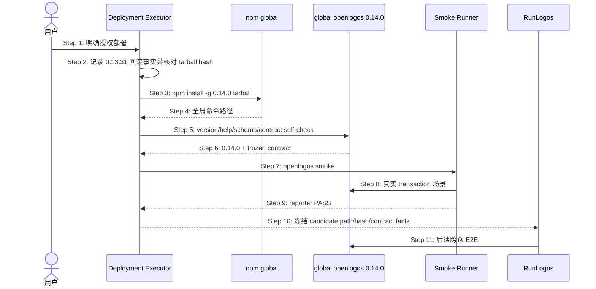
```mermaid
sequenceDiagram
    actor U as 用户
    participant D as Deployment Executor
    participant N as npm global
    participant O as global openlogos 0.14.0
    participant S as Smoke Runner
    participant R as RunLogos
    U->>D: Step 1: 明确授权部署
    D->>D: Step 2: 记录 0.13.31 回滚事实并核对 tarball hash
    D->>N: Step 3: npm install -g 0.14.0 tarball
    N-->>D: Step 4: 全局命令路径
    D->>O: Step 5: version/help/schema/contract self-check
    O-->>D: Step 6: 0.14.0 + frozen contract
    D->>S: Step 7: openlogos smoke
    S->>O: Step 8: 真实 transaction 场景
    S-->>D: Step 9: reporter PASS
    D-->>R: Step 10: 冻结 candidate path/hash/contract facts
    R->>O: Step 11: 后续跨仓 E2E
```

### 步骤说明

1. 部署是独立人类确认点；plan 批准和 verify 不自动授权部署。
2. 在覆盖全局命令前保存可复制回滚事实，不能只记录版本字符串。
3. 安装真实 `npm pack` tarball，不用仓库内 `node dist` 或 symlink 冒充。
4. 在新 shell 解析命令，排除 shell hash/cache 指向旧版本。
5. 验证版本、命令面、随包 schema/Skill 与 contract hash。
6. 任一不一致立即失败，不进入 RunLogos。
7. smoke 只在 DEPLOY_DONE 与部署任务完成后执行。
8. runner 覆盖 CREATE、MODIFY、mixed、no-delta、validator retry、status 只读、崩溃恢复和 response-lost。
9. 每个 SMOKE ID 写真实 reporter 结果，不以手工结论替代。
10. 冻结绝对命令路径、tarball SHA-256、schema hash 和 contract hash供 RunLogos 使用。
11. RunLogos 不得改用源码路径或 mock。

### 异常与边界

#### EX-MT-19-1：全局版本或路径不符
- **触发条件**：命令仍指向旧安装、版本不是 0.14.0 或 tarball hash 不匹配。
- **期望响应**：部署/smoke 失败，不向 RunLogos声明 candidate ready；按方案回滚。
- **副作用**：记录诊断与回滚结果。

#### EX-MT-19-2：随包合同漂移
- **触发条件**：schema/Skill/contract hash 与源码冻结值不同或 `merge-transaction --help` 缺失。
- **期望响应**：candidate 无效，禁止 RunLogos 接入。
- **副作用**：恢复 0.13.31 或保留隔离诊断环境。

#### EX-MT-19-3：RunLogos 绕过 candidate
- **触发条件**：下游使用源码相对路径、mock、预造 receipt 或手工 target。
- **期望响应**：跨仓验收无效，不能进入完成/归档判定。
- **副作用**：OpenLogos 已完成 smoke 事实不被篡改。

#### EX-MT-19-4：出现公开发布命令
- **触发条件**：部署调用图包含 npm publish、tag、release、官网部署或 push。
- **期望响应**：立即阻断；本机全局部署授权不扩张为公开发布授权。
- **副作用**：不得执行公开命令。

### 追溯

- 部署方案：0.14.0 本机全局 candidate。
- 测试：UT-S19-12～UT-S19-18、ST-S19-10～ST-S19-13、SMOKE-core-141～SMOKE-core-150。

## S19 修正 candidate 与双 slug smoke 交接

### 主路径

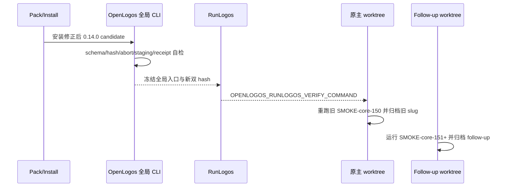
```mermaid
sequenceDiagram
    participant P as Pack/Install
    participant O as OpenLogos 全局 CLI
    participant R as RunLogos
    participant M as 原主 worktree
    participant F as Follow-up worktree
    P->>O: 安装修正后 0.14.0 candidate
    O->>O: schema/hash/abort/staging/receipt 自检
    O-->>R: 冻结全局入口与新双 hash
    R-->>M: OPENLOGOS_RUNLOGOS_VERIFY_COMMAND
    M->>M: 重跑旧 SMOKE-core-150 并归档旧 slug
    F->>F: 运行 SMOKE-core-151+ 并归档 follow-up
```

### 门禁

- 旧 candidate tarball/schema/contract hash 必须显式标为失效。
- 新 candidate 必须从真实 npm tarball 安装，不得用源码入口、workspace link 或 mock。
- SMOKE-core-150 仍只属于旧 slug；新 smoke ID 不覆盖或伪造其结果。
- 两个 worktree 分别维护自己的 VERIFY/DEPLOY/SMOKE marker 和报告。
- RunLogos 命令必须覆盖声明 staging、abort、completed commit_paths/final/artifact hashes 和 response-lost。
- 任一失败保留对应 slug 的 SMOKE_FAIL，不得借另一 worktree 的 PASS 归档。

## S19 0.14.1 本地全局 patch 候选分支

### 场景目标

在不触发公开发布的前提下，把已通过 verify 的仓库当前实现打成真实 0.14.1 npm tarball、安装到本机全局入口，并在部署后用同一制品执行最小 smoke；任一阶段失败都能恢复到冻结的 0.14.0，而不会留下混合版本或伪造成功证据。

### 参与者

- **用户（U）**：分别授权本地全局部署与部署后 smoke。
- **部署执行者（D）**：冻结旧版本事实、构建制品、安装、自检、回滚并生成部署报告。
- **npm 全局环境（N）**：承载实际 shell 命令入口和全局 package root。
- **全局 OpenLogos（O）**：从真实安装包运行版本、资产和 merge transaction 合同检查。
- **Smoke Runner（S）**：执行 SMOKE-core-157～159 并通过 reporter 写入真实结果。

### 前置条件

- 活跃提案为 `release-0-14-1-local`，规格与实现已完成，`VERIFY_PASS` 有效。
- 用户已明确授权部署到本机 npm 全局环境，但未授权任何公开发布动作。
- 当前全局命令为 0.14.0，命令路径、realpath、npm prefix、package root 和可复制回滚来源可读取。
- 0.14.1 package/candidate identity 已同步，CLI 全量测试与构建通过。

### 成功后置条件

- 新 shell 解析的全局命令、package、五类插件 manifest、asset manifest 和 candidate 证据均精确为 0.14.1，并绑定同一 tarball SHA-256。
- 部署报告记录部署前 0.14.0、0.14.1 candidate、安装命令、自检、回滚点与未解决风险。
- 获得独立 smoke 授权后，SMOKE-core-157～159 全部真实 PASS，结果归属于同一 candidate；公开发布副作用为零。
- 任一步失败时全局入口恢复为冻结的 0.14.0，或显式停在恢复失败状态且不写 `DEPLOY_DONE` / `SMOKE_PASS`。

### 主时序

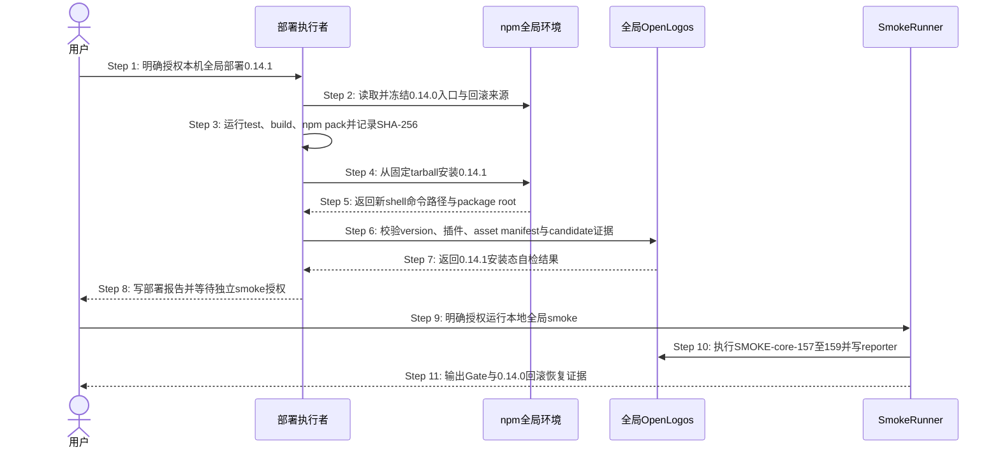
```mermaid
sequenceDiagram
    actor U as 用户
    participant D as 部署执行者
    participant N as npm全局环境
    participant O as 全局OpenLogos
    participant S as SmokeRunner
    U->>D: Step 1: 明确授权本机全局部署0.14.1
    D->>N: Step 2: 读取并冻结0.14.0入口与回滚来源
    D->>D: Step 3: 运行test、build、npm pack并记录SHA-256
    D->>N: Step 4: 从固定tarball安装0.14.1
    N-->>D: Step 5: 返回新shell命令路径与package root
    D->>O: Step 6: 校验version、插件、asset manifest与candidate证据
    O-->>D: Step 7: 返回0.14.1安装态自检结果
    D-->>U: Step 8: 写部署报告并等待独立smoke授权
    U->>S: Step 9: 明确授权运行本地全局smoke
    S->>O: Step 10: 执行SMOKE-core-157至159并写reporter
    S-->>U: Step 11: 输出Gate与0.14.0回滚恢复证据
```

### 步骤说明

1. **用户**只授权把当前仓库 candidate 部署到本机 npm 全局环境；授权不包含 publish、tag、release、官网部署或 push。
2. **部署执行者**在覆盖入口前读取全局 0.14.0 的命令路径、realpath、npm prefix 和 package root，并从当前已安装包生成或确认固定的本地回滚 tarball。
3. **部署执行者**依次执行 CLI 全量测试、TypeScript 构建和真实 `npm pack`，从 pack JSON 与解包字节核验包名、0.14.1 版本、bin、五类插件、asset manifest、文件数、大小和 SHA-256。身份不符时进入 EX-3.2。
4. **部署执行者**只从已冻结的 0.14.1 tarball 绝对路径执行全局安装，不使用 workspace link 或仓库源码入口。
5. **npm 全局环境**在新 shell 中返回重新解析后的命令路径与 package root；若入口仍指向旧缓存、link 或 prefix 外路径，进入 EX-5.1。
6. **部署执行者**调用全局 OpenLogos 校验 `--version`、package/plugin/asset manifest、schema/contract hash 与 candidate 证据；任一混合版本或旧证据进入 EX-6.1。
7. **全局 OpenLogos**返回与同一 0.14.1 tarball SHA-256 绑定的安装态事实。
8. **部署执行者**生成部署报告；自检全部通过才允许调用 `openlogos deploy-done --env local-global`，随后停在独立 smoke 授权点。
9. **用户**另行明确授权运行部署后 smoke；plan 批准、verify 或部署授权均不能替代本步骤。
10. **Smoke Runner**通过统一 dispatcher 调用已安装的绝对全局入口，执行 SMOKE-core-157～159，并逐 ID 写入 `smoke-results.jsonl`。任一结果或归属异常进入 EX-10.1。
11. **Smoke Runner**向用户输出 Gate；回滚演练必须完成 `0.14.1 → 0.14.0 → 0.14.1` 并验证每一步入口、版本与 SHA，最终保持 0.14.1。

### 异常与边界

#### EX-3.2：0.14.1 tarball 身份不一致

- **触发条件**：Step 3 的 package version、文件名、bin、插件/asset manifest、解包清单或 SHA-256 任一不一致。
- **期望响应**：停止安装并报告精确漂移项；不修改本机全局环境，不写部署成功标记。
- **副作用**：仅保留本次打包产物与诊断，当前全局 0.14.0 不变。

#### EX-5.1：全局入口未切换到目标制品

- **触发条件**：Step 5 的新 shell 仍解析到旧 cache、workspace link、仓库源码入口或目标 npm prefix 之外的命令。
- **期望响应**：判定部署失败，清理 shell cache 后重查；仍不一致则使用冻结制品恢复 0.14.0。
- **副作用**：不得继续 smoke，不写 `DEPLOY_DONE`。

#### EX-6.1：安装态资产或 candidate 证据漂移

- **触发条件**：Step 6 发现 package、任一插件、asset manifest、schema/contract hash 或 candidate version 混用 0.14.0/0.14.1，或证据缺字段、hash 不同源。
- **期望响应**：fail-closed，恢复冻结的 0.14.0 并验证入口/版本；恢复失败时显式阻塞。
- **副作用**：保留脱敏诊断，不写部署或 smoke 成功标记。

#### EX-10.1：smoke 结果不完整或副作用越界

- **触发条件**：Step 10 任一 SMOKE-core-157～159 缺失、skip、fail、重复矛盾、candidate 归属漂移，或调用图出现公开发布动作。
- **期望响应**：Smoke Gate FAIL，写失败报告但不写 `SMOKE_PASS`；必要时恢复 0.14.0。
- **副作用**：禁止 npm publish、dist-tag、Git tag、GitHub Release、官网/Cloudflare 部署与 git push。

### 派生边界与追溯

- API/RPC/消息边界：无；全部交互为本机 CLI 子进程、npm package 与文件证据。
- 持久化边界：只写 npm 全局 package、提案部署报告、`DEPLOY_DONE`（通过受控命令）和 smoke JSONL/报告；无数据库。
- 需求：S19-AC-01～S19-AC-04。
- 测试：UT-S19-22、UT-S19-23、ST-S19-15、SMOKE-core-157～SMOKE-core-159。

## S19 OpenLogos 0.14.2 Preflight/Reopen 候选门

### 场景目标

以真实npm tarball证明0.14.2安装态同时支持新事务seal前拒绝、0.14.1 legacy sealed局部reopen、回滚和RunLogos同事务恢复；源码直跑或mock不能替代。

### 授权与前置条件

1. 规格已明确merge、代码切片全部完成，`openlogos verify`为PASS。
2. 获得本机部署明确授权后才pack/install；获得smoke授权后才运行安装态smoke；获得RunLogos恢复/继续merge授权后才触达该仓库。
3. 冻结0.14.1全局入口、realpath、package/plugin/asset hashes及固定回滚tarball SHA-256。
4. 0.14.2 candidate记录绝对tarball路径、大小、文件清单、SHA-256和随包contract/schema/skill/golden hashes。

### 主时序

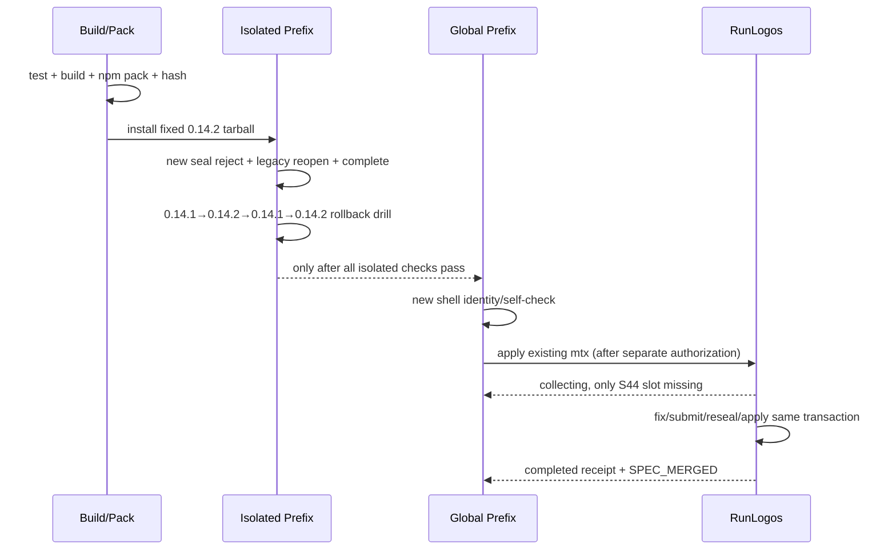
```mermaid
sequenceDiagram
    participant B as Build/Pack
    participant I as Isolated Prefix
    participant G as Global Prefix
    participant R as RunLogos

    B->>B: test + build + npm pack + hash
    B->>I: install fixed 0.14.2 tarball
    I->>I: new seal reject + legacy reopen + complete
    I->>I: 0.14.1→0.14.2→0.14.1→0.14.2 rollback drill
    I-->>G: only after all isolated checks pass
    G->>G: new shell identity/self-check
    G->>R: apply existing mtx (after separate authorization)
    R-->>G: collecting, only S44 slot missing
    R->>R: fix/submit/reseal/apply same transaction
    R-->>G: completed receipt + SPEC_MERGED
```

### 门禁

- candidate任一hash、入口、schema/skill/golden或最小正反例不符，不覆盖全局。
- 全局安装/新shell自检失败立即用固定0.14.1恢复，验证无混装。
- RunLogos出现不可归因fatal、plan drift、journal/recovery错误时停止，不abort或新建事务掩盖。
- smoke/reporter必须写真实ID与结果；无证据不生成部署/SMOKE成功标记。

### 追溯

UT-S19-24～25、ST-S19-16覆盖candidate identity、隔离回滚和安装态分支；SMOKE-core-160～162覆盖新事务、legacy fixture与RunLogos真实事务。

## S19 Authority Closure candidate 与 cutover smoke

### 场景目标

在隔离安装态证明根规范、六个 Skill、CLI evaluator 和插件/cache 投影来自同一源，并验证 writer cutover、stale projection 与版本回滚不会产生第二权威。

### 时序图

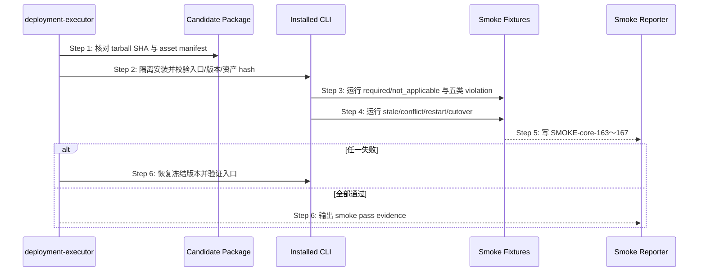
```mermaid
sequenceDiagram
    participant D as deployment-executor
    participant PK as Candidate Package
    participant CL as Installed CLI
    participant FX as Smoke Fixtures
    participant RP as Smoke Reporter
    D->>PK: Step 1: 核对 tarball SHA 与 asset manifest
    D->>CL: Step 2: 隔离安装并校验入口/版本/资产 hash
    CL->>FX: Step 3: 运行 required/not_applicable 与五类 violation
    CL->>FX: Step 4: 运行 stale/conflict/restart/cutover
    FX-->>RP: Step 5: 写 SMOKE-core-163～167
    alt 任一失败
        D->>CL: Step 6: 恢复冻结版本并验证入口
    else 全部通过
        D-->>RP: Step 6: 输出 smoke pass evidence
    end
```

### 门禁

- source Skill、package Skill、plugin/cache 资产与 manifest/hash 一致。
- Authority Closure evaluator 正负例与源码测试一致；status/next/flow 不出现局部重算。
- stale/conflict fixture 只按 authority 得出结论；旧 writer 调用被拒绝。
- 回滚演练后当前版本入口、资产和行为完全恢复；再次安装 candidate 仍幂等。
- 结果由 smoke reporter 写 `logos/resources/verify/smoke-results.jsonl`，禁止手工补写。

### 授权边界

规格 merge、verify、部署和 smoke 是独立确认点。本场景只定义部署后验收，不因 plan 批准自动执行安装或 smoke，也不授权公开 npm 发布。

### 追溯

- 规范：AC-04～AC-08。
- 测试：UT-S19-26～UT-S19-28、ST-S19-17、SMOKE-core-163～SMOKE-core-167。

## S19 环境不具备的显式 skip 与一次性用例的终态重放

### 场景目标

已合并的「smoke runner / reporter / dispatcher 覆盖检查」与「smoke skip 统计口径」两节已经规定：runner 对每个用例写 `pass|fail|skip`，且 skip 表示当前环境缺少部署目标、外部依赖或平台能力。**规格是对的，问题在实现没有遵守**——依赖第三方宿主或历史制品的 runner 在环境不具备时静默退出且零记录，使「不适用」与「该跑没跑」在账本上完全同形。

本节补齐两条时序：runner 判定不适用时如何留痕，以及一次性迁移 / 恢复类用例如何以终态重放为判据。

### 参与者与前置条件

| 别名 | 组件 | 说明 |
|------|------|------|
| D | Smoke Dispatcher | 发现并调度 runner |
| S | Smoke Runner | 判定自身可执行性并写结果 |
| R | `smoke-results.jsonl` | 本轮账本（每轮清空重建） |
| C | OpenLogos CLI | 读账本、判 Gate |

前置：`VERIFY_PASS`、`DEPLOY_DONE`、`[deploy]` 全勾与 `smoke_required=true` 等既有门禁不因本节放松。

### 不适用留痕时序

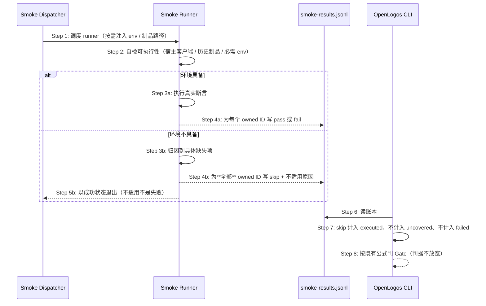
```mermaid
sequenceDiagram
    participant D as Smoke Dispatcher
    participant S as Smoke Runner
    participant R as smoke-results.jsonl
    participant C as OpenLogos CLI

    D->>S: Step 1: 调度 runner（按需注入 env / 制品路径）
    S->>S: Step 2: 自检可执行性（宿主客户端 / 历史制品 / 必需 env）
    alt 环境具备
        S->>S: Step 3a: 执行真实断言
        S-->>R: Step 4a: 为每个 owned ID 写 pass 或 fail
    else 环境不具备
        S->>S: Step 3b: 归因到具体缺失项
        S-->>R: Step 4b: 为**全部** owned ID 写 skip + 不适用原因
        S-->>D: Step 5b: 以成功状态退出（不适用不是失败）
    end
    C->>R: Step 6: 读账本
    C->>C: Step 7: skip 计入 executed、不计入 uncovered、不计入 failed
    C-->>C: Step 8: 按既有公式判 Gate（判据不放宽）
```

### 一次性用例的终态重放时序

迁移 / 恢复类用例的被测对象是会被消费掉的外部事务。判据必须是终态，而非中间相位：

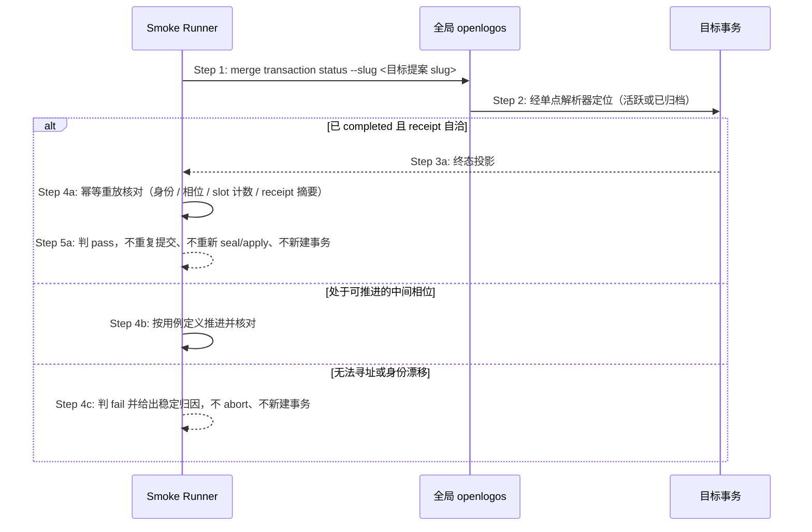
```mermaid
sequenceDiagram
    participant S as Smoke Runner
    participant CLI as 全局 openlogos
    participant T as 目标事务

    S->>CLI: Step 1: merge transaction status --slug <目标提案 slug>
    CLI->>T: Step 2: 经单点解析器定位（活跃或已归档）
    alt 已 completed 且 receipt 自洽
        T-->>S: Step 3a: 终态投影
        S->>S: Step 4a: 幂等重放核对（身份 / 相位 / slot 计数 / receipt 摘要）
        S-->>S: Step 5a: 判 pass，不重复提交、不重新 seal/apply、不新建事务
    else 处于可推进的中间相位
        S->>S: Step 4b: 按用例定义推进并核对
    else 无法寻址或身份漂移
        S-->>S: Step 4c: 判 fail 并给出稳定归因，不 abort、不新建事务
    end
```

### 不变量

- **全部 owned ID 留痕**：不适用时不得只写一条或一条不写；每个 owned 用例都要有 skip 记录。
- **原因可读**：skip 记录携带机器可读的缺失项（具体 env 名或制品名），供 JSON 与 `smoke-report.md` 审计。
- **三态不混用**：不适用不是通过（禁止伪造 pass），真实失败不是不适用（禁止降级为 skip）。
- **判据不放宽**：`isPass` 公式与 skip 统计口径均不变；本节只补全账本完整性。
- **终态优先**：一次性用例以「completed 且 receipt 自洽」为通过判据；不得把会被消费的中间相位写成必要条件。
- **显式寻址**：一次性用例必须经 `--slug` 定位目标事务，不得依赖它恰好挂在活跃 guard 下。

### 异常与边界

| 编号 | 触发条件 | 处理 |
|---|---|---|
| EX-S19-NA-1 | runner 环境不具备 | 全部 owned ID 写 skip + 原因，成功退出；不得静默零记录 |
| EX-S19-NA-2 | runner 真实断言失败 | 写 fail，Gate 仍 FAIL；不得降级为 skip |
| EX-S19-NA-3 | 目标事务已 completed | 走幂等重放核对判 pass；不重复提交或新建事务 |
| EX-S19-NA-4 | 目标事务无法寻址或身份漂移 | 判 fail 并稳定归因；不得改写 guard 或新建事务绕过 |

### 追溯

- 需求：AC-SMOKE-NA-01～04。
- 功能规格：§2.48.3～§2.48.5。
- 架构：§三十九.2。
- 测试：UT-S19-29～UT-S19-32、ST-S19-18；安装态 SMOKE-core-170（并复核 SMOKE-core-168）。

## S19 候选 runner 留痕契约的普遍化与元测试

### 场景目标

把「环境不具备时写显式 skip」从个别 runner 的实现细节，提升为**对全部已注册安装态候选 runner 的普遍要求**，并用元测试防止新增 runner 遗漏。

### 缺陷背景

依赖历史制品的 runner（`SMOKE-core-168` / `169` / `170`）早于留痕契约，缺候选或回滚 tarball 时经 `requiredFile()` 直接抛错、记 `fail`。

这些 tarball 只在各自提案的部署窗口内存在，之后必然缺失。因此**任何后续提案的 Gate 3.8 都会被这三条永久拉黑**——与被测能力毫无关系，也与该提案是否正确毫无关系。

已有的「不适用留痕时序」规格是对的，`scripts/lib/smoke-not-applicable.mjs` 的原语也是对的，缺的是**让规格覆盖到每一个 runner 的机制**：现有 `UT-S19-29`～`UT-S19-31`、`ST-S19-18` 只验证留痕原语本身的行为，不验证「每个 runner 都真的调用了它」。

### 参与者与前置条件

| 别名 | 组件 | 说明 |
|---|---|---|
| R | `scripts/run-smoke.js` | runner 注册表（`hostArtifacts` / `globalMutatingRunners` / `globalCandidateRunners`） |
| S | 安装态候选 runner | 依赖固定 tarball 的 runner |
| P | `smoke-not-applicable` | 留痕原语 |
| T | 契约元测试 | 断言注册表中每项都实现该契约 |

### 元测试时序

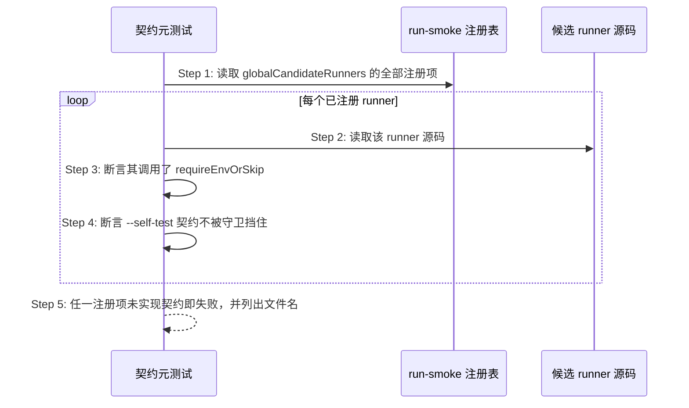
```mermaid
sequenceDiagram
    participant T as 契约元测试
    participant R as run-smoke 注册表
    participant S as 候选 runner 源码

    T->>R: Step 1: 读取 globalCandidateRunners 的全部注册项
    loop 每个已注册 runner
        T->>S: Step 2: 读取该 runner 源码
        T->>T: Step 3: 断言其调用了 requireEnvOrSkip
        T->>T: Step 4: 断言 --self-test 契约不被守卫挡住
    end
    T-->>T: Step 5: 任一注册项未实现契约即失败，并列出文件名
```

**判据落在注册表而非目录扫描**：候选 runner 的权威清单是 `run-smoke.js` 的注册项。以目录通配发现会把非候选 runner 也卷进来，且新增 runner 若忘记注册，元测试反而发现不了——那是另一类缺陷，由既有的覆盖预检负责。

### 不变量

1. **普遍要求**：`globalCandidateRunners` 中每一项都必须实现留痕契约，无例外名单。
2. **skip 是诚实的未覆盖**，不是通过：写 skip 的用例不计入 passed，只计入 executed 与 skipped。
3. **契约不得以放宽 Gate 判据替代**：Gate 3.8 的 `failed==0 && uncovered==0 && diagnostics==0` 公式不变。
4. **自检契约不受守卫约束**：`--self-test` 类只读查询在缺制品时仍须正常输出声明。

### 异常与边界

- 新增候选 runner 未实现契约：元测试失败并点名文件，实现前不得合入。
- runner 已实现契约但注册项缺失：属覆盖预检的职责，不由本元测试负责。
- 历史制品重新可得时：runner 自动从 skip 转为真实断言，无需改代码。

### 追溯

- 需求：AC-MERGEGATE-10。
- 功能规格：§2.51.8；架构：§四十一.6.2。
- 测试：UT-S19-33、ST-S19-19。

## S19 切片事务的安装态覆盖要求

### 场景目标

明确切片事务必须在**安装态**验证的内容：两种 origin 的完整事务、apply 中途失败的整体回滚、归档只读，以及「Agent 直接写产物的路径已不可用」。

### 为何必须走安装态

本次新增的是**公共命令面**，而它同时是跨仓消费方的锚点。源码测试能证明状态机与写入逻辑正确，但证明不了：

1. 命令面随包分发且可从全局入口调用；
2. `schema_sha256` / `contract_sha256` 在打包产物中稳定；
3. 旧路径（Agent 直接写产物）在装好的 CLI 上确已不可用。

第三点尤其只能在安装态验证——源码里删掉一条路径，与用户装到的包里没有这条路径，是两件事。

### 覆盖要求

| 必须覆盖 | 判据 |
|---|---|
| initial-plan 全链 | 创建 → 两 slot 提交 → seal → apply → completed；两产物同时存在且一致 |
| manifest-recovery 全链 | 失效态创建恢复事务 → slot 收窄 → apply；`[code]` 段字节恒等，仅 manifest 被重写 |
| **apply 写盘失败整体回滚** | 注入写盘失败后两产物**同时不存在**，无半写态；事务转 failed 并保留可归因诊断 |
| **apply 产出非法整体回滚** | 提交**结构合法但业务非法**的 slot 后 apply 必须失败：两产物同时不存在、`phase=failed`、`classification=recovery_required`、violations 保真 |
| **终态事务不堵恢复** | 终态事务在场且 manifest 失效（`human_action_required=false`）时，仍能创建 `origin=manifest-recovery` 事务，`required=1` |
| 归档只读 | 归档提案的五个写动作被拒且无副作用 |
| 旧路径不可用 | 安装态下不存在 Agent 直接写两产物的可用入口 |
| 契约哈希稳定 | 成功 envelope 的 `schema_sha256` / `contract_sha256` 与冻结值一致 |

**「apply 中途失败整体回滚」是原有红线**：它是不变量 H（原子性由构造保证）唯一的直接证据。若只验证成功路径，等于只证明了「顺利时一致」，而纪律维持的方案在顺利时同样一致。

### 留痕契约

沿用既有的不适用留痕：环境不具备（缺候选或回滚 tarball）时写显式 `skip` 并携带缺失项，禁止静默零记录退出或硬失败。新增 runner 须在 `run-smoke.js` 的三处注册表显式登记，并由既有的 runner 契约元测试自动纳入。

### 不变量

1. 两种 origin 都必须覆盖——只测 initial-plan 会漏掉恢复路径的 slot 收窄与 `[code]` 冻结。
2. 回滚必须以「两产物同时不存在」断言，而非「命令返回非零」。
3. **写盘失败与产出非法各覆盖一条**，不得互相冒充。
4. **恢复类断言的夹具中终态事务必须在场**，禁止预先删除事务文件。
5. 断言对象是**安装态入口**解析出的全局 CLI，不得源码直跑。
6. 全部断言在一次性临时项目中构造，不触碰本仓或用户其它项目。
7. 新 runner 必须在 `run-smoke.js` 的三处注册表显式登记，并实现 `requireEnvOrSkip` 留痕与 `--self-test` 只读入口。
8. **零回归对照**：同一矩阵打到冻结的前一版本上必须失败，并记录失败点，以证明用例非空转。

### 追溯

- 需求：AC-SLICETX-04、AC-SLICETX-07、AC-SLICETX-09、AC-SLICETX-10、AC-SLICETX-12；AC-SLICEFIX-02、AC-SLICEFIX-05、AC-SLICEFIX-09～12。
- 功能规格：§2.53.5.1、§2.53.6.1；架构：§四十三.2.1。
- 测试：UT-S19-34～UT-S19-35；安装态 SMOKE-core-175、SMOKE-core-176。

### 「写盘失败」与「产出非法」必须分别覆盖

这两者是不同的失败源，安装态必须各覆盖一条，不得以其中一条冒充另一条：

| | 触发 | 只覆盖它会漏掉什么 |
|---|---|---|
| 写盘失败 | I/O 异常、路径不可写、slot 内容结构非法 | 漏掉「写盘成功但产出非法照样宣告成功」——0.14.11 的实际缺陷 |
| 产出非法 | slot 结构合法但业务非法（`spec_targets` 非测试规格路径、`task_text` 与 `[code]` 行不一致） | 漏掉写盘异常路径的回滚正确性 |

**产出非法在顺利路径上同样表现为「原子写入成功」**，所以既有的写盘失败用例对它完全无感——`SMOKE-core-175` 全绿的同时，现场提案已被永久锁死。安装态用例必须显式构造业务非法的 slot，并断言 apply 失败、两产物回滚、violations 可定位到具体字段。

### 恢复类断言的夹具约束

恢复类断言**必须在终态事务在场的前提下**构造：先走一次完整的 apply 抵达 `completed`，再让 manifest 失效，然后断言恢复事务可创建。

**禁止在夹具中预先删除或改名 `TEST_SLICE_TRANSACTION.json`。** 该文件由 OpenLogos 拥有，删除它正是缺陷报告中「唯一脱困手段」所指的人工绕过；把绕过写进夹具的前提，会让「终态事务不堵恢复」这条约束在测试中天然不可见——本仓既有的 `UT-S28-45` / `UT-S28-46` 正是因此漏掉了该缺陷。沿用旧夹具口径的用例视为未覆盖。

## S19 单切片事务终态判定的安装态覆盖（fix-apply-verdict-not-applicable-vs-invalid）

### 场景目标

在**已安装的全局包**上证明单切片计划能走完整切片事务抵达 `completed`——即终态守门确实按三分支语义放行「判定器不适用」，而不只是源码里存在这条判据。

### 为何必须走安装态

被修的缺陷正位于已发布的 0.14.13 全局 CLI：源码改一条判据，与用户装到的包在真实 CLI 进程里放行单切片，是两件事。且判据形如「不适用即放行」，在源码级极易被后续改动无声退化——安装态断言把它钉在用户实际形态上。

### 覆盖要求

1. 新增 `SMOKE-core-178`：安装态下构造 spec-complete 的临时提案，提交**单切片** slot 内容（一条标注真实测试 ID 的切片）→ `seal` → `apply`，断言抵达 `completed`、`tasks.md` 的 `[code]` 段正确写出、manifest 落盘、错误输出不含 `unknown`。
2. 同一 runner 必须回归多切片健康全链与业务非法 slot 的整体回滚（既有 SMOKE-core-176 断言面不回退）。
3. **零回归对照**：同一单切片断言打到固定 `0.14.13` 上 `apply` **必须失败**（报「判为 unknown……0 条违规」），否则断言空转、必须重写用例而非放行部署。

### 留痕契约

- 修复版 runner 必须在 `scripts/run-smoke.js` **三处注册表逐表登记**（`hostArtifacts` / `globalMutatingRunners` / `globalCandidateRunners`），不得依靠通配发现后无条件 PASS；具备 `--self-test` 只读入口自述 ids / 版本 / 所需 env。
- 缺 candidate / 回滚 tarball 时必须经 `requireEnvOrSkip` 写**显式 `skip` 记录并携带缺失项**，禁止静默零记录退出。
- 结果写入 `smoke-results.jsonl` 唯一一条 `SMOKE-core-178` 记录，字段含 `id/status/timestamp/duration_ms/environment/evidence`。
- **证伪门**：摘掉三处注册中的任意一处，对应元用例（UT-S19-36）必须变红。

### 不变量

- runner 不执行 `npm publish`、dist-tag、Git tag、GitHub Release、官网部署或 git push。
- 全部关键断言穿过公开 `openlogos slice transaction` 命令，不以库级调用构造。
- 不得手工写 `tasks.md` 的 `[code]` 段、`TEST_SLICE_MANIFEST.json`，不得删除或改名 `TEST_SLICE_TRANSACTION.json` 构造前提。

### 追溯

- 需求：AC-VERDICT-01、AC-VERDICT-06；功能规格：§2.55；架构：§四十三.2.1。
- 测试：UT-S19-36；安装态：SMOKE-core-178；回归：SMOKE-core-176。

## S19 切片重划的安装态覆盖（support-slice-replan-on-completed-plan）

### 场景目标

在**已安装的全局包**上证明重划全链真实可走：`completed` → `reopen` → 提交不同划分 → seal/apply → `completed`，且新划分完全替换旧划分、留痕可审计。

### 为何必须走安装态

被修的缺口位于已发布的 0.14.14 全局 CLI（`completed` 无出边）；重划涉及动作准入、留痕、归档、marker 作废与产物整体替换的**多步组合**，任何一步在源码级被无声退化都会让出口重新消失。零回归对照（0.14.14 上 `reopen` 必须被拒、锁死现场复现）也只有安装态能构造。

### 覆盖要求

1. 新增 `SMOKE-core-179`：安装态构造 spec-complete 临时提案 → 首次规划 apply 达 `completed` → `reopen --reason` → 断言进入 `collecting`、`SLICE_REPLANS.jsonl` 留痕含旧 `transaction_id`、旧事务已归档、`[code]`/manifest 暂保旧值 → 提交**不同**划分 → seal/apply → `completed`，断言两产物完全为新划分、无旧残留、`manifest_sha256` 已变化。
2. 同一 runner 回归：未执行 `reopen` 的 `completed` 行为与 0.14.14 一致（submit-content 仍被拒）；0.14.12/0.14.14 既有能力不回退。
3. **零回归对照**：同一 `reopen` 步骤打到固定 `0.14.14` 上**必须被拒**（动作不可用），且 completed 后 submit-content/abort 被拒的锁死现场复现——否则断言空转，必须重写用例而非放行部署。
4. 已批准分支（`SLICES_APPROVED` 在场需确认、确认后作废 marker）不在安装态覆盖——smoke 约束禁止夹具手工创建 marker，该分支由 UT-S32-65 在进程内覆盖。

### 留痕契约

- 修复版 runner 在 `scripts/run-smoke.js` **三处注册表逐表登记**（`hostArtifacts` / `globalMutatingRunners` / `globalCandidateRunners`），具备 `--self-test` 只读入口自述 ids / 版本 / 所需 env。
- 缺 candidate / 回滚 tarball 时经 `requireEnvOrSkip` 写显式 `skip` 并携带缺失项，禁止静默零记录退出。
- 结果写入 `smoke-results.jsonl` 唯一一条 `SMOKE-core-179` 记录。
- **证伪门**：摘掉三处注册中的任意一处，元用例（UT-S19-37）必须变红。

### 不变量

- runner 不执行 `npm publish`、dist-tag、Git tag、GitHub Release、官网部署或 git push。
- 全部关键断言穿过公开 `openlogos slice transaction` 命令；不得手工写 `[code]` 段、manifest 或删除/改名事务文件构造前提。

### 追溯

- 需求：AC-REPLAN-09；功能规格：§2.56；架构：§四十四。
- 测试：UT-S19-37；安装态：SMOKE-core-179；回归：SMOKE-core-176、SMOKE-core-178。

## OpenLogos 0.14.21 guard 修复候选发布时序

### 场景目标

把已入仓的 guard hook 三项修复冻结为唯一 `0.14.21` tarball，经隔离矩阵（含 guard 全链、存量项目 sync 补齐实测与 0.14.20 fail-open 对照）与回滚演练后覆盖本机全局，并以 SMOKE-core-192 完成正式 smoke。

### 参与者

- **用户**：部署与 smoke 两个独立确认点的授权者。
- **OpenLogos CLI 构建链**：身份 bump、build、npm pack。
- **隔离 prefix / SMOKE-core-192 runner**：安装态验收执行者。
- **本机全局 prefix**：部署目标。

### 前置条件

guard 修复已合并入仓且 `openlogos verify` PASS（fix-claude-guard-hook-project-dir-and-sync-deploy 已归档）。

### 成功后置条件

全局 `openlogos --version` 精确 `0.14.21`，identity 全同源；SMOKE-core-192 pass、`SMOKE_PASS` 在场；存量项目可经 `openlogos sync` 补齐硬闸。

### 时序图

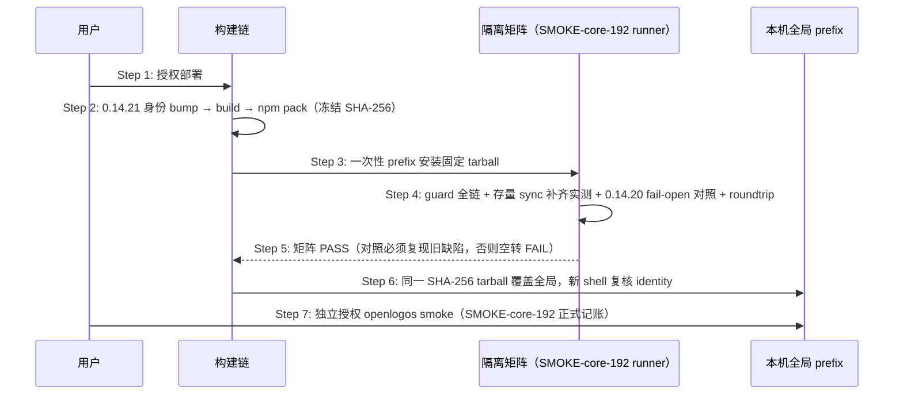
```mermaid
sequenceDiagram
    participant U as 用户
    participant B as 构建链
    participant M as 隔离矩阵（SMOKE-core-192 runner）
    participant G as 本机全局 prefix
    U->>B: Step 1: 授权部署
    B->>B: Step 2: 0.14.21 身份 bump → build → npm pack（冻结 SHA-256）
    B->>M: Step 3: 一次性 prefix 安装固定 tarball
    M->>M: Step 4: guard 全链 + 存量 sync 补齐实测 + 0.14.20 fail-open 对照 + roundtrip
    M-->>B: Step 5: 矩阵 PASS（对照必须复现旧缺陷，否则空转 FAIL）
    B->>G: Step 6: 同一 SHA-256 tarball 覆盖全局，新 shell 复核 identity
    U->>G: Step 7: 独立授权 openlogos smoke（SMOKE-core-192 正式记账）
```

### 步骤说明

1. **用户** 明确授权部署（与 smoke 分离的两个确认点）。
2. **构建链** 同步候选身份全链并真实 `npm pack`，任何重新 pack 产生新 candidate identity。
3. **runner** 在 `mktemp -d` 一次性 prefix 从绝对入口执行，杜绝 workspace link。
4. **矩阵** 四类核心断言：init 新项目 hook `$CLAUDE_PROJECT_DIR` 形态与子目录 cwd 拦截/放行；变量缺失且 cwd 非根 fail-closed；存量项目（无 guard-check/仅旧 SessionStart）sync 后硬闸齐备且旧条目迁移、重复 sync 幂等；`0.14.20→0.14.21` roundtrip。
5. **对照**：固定 0.14.20 上同一子目录 cwd 无提案改码必须静默放行（缺陷复现）。
6. **全局覆盖** 后 identity 复核全同源 0.14.21。
7. **smoke** 独立授权，写唯一 SMOKE-core-192 记录。

### 异常与边界

#### EX-53.1：隔离矩阵失败
- **触发条件**：任一矩阵断言红。
- **期望响应**：停止部署、回实现、重新 verify/build/pack；不得为过矩阵伪造 settings/guard 产物。
- **副作用**：全局不受影响。

#### EX-53.2：对照空转
- **触发条件**：0.14.20 上子目录 cwd 场景也被拦截。
- **期望响应**：判 FAIL 并重写矩阵，而非放行部署。
- **副作用**：无。

#### EX-53.3：全局覆盖后行为异常
- **触发条件**：identity 漂移或 guard 行为异常。
- **期望响应**：按固定 0.14.20 tarball 回滚并复核 identity 全回 0.14.20。
- **副作用**：回滚留痕于部署报告。

### 追溯

- 需求：OpenLogos 0.14.21 guard 修复候选发布需求。
- 测试：UT-S19-38、SMOKE-core-192。
