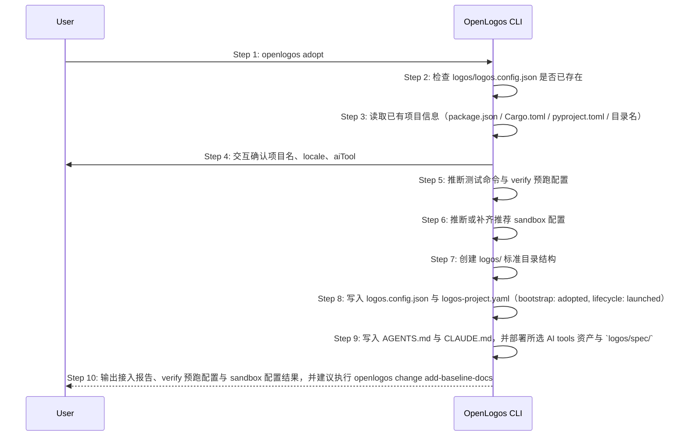

# S20: 已有项目接入 OpenLogos — 时序图

## 步骤说明
1. **用户**执行 `openlogos adopt`。
2. **CLI** 校验 `logos/logos.config.json` 是否已存在，若已存在则报错退出。
3. **CLI** 扫描当前目录，按优先级读取 `package.json` → `Cargo.toml` → `pyproject.toml` → 目录名，提取项目名称。
4. **CLI** 交互式确认项目名、locale 与 aiTool（有默认值，可直接回车确认）。
5. **CLI** 推断测试命令。Node 项目优先读取 `package.json` 的 `test` 脚本；Python / Go / Rust 项目按常见命令推断。无法推断时记录 TODO。
6. **CLI** 推断或补齐推荐的 `verify.sandbox_mode=auto`、`verify.sandbox_root` 和 `verify.sandbox_deny_workspace_write=true`，但不得覆盖用户已有沙箱配置。
7. **CLI** 创建 `logos/` 标准目录结构（与 `init` 相同）。
8. **CLI** 写入 `logos.config.json` 与 `logos-project.yaml`；`logos.config.json` 包含 `verify.result_path`，并在可推断时包含 verify 预跑命令与推荐沙箱配置；`logos-project.yaml` 中模块 `bootstrap` 字段为 `adopted`，`lifecycle` 为 `launched`。
9. **CLI** 部署 AI 工具资产，与 `init` 行为一致，并部署 `logos/spec/`。
10. **CLI** 输出接入报告，说明 verify 预跑配置与 sandbox 配置是否已补齐，并固定建议下一步执行 `openlogos change add-baseline-docs`。

## 异常用例
### EX-2.1: 项目已初始化
- **触发条件**：`logos/logos.config.json` 已存在。
- **期望响应**：输出错误并退出，提示该项目已初始化，不覆盖已有文件。
- **副作用**：无文件被修改。

### EX-5.1: 无法推断测试命令
- **触发条件**：已有项目没有可识别测试脚本或测试框架。
- **期望响应**：adopt 成功，但接入报告显示 TODO，提示用户配置 `verify.pre_run_command` 或 `verify.regression_command`，并说明 sandbox 配置仍可按默认推荐值写入。
- **副作用**：不写入虚假的测试命令。
