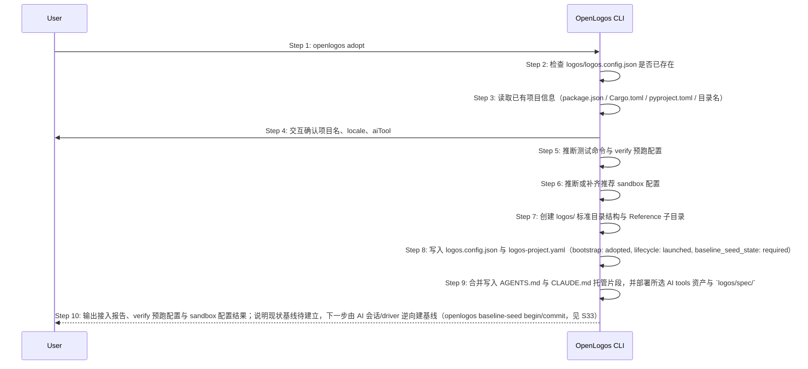

# S20: 已有项目接入 OpenLogos — 时序图

```mermaid
sequenceDiagram
    participant U as User
    participant C as OpenLogos CLI

    U->>C: Step 1: openlogos adopt
    C->>C: Step 2: 检查 logos/logos.config.json 是否已存在
    C->>C: Step 3: 读取已有项目信息（package.json / Cargo.toml / pyproject.toml / 目录名）
    C->>U: Step 4: 交互确认项目名、locale、aiTool
    C->>C: Step 5: 推断测试命令与 verify 预跑配置
    C->>C: Step 6: 推断或补齐推荐 sandbox 配置
    C->>C: Step 7: 创建 logos/ 标准目录结构与 Reference 子目录
    C->>C: Step 8: 写入 logos.config.json 与 logos-project.yaml（bootstrap: adopted, lifecycle: launched, baseline_seed_state: required）
    C->>C: Step 9: 合并写入 AGENTS.md 与 CLAUDE.md 托管片段，并部署所选 AI tools 资产与 `logos/spec/`
    C-->>U: Step 10: 输出接入报告、verify 预跑配置与 sandbox 配置结果；说明现状基线待建立，下一步由 AI 会话/driver 逆向建基线（openlogos baseline-seed begin/commit，见 S33）
```

> **交接说明**：`adopt` 只做确定性初始化并写 `baseline_seed_state: required`，**CLI 本身不启动 AI、不产逆向内容、不声称基线已建立**。现状基线的逆向建立由 AI 会话/driver 检测该状态后经 `openlogos baseline-seed`（`begin` 提交逻辑产物计划 → 写 staging → `commit` 原子提交）完成，完整时序见 **S33**。旧的 `openlogos change add-baseline-docs` 入口已废弃、由 baseline-seed 流程取代，本时序图不再引用。

## 步骤说明
1. **用户**执行 `openlogos adopt`。
2. **CLI** 校验 `logos/logos.config.json` 是否已存在，若已存在则报错退出。
3. **CLI** 扫描当前目录，按优先级读取 `package.json` → `Cargo.toml` → `pyproject.toml` → 目录名，提取项目名称。
4. **CLI** 交互式确认项目名、locale 与 aiTool（有默认值，可直接回车确认）。
5. **CLI** 推断测试命令。Node 项目优先读取 `package.json` 的 `test` 脚本；Python / Go / Rust 项目按常见命令推断。无法推断时记录 TODO。
6. **CLI** 推断或补齐推荐的 `verify.sandbox_mode=auto`、`verify.sandbox_root` 和 `verify.sandbox_deny_workspace_write=true`，但不得覆盖用户已有沙箱配置。
7. **CLI** 创建 `logos/` 标准目录结构（与 `init` 相同）；其中 `logos/resources/reference/` 下必须同时创建 `requirement/`、`todolist/`、`code/`、`image/`、`temp/`、`note/` 子目录，并写入 `.gitkeep`。
8. **CLI** 写入 `logos.config.json` 与 `logos-project.yaml`；`logos.config.json` 包含 `verify.result_path`，并在可推断时包含 verify 预跑命令与推荐沙箱配置；`logos-project.yaml` 中模块 `bootstrap` 字段为 `adopted`，`lifecycle` 为 `launched`。
9. **CLI** 写入根目录 AI 指令文件时复用 `init` 的 managed block 合并策略：已有用户内容必须保留；OpenLogos 内容写入或刷新在托管片段内；同时部署 AI 工具资产与 `logos/spec/`。
10. **CLI** **写入模块级枚举 `baseline_seed_state: required`**（衔接逆向建基线 S33；唯一状态字段，非布尔），输出接入报告，说明 verify 预跑配置与 sandbox 配置是否已补齐，并说明下一步将由 AI 会话/driver 逆向建立现状基线（种子基线，非权威意图）。**CLI 本身不启动 AI、不产逆向内容、不声称基线已建立**；能力缺失时输出可复制的后续提示并保持 `baseline_seed_state: required`。

## 异常用例
### EX-2.1: 项目已初始化
- **触发条件**：`logos/logos.config.json` 已存在。
- **期望响应**：输出错误并退出，提示该项目已初始化，不覆盖已有文件。
- **副作用**：无文件被修改。

### EX-5.1: 无法推断测试命令
- **触发条件**：已有项目没有可识别测试脚本或测试框架。
- **期望响应**：adopt 成功，但接入报告显示 TODO，提示用户配置 `verify.pre_run_command` 或 `verify.regression_command`，并说明 sandbox 配置仍可按默认推荐值写入。
- **副作用**：不写入虚假的测试命令。

### EX-9.1: AI 指令文件 marker 不完整
- **触发条件**：已有项目的 `AGENTS.md` / `CLAUDE.md` 中只存在 `OPENLOGOS:BEGIN` 或只存在 `OPENLOGOS:END`。
- **期望响应**：adopt 失败并提示用户修复指令文件托管片段边界。
- **副作用**：不得覆盖用户既有 AI 指令文件。

### EX-10.1: adopt 不越权逆向扫描
- **触发条件**：adopt 完成初始化。
- **期望响应**：adopt 只写入 `baseline_seed_state: required`，**不启动 AI、不产任何逆向基线内容、不声称基线已建立**；逆向扫描由 AI 会话/driver 检测该状态后派发 `brownfield-adopter`（见 S33）。
- **副作用**：能力缺失时保持 `baseline_seed_state: required`，输出可复制提示，不伪造基线。

