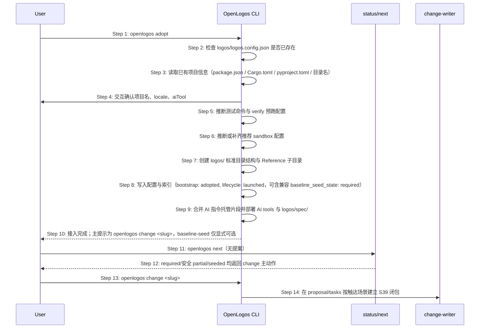

# S20: 已有项目接入 OpenLogos — 时序图

```mermaid
sequenceDiagram
    participant U as User
    participant C as OpenLogos CLI
    participant N as status/next
    participant W as change-writer

    U->>C: Step 1: openlogos adopt
    C->>C: Step 2: 检查 logos/logos.config.json 是否已存在
    C->>C: Step 3: 读取已有项目信息（package.json / Cargo.toml / pyproject.toml / 目录名）
    C->>U: Step 4: 交互确认项目名、locale、aiTool
    C->>C: Step 5: 推断测试命令与 verify 预跑配置
    C->>C: Step 6: 推断或补齐推荐 sandbox 配置
    C->>C: Step 7: 创建 logos/ 标准目录结构与 Reference 子目录
    C->>C: Step 8: 写入配置与索引（bootstrap: adopted, lifecycle: launched，可含兼容 baseline_seed_state: required）
    C->>C: Step 9: 合并 AI 指令托管片段并部署 AI tools 与 logos/spec/
    C-->>U: Step 10: 接入完成；主提示为 openlogos change <slug>，baseline-seed 仅显式可选
    U->>N: Step 11: openlogos next（无提案）
    N-->>U: Step 12: required/安全 partial/seeded 均返回 change 主动作
    U->>C: Step 13: openlogos change <slug>
    C->>W: Step 14: 在 proposal/tasks 按触达场景建立 S39 闭包
```

> **交接说明**：`adopt` 只做确定性初始化，CLI 本身不启动 AI、不产逆向内容、不声称规格基线已建立。可继续写 `baseline_seed_state: required` 以兼容旧消费者，但 driver 不得因该状态自动派发 `brownfield-adopter`。默认交接对象是首个 change；只有用户或宿主显式选择 eager seed 时才进入 S33。

## 步骤说明
1. **用户**执行 `openlogos adopt`。
2. **CLI** 校验 `logos/logos.config.json` 是否已存在，若已存在则报错退出。
3. **CLI** 扫描当前目录，按优先级读取 `package.json` → `Cargo.toml` → `pyproject.toml` → 目录名，提取项目名称。
4. **CLI** 交互式确认项目名、locale 与 aiTool（有默认值，可直接回车确认）。
5. **CLI** 推断测试命令。Node 项目优先读取 `package.json` 的 `test` 脚本；Python / Go / Rust 项目按常见命令推断。无法推断时记录 TODO。
6. **CLI** 推断或补齐推荐的 `verify.sandbox_mode=auto`、`verify.sandbox_root` 和 `verify.sandbox_deny_workspace_write=true`，但不得覆盖用户已有沙箱配置。
7. **CLI** 创建 `logos/` 标准目录结构（与 `init` 相同）；其中 `logos/resources/reference/` 下必须同时创建 `requirement/`、`todolist/`、`code/`、`image/`、`temp/`、`note/` 子目录，并写入 `.gitkeep`。
8. **CLI** 写入 `logos.config.json` 与 `logos-project.yaml`；`logos.config.json` 包含 `verify.result_path`，并在可推断时包含 verify 预跑命令与推荐沙箱配置；`logos-project.yaml` 中模块 `bootstrap` 为 `adopted`、`lifecycle` 为 `launched`，可保留兼容枚举 `baseline_seed_state: required`。该枚举不是 change gate。
9. **CLI** 写入根目录 AI 指令文件时复用 `init` 的 managed block 合并策略：已有用户内容必须保留；OpenLogos 内容写入或刷新在托管片段内；同时部署 AI 工具资产与 `logos/spec/`。
10. **CLI** 输出接入报告，说明 verify/sandbox 配置结果，并把主提示写成「现在可直接运行 `openlogos change <slug>`；提案将按触达场景补齐规格」。可附显式 `baseline-seed` 预扫选项，但不得把它写成下一步前置。
11. **next/status 读取门**在访问资源、索引或覆盖率前，先在同一模块锁内恢复未终结 seed commit journal。无法恢复时返回 `baseline_commit_in_progress`，不得读取半新集合；安全 open run / staging 则排除后继续。
12. 无未终结 journal 时，`required`、安全 `partial`、`seeded` 均不得改写 next 的 change 主动作；状态只作旁路信息。
13. 用户直接创建首个提案，不需要先运行 S33。
14. change-writer 按 S39 写规范化闭包清单与唯一 delta tasks；缺失目标全量 CREATE，已有目标 MODIFY。

## 异常用例
### EX-2.1: 项目已初始化
- **触发条件**：`logos/logos.config.json` 已存在。
- **期望响应**：输出错误并退出，提示该项目已初始化，不覆盖已有文件。
- **副作用**：无文件被修改。

### EX-5.1: 无法推断测试命令
- **触发条件**：已有项目没有可识别测试脚本或测试框架。
- **期望响应**：adopt 成功，但接入报告显示 TODO，提示用户配置 `verify.pre_run_command` 或 `verify.regression_command`，并说明 sandbox 配置仍可按默认推荐值写入。
- **副作用**：不写入虚假的测试命令。

### EX-9.1: AI 指令文件 marker 不完整
- **触发条件**：已有项目的 `AGENTS.md` / `CLAUDE.md` 中只存在 `OPENLOGOS:BEGIN` 或只存在 `OPENLOGOS:END`。
- **期望响应**：adopt 失败并提示用户修复指令文件托管片段边界。
- **副作用**：不得覆盖用户既有 AI 指令文件。

### EX-10.1: adopt 不越权逆向扫描
- **触发条件**：adopt 完成初始化。
- **期望响应**：adopt 不启动 AI、不产任何逆向基线内容、不声称基线已建立；默认提示创建 change。AI 能力缺失不影响 change；显式 seed 才派发 `brownfield-adopter`（见 S33）。
- **副作用**：可保留 `baseline_seed_state: required` 兼容值，但不得据此自动派发或阻断。

### EX-11.1: 安全 partial 与未终结 journal 必须分流
- **触发条件**：adopted 模块存在 seed run。
- **期望响应**：仅 open run / 未提交 staging 时排除 staging，next 仍指向 change并附非阻断重试信息；journal=`prepared|committing` 时先恢复，恢复失败返回 `baseline_commit_in_progress`，不得继续读取 resources/index 或输出 change 建议。
- **副作用**：不把半新资源当权威，不把安全 staging 升格为硬门。

### EX-11.2: 不得把自动 skip 当永久技术结论
- **触发条件**：adopt 自动写入 `skip_phases`，首个 change 实际出现 API/持久化边界。
- **期望响应**：S39 必须规划 API/DB/编排或以 AMBIGUOUS 阻断，不能因接入元数据静默 SKIP。
- **副作用**：Initial 阶段豁免保持，launched change 的适用性单独判定。
