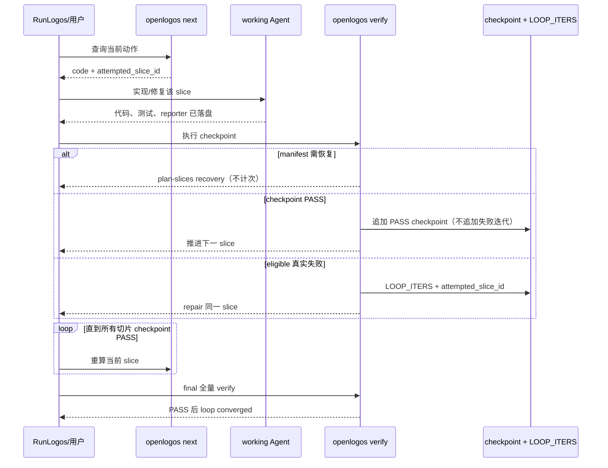

# S27：implement loop 真实迭代与预算隔离

### 场景目标

使 implement loop 只为当前 attempted slice 的真实验收失败计次；正常 checkpoint 推进、未来切片 pending 和 manifest 恢复均不消耗代码 repair budget。

### 参与者

- working Agent
- OpenLogos `next/status/verify`
- SliceVerificationService
- `LOOP_ITERS` 与 checkpoint 账本
- RunLogos 编排器

### 前置条件

- launched 提案已通过 slice-exit，implement loop 激活。
- manifest 有效，或可经 S28/S32 恢复。
- `max_iters` 与不可绕过的 `gate:implement:loop-exhausted` 保持既有配置。

### 后置条件

- 每条失败迭代可追溯到稳定 slice；所有切片 checkpoint 与 final 均通过后 loop 收敛。
- 可恢复规划事件不改变 loop iteration。

### 步骤

1. `next` 从 manifest/checkpoint 派生 attempted slice 并交给 Agent。
2. Agent 只交付该 slice 的业务代码、测试代码与 reporter。
3. checkpoint PASS 记录切片完成，正常前移，不作为 repair 失败计次。
4. checkpoint FAIL 才追加失败迭代，后续 `next_node` 继续指向同一 slice。
5. 全部 checkpoint 通过且任务完成后执行 final；final PASS 使 `code_slices_green=true`。

### 异常与边界

- pending 数量大于零不是失败，不得增加 iteration。
- 缺 manifest、stale fingerprint 的自动恢复使用独立有界重试，不写 `LOOP_ITERS`。
- checkbox 先勾选但 checkpoint 未过时，attempted slice 不前移。
- 同一 slice 连续失败逐次计数，达到 `max_iters` 后仍触发不可自动放行的人类门。
- final 失败属于真实回归失败，可计入 loop，但 `attempted_slice_id=null`、`verify_mode=final`。

### 追溯

- 需求：S27、S31。
- 规格：功能规格 §2.37.3～§2.37.5；`spec/flow-spec.md`。
- 测试：UT-S27-33～UT-S27-40、ST-S27-11～ST-S27-13。
