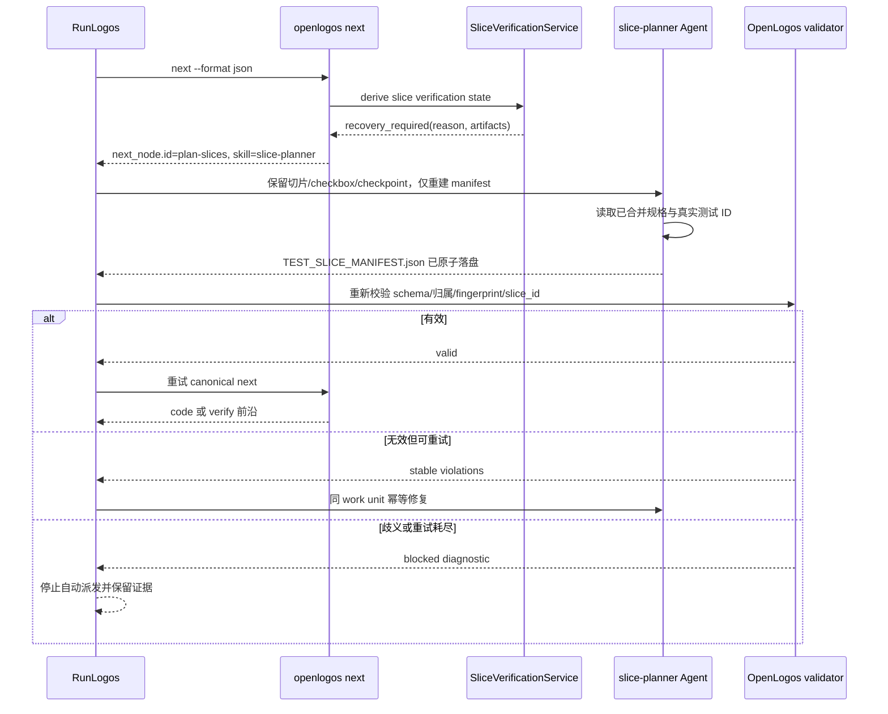

# S28：next 暴露恢复派发动作

### 场景目标

当多切片提案缺少有效 manifest 时，由 OpenLogos 输出稳定、可执行的 `plan-slices` 动作，让 RunLogos 派发 Agent 自动恢复并重试，不把流程停成测试失败。

### 参与者

- OpenLogos `status/next/verify`
- SliceVerificationService
- RunLogos 流程引擎
- 使用 `slice-planner` 的 Agent
- manifest validator

### 前置条件

- 活跃 launched 提案已 spec-complete，`[code]` 含多个真实切片。
- manifest 缺失、已知版本非法或 fingerprint 漂移。
- 恢复可在不改变已确认产品决策的前提下执行。

### 后置条件

- 成功：manifest 通过 OpenLogos validator，宿主重新调用 canonical `next/verify`。
- 失败：达到有界恢复上限或归属仍歧义，保留诊断并阻塞；代码 repair budget 不受影响。

### 步骤

1. OpenLogos 在任何测试 Gate 前检测 manifest 状态。
2. 恢复态输出原因、完整 `next_node` 与 artifacts，不写失败 marker/迭代。
3. RunLogos 按 `dispatch.idempotent=true` 派发 Agent，指令明确禁止重切既有 `[code]` 或清空 checkpoint。
4. Agent 依据已合并测试规格生成 manifest；不能唯一归属时必须报告歧义。
5. RunLogos 调用 OpenLogos validator 作为完成屏障；成功后重新 `next`，不自行决定下一阶段。

### 异常与边界

- RunLogos 不得扫描文件猜测缺 manifest，也不得解析 `tasks.md` 计算 owned tests。
- 文件存在但 validator 失败不算完成。
- 相同 dispatch 重投必须产生相同 slice ID 和稳定排序，不能重复 checkpoint。
- 未知 manifest 主版本不自动覆盖；输出升级/人工诊断。
- 恢复重试次数由宿主控制并独立于 implement `max_iters`。

### 追溯

- 需求：S28、S32；用户决策 C02。
- 规格：功能规格 §2.37.5；`spec/cli-json-output.md`、`spec/flow-spec.md`。
- 测试：UT-S28-37～UT-S28-44、ST-S28-12～ST-S28-14。

