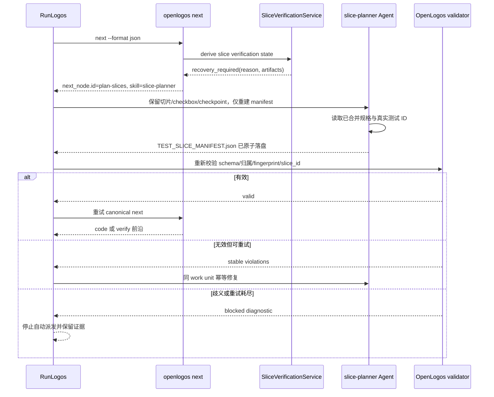
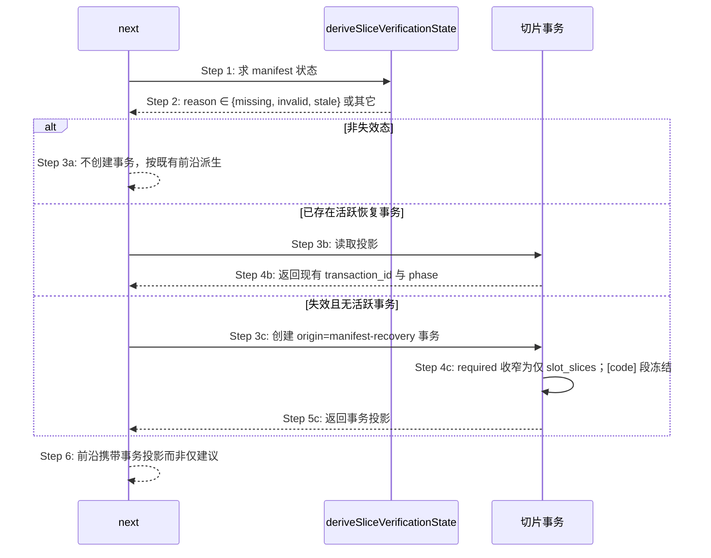

# S28：next 暴露恢复派发动作

### 场景目标

当多切片提案缺少有效 manifest 时，由 OpenLogos 输出稳定、可执行的 `plan-slices` 动作，让 RunLogos 派发 Agent 自动恢复并重试，不把流程停成测试失败。

### 参与者

- OpenLogos `status/next/verify`
- SliceVerificationService
- RunLogos 流程引擎
- 使用 `slice-planner` 的 Agent
- manifest validator

### 前置条件

- 活跃 launched 提案已 spec-complete，`[code]` 含多个真实切片。
- manifest 缺失、已知版本非法或 fingerprint 漂移。
- 恢复可在不改变已确认产品决策的前提下执行。

### 后置条件

- 成功：manifest 通过 OpenLogos validator，宿主重新调用 canonical `next/verify`。
- 失败：达到有界恢复上限或归属仍歧义，保留诊断并阻塞；代码 repair budget 不受影响。



### 步骤

1. OpenLogos 在任何测试 Gate 前检测 manifest 状态。
2. 恢复态输出原因、完整 `next_node` 与 artifacts，不写失败 marker/迭代。
3. RunLogos 按 `dispatch.idempotent=true` 派发 Agent，指令明确禁止重切既有 `[code]` 或清空 checkpoint。
4. Agent 依据已合并测试规格生成 manifest；不能唯一归属时必须报告歧义。
5. RunLogos 调用 OpenLogos validator 作为完成屏障；成功后重新 `next`，不自行决定下一阶段。

### 异常与边界

- RunLogos 不得扫描文件猜测缺 manifest，也不得解析 `tasks.md` 计算 owned tests。
- 文件存在但 validator 失败不算完成。
- 相同 dispatch 重投必须产生相同 slice ID 和稳定排序，不能重复 checkpoint。
- 未知 manifest 主版本不自动覆盖；输出升级/人工诊断。
- 恢复重试次数由宿主控制并独立于 implement `max_iters`。

### 追溯

- 需求：S28、S32；用户决策 C02。
- 规格：功能规格 §2.37.5；`spec/cli-json-output.md`、`spec/flow-spec.md`。
- 测试：UT-S28-37～UT-S28-44、ST-S28-12～ST-S28-14。

## S28 恢复节点由建议改为创建事务

### 场景目标

`next` 在检测到 manifest 失效时，从「返回一个建议节点」改为「创建或返回 `origin=manifest-recovery` 的事务投影」——把恢复的执行权收归 OpenLogos。

### 缺陷背景

`cli/src/commands/next.ts:115` 的 `manifestRecoveryNode()` 已能识别三种失效态：

```ts
if (!['test-slice-manifest-missing', 'test-slice-manifest-invalid', 'test-slice-manifest-stale']
  .includes(state.reason ?? '')) return null;
return { id: 'plan-slices', name: '恢复测试—切片清单', ... };
```

它返回的是 `NextNode`——**只能建议，不能执行**。执行权在消费方：由消费方判断「这是不是一次恢复」、自行推导 Agent 可写哪些产物、自建恢复身份与进度账本。同一事实因此被两处各自持有。

### 参与者与前置条件

| 别名 | 组件 | 说明 |
|---|---|---|
| N | `openlogos next` | 派生前沿节点 |
| V | `deriveSliceVerificationState()` | 三态失效判定 |
| T | 切片事务 | 恢复事务的创建与投影 |

### 主时序



### 步骤说明

- **Step 3a**：无失效态时不创建事务——避免为正常提案凭空产生事务对象。
- **Step 3b 幂等**：已有活跃恢复事务时返回既有投影，不重复创建。单活跃事务约束由事务侧保证。
- **Step 4c 收窄 slot**：恢复只需重写 manifest，`[code]` 段冻结（S32 已冻结该约束）。
- **Step 6 的差别**：消费方读到的是 canonical `transaction_id` 与 `allowed_actions`，不再需要自判恢复模式或自算可写作用域。

### 不变量

1. 三种失效态与恢复事务的映射是唯一的；判定仍来自 `deriveSliceVerificationState()`，不新建第二套。
2. 无失效态时不创建事务。
3. 创建是幂等的：同一提案同时至多一个活跃恢复事务。
4. `next` 本身不写两产物——它只创建/返回事务；写入仍只发生在 apply。

### 异常与边界

- `human_action_required` 时不创建事务（沿用既有短路，人工门优先）。
- 提案已归档：仅返回只读投影，不创建事务。
- 事务创建失败：`next` 如实报告失败原因，不降级为「仅建议」——那会让消费方以为可以自行恢复。

### 追溯

- 需求：AC-SLICETX-07、AC-SLICETX-08。
- 功能规格：§2.53.6；架构：§四十三.1。
- 测试：UT-S28-45～UT-S28-46；安装态 SMOKE-core-175。
