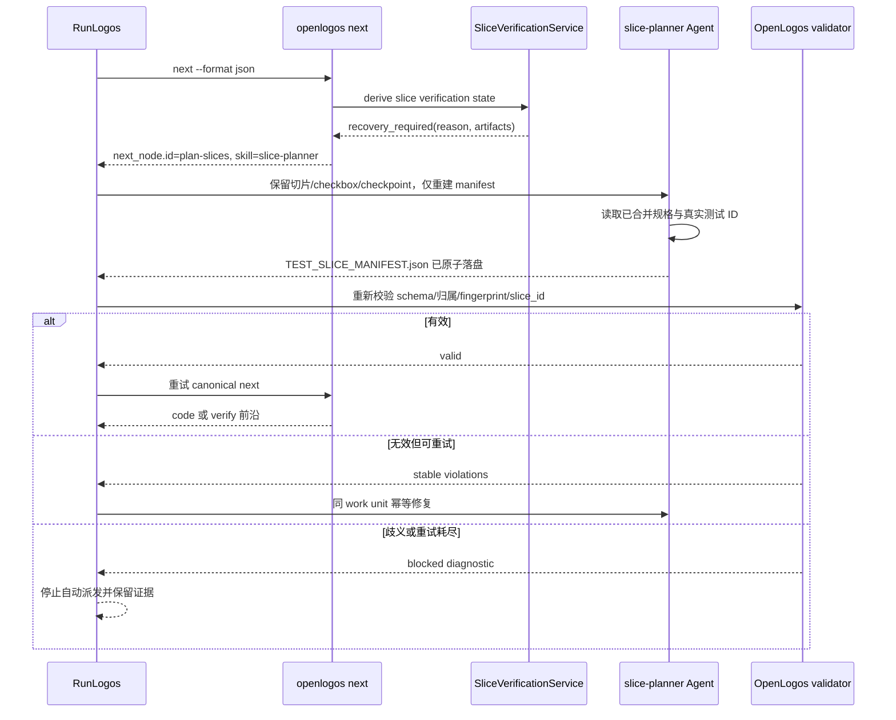
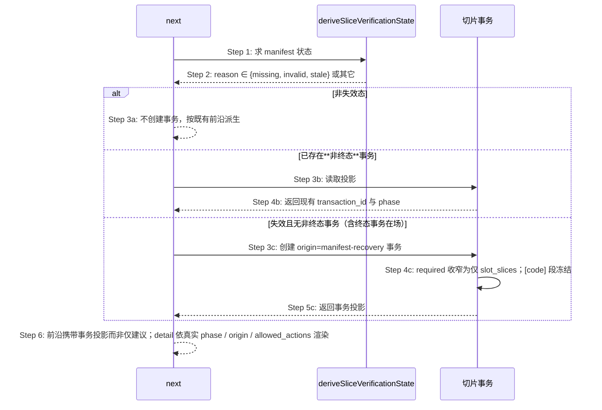
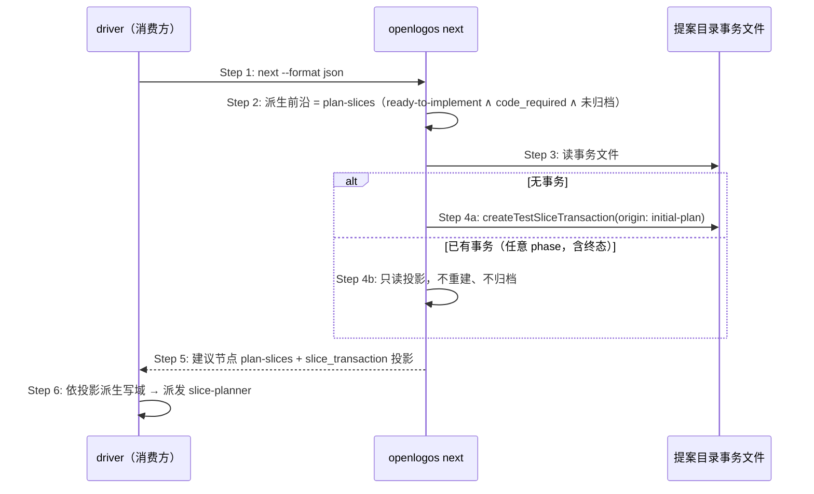

# S28：next 暴露恢复派发动作

### 场景目标

当多切片提案缺少有效 manifest 时，由 OpenLogos 输出稳定、可执行的 `plan-slices` 动作，让 RunLogos 派发 Agent 自动恢复并重试，不把流程停成测试失败。

### 参与者

- OpenLogos `status/next/verify`
- SliceVerificationService
- RunLogos 流程引擎
- 使用 `slice-planner` 的 Agent
- manifest validator

### 前置条件

- 活跃 launched 提案已 spec-complete，`[code]` 含多个真实切片。
- manifest 缺失、已知版本非法或 fingerprint 漂移。
- 恢复可在不改变已确认产品决策的前提下执行。

### 后置条件

- 成功：manifest 通过 OpenLogos validator，宿主重新调用 canonical `next/verify`。
- 失败：达到有界恢复上限或归属仍歧义，保留诊断并阻塞；代码 repair budget 不受影响。



### 步骤

1. OpenLogos 在任何测试 Gate 前检测 manifest 状态。
2. 恢复态输出原因、完整 `next_node` 与 artifacts，不写失败 marker/迭代。
3. RunLogos 按 `dispatch.idempotent=true` 派发 Agent，指令明确禁止重切既有 `[code]` 或清空 checkpoint。
4. Agent 依据已合并测试规格生成 manifest；不能唯一归属时必须报告歧义。
5. RunLogos 调用 OpenLogos validator 作为完成屏障；成功后重新 `next`，不自行决定下一阶段。

### 异常与边界

- RunLogos 不得扫描文件猜测缺 manifest，也不得解析 `tasks.md` 计算 owned tests。
- 文件存在但 validator 失败不算完成。
- 相同 dispatch 重投必须产生相同 slice ID 和稳定排序，不能重复 checkpoint。
- 未知 manifest 主版本不自动覆盖；输出升级/人工诊断。
- 恢复重试次数由宿主控制并独立于 implement `max_iters`。

### 追溯

- 需求：S28、S32；用户决策 C02。
- 规格：功能规格 §2.37.5；`spec/cli-json-output.md`、`spec/flow-spec.md`。
- 测试：UT-S28-37～UT-S28-44、ST-S28-12～ST-S28-14。

## S28 恢复节点由建议改为创建事务

### 场景目标

`next` 在检测到 manifest 失效时，从「返回一个建议节点」改为「创建或返回 `origin=manifest-recovery` 的事务投影」——把恢复的执行权收归 OpenLogos。

### 缺陷背景

`cli/src/commands/next.ts:115` 的 `manifestRecoveryNode()` 已能识别三种失效态：

```ts
if (!['test-slice-manifest-missing', 'test-slice-manifest-invalid', 'test-slice-manifest-stale']
  .includes(state.reason ?? '')) return null;
return { id: 'plan-slices', name: '恢复测试—切片清单', ... };
```

它返回的是 `NextNode`——**只能建议，不能执行**。执行权在消费方：由消费方判断「这是不是一次恢复」、自行推导 Agent 可写哪些产物、自建恢复身份与进度账本。同一事实因此被两处各自持有。

### 参与者与前置条件

| 别名 | 组件 | 说明 |
|---|---|---|
| N | `openlogos next` | 派生前沿节点 |
| V | `deriveSliceVerificationState()` | 三态失效判定 |
| T | 切片事务 | 恢复事务的创建与投影 |

### 主时序




### 步骤说明


- **Step 3a**：无失效态时不创建事务——避免为正常提案凭空产生事务对象。
- **Step 3b 的「已存在」只认非终态。** 此前规格写作「已存在**活跃恢复**事务」，实现却读成了「已存在任何事务」：`completed` / `failed` 一并返回，且不区分 `origin`。后果是 `completed` 的 initial-plan 事务占住名额——它 `allowed_actions=[]`，既不能提交也不能中止，而恢复事务永远创建不出来，提案永久锁死在 `plan-slices`。**「活跃」必须在规格里写成可机械判定的条件，而不是一个形容词**：见 §2.53.6.1 的 phase 表。
- **Step 3c 覆盖「终态事务在场」**：终态是可归档历史，不占活跃名额。恢复入口的可达性是合同的一部分——只要判定为可自动恢复且 `human_action_required=false`，就必须能创建出恢复事务。
- **Step 4c 收窄 slot**：恢复只需重写 manifest，`[code]` 段冻结（S32 已冻结该约束）。
- **Step 6 的 detail 必须由真实字段推出**，不得复用另一分支的模板文案：不把 `origin=initial-plan` 讲成恢复事务、不对 `allowed_actions=[]` 提示「提交内容后 seal、apply」、不把空缺口渲染成「（无缺口）」的同时声称「已就绪」。

### 不变量


1. 三种失效态与恢复事务的映射是唯一的；判定仍来自 `deriveSliceVerificationState()`，不新建第二套。
2. 无失效态时不创建事务。
3. **「已存在活跃事务」只含非终态**：`completed` / `failed` 不占活跃名额，终态事务在场时仍可创建恢复事务。
4. 创建是幂等的：同一提案同时至多一个**非终态**切片事务。
5. `next` 本身不写两产物——它只创建/返回事务；写入仍只发生在 apply。
6. **投影与事实一致**：detail 与 `next_action` 由事务真实 `phase` / `origin` / `allowed_actions` 推出。
7. **禁止以人工删除 `TEST_SLICE_TRANSACTION.json` 作为恢复手段**，包括在测试夹具中预先删除——该文件由 OpenLogos 拥有，让消费方改它与写入权归属冲突；夹具里删除它会使不变量 3 在测试中天然不可见。

### 异常与边界


- `human_action_required` 时不创建事务（沿用既有短路，人工门优先）。
- 提案已归档：仅返回只读投影，不创建事务。
- 事务创建失败：`next` 如实报告失败原因，不降级为「仅建议」——那会让消费方以为可以自行恢复。
- **终态事务在场且判定可自动恢复**：创建新的 `origin=manifest-recovery` 事务；若因任何原因无法创建，必须给出结构化诊断说明原因，**不得返回那个不接受任何动作的终态事务投影充数**——后者会让消费方按错误指引反复撞墙。

### 追溯


- 需求：AC-SLICETX-07、AC-SLICETX-08；AC-SLICEFIX-05～07、AC-SLICEFIX-09。
- 功能规格：§2.53.6、§2.53.6.1、§2.53.6.2；架构：§四十三.1、§四十三.2.1。
- 测试：UT-S28-45～UT-S28-48、ST-S28-15；安装态 SMOKE-core-175、SMOKE-core-176。

## S28 切片已规划未批准时的重划入口（support-slice-replan-on-completed-plan）

### 场景目标

让「切片划分还能改」这一事实在 `next` 中可被发现：切片已规划（当前切片事务 `completed`、`[code]` 与 manifest 在盘）但 `SLICES_APPROVED` 不在场时，`next` 除「开始编码实现」外同时给出重划入口；已批准后不再主动提示。

### 呈现规则

1. **未批准态**：`next` 的 detail 在实现指引之外附一行重划入口——`如需重新划分切片：openlogos slice transaction reopen --reason "<原因>"`。两个出口并列呈现，不互相遮蔽；重划入口不改变 `next` 的主动作与 `command` 字段。
2. **已批准态**（`SLICES_APPROVED` 在场）：不主动提示重划——重开仍可用但需 `--confirm-approved`，其入口由 reopen 的拒绝文案给出，避免把「已批准的划分可被改写」常态化。
3. 提示行与 `allowed_actions` 同一次求值同源（架构 §四十四 projections `next-node-replan-hint`）：事务或 marker 状态变化后，下一次 `next` 即反映新状态，不缓存。

### 异常与边界

- 当前事务非 `completed`（collecting/failed 等）：不出现重划入口，既有前沿指引不变。
- 事务文件缺失或不可读：`next` 维持既有 fail 语义，不渲染基于猜测的重划入口。
- 重划入口只是提示文案，不构成动作授权——实际重开仍经 `reopen` 的准入检查。

### 追溯

- 需求：AC-REPLAN-07、AC-REPLAN-09；功能规格：§2.56.6；架构：§四十四。
- 测试：UT-S28-49；安装态：SMOKE-core-179。

## S28 initial-plan 事务的问即建与投影输出

### 场景目标

`next` 在模块前沿为 `plan-slices`（ready-to-implement、需要代码、切片未填、提案未归档）时，ensure initial-plan 切片事务并在输出中携带 canonical 投影——发证时机与消费方投影前置契约对齐，消除「投影只有 submit-content 后才存在、driver 没投影又拒绝派发 slice-planner」的鸡生蛋死锁。与 manifest-recovery 分支同层、同构（先例：「恢复的执行权归 OpenLogos——此处创建或返回事务投影，而非仅返回一个建议节点」）。

### 参与者

- **消费方 driver**（如 runlogos）：只读 `next` 输出，按 `slice_transaction` 投影派生写域后派发 slice-planner。
- **OpenLogos `next`**：ensure 执行者与投影输出者（事务唯一 writer）。
- **提案目录**：`TEST_SLICE_TRANSACTION.json` 落盘位置。

### 前置条件

活跃提案 spec-complete（`SPEC_MERGED` 在场）、`[code]` 标题在场且切片未填、提案未归档。

### 成功后置条件

`next --format json` 的模块项建议节点为 `plan-slices` 且携带 `slice_transaction` 投影（首达时 `origin=initial-plan`、`phase=collecting`、`content_slots.required=2`）；`TEST_SLICE_TRANSACTION.json` 在盘；重复执行幂等。

### 时序图



### 步骤说明

1. 消费方在派发 slice-planner 前调用 `next`（其契约：投影缺失即 fail-closed，不自行推导写域）。
2. ensure 触发条件全部满足才进入 Step 3；非 plan-slices 前沿（writing / delta-writing / ready-to-merge / coding / verify 各步）、无 `[code]` 标题、无活跃提案、initial 生命周期一律不创建、不输出该字段。
3. ~ 4. 无事务则创建（`origin=initial-plan`）；已有事务（含 `completed` / `failed` 终态）只读投影输出——ensure 不触发终态归档让位（那是新一轮 `createTestSliceTransaction` 的行为）。
5. 投影 schema 沿用 `openlogos/test-slice-transaction@1`（与 manifest-recovery 分支同一字段表，仅扩大出现场景）。
6. 消费方零改动痊愈：其消费处本就在找 `slice_transaction` 字段。

### 异常与边界

#### EX-58.1：事务创建失败
- **触发条件**：Step 4a IO 异常等导致创建失败。
- **期望响应**：如实反映为「无投影」——输出不含 `slice_transaction` 字段、detail 携带错误信息；不降级为仅建议节点（消费方 fail-closed，不误以为可自行恢复）。
- **副作用**：无半写事务文件。

#### EX-58.2：与 manifest-recovery 分支的互斥
- **触发条件**：`deriveSliceVerificationState()` 判定 manifest 失效态（missing / invalid / stale）。
- **期望响应**：走既有 recovery 分支（`origin=manifest-recovery`、required 收窄），本 ensure 不介入；两分支不并发创建、不互相覆盖。
- **副作用**：无。

#### EX-58.3：幂等重入
- **触发条件**：同一状态下重复执行 `next`（含 `--auto` 与只读并发）。
- **期望响应**：不重复创建；投影 `transaction_id` 稳定不变；除事务文件外 `next` 不产生任何其它写副作用。
- **副作用**：无。

### 追溯

- 功能规格：§2.65（ensure 语义、行为表、失败口径、与 recovery / 用即建关系）。
- 根规范：`spec/cli-json-output.md`（next 输出携带 `slice_transaction` 的字段口径）、`spec/test-slice-manifest.md`（创建时机合同）。
- 测试：UT-S28-50～52、ST-S28-16。
