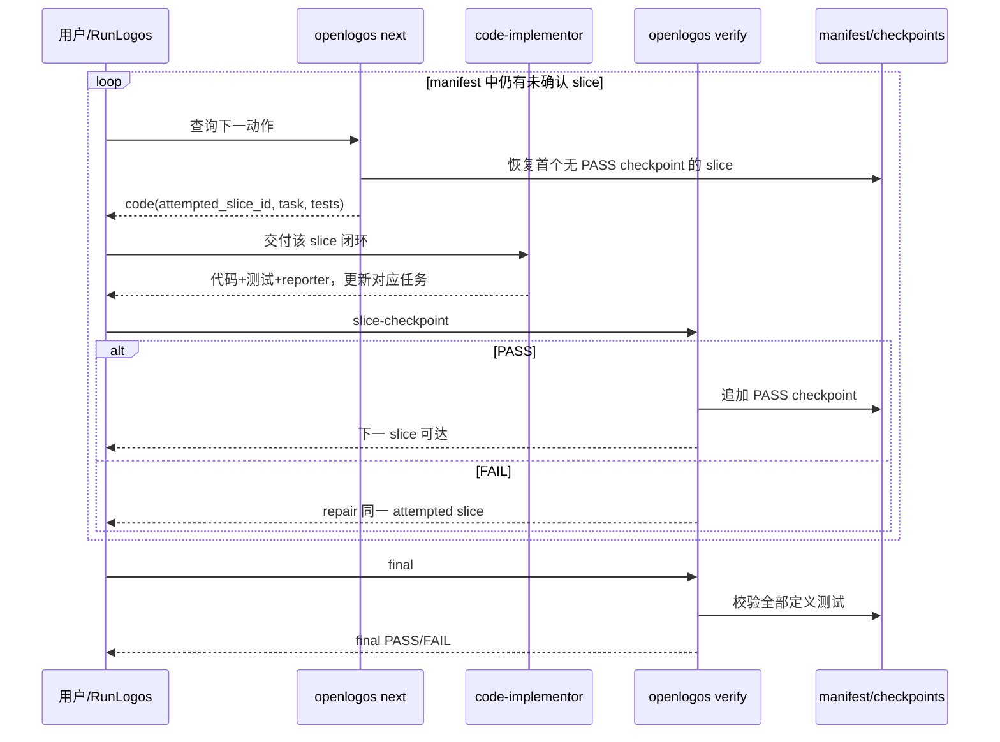

# S31：代码切片 checkpoint 循环

### 场景目标

以稳定 manifest 身份逐片完成“业务代码 + 测试 + reporter + checkpoint”，在最后一片后执行 final 全量 verify，并允许跨进程重启无歧义续跑。

### 参与者

- 用户或 RunLogos
- code-implementor Agent
- OpenLogos `next/verify`
- SliceVerificationService
- manifest/checkpoint/loop 文件

### 前置条件

- proposal 与 delta 已合并，真实测试 ID 已进入主规格。
- slice-planner 已写入 `[code]` 和有效 manifest，slice-exit 已批准。
- 每个切片均为可独立 checkpoint 的闭环交付物。

### 后置条件

- 每个切片有且仅有一个有效 PASS checkpoint。
- final PASS 后才写 `VERIFY_PASS` 并进入 deliver。

### 步骤

1. `next` 使用 manifest 顺序和 checkpoint 选择 attempted slice，并把该片 owned tests/selector 作为提示。
2. Agent 按单片闭环交付，不为后续切片写 reporter 结果。
3. verify 对 eligible 集合执行 checkpoint；PASS 后才允许身份前移。
4. 最后一片 checkpoint PASS 后，若所有 `[code]` 任务完成，下一次 verify 进入 final。
5. final 全量通过后 implement loop 收敛。

### 重启恢复

宿主或 Agent 进程退出后，OpenLogos 只依赖提案目录中的 manifest、有效 checkpoint、tasks 和 marker 重算状态。若 checkbox 已前移而 checkpoint 未写，仍返回原 attempted slice；若 checkpoint 已写而响应丢失，重试不会重复追加等价 PASS，并返回下一片。

### 异常与边界

- manifest 缺失转 S28/S32，不把所有未来 ID 作为 uncovered。
- owned tests 重复、遗漏或不存在时在 runner 启动前阻塞。
- 父切片已勾但子任务未完成时不能进入 final。
- checkpoint 全通过但 task 未完成时返回状态不一致，不伪造 final。
- final 失败重新打开 repair，但不得删除已有 checkpoint 审计。

### 追溯

- 需求：S31、S13、S27。
- 规格：功能规格 §2.37；`spec/tasks-spec.md`、`spec/test-slice-manifest.md`。
- 测试：UT-S31-28～UT-S31-36、ST-S31-12～ST-S31-15。
