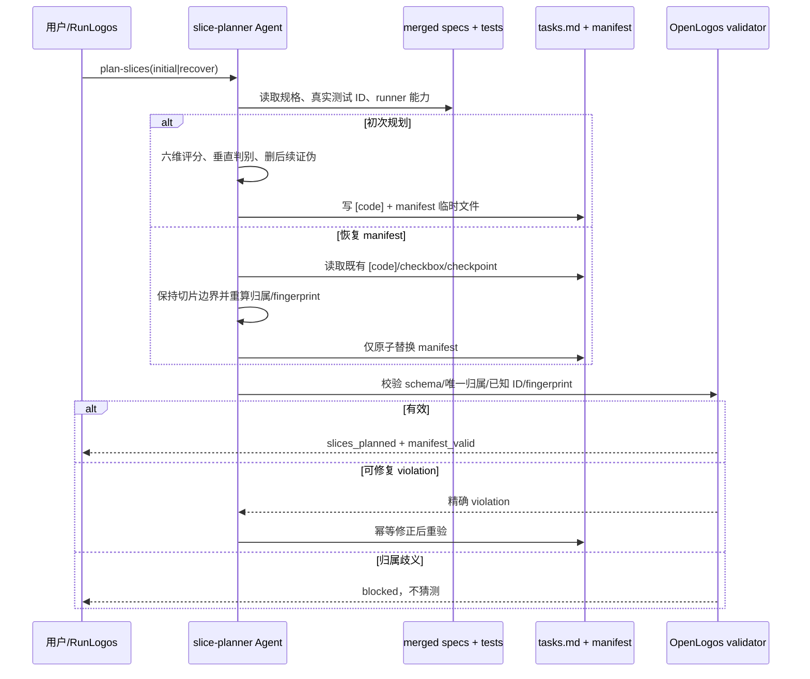
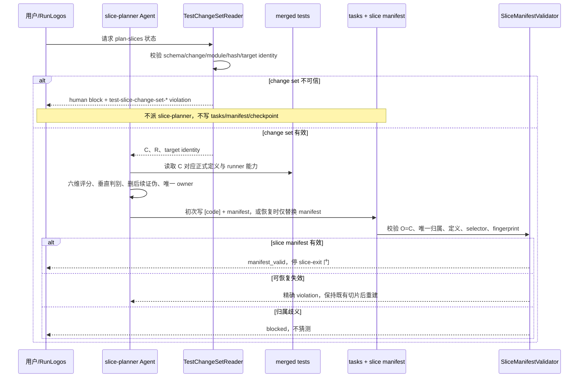
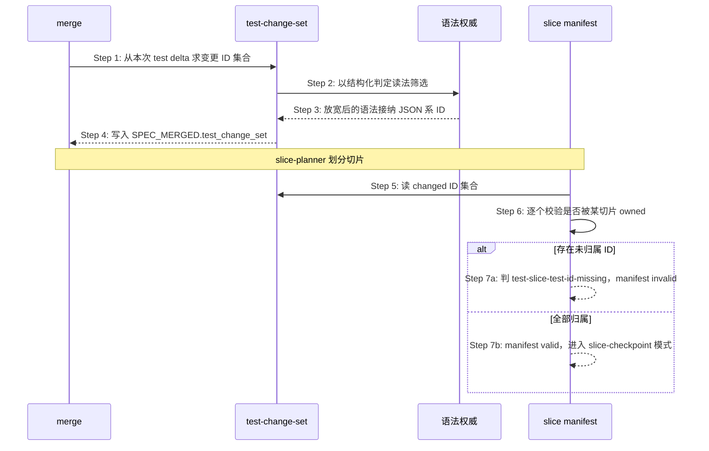

# S32：切片规划与 manifest 生成/恢复

### 场景目标

在 spec-complete 后基于已合并规格与真实测试 ID 同时产出良构 `[code]` 切片和稳定机器 manifest；缺失或漂移时能保留既有切片身份并安全重建 manifest。

### 参与者

- 用户或 RunLogos
- 使用 `slice-planner` Skill 的 Agent
- OpenLogos manifest validator
- `tasks.md`、已合并测试规格与提案目录

### 前置条件

- `SPEC_MERGED` 存在，测试规格包含真实 UT/ST/SMOKE ID。
- 初次模式下 `[code]` 仍为占位；恢复模式下 `[code]` 已规划且可能部分完成。
- 不存在未恢复的 seed commit journal。

### 后置条件

- 初次模式：`[code]` 良构切片与 `TEST_SLICE_MANIFEST.json` 同一轮原子收敛。
- 恢复模式：既有切片文本、顺序、checkbox、稳定 slice ID 和有效 checkpoint 均保留。

### 步骤

1. Agent 从规格提取本提案变更测试 ID，为每个 ID确定唯一 owning slice 和 runner selector。
2. 初次规划先完成 slice-planner 的六维评分、垂直/横向判别与删后续证伪，再给切片分配稳定 ID。
3. `slice_id` 从规范化顺序和切片语义生成；重复运行输入相同则逐字节稳定。
4. 计算 `task_fingerprint` 与 `spec_fingerprint`，写入 manifest。
5. 原子落盘后调用 validator；只有 schema、唯一归属、ID 存在性、selector 与 fingerprint 全部通过才完成。

### 恢复模式

- 禁止重新打分或调整既有切片边界。
- 以既有 manifest 可验证 slice ID 为优先；manifest 完全缺失时，依据既有 `[code]` 的规范化顺序和文本确定性重建。
- 已完成 checkbox 与有效 checkpoint 原样保留；若切片文本改变导致无法保持身份，必须报告歧义。

### 异常与边界

- 测试 ID 漏配、重复归属、未知 ID、空 selector、fingerprint 漂移均在实现/verify 前失败。
- 一个测试跨多个能力线时仍必须选择唯一 owning slice；共享回归通过基线集合运行，不重复 owned。
- 未知 manifest 主版本不覆盖。
- 文件存在但未通过 validator 不得宣布 slice 规划完成。

### 追溯

- 需求：S32、S28。
- 规格：功能规格 §2.37.1、§2.37.5；`skills/slice-planner/SKILL.md`、`spec/test-slice-manifest.md`。
- 测试：UT-S32-32～UT-S32-42、ST-S32-10～ST-S32-13。

## Canonical 测试变更集驱动的切片规划

### 目标

slice-planner 只为 merge 时已固化的真实 changed 测试集合规划唯一 owner；原样携带的 baseline 与已删除测试不得进入切片归属。

### 参与者

- 用户或 RunLogos
- 使用 `slice-planner` Skill 的 Agent
- OpenLogos `TestChangeSetReader`
- OpenLogos slice manifest validator
- `SPEC_MERGED`、`tasks.md`、正式测试规格与 `TEST_SLICE_MANIFEST.json`

### 前置条件

- `SPEC_MERGED` 存在并通过 spec-complete 身份检查。
- `[code]` 为初次规划空承载区，或处于仅重建 manifest 的恢复模式。
- 正式测试规格与 change set 的 `targets[].after_sha256` 一致。

### 步骤

1. OpenLogos 先读取并严格校验 `SPEC_MERGED.test_change_set`；不得从 Delta 或 Git 回退推导。
2. Agent 只把 `changed_test_ids` 分配给切片；`removed_test_ids` 仅供诊断，baseline 不进入 owned。
3. 初次规划按已合并规格与真实 ID 形成 `[code]` 切片，再生成稳定 `slice_id`、owner、selector 与 fingerprint。
4. validator 强制 `O=C`、切片间无交集、owned ID 在唯一 spec target 中存在且 selector 可执行。
5. change set 有效但 manifest 非法时，恢复模式保留 task 文本、顺序、checkbox、slice identity 与有效 checkpoint，只原子替换 manifest。
6. 合法 manifest 后停在 `slice-exit` 人类门，不因恢复自动越门进入实现。

### 事故样本

对完整 `MODIFIED` 测试章节，C 只能包含 `UT-S10-129`、`UT-S10-137`～`UT-S10-140`、`ST-S10-44`。`UT-S10-121`～`UT-S10-128`、`ST-S10-36`～`ST-S10-39` 留在 baseline；若 manifest owned 任一原样 ID，报 unknown；漏掉 `UT-S10-129`，报 missing。

### 异常与边界

- change set missing/unsupported/hash/target 漂移：`human_action_required=true`，不得派 `plan-slices`。
- changed ID 多片归属：ambiguous fail-closed，不自动选择。
- removed ID 被 owned：unknown；不得因它已从正式规格消失而放宽定义门。
- no-delta marker 且确无 mergeable delta：可信空 C/R；不得把任意既有测试猜成 changed。
- final `VERIFY_PASS` 已存在的 legacy 提案不回退。

### 追溯

- 需求：S32/S39 测试变更 ID 语义差异与持久化要求。
- 功能规格：§2.37。
- 方法论：`spec/test-slice-manifest.md`、`spec/baseline-closure.md`。
- 测试：UT-S32-43～UT-S32-49、ST-S32-14～ST-S32-16。

## S32 此前不可见的测试 ID 进入切片归属

### 场景目标

让此前对 `test-change-set` 不可见的 JSON 系测试 ID 进入 changed / owned 计算，使对这些用例的改动不再绕过切片归属校验。

### 参与者与前置条件

| 别名 | 组件 | 说明 |
|---|---|---|
| M | `merge` | 写入 `SPEC_MERGED.test_change_set` |
| C | `test-change-set` | 变更 ID 集合的权威 |
| S | `test-slice-manifest` | 切片归属校验 |
| G | 测试 ID 语法权威 | 结构化判定读法的唯一来源 |

### 归属校验时序

**Step 3 的缺陷形态**：此前严格读法要求 ID 形如 `(?:UT|ST)-S\d{2}-…`，JSON 系 ID 不符，在 Step 2 即被丢弃。于是 Step 6 根本看不到它们——修改这些用例的提案可以不为其规划任何切片，校验也不会报错。

**Step 7a 的行为不变**：未归属即 invalid，判据本身不放宽。变化只是**被校验的集合变大了**。

### 对切片规划的影响

| | 此前 | 此后 |
|---|---|---|
| 改动 JSON 系用例是否需规划切片 | 否（看不见） | 是 |
| 未规划时 manifest 状态 | valid（假阴性） | invalid，点名未归属 ID |
| ID 是否需携带场景号 | —— | 否，归属以 `owned_test_ids` 为准 |

**ID 无场景号不妨碍归属**：切片的归属关系由 manifest 的 `owned_test_ids` 显式声明，不从 ID 中的场景编号推断。`spec_targets` 同样由切片作者显式给出。

### 不变量

1. 变更 ID 集合的筛选判据只有一处，即权威语法的结构化判定读法。
2. 归属校验的判据不因集合变大而放宽——未归属仍判 invalid。
3. 集合变化只增不减；不存在此前被捕获、此后遗漏的 ID。

### 异常与边界

- 已归档提案的 manifest 不受影响：其 `test_change_set` 在 merge 时已固化。
- 若某 JSON 系 ID 被改动但作者未规划切片：manifest 判 invalid 并点名该 ID，属正确拦截。

### 追溯

- 需求：AC-MERGEGATE-08、AC-MERGEGATE-09。
- 功能规格：§2.51.7；架构：§四十一.6.1。
- 测试：UT-S32-50～UT-S32-51、ST-S32-17。
