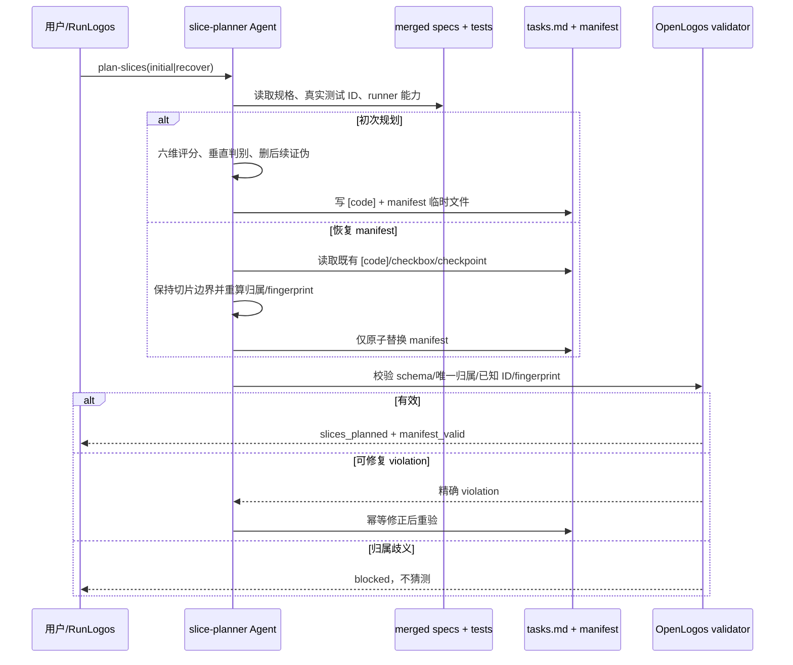
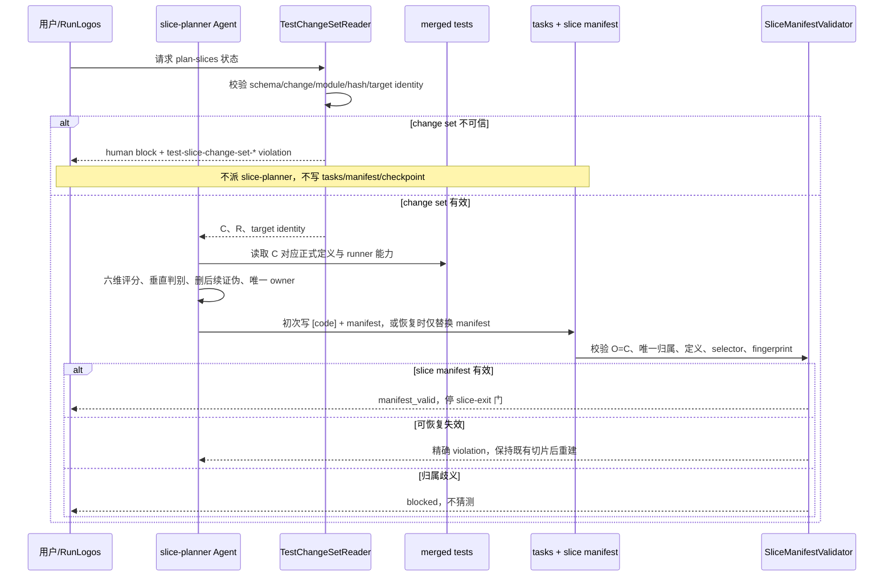
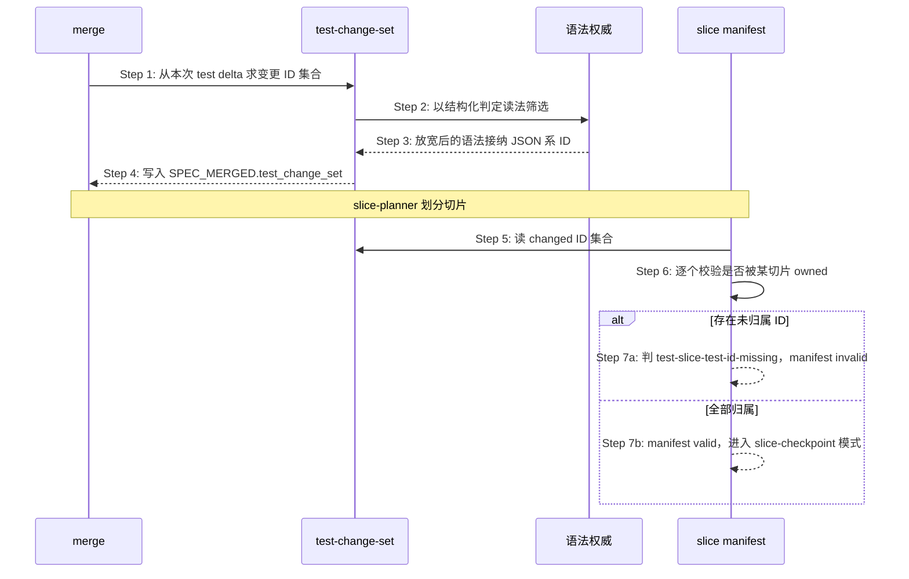
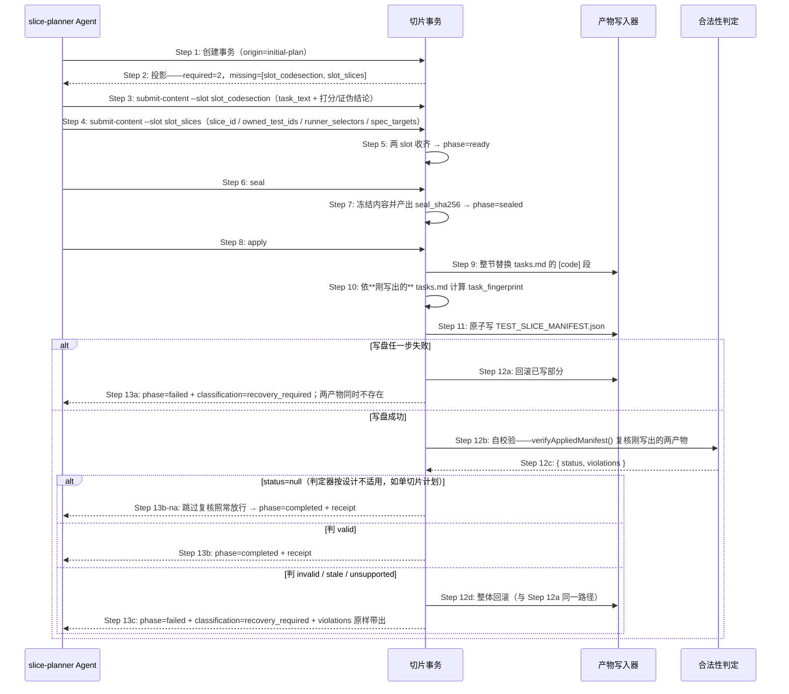
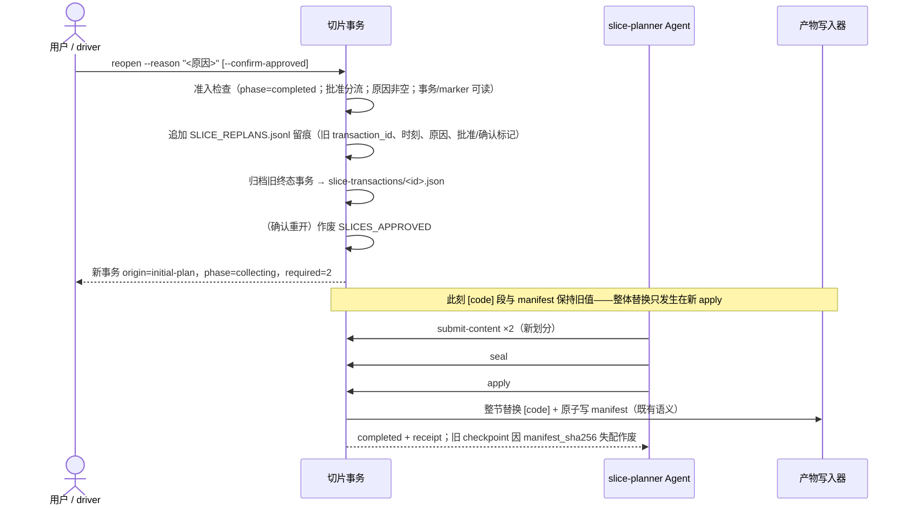
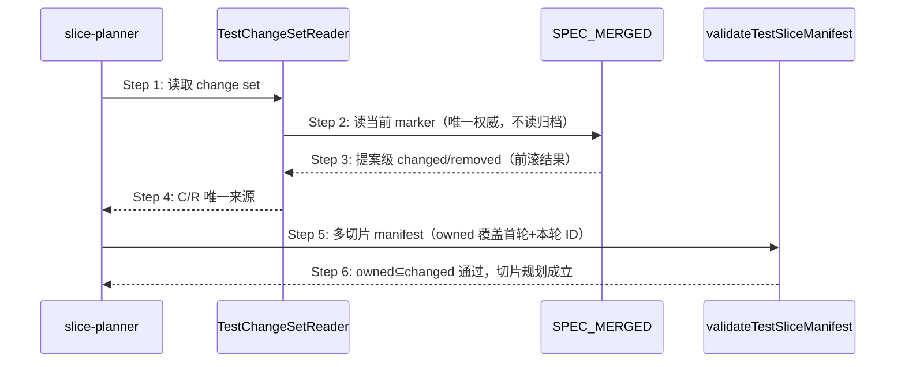

# S32：切片规划与 manifest 生成/恢复

### 场景目标

在 spec-complete 后基于已合并规格与真实测试 ID 同时产出良构 `[code]` 切片和稳定机器 manifest；缺失或漂移时能保留既有切片身份并安全重建 manifest。

### 参与者

- 用户或 RunLogos
- 使用 `slice-planner` Skill 的 Agent
- OpenLogos manifest validator
- `tasks.md`、已合并测试规格与提案目录

### 前置条件

- `SPEC_MERGED` 存在，测试规格包含真实 UT/ST/SMOKE ID。
- 初次模式下 `[code]` 仍为占位；恢复模式下 `[code]` 已规划且可能部分完成。
- 不存在未恢复的 seed commit journal。

### 后置条件

- 初次模式：`[code]` 良构切片与 `TEST_SLICE_MANIFEST.json` 同一轮原子收敛。
- 恢复模式：既有切片文本、顺序、checkbox、稳定 slice ID 和有效 checkpoint 均保留。

### 步骤

1. Agent 从规格提取本提案变更测试 ID，为每个 ID确定唯一 owning slice 和 runner selector。
2. 初次规划先完成 slice-planner 的六维评分、垂直/横向判别与删后续证伪，再给切片分配稳定 ID。
3. `slice_id` 从规范化顺序和切片语义生成；重复运行输入相同则逐字节稳定。
4. 计算 `task_fingerprint` 与 `spec_fingerprint`，写入 manifest。
5. 原子落盘后调用 validator；只有 schema、唯一归属、ID 存在性、selector 与 fingerprint 全部通过才完成。

### 恢复模式

- 禁止重新打分或调整既有切片边界。
- 以既有 manifest 可验证 slice ID 为优先；manifest 完全缺失时，依据既有 `[code]` 的规范化顺序和文本确定性重建。
- 已完成 checkbox 与有效 checkpoint 原样保留；若切片文本改变导致无法保持身份，必须报告歧义。

### 异常与边界

- 测试 ID 漏配、重复归属、未知 ID、空 selector、fingerprint 漂移均在实现/verify 前失败。
- 一个测试跨多个能力线时仍必须选择唯一 owning slice；共享回归通过基线集合运行，不重复 owned。
- 未知 manifest 主版本不覆盖。
- 文件存在但未通过 validator 不得宣布 slice 规划完成。

### 追溯

- 需求：S32、S28。
- 规格：功能规格 §2.37.1、§2.37.5；`skills/slice-planner/SKILL.md`、`spec/test-slice-manifest.md`。
- 测试：UT-S32-32～UT-S32-42、ST-S32-10～ST-S32-13。

## Canonical 测试变更集驱动的切片规划

### 目标

slice-planner 只为 merge 时已固化的真实 changed 测试集合规划唯一 owner；原样携带的 baseline 与已删除测试不得进入切片归属。

### 参与者

- 用户或 RunLogos
- 使用 `slice-planner` Skill 的 Agent
- OpenLogos `TestChangeSetReader`
- OpenLogos slice manifest validator
- `SPEC_MERGED`、`tasks.md`、正式测试规格与 `TEST_SLICE_MANIFEST.json`

### 前置条件

- `SPEC_MERGED` 存在并通过 spec-complete 身份检查。
- `[code]` 为初次规划空承载区，或处于仅重建 manifest 的恢复模式。
- 正式测试规格与 change set 的 `targets[].after_sha256` 一致。

### 步骤

1. OpenLogos 先读取并严格校验 `SPEC_MERGED.test_change_set`；不得从 Delta 或 Git 回退推导。
2. Agent 只把 `changed_test_ids` 分配给切片；`removed_test_ids` 仅供诊断，baseline 不进入 owned。
3. 初次规划按已合并规格与真实 ID 形成 `[code]` 切片，再生成稳定 `slice_id`、owner、selector 与 fingerprint。
4. validator 强制 `O=C`、切片间无交集、owned ID 在唯一 spec target 中存在且 selector 可执行。
5. change set 有效但 manifest 非法时，恢复模式保留 task 文本、顺序、checkbox、slice identity 与有效 checkpoint，只原子替换 manifest。
6. 合法 manifest 后停在 `slice-exit` 人类门，不因恢复自动越门进入实现。

### 事故样本

对完整 `MODIFIED` 测试章节，C 只能包含 `UT-S10-129`、`UT-S10-137`～`UT-S10-140`、`ST-S10-44`。`UT-S10-121`～`UT-S10-128`、`ST-S10-36`～`ST-S10-39` 留在 baseline；若 manifest owned 任一原样 ID，报 unknown；漏掉 `UT-S10-129`，报 missing。

### 异常与边界

- change set missing/unsupported/hash/target 漂移：`human_action_required=true`，不得派 `plan-slices`。
- changed ID 多片归属：ambiguous fail-closed，不自动选择。
- removed ID 被 owned：unknown；不得因它已从正式规格消失而放宽定义门。
- no-delta marker 且确无 mergeable delta：可信空 C/R；不得把任意既有测试猜成 changed。
- final `VERIFY_PASS` 已存在的 legacy 提案不回退。

### 追溯

- 需求：S32/S39 测试变更 ID 语义差异与持久化要求。
- 功能规格：§2.37。
- 方法论：`spec/test-slice-manifest.md`、`spec/baseline-closure.md`。
- 测试：UT-S32-43～UT-S32-49、ST-S32-14～ST-S32-16。

## S32 此前不可见的测试 ID 进入切片归属

### 场景目标

让此前对 `test-change-set` 不可见的 JSON 系测试 ID 进入 changed / owned 计算，使对这些用例的改动不再绕过切片归属校验。

### 参与者与前置条件

| 别名 | 组件 | 说明 |
|---|---|---|
| M | `merge` | 写入 `SPEC_MERGED.test_change_set` |
| C | `test-change-set` | 变更 ID 集合的权威 |
| S | `test-slice-manifest` | 切片归属校验 |
| G | 测试 ID 语法权威 | 结构化判定读法的唯一来源 |

### 归属校验时序

**Step 3 的缺陷形态**：此前严格读法要求 ID 形如 `(?:UT|ST)-S\d{2}-…`，JSON 系 ID 不符，在 Step 2 即被丢弃。于是 Step 6 根本看不到它们——修改这些用例的提案可以不为其规划任何切片，校验也不会报错。

**Step 7a 的行为不变**：未归属即 invalid，判据本身不放宽。变化只是**被校验的集合变大了**。

### 对切片规划的影响

| | 此前 | 此后 |
|---|---|---|
| 改动 JSON 系用例是否需规划切片 | 否（看不见） | 是 |
| 未规划时 manifest 状态 | valid（假阴性） | invalid，点名未归属 ID |
| ID 是否需携带场景号 | —— | 否，归属以 `owned_test_ids` 为准 |

**ID 无场景号不妨碍归属**：切片的归属关系由 manifest 的 `owned_test_ids` 显式声明，不从 ID 中的场景编号推断。`spec_targets` 同样由切片作者显式给出。

### 不变量

1. 变更 ID 集合的筛选判据只有一处，即权威语法的结构化判定读法。
2. 归属校验的判据不因集合变大而放宽——未归属仍判 invalid。
3. 集合变化只增不减；不存在此前被捕获、此后遗漏的 ID。

### 异常与边界

- 已归档提案的 manifest 不受影响：其 `test_change_set` 在 merge 时已固化。
- 若某 JSON 系 ID 被改动但作者未规划切片：manifest 判 invalid 并点名该 ID，属正确拦截。

### 追溯

- 需求：AC-MERGEGATE-08、AC-MERGEGATE-09。
- 功能规格：§2.51.7；架构：§四十一.6.1。
- 测试：UT-S32-50～UT-S32-51、ST-S32-17。

## S32 切片产物经事务原子落盘

### 场景目标

把切片规划的两个 canonical 产物——`tasks.md` 的 `## [code]` 段与 `TEST_SLICE_MANIFEST.json`——从 Agent 直接写文件，改为向事务 content slot 提交内容、由 OpenLogos 在同一次 apply 中原子写出。

### 参与者与前置条件

| 别名 | 组件 | 说明 |
|---|---|---|
| A | slice-planner Agent | 生产切片划分内容，只能 `submit-content` |
| T | 切片事务 | 状态机、slot 校验、seal/apply |
| W | 产物写入器 | `writeTestSliceManifestAtomic()` 与 `[code]` 整节替换 |
| V | `deriveSliceVerificationState()` | manifest 合法性判定 |

前置：提案已 spec-complete（`SPEC_MERGED` 或 legacy `MERGED`）；测试 ID 已定；同一提案同时至多一个活跃切片事务。

### 主时序

### 步骤说明

- **Step 3/4 是 Agent 唯一的写动作**。`[code]` 段、manifest、receipt 与 marker 一律由 OpenLogos 写入。
- **Step 9 为整节替换**：只替换 `## [code]` 段，`[delta]` / `[deploy]` 段及其既有 checkbox 状态字节恒等。
- **Step 10 是本场景的关键**：指纹由 OpenLogos 依其**自己刚写出**的 `tasks.md` 计算，不接受 Agent 提供。写入者与指纹计算者是同一方、同一时刻，漂移窗口从构造上消失（架构 §四十三.2）。
- **Step 12a 无半写态**：两产物同时存在或同时不存在。
- **Step 12b～12d 曾是 0.14.12 补齐的分支。** 此前时序只画到「Step 12b 复核 manifest 合法性」便直接连向 `completed`——**画了复核这一步，却没有画复核结论的去向**。实现照此产出了一个 `verifyAppliedManifest()` 函数，然后没有任何路径调用它：写盘成功即 `completed`，同一进程内的判定器随即判 `invalid`。规格里一条没有分支的复核，落到实现里就是一个没有调用方的函数。
- **Step 12c 的结论按三分支消费（fix-apply-verdict-not-applicable-vs-invalid）**：`status=null` 表示判定器**按设计不适用**（当前唯一来源：单切片计划下 `shouldUseSliceVerification()` 恒为假），与 `valid` 同样放行进入 `completed`——复核的适用性是前置条件，不适用即跳过复核而非判失败（架构 §四十三.2.1）；只有判定器实际给出的负面结论（`invalid` / `stale` / `unsupported`）才走 Step 12d。放行分支须显式区分 `null` 与 `valid` 两种来源，不得无差别合并。0.14.12～0.14.13 曾以 `status !== 'valid'` 作唯一判据，把所有单切片提案的 apply 误判为失败，错误信息「判为 unknown，已整体回滚：0 条违规」——0 条违规正是判定器根本没运行的特征。
- **Step 12d 与 Step 12a 是同一条回滚路径**，不是第二份实现。「产出不合法」与「写盘异常」对消费方是同一种失败，只需一套语义：修正 slot 内容后重新提交。
- **Step 13c 必须保真 violations**：原样带出 `code` / `path` / `message` / `fix_hint`，不得压缩为单条摘要，否则消费方无法定位是哪个 `spec_targets` 或哪个 `task_text` 不合格；失败文案不得出现 `unknown`，且失败终态必伴随非零 violations。

### 恢复事务的差异

| | initial-plan | manifest-recovery |
|---|---|---|
| 触发 | 首次切片规划 | `deriveSliceVerificationState()` 判 missing / invalid / stale |
| required slots | `slot_codesection` + `slot_slices` | 仅 `slot_slices` |
| `[code]` 段 | 由本事务写出 | **冻结，拒绝改写** |

`[code]` 冻结是硬约束：切片划分本身没问题，问题只在 manifest 失效；改写 `[code]` 会把一次修复变成一次重新规划，并使既有 checkpoint 失去意义。

### 复用边界

不新建第二套判据或写入器：

| 复用 | 此前状态 |
|---|---|
| `writeTestSliceManifestAtomic()` | 已导出，**调用方 0 处** |
| `extractChangedTestIds()` | 已导出，**调用方 0 处** |
| `deriveSliceVerificationState()` | 11 处消费 |
| `computeTaskFingerprint()` / `computeSpecFingerprint()` | 各 1 处消费 |

前两项正是本场景要接出来的能力，而非重新实现。

### 不变量

1. **写入权唯一**：两产物的字节只由 apply 写出；不存在 Agent 直接写它们的可用路径（架构 §四十三.1）。
2. **原子性由构造保证**：两产物同时成功或同时回滚，无半写态（架构 §四十三.2）。
3. **终态准入**：`completed` 当且仅当自校验**未给出负面结论**——判 `valid` 或判定器按设计不适用（`null`）均放行；判 `invalid` / `stale` / `unsupported` 必须整体回滚为 `failed`（架构 §四十三.2.1）。
4. **复核有调用方**：合法性复核必须位于 apply 的主路径上。只被定义、无人调用的复核函数等同于该约束不存在。
5. **不适用不是失败**：判定器按设计不适用时跳过复核照常放行；「失败终态 + 0 条违规」的组合不得出现。放行分支显式区分 `null` 与 `valid` 两种来源。
6. **指纹自算**：`task_fingerprint` 不接受外部提供。
7. **整节守恒**：`[code]` 之外的段与 checkbox 状态字节恒等。
8. **恢复不改划分**：`manifest-recovery` 下 `[code]` 段字节恒等。
9. **单活跃事务**：同一提案同时至多一个**非终态**切片事务；终态事务不占活跃名额。

### 异常与边界

- slot 内容结构非法（缺字段、非 JSON）：`submit-content` 拒绝并点名字段，事务停留在 `collecting`。
- slot 内容**结构合法但业务非法**（`spec_targets` 指向非测试规格文档、`task_text` 与 `[code]` 行不一致）：`submit-content` 与 `seal` 均放行，由 apply 的自校验拦截并整体回滚（Step 12d）。本提案不在提交点重复该判据——判据只保留一处实现（架构 §四十一.4）。
- **单切片计划（`tasks.length < 2`）**：切片验证按设计不启用，Step 12c 得 `status=null` → 照常放行进入 `completed`，`[code]` 正确写出，manifest 为惰性产物保留在盘。单切片是 slice-planner 的合规产出形态（六维 0–7 分单切；≥8 分不可拆的逃生口显式单切），不得以「拆成两片满足判定器」替代。注意由此派生的边界：单切片下业务判据同样不启用（如 `spec_targets` 不受切片验证检查），其兜底由 verify 全量回归与实现阶段承担。
- seal 后再提交内容：动作不在 `allowed_actions` 中，被拒且无副作用。
- apply 后重复 apply：幂等，返回既有 receipt，不重复写入。
- apply 自校验判非法后重新提交：事务处于 `failed` 且 `classification=recovery_required`，允许修正 slot 后重走 seal / apply。
- 提案未 spec-complete 即创建事务：拒绝，理由指向 spec-complete 前置。

### 追溯

- 需求：AC-SLICETX-03～07、AC-SLICETX-10；AC-SLICEFIX-01～04；AC-VERDICT-01～05。
- 功能规格：§2.53.3～§2.53.6、§2.53.5.1、§2.53.8、§2.55；架构：§四十三.1、§四十三.2、§四十三.2.1。
- 测试：UT-S32-52～UT-S32-64、ST-S32-18～ST-S32-21；安装态 SMOKE-core-175、SMOKE-core-176、SMOKE-core-178。

## S32 已完成规划的受控重划（support-slice-replan-on-completed-plan）

### 场景目标

在切片划分被证实有误时（manifest 完全有效、恢复回边不触发），经受控重开路径作废当前规划、留痕、重建 `collecting` 事务，由 slice-planner 提交新划分并经既有 seal/apply 整体替换两产物。

### 重划时序

### 失败分支（fail-closed，三类）

- **事务文件不可读**：拒绝重开，无任何写副作用（不留痕、不归档、不动 marker）。
- **`SLICES_APPROVED` 状态不可判定**（I/O 错误等）：同上 fail-closed。
- **已批准未确认**：拒绝并给出可执行指引（附 `--confirm-approved` 重试）；同样零副作用。

### 不变量

1. `reopen` 是 `completed` 唯一的出边动作；`--reason` 非空是留痕前置。
2. 留痕 append-only；无留痕的重开是被禁止的影子路径。
3. 重开 → 新 apply 之间不存在半新半旧窗口：两产物保持旧值直到整体替换。
4. 旧终态事务归档不销毁；旧 checkpoint 不被新划分的 verify 采信（`manifest_sha256` 失配）。
5. 确认重开作废 `SLICES_APPROVED`——slice-exit 门须对新划分重走。
6. 与 manifest-recovery 回边互不顶替（架构 §四十四.3）。
7. 未执行 `reopen` 时 `completed` 行为与 0.14.14 逐项一致。

### 异常与边界

- 重开后的 `collecting` 事务与首次规划同形：slot 校验、seal preflight、apply 终态守门（三分支）全部复用，不开第二套语义。
- 重开后再次 `reopen`：新事务非 `completed`，`action_not_allowed`。
- 重复重开（新划分 apply 后再发现错误）：合法，各自留痕成行。
- `manifest-recovery` 的 `completed` 同样可 `reopen`（规划错误与 manifest 曾失效无冲突）。

### 追溯

- 需求：AC-REPLAN-01～08；功能规格：§2.56；架构：§四十四；根规范：`spec/test-slice-manifest.md` §2.4。
- 测试：UT-S32-65～UT-S32-68、ST-S32-22；安装态：SMOKE-core-179。

## S32 change set 提案级语义与 reopen 后切片归属

### 场景目标

明确 `SPEC_MERGED.test_change_set` 的消费语义为**提案级累计事实**：reopen 重合并后，切片规划与校验读到的 changed/removed 表达「本提案引入/修改/删除了哪些测试 ID」，多切片方案（owned 归属 + 删后续证伪门）在 reopen 后依然成立。消费侧代码零变化。

### 参与者

- **slice-planner**：以 changed 为 C/R 唯一来源划分切片。
- **validateTestSliceManifest**：owned⊆changed 双向强校验。
- **slice-aware verify**：按切片归属豁免未完成切片 ID。
- **merge apply（生产者）**：前滚合并后写出提案级 change set（时序见 S09）。

### 前置条件

提案经 reopen 重合并 completed，`SPEC_MERGED.test_change_set` 为前滚合并结果。

### 成功后置条件

本提案真实新增的每个测试 ID 均可被某切片 own（不再触发 `test-slice-test-id-unknown`）；多切片规划与删后续全量 verify 成立。

### 时序图

### 步骤说明

1. **slice-planner** 经共享 TestChangeSetReader 读取 change set，不感知提案是否经历 reopen。
2. **TestChangeSetReader** 只读当前 `SPEC_MERGED.test_change_set` 并校验 payload hash 与 target after hash；归档事务/receipt 对消费者保持 audit-only。
3. 前滚结果使 changed 含首轮引入且未删除的全部 ID。
4. **slice-planner** 按 C/R 正常划分多切片。
5. **validateTestSliceManifest** 的 owned⊆changed 校验对本提案真实 ID 全部放行；removed 后写胜出（被本轮删除的 ID 不在 changed、出现在 removed，own 之即报 `test-slice-test-id-unknown`）。
6. slice-aware verify 按归属豁免未完成切片 ID，删后续证伪门可成立。

### 异常与边界

#### EX-49.1：消费者试图读归档补齐
- **触发条件**：任何消费者在 changed 缺失时读取 `merge-transactions/` 并集裁决。
- **期望响应**：禁止（forbidden fallback）；change set 不可信时按既有分层阻断（`manifest_status=invalid` / human action required），不回退推导。
- **副作用**：无。

#### EX-49.2：change set 为前滚结果但被篡改
- **触发条件**：payload hash 或 target hash 漂移。
- **期望响应**：与既有行为一致——精确 `test-slice-change-set-*` violation 阻断，零 Gate/loop/runner 副作用。
- **副作用**：无。

### 追溯

- 需求：reopen 后 test change set 提案级前滚需求。
- 测试：UT-S32-69～70、ST-S32-23、SMOKE-core-191。
