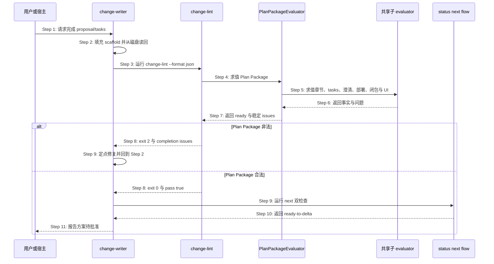

# S35：提案计划产物左移硬检查（change-lint）

> Feature：F04 变更提案与切片生命周期  
> 来源：需求 S35、功能规格 §2.30 与 §2.43、跨仓 Plan Package 修复方案

## 场景目标

在 proposal/tasks producer 向用户报告完成之前，由 OpenLogos CLI 独立证明 Plan Package 满足统一合同；失败时返回可供同一 Agent 定点修复的结构化问题，并保证 change-lint、status、next 与 flow derive 对同一输入收敛。

## 用户价值

用户只会在方案真正可批准时看到 `ready-to-delta`，不会遭遇“lint PASS 但面板仍 writing”，也无需理解 canonical 标题、模板占位或插件缓存漂移。

## 参与者

- **用户/宿主**：触发检查并消费最终完成结论。
- **change-writer**：生产 proposal/tasks、读回并消费问题修复。
- **change-lint**：命令入口、退出码与 envelope 所有者。
- **PlanPackageEvaluator**：唯一完成判据与 issue 生产者。
- **status/next/flow**：只读消费同一 evaluation 的投影方。
- **AssetManifest**：证明 producer Skill/模板与 CLI 合同一致。

## 前置条件

- 项目已初始化，guard 指向当前 launched change。
- proposal/tasks 已由 change-writer 填充但尚无 Delta、无 `PLAN_APPROVED`。
- 项目 locale、模块、部署决定、clarification 与 baseline closure 可读取。

## 成功后置条件

- `change-lint --format json` exit 0 且 `data.pass=true`、`data.plan_package.ready=true`。
- status 的 `plan_ready=true`，next 的 `proposal_step=ready-to-delta`，flow predicate 同样完成。
- 检查前后项目全量文件集合与内容 hash 不变。
- change-writer 才能向用户报告方案待批准；本场景不写审批 marker。

## 时序图

## 步骤说明

1. **用户或宿主**要求 change-writer 完成当前提案，而不是直接授权 Delta 或 merge。
2. **change-writer**保留 CLI canonical scaffold，只替换占位正文；落盘后重新读取真实字节。
3. **change-writer**从项目根运行带明确 slug 的 change-lint JSON 命令。
4. **change-lint**完成操作错误前置检查后调用唯一 **PlanPackageEvaluator** 作为 L0。
5. **PlanPackageEvaluator**调用 authority scan、tasks parser、clarification、deployment、baseline closure 与 UI 声明共享 evaluator。
6. **共享子 evaluator**返回结构化事实；不得自行写文件或吞掉解析错误。
7. **PlanPackageEvaluator**规范化、去重并稳定排序 issues，计算 proposal/tasks 三态与 ready。
8. **change-lint**在 ready=false 时 exit 2、ready=true 时继续 L1～L9 并最终 exit 0；操作错误仍 exit 1。
9. 失败时 **change-writer**只修 issues 指向的当前提案文件并读回重试；成功时运行 next 双检查。
10. **status/next/flow**消费同一 evaluation；next 必须进入 `ready-to-delta`，不得仍为 writing。
11. **change-writer**向用户报告最终收敛结果并等待 plan gate 批准，不自动产 Delta 或 marker。

## 异常与边界

### EX-5.1：canonical summary 缺失
- **触发条件**：proposal 把 locale summary 改为自由标题，或章节缺失/重复/为空。
- **期望响应**：`proposal_required_section_missing|duplicate|empty`，包含 path、section_id、expected 与 fix_hint。
- **副作用**：lint/status/next/flow 均只读，plan 不 ready。

### EX-5.2：plan 阶段 code 占位或切片
- **触发条件**：tasks 保留 `实现代码变更` 或提前出现任意 `[code]` checkbox。
- **期望响应**：模板残留或 `tasks_code_entry_before_spec_complete`；空 `[code]` 锚点本身合法。
- **副作用**：不 auto-reset；auto-reset 仍只属于既有 merge/slice 边界。

### EX-7.1：子 evaluator 操作错误
- **触发条件**：proposal/tasks 不可读、YAML parser 失败或项目根事实不可安全解析。
- **期望响应**：exit 1 error envelope；不得降级成 pass=false success envelope。
- **副作用**：后续检查停止，文件与 marker 不变。

### EX-9.1：Agent 自然语言声称完成
- **触发条件**：文件非法但 Agent 输出“已完成”。
- **期望响应**：机器门仍失败；宿主 completion barrier 不得把 WorkUnit 标成 completed。
- **副作用**：用户不看到“可写 Delta”。

### EX-10.1：历史提案已越过 plan
- **触发条件**：存在 `PLAN_APPROVED|SPEC_MERGED|MERGED|VERIFY_PASS` 且旧 scaffold 不符合新规则。
- **期望响应**：保持现有前沿，仅允许非阻塞 warning。
- **副作用**：不回退、不改写历史。

### EX-10.2：Skill/模板资产过期
- **触发条件**：项目 sync hash 与 CLI asset manifest 不一致。
- **期望响应**：只读状态可见；producer dispatch 提示 sync + 重开 session，禁止静默使用旧 Skill。
- **副作用**：不覆盖用户/项目自有 Skill。

## API、数据库与安全边界

- 所有交互是本地进程/文件合同，API、数据库与 API 编排为 SKIP。
- completion 命令保持只读，不写 `PLAN_APPROVED`、Delta、MERGE_PROMPT 或宿主 WorkUnit 状态。
- RunLogos 自动回传、三次修复预算和 UI 展示属于独立 companion change。

## 追溯

- 需求：S05/S08/S09/S11/S35 Plan Package 完成合同收敛需求。
- 功能规格：§2.43 Plan Package 统一完成合同。
- 架构：第三十三章 Plan Package 完成合同收敛架构。
- 方法论：`spec/change-management.md`、`spec/tasks-spec.md`、`spec/flow-spec.md`、`spec/cli-json-output.md`。
- 测试：UT-S35-100～UT-S35-111、ST-S35-16～ST-S35-18、SMOKE-core-135～SMOKE-core-140。

## S35 围栏提取单点、可归因诊断与门禁可满足性断言

### 场景目标

消除 `change-lint` 判定链上的两处判据分裂（YAML 围栏提取、测试 ID 语法），让多命中不再静默降级，并为「门在其阶段可满足」建立可执行的失败信号。

### 参与者与前置条件

| 别名 | 组件 | 说明 |
|---|---|---|
| C | `change-lint` evaluator | L0～L9 的完整判定 |
| S | `markdown-scan.authorityScan` | 围栏 / 缩进代码 / HTML 注释掩码的唯一判据（函数名承自历史，判据本身与 authority 无关） |
| G | 测试 ID 语法权威 | 语法与三种具名读法的唯一铸造点 |
| T | 门禁可满足性断言 | 每道门 × 该阶段合法最小提案 |

### 围栏提取归位时序

**Step 3 的判据**：全部 YAML 围栏提取器一律走 `markdown-scan` 的 fence-aware 掩码，不得自建裸正则。对含嵌套围栏的文档（如四反引号 markdown 块内示意一段 yaml），裸正则会比 fence-aware 多命中一个围栏——这正是掩码必须单点的原因。

**多命中不得静默降级**：任一围栏提取器在候选数不为 1 时，必须产出点名的诊断，说明命中了几处、分别在哪；不得静默返回空集或取第一个命中。

### 测试 ID 语法的单点与具名读法

| 读法 | 消费方 | 与权威语法的关系 |
|---|---|---|
| 结构化判定 | `test-change-set`、`test-slice-manifest`、`baseline-closure` | 完整语法 |
| 表格首列提取 | `test-slice-manifest` | 完整语法 + 行首锚定 |
| 正文扫描 | `automation-diagnostic` | 完整语法减去 SMOKE |

读法差异正当，各自定义不正当。本次消除的是四份独立演化的定义。

**语法与数据的一致性锚**：断言已合并测试规格中每一个表格首列 ID 都被权威语法接纳。原始缺陷不是正则写错了，而是没人检查正则与真实数据是否还对得上——11 个 JSON 系 ID 因此静默失联。

### 门禁可满足性断言

对每一道门构造「该门所处阶段的合法最小提案」，断言其通过：

| 阶段 | 合法最小提案含有 | 不含 |
|---|---|---|
| plan | 完整 proposal（含 baseline_closure）+ tasks（`[delta]` 已规划、`[code]` 空标题） | 任何 delta |
| spec / merge | 上述 + 全部已规划 delta | `[code]` 切片 |

断言的价值不在验证当前 11 道门，而在新增门禁时立刻给出失败信号（架构 §四十一.6.2）。

### 诊断可归因要求

全部门禁诊断必须点名导致失败的实体本身——fact_id、测试 ID、文件路径、字段名。禁止「为空、非法或不在某集合中」这类无法定位的措辞。

### 不变量

1. **围栏判据唯一**：四个提取器对同一文档得到同一组围栏。
2. **多命中不静默**：候选数异常时必须产出诊断，不得降级为空集或空结论。
3. **语法唯一、读法具名**：语法恰一处定义；每种读法从其具名派生，不得独立定义。
4. **语法与数据不漂移**：已合并规格中每个表格首列 ID 都被权威语法接纳。
5. **门禁可满足性有断言**：每道门都有对应的「该阶段合法最小提案通过」断言。

### 异常与边界

- 文档不含任何 YAML 围栏：`extractDeclaration` 返回 `missing`，行为不变。
- 语法放宽只增不减：不存在此前被接纳、此后被拒绝的 ID。
- 元测试发现语法与数据漂移时，修复方向是调整语法或修正数据，**不得放宽断言本身**。

### 追溯

- 需求：AC-MERGEGATE-03、AC-MERGEGATE-04、AC-MERGEGATE-06～08。
- 功能规格：§2.51.3、§2.51.5～§2.51.7；架构：§四十一.6.1、§四十一.6.2。
- 测试：UT-S35-127～UT-S35-131、ST-S35-24；安装态 SMOKE-core-173。

## S35 SQL 校验降级留痕的输出通道

### 场景目标

让 SQL 方言层的降级留痕经 `change-lint` 的既有 `warnings` 通道可见，且不改变 L9 的通过与否，也不产生输出漂移。

### 参与者与前置条件

| 别名 | 组件 | 说明 |
|---|---|---|
| L | `change-lint` | L9 的判定与输出 |
| V | `validateSql` | 回传层级结论与降级留痕 |
| W | `warnings` 通道 | 既有字段，非空才出现 |

### 输出时序

### 输出契约

- **不计入 violations**：降级留痕不是违规，不影响 L9 通过与否，也不影响 `change-lint` 的整体退出码。
- **零漂移**：`warnings` 为空时字段整体省略——与既有约定一致，不因本功能改变无降级项目的输出字节。
- **可归因**：每条 warning 含 `code` / `message` / `fix_hint`；message 点名方言、缺失项与已执行层级，fix_hint 说明如何获得更强层级（如安装 `sqlite3`）。

### 不变量

1. 降级留痕只出现在 `warnings`，绝不出现在 `violations`。
2. 无降级的项目，其 `change-lint` 输出与本功能引入前逐字节一致。
3. warning 的存在与否不改变 merge 的准入结论——merge 只看 violations（S09 已冻结「准入判据等于 change-lint 完整结论」，此处的 violations 集合不因 warning 变化）。

### 异常与边界

- 同一提案多份 `.sql` delta 都降级：逐份产出 warning，不合并为一条——用户需要知道具体是哪一份。
- 降级与真实违规并存：violations 与 warnings 各自输出，互不吞并。

### 追溯

- 需求：AC-SQLGATE-08。
- 功能规格：§2.52.7；架构：§四十二.2。
- 测试：UT-S35-132～UT-S35-133、ST-S35-25；安装态 SMOKE-core-174。
