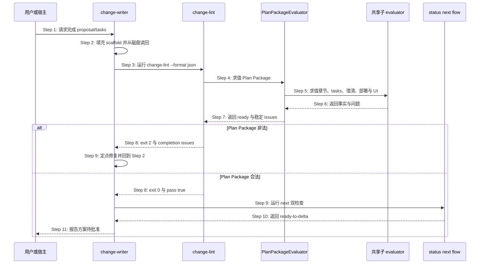
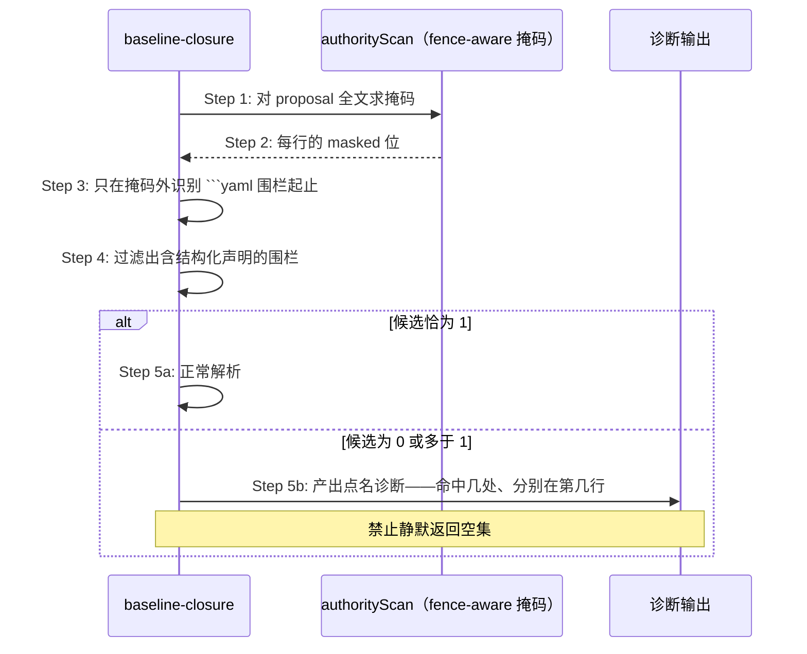
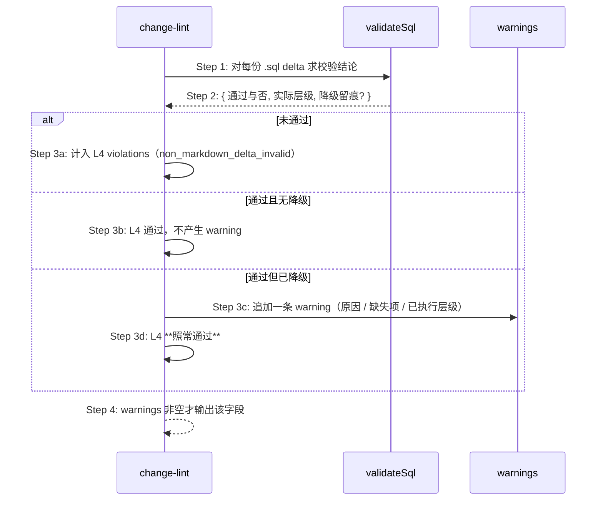
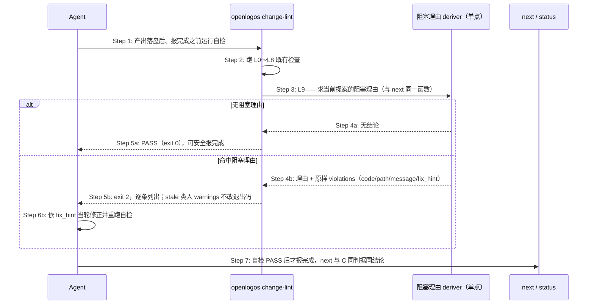
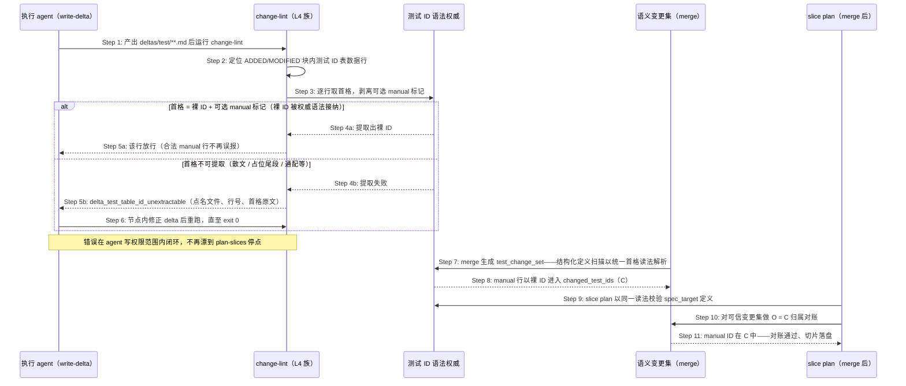
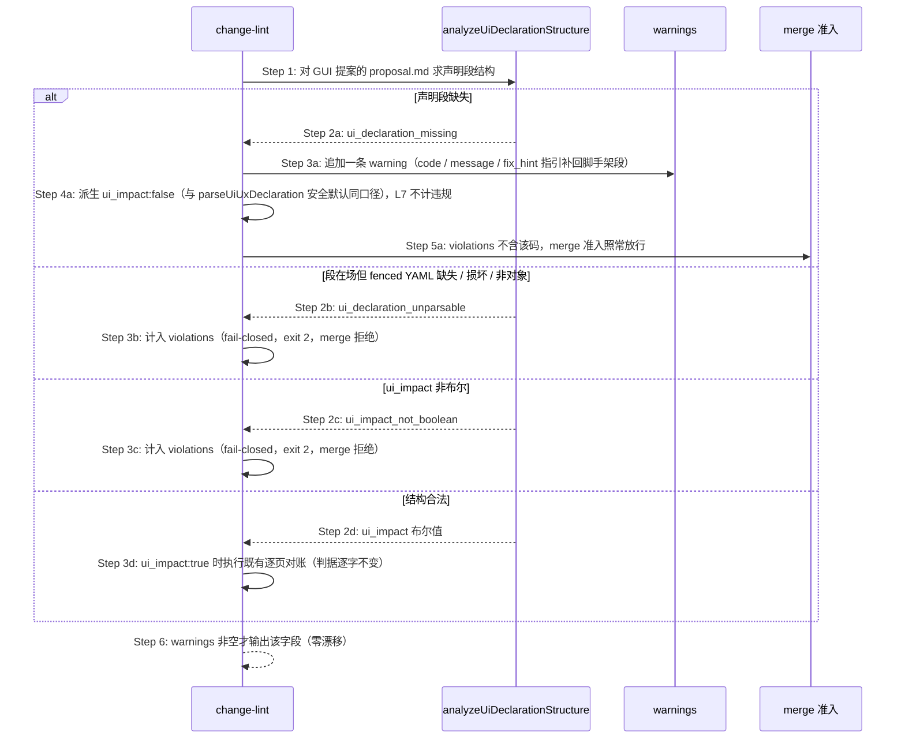
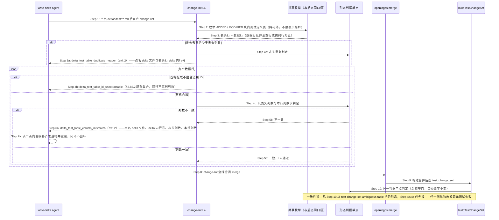

# S35：提案计划产物左移硬检查（change-lint）

> Feature：F04 变更提案与切片生命周期  
> 来源：需求 S35、功能规格 §2.30 与 §2.43、跨仓 Plan Package 修复方案

## 场景目标

在 proposal/tasks producer 向用户报告完成之前，由 OpenLogos CLI 独立证明 Plan Package 满足统一合同；失败时返回可供同一 Agent 定点修复的结构化问题，并保证 change-lint、status、next 与 flow derive 对同一输入收敛。

## 用户价值

用户只会在方案真正可批准时看到 `ready-to-delta`，不会遭遇“lint PASS 但面板仍 writing”，也无需理解 canonical 标题、模板占位或插件缓存漂移。

## 参与者

- **用户/宿主**：触发检查并消费最终完成结论。
- **change-writer**：生产 proposal/tasks、读回并消费问题修复。
- **change-lint**：命令入口、退出码与 envelope 所有者。
- **PlanPackageEvaluator**：唯一完成判据与 issue 生产者。
- **status/next/flow**：只读消费同一 evaluation 的投影方。
- **AssetManifest**：证明 producer Skill/模板与 CLI 合同一致。

## 前置条件

- 项目已初始化，guard 指向当前 launched change。
- proposal/tasks 已由 change-writer 填充但尚无 Delta、无 `PLAN_APPROVED`。
- 项目 locale、模块、部署决定、clarification 与 baseline closure 可读取。

## 成功后置条件

- `change-lint --format json` exit 0 且 `data.pass=true`、`data.plan_package.ready=true`。
- status 的 `plan_ready=true`，next 的 `proposal_step=ready-to-delta`，flow predicate 同样完成。
- 检查前后项目全量文件集合与内容 hash 不变。
- change-writer 才能向用户报告方案待批准；本场景不写审批 marker。

## 时序图

## 步骤说明

1. **用户或宿主**要求 change-writer 完成当前提案，而不是直接授权 Delta 或 merge。
2. **change-writer**保留 CLI canonical scaffold，只替换占位正文；落盘后重新读取真实字节。
3. **change-writer**从项目根运行带明确 slug 的 change-lint JSON 命令。
4. **change-lint**完成操作错误前置检查后调用唯一 **PlanPackageEvaluator** 作为 L0。
5. **PlanPackageEvaluator**调用 authority scan、tasks parser、clarification、deployment、baseline closure 与 UI 声明共享 evaluator。
6. **共享子 evaluator**返回结构化事实；不得自行写文件或吞掉解析错误。
7. **PlanPackageEvaluator**规范化、去重并稳定排序 issues，计算 proposal/tasks 三态与 ready。
8. **change-lint**在 ready=false 时 exit 2、ready=true 时继续 L1～L8 并最终 exit 0；操作错误仍 exit 1。
9. 失败时 **change-writer**只修 issues 指向的当前提案文件并读回重试；成功时运行 next 双检查。
10. **status/next/flow**消费同一 evaluation；next 必须进入 `ready-to-delta`，不得仍为 writing。
11. **change-writer**向用户报告最终收敛结果并等待 plan gate 批准，不自动产 Delta 或 marker。

## 异常与边界

### EX-5.1：canonical summary 缺失
- **触发条件**：proposal 把 locale summary 改为自由标题，或章节缺失/重复/为空。
- **期望响应**：`proposal_required_section_missing|duplicate|empty`，包含 path、section_id、expected 与 fix_hint。
- **副作用**：lint/status/next/flow 均只读，plan 不 ready。

### EX-5.2：plan 阶段 code 占位或切片
- **触发条件**：tasks 保留 `实现代码变更` 或提前出现任意 `[code]` checkbox。
- **期望响应**：模板残留或 `tasks_code_entry_before_spec_complete`；空 `[code]` 锚点本身合法。
- **副作用**：不 auto-reset；auto-reset 仍只属于既有 merge/slice 边界。

### EX-7.1：子 evaluator 操作错误
- **触发条件**：proposal/tasks 不可读、YAML parser 失败或项目根事实不可安全解析。
- **期望响应**：exit 1 error envelope；不得降级成 pass=false success envelope。
- **副作用**：后续检查停止，文件与 marker 不变。

### EX-9.1：Agent 自然语言声称完成
- **触发条件**：文件非法但 Agent 输出“已完成”。
- **期望响应**：机器门仍失败；宿主 completion barrier 不得把 WorkUnit 标成 completed。
- **副作用**：用户不看到“可写 Delta”。

### EX-10.1：历史提案已越过 plan
- **触发条件**：存在 `PLAN_APPROVED|SPEC_MERGED|MERGED|VERIFY_PASS` 且旧 scaffold 不符合新规则。
- **期望响应**：保持现有前沿，仅允许非阻塞 warning。
- **副作用**：不回退、不改写历史。

### EX-10.2：Skill/模板资产过期
- **触发条件**：项目 sync hash 与 CLI asset manifest 不一致。
- **期望响应**：只读状态可见；producer dispatch 提示 sync + 重开 session，禁止静默使用旧 Skill。
- **副作用**：不覆盖用户/项目自有 Skill。

## API、数据库与安全边界

- 所有交互是本地进程/文件合同，API、数据库与 API 编排为 SKIP。
- completion 命令保持只读，不写 `PLAN_APPROVED`、Delta、MERGE_PROMPT 或宿主 WorkUnit 状态。
- RunLogos 自动回传、三次修复预算和 UI 展示属于独立 companion change。

## 追溯

- 需求：S05/S08/S09/S11/S35 Plan Package 完成合同收敛需求。
- 功能规格：§2.43 Plan Package 统一完成合同。
- 架构：第三十三章 Plan Package 完成合同收敛架构。
- 方法论：`spec/change-management.md`、`spec/tasks-spec.md`、`spec/flow-spec.md`、`spec/cli-json-output.md`。
- 测试：UT-S35-100～UT-S35-111、ST-S35-16～ST-S35-18、SMOKE-core-135～SMOKE-core-140。

## S35 围栏提取单点、可归因诊断与门禁可满足性断言

### 场景目标

消除 `change-lint` 判定链上的两处判据分裂（YAML 围栏提取、测试 ID 语法），让多命中不再静默降级，并为「门在其阶段可满足」建立可执行的失败信号。

### 参与者与前置条件

| 别名 | 组件 | 说明 |
|---|---|---|
| C | `change-lint` evaluator | L0～L8 的完整判定 |
| S | `markdown-scan.authorityScan` | 围栏 / 缩进代码 / HTML 注释掩码的唯一判据（函数名承自历史，判据本身与 authority 无关） |
| G | 测试 ID 语法权威 | 语法与三种具名读法的唯一铸造点 |
| T | 门禁可满足性断言 | 每道门 × 该阶段合法最小提案 |

### 围栏提取归位时序

**Step 3 的判据**：全部 YAML 围栏提取器一律走 `markdown-scan` 的 fence-aware 掩码，不得自建裸正则。对含嵌套围栏的文档（如四反引号 markdown 块内示意一段 yaml），裸正则会比 fence-aware 多命中一个围栏——这正是掩码必须单点的原因。

**多命中不得静默降级**：任一围栏提取器在候选数不为 1 时，必须产出点名的诊断，说明命中了几处、分别在哪；不得静默返回空集或取第一个命中。

### 测试 ID 语法的单点与具名读法

| 读法 | 消费方 | 与权威语法的关系 |
|---|---|---|
| 结构化判定 | `test-change-set`、`test-slice-manifest`、`baseline-closure` | 完整语法 |
| 表格首列提取 | `test-slice-manifest` | 完整语法 + 行首锚定；容忍并剥离首格可选 manual 标记（`[manual]` / `[manual/<平台>]`），提取结果恒为裸 ID（fix-table-test-id-manual-marker） |
| 正文扫描 | `automation-diagnostic` | 完整语法减去 SMOKE |

读法差异正当，各自定义不正当。本次消除的是四份独立演化的定义。首格 manual 标记的判定与剥离复用 `MANUAL_MARKER_RE` 单点——同一首格不得存在宽严不一的第二份读法；统一覆盖语义变更集的定义解析入口（§2.37.3 首格合同同步修订）。**统一的是「首格 → 裸 ID」解析层，不是输出集合**：各消费方在裸 ID 之上仍按既有语义筛选资格——verify 的 defined/eligible 派生仍经同源 manual 判定排除 manual 行、SMOKE 恒不进 verify 可选集（功能规格 §2.82.1、§2.82.4）。

**语法与数据的一致性锚**：断言已合并测试规格中**每一个 ID 表数据行**都能被表格首列读法提取出被权威语法接纳的裸 ID（含带 manual 标记的首格），**静默跳过即失败**。原始缺陷不是正则写错了，而是没人检查正则与真实数据是否还对得上——11 个 JSON 系 ID 因此静默失联；「提取不出的行不进断言集合」的静默跳过是同一缺陷的第二形态（fix-table-test-id-manual-marker 行级扩展）。

### 门禁可满足性断言

对每一道门构造「该门所处阶段的合法最小提案」，断言其通过：

| 阶段 | 合法最小提案含有 | 不含 |
|---|---|---|
| plan | 完整 proposal + tasks（`[delta]` 已规划、`[code]` 空标题） | 任何 delta |
| spec / merge | 上述 + 全部已规划 delta | `[code]` 切片 |

断言的价值不在验证当前 11 道门，而在新增门禁时立刻给出失败信号（架构 §四十一.6.2）。

### 诊断可归因要求

全部门禁诊断必须点名导致失败的实体本身——fact_id、测试 ID、文件路径、字段名。禁止「为空、非法或不在某集合中」这类无法定位的措辞。

### 不变量

1. **围栏判据唯一**：四个提取器对同一文档得到同一组围栏。
2. **多命中不静默**：候选数异常时必须产出诊断，不得降级为空集或空结论。
3. **语法唯一、读法具名**：语法恰一处定义；每种读法从其具名派生，不得独立定义。**行级形态读法同样只一处定义**——「数据行列数须等于表头列数」与「表头无重复」的判定收敛为唯一纯函数单点，`change-lint` L4（delta 侧前移）、`buildTestChangeSet`（合并后态守门）、`lint-specs`（只读诊断）三处**同源派生**。**单点覆盖判据与枚举口径两者**：凡以「预检必先报」为承诺的作用点，其「哪些表、哪些行进入判定」的枚举须与被对齐的下游门共用具名实现；只共享最后那次比较、各自决定进入比较的集合，等同于把分裂从判据挪到集合（功能规格 §2.84.1，delta-r1 F1）。集合的差异只允许出现在**不作此承诺**的作用点（`lint-specs` 全部表格、§2.82.2 首格检查的既有表头族），且须显式登记理由。
4. **语法与数据不漂移**：已合并规格中每一个 ID 表数据行都能被表格首列读法提取出被权威语法接纳的裸 ID（含带 manual 标记的首格）；静默跳过即失败。
5. **门禁可满足性有断言**：每道门都有对应的「该阶段合法最小提案通过」断言。**且凡下游门（含 merge 内部 `buildTestChangeSet` 等非命令形态的构建期判定）会拒绝的形态，预检必先报**——不允许存在「`change-lint` 全绿而 `merge` 必然失败」的组合；该一致性以双向比对元测试锚定，任一侧单独收紧即失败（功能规格 §2.84.5）。

### 异常与边界

- 文档不含任何 YAML 围栏：`extractDeclaration` 返回 `missing`，行为不变。
- 语法放宽只增不减：不存在此前被接纳、此后被拒绝的 ID。
- 元测试发现语法与数据漂移时，修复方向是调整语法或修正数据，**不得放宽断言本身**。

### 追溯

- 需求：AC-MERGEGATE-03、AC-MERGEGATE-04、AC-MERGEGATE-06～08。
- 功能规格：§2.51.3、§2.51.5～§2.51.7；架构：§四十一.6.1、§四十一.6.2。
- 测试：UT-S35-127～UT-S35-131、ST-S35-24；安装态 SMOKE-core-173。

## S35 SQL 校验降级留痕的输出通道

### 场景目标

让 SQL 方言层的降级留痕经 `change-lint` 的既有 `warnings` 通道可见，且不改变 L4 的通过与否，也不产生输出漂移。

### 参与者与前置条件

| 别名 | 组件 | 说明 |
|---|---|---|
| L | `change-lint` | L4 的判定与输出 |
| V | `validateSql` | 回传层级结论与降级留痕 |
| W | `warnings` 通道 | 既有字段，非空才出现 |

### 输出时序

### 输出契约

- **不计入 violations**：降级留痕不是违规，不影响 L4 通过与否，也不影响 `change-lint` 的整体退出码。
- **零漂移**：`warnings` 为空时字段整体省略——与既有约定一致，不因本功能改变无降级项目的输出字节。
- **可归因**：每条 warning 含 `code` / `message` / `fix_hint`；message 点名方言、缺失项与已执行层级，fix_hint 说明如何获得更强层级（如安装 `sqlite3`）。

### 不变量

1. 降级留痕只出现在 `warnings`，绝不出现在 `violations`。
2. 无降级的项目，其 `change-lint` 输出与本功能引入前逐字节一致。
3. warning 的存在与否不改变 merge 的准入结论——merge 只看 violations（S09 已冻结「准入判据等于 change-lint 完整结论」，此处的 violations 集合不因 warning 变化）。

### 异常与边界

- 同一提案多份 `.sql` delta 都降级：逐份产出 warning，不合并为一条——用户需要知道具体是哪一份。
- 降级与真实违规并存：violations 与 warnings 各自输出，互不吞并。

### 追溯

- 需求：AC-SQLGATE-08。
- 功能规格：§2.52.7；架构：§四十二.2。
- 测试：UT-S35-132～UT-S35-133、ST-S35-25；安装态 SMOKE-core-174。

## S35 阻塞理由自检可达性与一致性锚

### 场景目标

把 `change-lint` 对 `ProposalBlockReason` 的覆盖从 1/8 扩到 8/8，让 Agent 在**报告完成之前**有一个统一入口自查「下游会不会拒绝我」；并新增一条机器检查的一致性锚，使「新增阻塞判据但自检入口不可达」这类漂移不再能长期无人发觉。

### 用户价值

订正前，Agent 完成 `plan-slices` 后无处自查：三个声明产物确实躺在磁盘上，命令也报了成功，于是它据实报 `done`；真正的拒绝发生在下游 `next`，而驱动只看得到「前沿未推进」，发出 `detail` 为 `null` 的 `blocked(no-progress)`——精确诊断在传递中丢失。订正后，同一份诊断在 Agent 还能改的那一刻就到它手上。

### 参与者与前置条件

| 别名 | 组件 | 说明 |
|---|---|---|
| C | `change-lint` evaluator | L0～L8 既有判定链 + 本次新增 L9 |
| D | 阻塞理由 deriver | `deriveSliceVerificationState` 与提案生命周期推导——`next` / `status` 使用的**同一单点** |
| A | Agent（slice-planner / code-implementor） | 自检的发起方与诊断的消费方 |
| N | `next` / `status` | 下游判定方，判据与 C 同源 |

前置条件：活跃提案存在；L9 各理由按其自身激活条件判定，不要求提案处于特定阶段。

### 覆盖矩阵（订正前 → 订正后）

| `ProposalBlockReason` | 订正前自检入口 | 订正后 |
|---|---|---|
| `code_change_requires_real_test_ids` | L3 | L3（不变） |
| `no_delta_spec_marker_missing` | 无 | **L9** |
| `test-slice-manifest-missing` | 无 | **L9** |
| `test-slice-manifest-invalid` | 无 | **L9** + `slice plan` 写入口当场拒绝（S32 EX-32.23） |
| `test-slice-manifest-stale` | 无 | **L9（warning）** |
| `test-slice-manifest-unsupported` | 无 | **L9** |
| `test-slice-assignment-ambiguous` | 无 | **L9** |
| `slice-task-state-inconsistent` | 无 | **L9** |

### 自检时序

### 步骤说明

1. L9 的问题是「**如果我现在报完成，下游会不会拒绝我**」——它不发明判据，只是把下游的结论提前一步给到还能修改的一方。
2. L9 **必须复用** `next` / `status` 所用的同一 deriver。lint 自建第二套阻塞判定，就是把本次订正的缺陷（写入口自建判据副本）原样搬到另一侧。
3. 违规明细**原样带出**：逐条保留 `code` / `path` / `message` / `fix_hint`，顺序稳定，不折叠为摘要。
4. 某理由在当前阶段不成立时不报告。delta 尚未产完时 `SPEC_MERGED` 缺失是正常进度，不是缺陷；L9 只在 deriver 判定其确实阻塞时发声。
5. `test-slice-manifest-stale` 进 `warnings`、不改退出码——与「审计产物不得出现在流程分支的条件里」一致（功能规格 §2.68.4）。

### 一致性锚：阻塞理由 × 自检入口可达性

在既有两条锚之上新增第三条：

| 锚 | 断言 | 原始缺陷形态 |
|---|---|---|
| 语法 × 数据（既有） | 已合并测试规格中每个表格首列 ID 都被权威语法接纳 | 不是正则写错了，而是没人检查正则与真实数据是否还对得上 |
| 门禁 × 可满足性（既有） | 每道门都有「该阶段合法最小提案通过」的断言 | 新增门禁时没有失败信号 |
| **阻塞理由 × 自检入口（本次）** | 枚举 `ProposalBlockReason` 全集，每一条都能被至少一个自检入口（`change-lint` 或对应写入口）检出 | 判据存在、入口不可达；新增理由而未接线时无人发觉 |

三条锚是同一个形状：**判据与其消费面之间的对账必须由机器做**。新增理由而未接线时该断言挂红，是它与「写进约定」的全部区别。

**不引入任何需要作者手工声明的门。** `authority-closure` 因「要求人工预测谁裁决事实并逐字段闭合，属于让人做机器该做的事」在 0.15.0 被整体废止，其记载的废止理由是「在起草阶段反复拦截作者本身，而从未拦下真实的权威设计缺陷」。把本条写成一道要作者自觉满足的 lint 门，就是重犯刚删掉的错。

### 不变量

1. **判据唯一**：L9 与 `next` / `status` 对同一提案状态得到同一结论；lint 不持有第二套阻塞判定。
2. **覆盖完备**：`ProposalBlockReason` 全集每一条都有可达的自检入口，并由一致性锚断言。
3. **诊断可归因**：L9 输出点名具体实体（路径、ID、字段），不出现「非法或不在某集合中」这类无法定位的措辞。
4. **强度分级不越界**：仅 `test-slice-manifest-stale` 为 warning，其余为 violation；L0～L8 的既有分级（含 L8 警告级）不变。
5. **只读红线不变**：L9 不写 marker、不改派生、项目级零写入。

### 异常与边界

- **提案不处于任何阻塞态**：L9 无输出，退出码由其余检查项决定。
- **deriver 判定器按设计不适用**（单切片计划，结论为 `null`）：不是负面结论，L9 不报告——「不适用」不得读成失败（根规范 §2.2.1）。
- **新增第 9 条阻塞理由而未接线**：一致性锚挂红，修复方向是接入自检入口，**不得放宽断言本身**。
- **同一缺陷同时被写入口与 L9 检出**：不是重复，是纵深——写入口在产出那一刻拒绝，L9 在报完成前复查在盘产物。

### 追溯

- 需求：阻塞理由自检入口可达性要求。
- 功能规格：§2.30（检查项矩阵与输出契约）、§2.79（L9 与一致性锚）、§2.78（写入侧 fail-closed）。
- 根规范：`spec/test-slice-manifest.md` §8（诊断码）、§9（恢复动作合同）。
- 测试：UT-S35-138、UT-S35-139、UT-S35-140、UT-S35-141、ST-S35-27。

## S35 表格首列 manual 标记统一读法与首格可提取性前移

### 场景目标

消除 ID 表首格的读法分裂（verify 单元格读法认 manual 标记、切片提取读法与 lint-specs 不认），把首格形态问题的暴露点从 plan-slices（无法自修节点）前移到 write-delta（agent 可自修节点）。

### 参与者与前置条件

| 别名 | 组件 | 说明 |
|---|---|---|
| W | change-writer / 执行 agent | write-delta 节点内产出测试规格 delta，可自行修正并重跑 change-lint |
| C | `change-lint` evaluator | L4 delta 形态族新增首格可提取性检查 |
| G | 测试 ID 语法权威（`test-id.ts`） | 表格首列读法 + `MANUAL_MARKER_RE` 的唯一铸造点 |
| T | 语义变更集（`SPEC_MERGED.test_change_set`） | merge 时结构化定义扫描以统一首格读法解析定义行，manual ID 以裸 ID 进入 `changed_test_ids`（C 集合） |
| P | `slice plan` 写入口 | merge 后以同一读法校验 `spec_target` 定义，并对可信变更集做 `O = C` 归属对账 |

前置条件：活跃提案含 `deltas/test/**` 的 `.md` delta；已合并测试规格与 delta 中允许出现 `ID [manual]` / `ID [manual/<平台>]` 首格（S13 认可形态）。

### 首格读法统一与前移检查时序

### 步骤说明

1. **执行 agent** 在 write-delta 节点产出测试规格 delta 并运行 `change-lint`（其命令白名单内）。
2. **change-lint** 对 `deltas/test/**` 的 `.md` delta，仅识别 ADDED / MODIFIED 块内结构化测试 ID 表的数据行（散文、非 ID 表、围栏内引用不参与）。
3. **语法权威** 以表格首列读法逐行判定：剥离可选 manual 标记后提取裸 ID；判定与剥离同一单点，不存在第二份正则。
4. 首格合法（含带 manual 标记形态）→ 放行；不可提取 → 报 `delta_test_table_id_unextractable`，agent 在节点内修正闭环。
5. merge 时**语义变更集**（`SPEC_MERGED.test_change_set`）的结构化定义扫描以统一首格读法解析定义行——manual 行以裸 ID 为身份进入 `changed_test_ids`（标记属定义语义，§2.37.3 修订）；切片归属集合 C 来自该变更集，不从 delta 重新推断。
6. merge 后 **slice plan** 以同一读法校验 `spec_target` 定义，并对可信变更集做 `O = C` 归属对账——manual ID 已在 C 中，`SMOKE-core-XX [manual]` 形态规格无需改写即通过（含启用切片验证的多切片形态），`SLICE_PLAN_UNKNOWN_TEST_ID` 类停点从此不发生。

### 不变量

1. **首格唯一语义**：ID 表首格 = 裸 ID + 可选 manual 标记；判定与剥离复用 `MANUAL_MARKER_RE` 单点；语义变更集定义解析入口同受此合同约束（裸 ID 为身份、标记属定义语义）。
2. **提取容忍 ≠ verify 语义变**：manual 行排除出 defined/executed 的判据单一事实源与判定结果逐字不变（UT-S13-70/72 锁）；SMOKE 仍不进 verify 可选集；切片模式下 `eligible_test_ids` 派生同样不得让 manual UT/ST 进入 defined。
3. **消费边界**：统一只发生在「首格 → 裸 ID」解析层；各消费方（变更集 / spec_target / verify 定义集合）在裸 ID 之上按既有语义各自筛选资格，不要求输出同一集合。
4. **零放宽**：散文首格、占位尾段、通配等既有被拒形态照常拒绝。
5. **lint-specs 递归**：`logos/resources/test/` 扫描递归含 `smoke/` 子目录，首格判定同步容忍 manual 标记。
6. **前移检查不缩小扫描集合**：结构化 ID 表识别复用既有表头口径（`ID` / `用例 ID` / `用例ID`）。

### 异常与边界

- **EX-M.1：首格不可提取的 delta ID 表行**——触发条件：`deltas/test/**` 的 ID 表数据行首格既非裸 ID 亦非「裸 ID + manual 标记」；期望响应：`delta_test_table_id_unextractable`（violations、exit 2、点名定位）；副作用：无（只读检查）。
- **EX-M.2：已合并规格中存在提取不出的 ID 表数据行**——触发条件：一致性锁行级断言扫到静默跳过；期望响应：断言失败并点名文件、行号与首格原文，修复方向是修正数据或语法，不得放宽断言本身。
- **EX-M.3：非 ID 表 / 散文 / 围栏引用**——不参与首格判定，零误报。

### 追溯

- 功能规格：§2.82（§2.51.7、§2.37.3、§2.70.1 同步修订）；架构：§四十一.2、§四十一.4。
- 测试：UT-S35-142～UT-S35-147、ST-S35-28。
- 来源变更：fix-table-test-id-manual-marker（下游 tools.top 实测缺陷，2026-09-13）。

## S35 L7 缺段警告化与 warning 输出通道

### 场景目标

让 GUI 项目提案缺失「UI/UX 变更声明」段时，change-lint L7 经既有 `warnings` 通道报警而**不阻断 merge 准入**，消费侧派生 `ui_impact:false` 安全默认；声明段在场但损坏 / `ui_impact` 非布尔仍 fail-closed。消除 20260914 全自动 run 在 merge 时点被缺段硬停的无收益阻断（功能规格 §2.83）。

### 用户价值

desktop / GUI 项目中语义偏 CLI 的提案不再因 producer 误删声明段而在 `openlogos merge` 硬停等人——缺段回落 `ui_impact:false` 安全默认并以警告提示补段；plan-exit 的原型确认合同（真正的保护点）不受影响。

### 参与者与前置条件

| 别名 | 组件 | 说明 |
|---|---|---|
| L | `change-lint` | L7 的判定与输出 |
| A | `analyzeUiDeclarationStructure` | 声明段结构化分级（缺段 / 损坏 / 非布尔 / 合法）的唯一判据 |
| P | `parseUiUxDeclaration` | 消费侧安全默认（缺段 → `ui_impact:false`）的既有单点 |
| W | `warnings` 通道 | 既有字段，非空才出现 |
| M | merge 准入消费点 | 只读 violations，warning 不改变准入结论 |

前置条件：模块经 proposal-context resolver 解析为 GUI（`product_type ∈ {web,desktop,mobile}`）；非 GUI 模块 L7 不激活，本场景不适用。

### 判定与输出时序

### 输出契约

- **缺段只出现在 `warnings`，绝不出现在 `violations`**：不影响 L7 通过与否、不影响 `change-lint` 整体退出码、不进入 merge 准入违规集合（S09 已冻结「准入判据 = change-lint 完整结论」，violations 集合不因 warning 变化）。
- **可归因**：warning 含 `code` / `message` / `fix_hint`；message 点名 proposal.md 与缺失的「UI/UX 变更声明」段，fix_hint 指引按脚手架骨架补回该段（本次不动界面即 `ui_impact: false`）。
- **零漂移**：`warnings` 为空时字段整体省略——与既有约定一致；无缺段项目的输出不因本功能改变。
- **派生口径单点**：缺段派生 `ui_impact:false` 与 `parseUiUxDeclaration` 的既有安全默认同口径，不引入第二处判定。

### 不变量

1. 缺段警告与派生安全默认**不改变** `ui_impact:true` 的逐页对账判据（声明清单 basename 集合 == 产出文件 basename 集合，重复 / 额外 / 缺失均失败）。
2. `ui_declaration_unparsable` / `ui_impact_not_boolean` 仍 fail-closed：进 violations、exit 2、merge 拒绝——诊断的 code / path / message / fix_hint 逐字不变。
3. 非 GUI 模块 L7 不激活：零输出、零警告；`module_unresolved` 仍为操作错误（exit 1，fail-closed），不得静默按非 GUI 跳过缺段判定。
4. plan-exit 原型渲染确认合同（§2.26.4～§2.26.9）零改动——本场景只动 merge 时点的缺段强度，不动 plan 时点的确认语义。
5. 只读红线不变：L7 判定项目级零写入。

### 异常与边界

- **缺段警告与真实违规并存**：violations 与 warnings 各自输出、互不吞并；整体 FAIL 因真实违规而非缺段。
- **缺段 + `ui_impact:true` 场景不存在**：缺段派生值恒为 `false`，不会触发逐页对账；对账仅对「结构合法且声明 `true`」的提案执行。
- **历史提案已越过 plan / merge**：沿 EX-10.1 既有口径，不回退、不改写历史。

### 追溯

- 来源变更：fix-ui-declaration-source-skew-and-missing-degate（20260914 全自动 run 实测事故；audit run `drv-mu0svxrh-64i2`）。
- 功能规格：§2.83（缺段降门与判定源统一）、§2.26.2（安全默认口径合流）、§2.30（检查项矩阵 L7 行）。
- 先例：§2.73（L8 守恒降级为警告）、本文档「S35 SQL 校验降级留痕的输出通道」。
- 测试：UT-S35-148～UT-S35-152、ST-S35-29。

## S35 行级形态判据前移与预检-门一致性锁

### 场景目标

把后态 `test-change-set-ambiguous-table` 的**全部触发形态**（数据行列数 ≠ 表头列数、表头重复）收敛为唯一语义与单点实现，并在 `change-lint` L4 族**前移**为可归因违规——让此前只在 merge 内部 `buildTestChangeSet` 阶段爆发、预检全绿而无任何前置信号的形态问题，在 **write-delta 节点**即被暴露闭环。前移不止于共享最后那次整数比较：**枚举「哪些表、哪些行进入判定」的口径同样与后态对齐**，否则漏扫的行照样在后态被拒、前移承诺落空（功能规格 §2.84.1～§2.84.2、§2.84.5）。

### 用户价值

一个「少写一个 `|`」的 delta 形态错误，不再需要烧掉一整轮全自动 run 才停在 `openlogos merge`、且停在 agent 已出写权限范围的节点。write-delta 节点下 delta 文件在 agent 写权限范围内、`change-lint` 在其命令白名单内——错误在此暴露即由 agent 当场修正，**不产生停点、不需要人**（audit run `drv-mu1d875x-7ooq` 的 `merge-failed` 硬停形态从此不发生）。

### 参与者与前置条件

| 别名 | 组件 | 说明 |
|---|---|---|
| L | `change-lint` L4 族 | delta 形态判定与违规输出（前移点） |
| R | 形态判据单点 | 「数据行列数 == 表头列数」与「表头无重复」的唯一纯函数实现 |
| B | `buildTestChangeSet` | 合并后态的 fail-closed 守门（判据同源派生） |
| P | `lint-specs` | 已合并基线只读诊断（判据同源派生，不参与任何门） |
| E | 测试定义表共享枚举 | 「哪些表、哪些行进入判定」的唯一实现，前移侧与后态共用 |
| K | 预检-门一致性锁 | 元测试：凡后态以 `test-change-set-ambiguous-table` 拒的形态，预检必先报 |

前置条件：提案含 `deltas/test/**` 的 `.md` delta；delta 内含**测试定义表**——识别口径与后态 `scanTestDefinitionCandidates` 对齐（表头行 + 分隔行、表头列数 == 分隔列数、列数 ≥ 2、无空表头格，**不限表头措辞**），而非仅 `TEST_ID_HEADER_RE` 表头族。

### 判据前移时序

### 步骤说明

1-3. `change-lint` 在既有 L4 delta 形态扫描中枚举**测试定义表**——枚举口径与后态 `scanTestDefinitionCandidates` 共享具名实现，**不限表头措辞**、数据行延伸至空行或掩码行为止；围栏与缩进块经 `authorityScan` 掩码排除。此前前移侧额外要求表头首格匹配 `TEST_ID_HEADER_RE`、且以「不含管道符的行」为块边界，两处都比后态窄，构成漏扫（delta-r1 F1）。
4a-5a. 表头去重后数量少于表头列数即 `delta_test_table_duplicate_header`——对应后态同码抛点的另一半触发形态，与列数检查一并前移，使一致性锁可按错误码定义（§2.84.2）。
4b. 首格与列数两检查**正交且不重复报**：首格非法（`delta_test_table_id_unextractable`）时该行不再判列数——其根本不构成 ID 行。**§2.82.2 首格检查的适用集合逐字不变**（仍限 `TEST_ID_HEADER_RE` 表头族）：若随列数检查一并扩大，会把后态接纳的散文表首格新判为违规。
4c-6a. 列数判定调**同一纯函数单点**（入参为表头单元格数与数据行单元格数，无 IO、无路径语义）；不一致即 `delta_test_table_column_mismatch` 进 violations、exit 2，message 点名 delta 文件路径、**delta 内行号**、表头列数与本行列数。
7a. 前移的全部价值在此：agent 在本节点即可改、即可重跑，不进入无法自修的下游节点。
8-10. merge 的后态守门**口径与强度逐字不变**（fail-closed）——本场景是前移侧向后态对齐，不反向改动后态。

### 判据单点与扫描集合的分工

| 作用点 | 作用对象 | 扫描集合 | 强度 |
|---|---|---|---|
| `change-lint` L4（列数 / 表头重复） | `deltas/test/**` | 测试定义表——**与后态逐项对齐**（不限表头措辞、数据行至空行止） | 违规（exit 2），入 merge 准入 |
| `change-lint` L4（首格可提取性，§2.82.2） | `deltas/test/**` | `TEST_ID_HEADER_RE` 表头族（**既有集合，逐字不变**） | 违规（exit 2），入 merge 准入 |
| `buildTestChangeSet` | 合并后态 | 首格为合法测试 ID 的数据行（**基准口径，逐字不变**） | fail-closed 后态守门 |
| `lint-specs` | 已合并基线 `logos/resources/test/**` | **全部表格**（不限 ID 表，逐字不变） | 只读诊断，不参与任何门 |

**判据单点 + 前移侧集合向后态对齐**：只把整数比较抽成共享函数、而让两侧各自决定「哪些行进入比较」，等于把分裂从判据挪到集合——未进入比较的行照样在后态被拒。故前移侧集合**只扩大**，扩大部分**恰为此前已被后态拒绝的形态**，不新增任何「后态接纳而预检拒绝」的组合；§2.82.2 首格检查与 `lint-specs` 的集合均逐字不变。

### 诊断可归因要求（本族补齐）

- **前移点诊断点名 delta 侧实体**：`delta_test_table_column_mismatch` 的 message 必须给出 **delta 文件路径 + delta 内行号**——这是 agent 能直接打开并修改的实体；只给后态行号等同于不可归因。
- **后态诊断标注口径**：`test-change-set` 族错误消息的行号标注为「合并后态行号」，消除「照着磁盘文件找不到该行」的误导（事故现场：消息给 `:771`，而该文件磁盘上只有 741 行）。
- **merge 层补 delta 侧归属**：兜底映射时点名产生该行的 delta 文件与其 delta 内行号；**归属无法确定时不得伪造**，降级为「仅后态行号 + 已标注口径」并显式说明未能归因。

### 预检-门一致性锁

- **断言**：凡 `buildTestChangeSet` 会以 `test-change-set-ambiguous-table` 在合并后态拒绝的 delta 形态，`change-lint` 必先报出对应违规。
- **边界按错误码定义（可穷举）**：覆盖该码的全部触发形态——数据行列数不一致、表头重复；不覆盖 `test-change-set-duplicate-id` / `-target-duplicate` / `-overlap`，因其需要合并后态全局视角，在单个 delta 片段上不可判定，强行前移只产生假阳性（§2.84.5）。
- **实现**：合成夹具对每个形态同时构造 delta 形态与其合并后态，一侧喂 `change-lint`、一侧喂 `buildTestChangeSet`，双向比对结论；**任一侧单独收紧即失败**。夹具须含三处对齐点各自的反例：非 `TEST_ID_HEADER_RE` 表头的测试定义表、数据行不含管道符导致前移侧提前收束、表头重复。
- **定位**：这是本文档不变量 5（门禁可满足性）在**表级 / 行级形态族**上的落点——不再允许出现「预检全绿而 merge 必炸」的组合。
- **不得放宽断言本身**：发现漂移时的修复方向是把两侧判据与枚举口径重新收敛到单点，**不得**靠收窄后态扫描或削弱锁来消红。

### 异常与边界

- **首格非法 + 列数不一致同时成立**：只报 `delta_test_table_id_unextractable`，不双报——首格非法的行不构成 ID 行，列数判定对其无意义。
- **表头非 `TEST_ID_HEADER_RE` 但数据行首格是合法测试 ID**：**必须报**列数违规——后态正是这样判定身份的（表头措辞不参与），此前前移侧以表头措辞为免报理由即漏扫（delta-r1 F1 反例一）。
- **无首尾管道的表格外形 / 数据行不含管道符**：同样进入枚举——数据行边界以空行与掩码行为准，不以「是否含管道符」为准（delta-r1 F1 反例二）。
- **完全无合法测试 ID 首格数据行的表**：不报列数违规——后态亦不对其抛 ambiguous（该表不产生任何测试定义）；此类表的列数问题由 `lint-specs` 作只读诊断承担，两者定位不同，不构成分裂。
- **历史基线兼容开关**：`buildTestChangeSet` 既有的 `allowAmbiguousRows` 等前滚 / 历史基线兼容语义逐字不变；一致性锁只对**开关关闭的正常路径**比对，不把兼容开关下的宽松当作漂移。
- **不放宽后态判据**：不把列数不一致降级为「告警跳行」——跳行会让该行测试 ID 静默掉出 `changed_test_ids`，切片归属对账误报「owned_test_ids 含非本提案变更 ID」（§2.82.0 同族事故）。正确处置是前移，不是放宽。

### 追溯

- 来源变更：fix-merge-preflight-parity-and-bare-throw（RunLogos 全自动 driver 实测事故，2026-09-14；audit run `drv-mu1d875x-7ooq`，blocked `merge-failed` / `exit-nonzero`）。
- 功能规格：§2.84.1～§2.84.2（判据与前移侧扫描集合同源）、§2.84.5（一致性锁边界）、§2.82.2（同族前一半：首格可提取性前移）、§2.70.1（三处读法归属澄清）。
- 场景关联：本文档「S35 围栏提取单点、可归因诊断与门禁可满足性断言」（不变量 3 与 5）、S09「merge 内部错误的稳定失败语义」。
- 测试：UT-S35-153～UT-S35-158、ST-S35-30。
