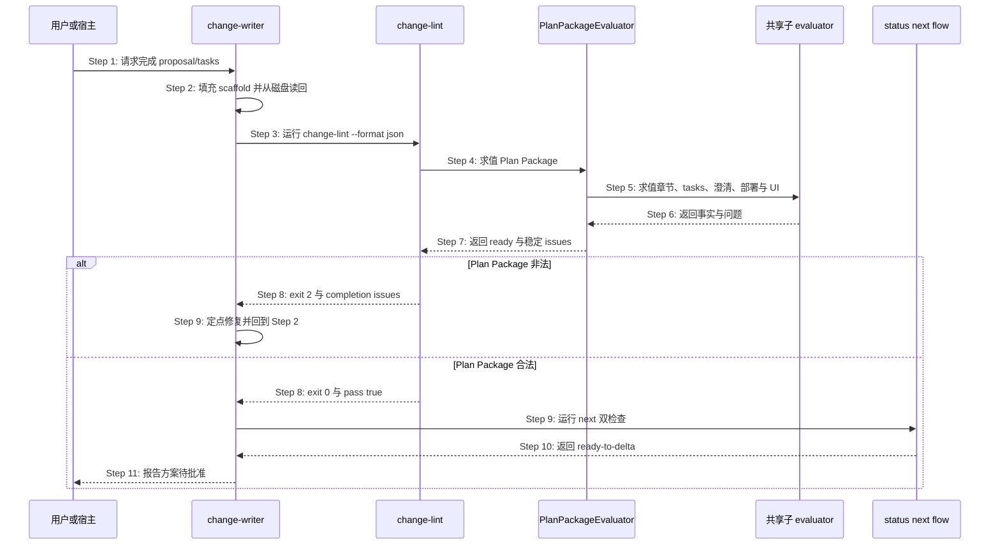
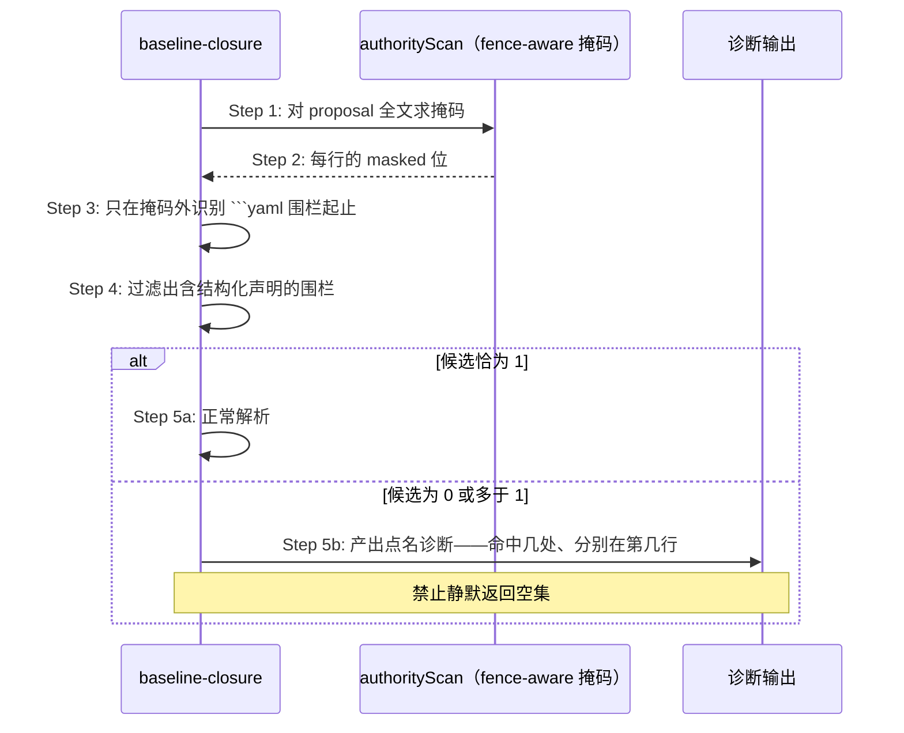
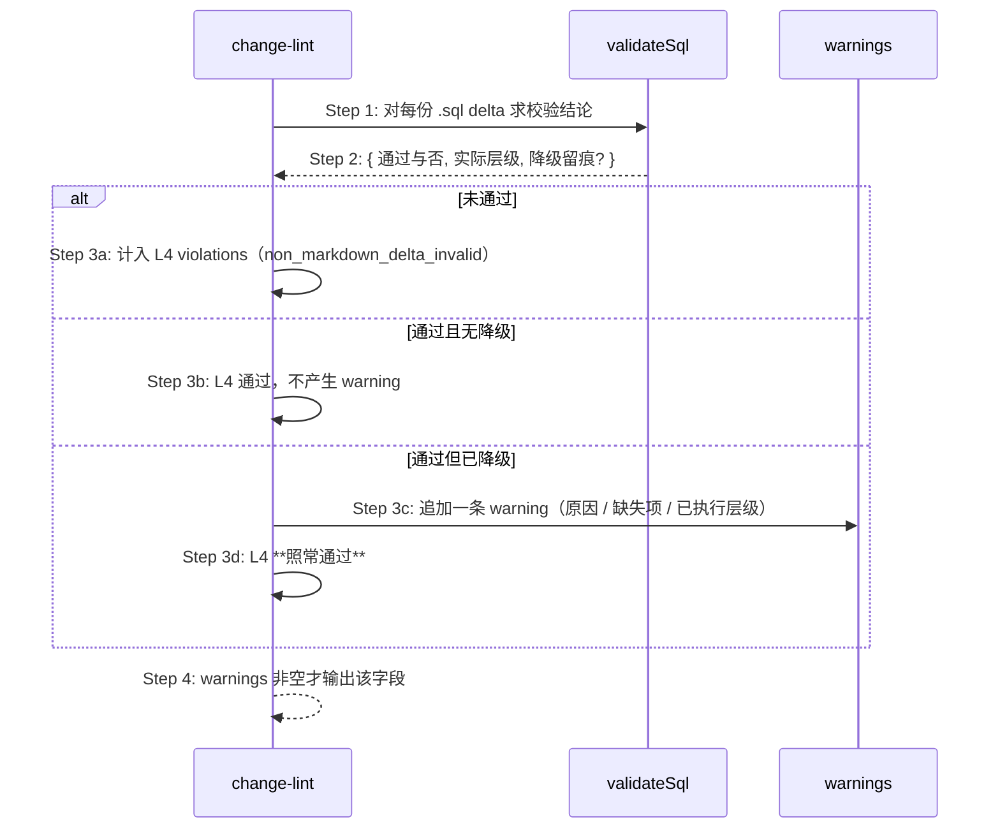
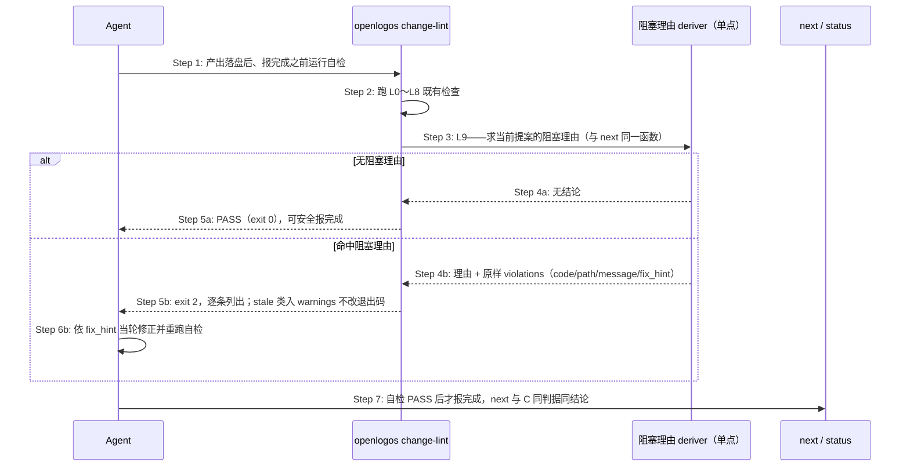
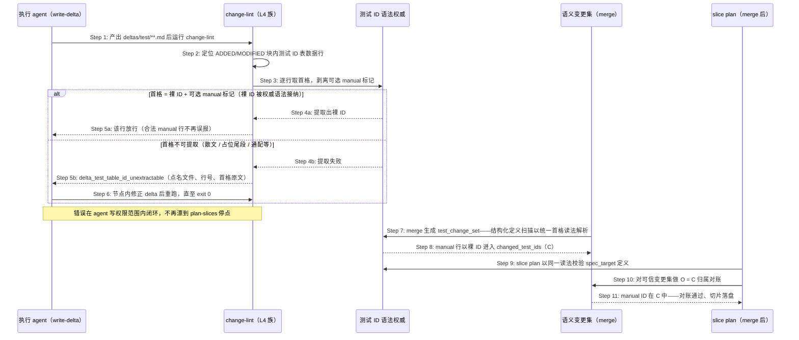
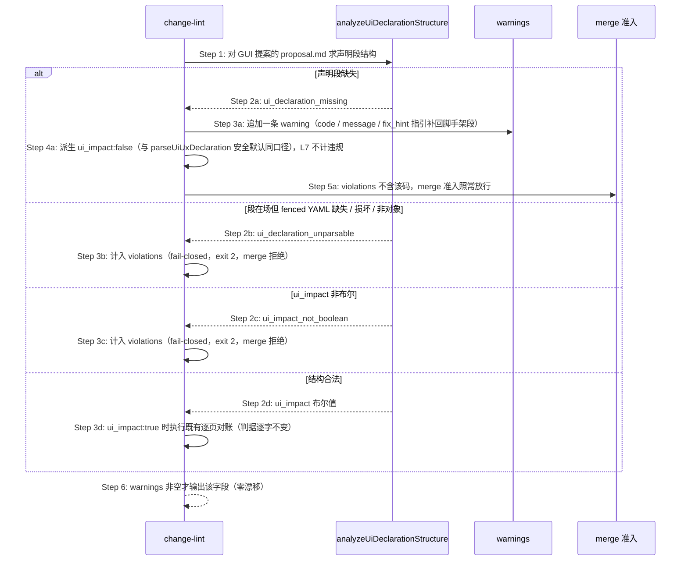
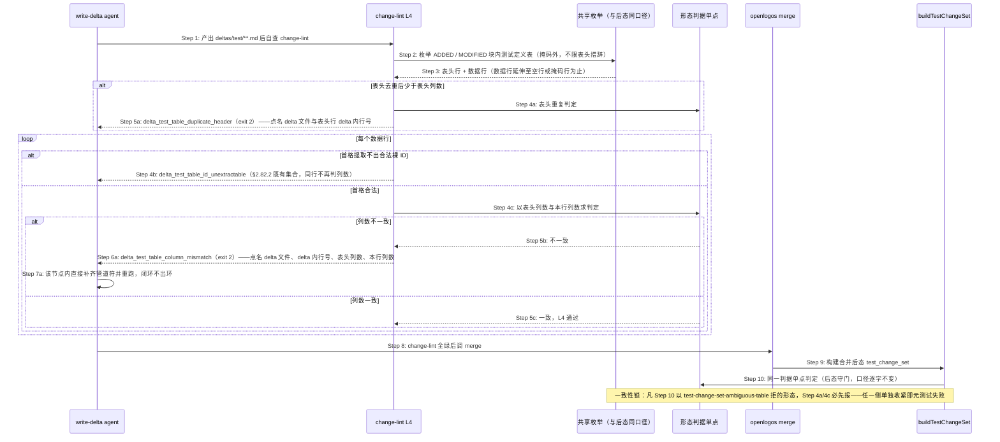
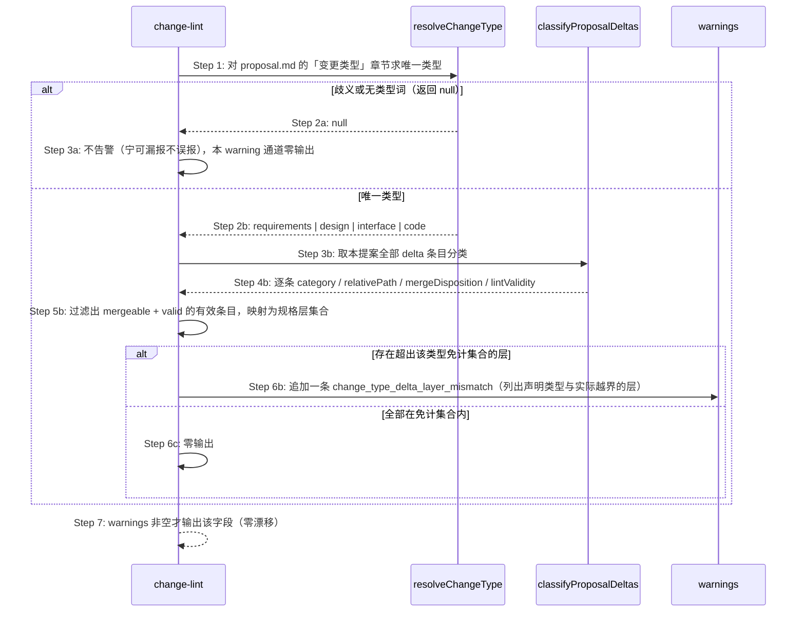
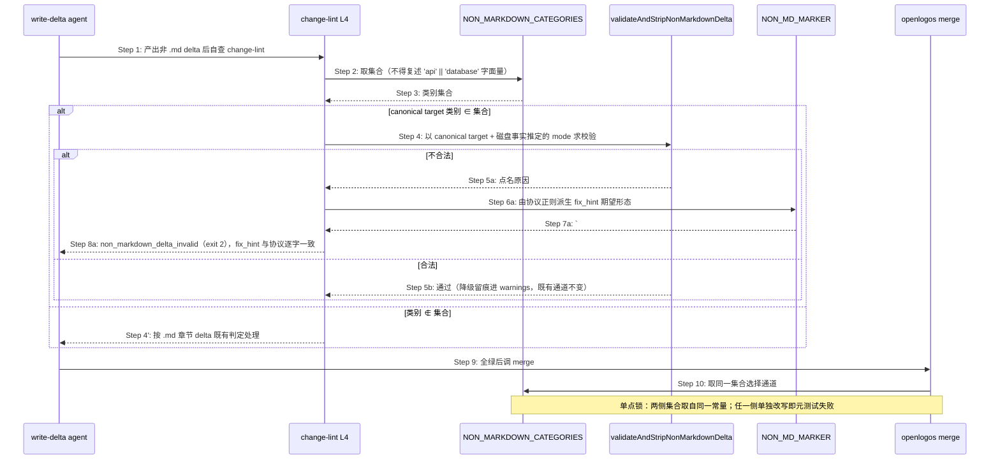
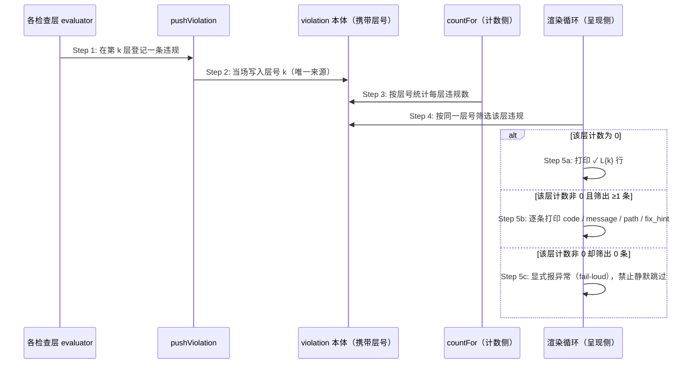

# S35：提案计划产物左移硬检查（change-lint）

> Feature：F04 变更提案与切片生命周期  
> 来源：需求 S35、功能规格 §2.30 与 §2.43、跨仓 Plan Package 修复方案

## 场景目标

在 proposal/tasks producer 向用户报告完成之前，由 OpenLogos CLI 独立证明 Plan Package 满足统一合同；失败时返回可供同一 Agent 定点修复的结构化问题，并保证 change-lint、status、next 与 flow derive 对同一输入收敛。

## 用户价值

用户只会在方案真正可批准时看到 `ready-to-delta`，不会遭遇“lint PASS 但面板仍 writing”，也无需理解 canonical 标题、模板占位或插件缓存漂移。

## 参与者

- **用户/宿主**：触发检查并消费最终完成结论。
- **change-writer**：生产 proposal/tasks、读回并消费问题修复。
- **change-lint**：命令入口、退出码与 envelope 所有者。
- **PlanPackageEvaluator**：唯一完成判据与 issue 生产者。
- **status/next/flow**：只读消费同一 evaluation 的投影方。
- **AssetManifest**：证明 producer Skill/模板与 CLI 合同一致。

## 前置条件

- 项目已初始化，guard 指向当前 launched change。
- proposal/tasks 已由 change-writer 填充但尚无 Delta、无 `PLAN_APPROVED`。
- 项目 locale、模块、部署决定、clarification 与 baseline closure 可读取。

## 成功后置条件

- `change-lint --format json` exit 0 且 `data.pass=true`、`data.plan_package.ready=true`。
- status 的 `plan_ready=true`，next 的 `proposal_step=ready-to-delta`，flow predicate 同样完成。
- 检查前后项目全量文件集合与内容 hash 不变。
- change-writer 才能向用户报告方案待批准；本场景不写审批 marker。

## 时序图



## 步骤说明

1. **用户或宿主**要求 change-writer 完成当前提案，而不是直接授权 Delta 或 merge。
2. **change-writer**保留 CLI canonical scaffold，只替换占位正文；落盘后重新读取真实字节。
3. **change-writer**从项目根运行带明确 slug 的 change-lint JSON 命令。
4. **change-lint**完成操作错误前置检查后调用唯一 **PlanPackageEvaluator** 作为 L0。
5. **PlanPackageEvaluator**调用 authority scan、tasks parser、clarification、deployment、baseline closure 与 UI 声明共享 evaluator。
6. **共享子 evaluator**返回结构化事实；不得自行写文件或吞掉解析错误。
7. **PlanPackageEvaluator**规范化、去重并稳定排序 issues，计算 proposal/tasks 三态与 ready。
8. **change-lint**在 ready=false 时 exit 2、ready=true 时继续 L1～L8 并最终 exit 0；操作错误仍 exit 1。
9. 失败时 **change-writer**只修 issues 指向的当前提案文件并读回重试；成功时运行 next 双检查。
10. **status/next/flow**消费同一 evaluation；next 必须进入 `ready-to-delta`，不得仍为 writing。
11. **change-writer**向用户报告最终收敛结果并等待 plan gate 批准，不自动产 Delta 或 marker。

## 异常与边界

### EX-5.1：canonical summary 缺失
- **触发条件**：proposal 把 locale summary 改为自由标题，或章节缺失/重复/为空。
- **期望响应**：`proposal_required_section_missing|duplicate|empty`，包含 path、section_id、expected 与 fix_hint。
- **副作用**：lint/status/next/flow 均只读，plan 不 ready。

### EX-5.2：plan 阶段 code 占位或切片
- **触发条件**：tasks 保留 `实现代码变更` 或提前出现任意 `[code]` checkbox。
- **期望响应**：模板残留或 `tasks_code_entry_before_spec_complete`；空 `[code]` 锚点本身合法。
- **副作用**：不 auto-reset；auto-reset 仍只属于既有 merge/slice 边界。

### EX-7.1：子 evaluator 操作错误
- **触发条件**：proposal/tasks 不可读、YAML parser 失败或项目根事实不可安全解析。
- **期望响应**：exit 1 error envelope；不得降级成 pass=false success envelope。
- **副作用**：后续检查停止，文件与 marker 不变。

### EX-9.1：Agent 自然语言声称完成
- **触发条件**：文件非法但 Agent 输出“已完成”。
- **期望响应**：机器门仍失败；宿主 completion barrier 不得把 WorkUnit 标成 completed。
- **副作用**：用户不看到“可写 Delta”。

### EX-10.1：历史提案已越过 plan
- **触发条件**：存在 `PLAN_APPROVED|SPEC_MERGED|MERGED|VERIFY_PASS` 且旧 scaffold 不符合新规则。
- **期望响应**：保持现有前沿，仅允许非阻塞 warning。
- **副作用**：不回退、不改写历史。

### EX-10.2：Skill/模板资产过期
- **触发条件**：项目 sync hash 与 CLI asset manifest 不一致。
- **期望响应**：只读状态可见；producer dispatch 提示 sync + 重开 session，禁止静默使用旧 Skill。
- **副作用**：不覆盖用户/项目自有 Skill。

## API、数据库与安全边界

- 所有交互是本地进程/文件合同，API、数据库与 API 编排为 SKIP。
- completion 命令保持只读，不写 `PLAN_APPROVED`、Delta、MERGE_PROMPT 或宿主 WorkUnit 状态。
- RunLogos 自动回传、三次修复预算和 UI 展示属于独立 companion change。

## 追溯

- 需求：S05/S08/S09/S11/S35 Plan Package 完成合同收敛需求。
- 功能规格：§2.43 Plan Package 统一完成合同。
- 架构：第三十三章 Plan Package 完成合同收敛架构。
- 方法论：`spec/change-management.md`、`spec/tasks-spec.md`、`spec/flow-spec.md`、`spec/cli-json-output.md`。
- 测试：UT-S35-100～UT-S35-111、ST-S35-16～ST-S35-18、SMOKE-core-135～SMOKE-core-140。

## S35 围栏提取单点、可归因诊断与门禁可满足性断言

### 场景目标

消除 `change-lint` 判定链上的两处判据分裂（YAML 围栏提取、测试 ID 语法），让多命中不再静默降级，并为「门在其阶段可满足」建立可执行的失败信号。

### 参与者与前置条件

| 别名 | 组件 | 说明 |
|---|---|---|
| C | `change-lint` evaluator | L0～L8 的完整判定 |
| S | `markdown-scan.authorityScan` | 围栏 / 缩进代码 / HTML 注释掩码的唯一判据（函数名承自历史，判据本身与 authority 无关） |
| G | 测试 ID 语法权威 | 语法与三种具名读法的唯一铸造点 |
| T | 门禁可满足性断言 | 每道门 × 该阶段合法最小提案 |

### 围栏提取归位时序



**Step 3 的判据**：全部 YAML 围栏提取器一律走 `markdown-scan` 的 fence-aware 掩码，不得自建裸正则。对含嵌套围栏的文档（如四反引号 markdown 块内示意一段 yaml），裸正则会比 fence-aware 多命中一个围栏——这正是掩码必须单点的原因。

**多命中不得静默降级**：任一围栏提取器在候选数不为 1 时，必须产出点名的诊断，说明命中了几处、分别在哪；不得静默返回空集或取第一个命中。

### 测试 ID 语法的单点与具名读法

| 读法 | 消费方 | 与权威语法的关系 |
|---|---|---|
| 结构化判定 | `test-change-set`、`test-slice-manifest`、`baseline-closure` | 完整语法 |
| 表格首列提取 | `test-slice-manifest` | 完整语法 + 行首锚定；容忍并剥离首格可选 manual 标记（`[manual]` / `[manual/<平台>]`），提取结果恒为裸 ID（fix-table-test-id-manual-marker） |
| 正文扫描 | `automation-diagnostic` | 完整语法减去 SMOKE |

读法差异正当，各自定义不正当。本次消除的是四份独立演化的定义。首格 manual 标记的判定与剥离复用 `MANUAL_MARKER_RE` 单点——同一首格不得存在宽严不一的第二份读法；统一覆盖语义变更集的定义解析入口（§2.37.3 首格合同同步修订）。**统一的是「首格 → 裸 ID」解析层，不是输出集合**：各消费方在裸 ID 之上仍按既有语义筛选资格——verify 的 defined/eligible 派生仍经同源 manual 判定排除 manual 行、SMOKE 恒不进 verify 可选集（功能规格 §2.82.1、§2.82.4）。

**语法与数据的一致性锚**：断言已合并测试规格中**每一个 ID 表数据行**都能被表格首列读法提取出被权威语法接纳的裸 ID（含带 manual 标记的首格），**静默跳过即失败**。原始缺陷不是正则写错了，而是没人检查正则与真实数据是否还对得上——11 个 JSON 系 ID 因此静默失联；「提取不出的行不进断言集合」的静默跳过是同一缺陷的第二形态（fix-table-test-id-manual-marker 行级扩展）。

### 门禁可满足性断言

对每一道门构造「该门所处阶段的合法最小提案」，断言其通过：

| 阶段 | 合法最小提案含有 | 不含 |
|---|---|---|
| plan | 完整 proposal + tasks（`[delta]` 已规划、`[code]` 空标题） | 任何 delta |
| spec / merge | 上述 + 全部已规划 delta | `[code]` 切片 |

断言的价值不在验证当前 11 道门，而在新增门禁时立刻给出失败信号（架构 §四十一.6.2）。

### 诊断可归因要求

全部门禁诊断必须点名导致失败的实体本身——fact_id、测试 ID、文件路径、字段名。禁止「为空、非法或不在某集合中」这类无法定位的措辞。

### 不变量

1. **围栏判据唯一**：四个提取器对同一文档得到同一组围栏。
2. **多命中不静默**：候选数异常时必须产出诊断，不得降级为空集或空结论。
3. **语法唯一、读法具名**：语法恰一处定义；每种读法从其具名派生，不得独立定义。**行级形态读法同样只一处定义**——「数据行列数须等于表头列数」与「表头无重复」的判定收敛为唯一纯函数单点，`change-lint` L4（delta 侧前移）、`buildTestChangeSet`（合并后态守门）、`lint-specs`（只读诊断）三处**同源派生**。**单点覆盖判据与枚举口径两者**：凡以「预检必先报」为承诺的作用点，其「哪些表、哪些行进入判定」的枚举须与被对齐的下游门共用具名实现；只共享最后那次比较、各自决定进入比较的集合，等同于把分裂从判据挪到集合（功能规格 §2.84.1，delta-r1 F1）。集合的差异只允许出现在**不作此承诺**的作用点（`lint-specs` 全部表格、§2.82.2 首格检查的既有表头族），且须显式登记理由。
4. **语法与数据不漂移**：已合并规格中每一个 ID 表数据行都能被表格首列读法提取出被权威语法接纳的裸 ID（含带 manual 标记的首格）；静默跳过即失败。
5. **门禁可满足性有断言**：每道门都有对应的「该阶段合法最小提案通过」断言。**且凡下游门（含 merge 内部 `buildTestChangeSet` 等非命令形态的构建期判定）会拒绝的形态，预检必先报**——不允许存在「`change-lint` 全绿而 `merge` 必然失败」的组合；该一致性以双向比对元测试锚定，任一侧单独收紧即失败（功能规格 §2.84.5）。

### 异常与边界

- 文档不含任何 YAML 围栏：`extractDeclaration` 返回 `missing`，行为不变。
- 语法放宽只增不减：不存在此前被接纳、此后被拒绝的 ID。
- 元测试发现语法与数据漂移时，修复方向是调整语法或修正数据，**不得放宽断言本身**。

### 追溯

- 需求：AC-MERGEGATE-03、AC-MERGEGATE-04、AC-MERGEGATE-06～08。
- 功能规格：§2.51.3、§2.51.5～§2.51.7；架构：§四十一.6.1、§四十一.6.2。
- 测试：UT-S35-127～UT-S35-131、ST-S35-24；安装态 SMOKE-core-173。

## S35 SQL 校验降级留痕的输出通道

### 场景目标

让 SQL 方言层的降级留痕经 `change-lint` 的既有 `warnings` 通道可见，且不改变 L4 的通过与否，也不产生输出漂移。

### 参与者与前置条件

| 别名 | 组件 | 说明 |
|---|---|---|
| L | `change-lint` | L4 的判定与输出 |
| V | `validateSql` | 回传层级结论与降级留痕 |
| W | `warnings` 通道 | 既有字段，非空才出现 |

### 输出时序



### 输出契约

- **不计入 violations**：降级留痕不是违规，不影响 L4 通过与否，也不影响 `change-lint` 的整体退出码。
- **零漂移**：`warnings` 为空时字段整体省略——与既有约定一致，不因本功能改变无降级项目的输出字节。
- **可归因**：每条 warning 含 `code` / `message` / `fix_hint`；message 点名方言、缺失项与已执行层级，fix_hint 说明如何获得更强层级（如安装 `sqlite3`）。

### 不变量

1. 降级留痕只出现在 `warnings`，绝不出现在 `violations`。
2. 无降级的项目，其 `change-lint` 输出与本功能引入前逐字节一致。
3. warning 的存在与否不改变 merge 的准入结论——merge 只看 violations（S09 已冻结「准入判据等于 change-lint 完整结论」，此处的 violations 集合不因 warning 变化）。

### 异常与边界

- 同一提案多份 `.sql` delta 都降级：逐份产出 warning，不合并为一条——用户需要知道具体是哪一份。
- 降级与真实违规并存：violations 与 warnings 各自输出，互不吞并。

### 追溯

- 需求：AC-SQLGATE-08。
- 功能规格：§2.52.7；架构：§四十二.2。
- 测试：UT-S35-132～UT-S35-133、ST-S35-25；安装态 SMOKE-core-174。

## S35 阻塞理由自检可达性与一致性锚

### 场景目标

把 `change-lint` 对 `ProposalBlockReason` 的覆盖从 1/8 扩到 8/8，让 Agent 在**报告完成之前**有一个统一入口自查「下游会不会拒绝我」；并新增一条机器检查的一致性锚，使「新增阻塞判据但自检入口不可达」这类漂移不再能长期无人发觉。

### 用户价值

订正前，Agent 完成 `plan-slices` 后无处自查：三个声明产物确实躺在磁盘上，命令也报了成功，于是它据实报 `done`；真正的拒绝发生在下游 `next`，而驱动只看得到「前沿未推进」，发出 `detail` 为 `null` 的 `blocked(no-progress)`——精确诊断在传递中丢失。订正后，同一份诊断在 Agent 还能改的那一刻就到它手上。

### 参与者与前置条件

| 别名 | 组件 | 说明 |
|---|---|---|
| C | `change-lint` evaluator | L0～L8 既有判定链 + 本次新增 L9 |
| D | 阻塞理由 deriver | `deriveSliceVerificationState` 与提案生命周期推导——`next` / `status` 使用的**同一单点** |
| A | Agent（slice-planner / code-implementor） | 自检的发起方与诊断的消费方 |
| N | `next` / `status` | 下游判定方，判据与 C 同源 |

前置条件：活跃提案存在；L9 各理由按其自身激活条件判定，不要求提案处于特定阶段。

### 覆盖矩阵（订正前 → 订正后）

| `ProposalBlockReason` | 订正前自检入口 | 订正后 |
|---|---|---|
| `code_change_requires_real_test_ids` | L3 | L3（不变） |
| `no_delta_spec_marker_missing` | 无 | **L9** |
| `test-slice-manifest-missing` | 无 | **L9** |
| `test-slice-manifest-invalid` | 无 | **L9** + `slice plan` 写入口当场拒绝（S32 EX-32.23） |
| `test-slice-manifest-stale` | 无 | **L9（warning）** |
| `test-slice-manifest-unsupported` | 无 | **L9** |
| `test-slice-assignment-ambiguous` | 无 | **L9** |
| `slice-task-state-inconsistent` | 无 | **L9** |

### 自检时序



### 步骤说明

1. L9 的问题是「**如果我现在报完成，下游会不会拒绝我**」——它不发明判据，只是把下游的结论提前一步给到还能修改的一方。
2. L9 **必须复用** `next` / `status` 所用的同一 deriver。lint 自建第二套阻塞判定，就是把本次订正的缺陷（写入口自建判据副本）原样搬到另一侧。
3. 违规明细**原样带出**：逐条保留 `code` / `path` / `message` / `fix_hint`，顺序稳定，不折叠为摘要。
4. 某理由在当前阶段不成立时不报告。delta 尚未产完时 `SPEC_MERGED` 缺失是正常进度，不是缺陷；L9 只在 deriver 判定其确实阻塞时发声。
5. `test-slice-manifest-stale` 进 `warnings`、不改退出码——与「审计产物不得出现在流程分支的条件里」一致（功能规格 §2.68.4）。

### 一致性锚：阻塞理由 × 自检入口可达性

在既有两条锚之上新增第三条：

| 锚 | 断言 | 原始缺陷形态 |
|---|---|---|
| 语法 × 数据（既有） | 已合并测试规格中每个表格首列 ID 都被权威语法接纳 | 不是正则写错了，而是没人检查正则与真实数据是否还对得上 |
| 门禁 × 可满足性（既有） | 每道门都有「该阶段合法最小提案通过」的断言 | 新增门禁时没有失败信号 |
| **阻塞理由 × 自检入口（本次）** | 枚举 `ProposalBlockReason` 全集，每一条都能被至少一个自检入口（`change-lint` 或对应写入口）检出 | 判据存在、入口不可达；新增理由而未接线时无人发觉 |

三条锚是同一个形状：**判据与其消费面之间的对账必须由机器做**。新增理由而未接线时该断言挂红，是它与「写进约定」的全部区别。

**不引入任何需要作者手工声明的门。** `authority-closure` 因「要求人工预测谁裁决事实并逐字段闭合，属于让人做机器该做的事」在 0.15.0 被整体废止，其记载的废止理由是「在起草阶段反复拦截作者本身，而从未拦下真实的权威设计缺陷」。把本条写成一道要作者自觉满足的 lint 门，就是重犯刚删掉的错。

### 不变量

1. **判据唯一**：L9 与 `next` / `status` 对同一提案状态得到同一结论；lint 不持有第二套阻塞判定。
2. **覆盖完备**：`ProposalBlockReason` 全集每一条都有可达的自检入口，并由一致性锚断言。
3. **诊断可归因**：L9 输出点名具体实体（路径、ID、字段），不出现「非法或不在某集合中」这类无法定位的措辞。
4. **强度分级不越界**：仅 `test-slice-manifest-stale` 为 warning，其余为 violation；L0～L8 的既有分级（含 L8 警告级）不变。
5. **只读红线不变**：L9 不写 marker、不改派生、项目级零写入。

### 异常与边界

- **提案不处于任何阻塞态**：L9 无输出，退出码由其余检查项决定。
- **deriver 判定器按设计不适用**（单切片计划，结论为 `null`）：不是负面结论，L9 不报告——「不适用」不得读成失败（根规范 §2.2.1）。
- **新增第 9 条阻塞理由而未接线**：一致性锚挂红，修复方向是接入自检入口，**不得放宽断言本身**。
- **同一缺陷同时被写入口与 L9 检出**：不是重复，是纵深——写入口在产出那一刻拒绝，L9 在报完成前复查在盘产物。

### 追溯

- 需求：阻塞理由自检入口可达性要求。
- 功能规格：§2.30（检查项矩阵与输出契约）、§2.79（L9 与一致性锚）、§2.78（写入侧 fail-closed）。
- 根规范：`spec/test-slice-manifest.md` §8（诊断码）、§9（恢复动作合同）。
- 测试：UT-S35-138、UT-S35-139、UT-S35-140、UT-S35-141、ST-S35-27。

## S35 表格首列 manual 标记统一读法与首格可提取性前移

### 场景目标

消除 ID 表首格的读法分裂（verify 单元格读法认 manual 标记、切片提取读法与 lint-specs 不认），把首格形态问题的暴露点从 plan-slices（无法自修节点）前移到 write-delta（agent 可自修节点）。

### 参与者与前置条件

| 别名 | 组件 | 说明 |
|---|---|---|
| W | change-writer / 执行 agent | write-delta 节点内产出测试规格 delta，可自行修正并重跑 change-lint |
| C | `change-lint` evaluator | L4 delta 形态族新增首格可提取性检查 |
| G | 测试 ID 语法权威（`test-id.ts`） | 表格首列读法 + `MANUAL_MARKER_RE` 的唯一铸造点 |
| T | 语义变更集（`SPEC_MERGED.test_change_set`） | merge 时结构化定义扫描以统一首格读法解析定义行，manual ID 以裸 ID 进入 `changed_test_ids`（C 集合） |
| P | `slice plan` 写入口 | merge 后以同一读法校验 `spec_target` 定义，并对可信变更集做 `O = C` 归属对账 |

前置条件：活跃提案含 `deltas/test/**` 的 `.md` delta；已合并测试规格与 delta 中允许出现 `ID [manual]` / `ID [manual/<平台>]` 首格（S13 认可形态）。

### 首格读法统一与前移检查时序



### 步骤说明

1. **执行 agent** 在 write-delta 节点产出测试规格 delta 并运行 `change-lint`（其命令白名单内）。
2. **change-lint** 对 `deltas/test/**` 的 `.md` delta，仅识别 ADDED / MODIFIED 块内结构化测试 ID 表的数据行（散文、非 ID 表、围栏内引用不参与）。
3. **语法权威** 以表格首列读法逐行判定：剥离可选 manual 标记后提取裸 ID；判定与剥离同一单点，不存在第二份正则。
4. 首格合法（含带 manual 标记形态）→ 放行；不可提取 → 报 `delta_test_table_id_unextractable`，agent 在节点内修正闭环。
5. merge 时**语义变更集**（`SPEC_MERGED.test_change_set`）的结构化定义扫描以统一首格读法解析定义行——manual 行以裸 ID 为身份进入 `changed_test_ids`（标记属定义语义，§2.37.3 修订）；切片归属集合 C 来自该变更集，不从 delta 重新推断。
6. merge 后 **slice plan** 以同一读法校验 `spec_target` 定义，并对可信变更集做 `O = C` 归属对账——manual ID 已在 C 中，`SMOKE-core-XX [manual]` 形态规格无需改写即通过（含启用切片验证的多切片形态），`SLICE_PLAN_UNKNOWN_TEST_ID` 类停点从此不发生。

### 不变量

1. **首格唯一语义**：ID 表首格 = 裸 ID + 可选 manual 标记；判定与剥离复用 `MANUAL_MARKER_RE` 单点；语义变更集定义解析入口同受此合同约束（裸 ID 为身份、标记属定义语义）。
2. **提取容忍 ≠ verify 语义变**：manual 行排除出 defined/executed 的判据单一事实源与判定结果逐字不变（UT-S13-70/72 锁）；SMOKE 仍不进 verify 可选集；切片模式下 `eligible_test_ids` 派生同样不得让 manual UT/ST 进入 defined。
3. **消费边界**：统一只发生在「首格 → 裸 ID」解析层；各消费方（变更集 / spec_target / verify 定义集合）在裸 ID 之上按既有语义各自筛选资格，不要求输出同一集合。
4. **零放宽**：散文首格、占位尾段、通配等既有被拒形态照常拒绝。
5. **lint-specs 递归**：`logos/resources/test/` 扫描递归含 `smoke/` 子目录，首格判定同步容忍 manual 标记。
6. **前移检查不缩小扫描集合**：结构化 ID 表识别复用既有表头口径（`ID` / `用例 ID` / `用例ID`）。

### 异常与边界

- **EX-M.1：首格不可提取的 delta ID 表行**——触发条件：`deltas/test/**` 的 ID 表数据行首格既非裸 ID 亦非「裸 ID + manual 标记」；期望响应：`delta_test_table_id_unextractable`（violations、exit 2、点名定位）；副作用：无（只读检查）。
- **EX-M.2：已合并规格中存在提取不出的 ID 表数据行**——触发条件：一致性锁行级断言扫到静默跳过；期望响应：断言失败并点名文件、行号与首格原文，修复方向是修正数据或语法，不得放宽断言本身。
- **EX-M.3：非 ID 表 / 散文 / 围栏引用**——不参与首格判定，零误报。

### 追溯

- 功能规格：§2.82（§2.51.7、§2.37.3、§2.70.1 同步修订）；架构：§四十一.2、§四十一.4。
- 测试：UT-S35-142～UT-S35-147、ST-S35-28。
- 来源变更：fix-table-test-id-manual-marker（下游 tools.top 实测缺陷，2026-09-13）。

## S35 L7 缺段警告化与 warning 输出通道

### 场景目标

让 GUI 项目提案缺失「UI/UX 变更声明」段时，change-lint L7 经既有 `warnings` 通道报警而**不阻断 merge 准入**，消费侧派生 `ui_impact:false` 安全默认；声明段在场但损坏 / `ui_impact` 非布尔仍 fail-closed。消除 20260914 全自动 run 在 merge 时点被缺段硬停的无收益阻断（功能规格 §2.83）。

### 用户价值

desktop / GUI 项目中语义偏 CLI 的提案不再因 producer 误删声明段而在 `openlogos merge` 硬停等人——缺段回落 `ui_impact:false` 安全默认并以警告提示补段；plan-exit 的原型确认合同（真正的保护点）不受影响。

### 参与者与前置条件

| 别名 | 组件 | 说明 |
|---|---|---|
| L | `change-lint` | L7 的判定与输出 |
| A | `analyzeUiDeclarationStructure` | 声明段结构化分级（缺段 / 损坏 / 非布尔 / 合法）的唯一判据 |
| P | `parseUiUxDeclaration` | 消费侧安全默认（缺段 → `ui_impact:false`）的既有单点 |
| W | `warnings` 通道 | 既有字段，非空才出现 |
| M | merge 准入消费点 | 只读 violations，warning 不改变准入结论 |

前置条件：模块经 proposal-context resolver 解析为 GUI（`product_type ∈ {web,desktop,mobile}`）；非 GUI 模块 L7 不激活，本场景不适用。

### 判定与输出时序



### 输出契约

- **缺段只出现在 `warnings`，绝不出现在 `violations`**：不影响 L7 通过与否、不影响 `change-lint` 整体退出码、不进入 merge 准入违规集合（S09 已冻结「准入判据 = change-lint 完整结论」，violations 集合不因 warning 变化）。
- **可归因**：warning 含 `code` / `message` / `fix_hint`；message 点名 proposal.md 与缺失的「UI/UX 变更声明」段，fix_hint 指引按脚手架骨架补回该段（本次不动界面即 `ui_impact: false`）。
- **零漂移**：`warnings` 为空时字段整体省略——与既有约定一致；无缺段项目的输出不因本功能改变。
- **派生口径单点**：缺段派生 `ui_impact:false` 与 `parseUiUxDeclaration` 的既有安全默认同口径，不引入第二处判定。

### 不变量

1. 缺段警告与派生安全默认**不改变** `ui_impact:true` 的逐页对账判据（声明清单 basename 集合 == 产出文件 basename 集合，重复 / 额外 / 缺失均失败）。
2. `ui_declaration_unparsable` / `ui_impact_not_boolean` 仍 fail-closed：进 violations、exit 2、merge 拒绝——诊断的 code / path / message / fix_hint 逐字不变。
3. 非 GUI 模块 L7 不激活：零输出、零警告；`module_unresolved` 仍为操作错误（exit 1，fail-closed），不得静默按非 GUI 跳过缺段判定。
4. plan-exit 原型渲染确认合同（§2.26.4～§2.26.9）零改动——本场景只动 merge 时点的缺段强度，不动 plan 时点的确认语义。
5. 只读红线不变：L7 判定项目级零写入。

### 异常与边界

- **缺段警告与真实违规并存**：violations 与 warnings 各自输出、互不吞并；整体 FAIL 因真实违规而非缺段。
- **缺段 + `ui_impact:true` 场景不存在**：缺段派生值恒为 `false`，不会触发逐页对账；对账仅对「结构合法且声明 `true`」的提案执行。
- **历史提案已越过 plan / merge**：沿 EX-10.1 既有口径，不回退、不改写历史。

### 追溯

- 来源变更：fix-ui-declaration-source-skew-and-missing-degate（20260914 全自动 run 实测事故；audit run `drv-mu0svxrh-64i2`）。
- 功能规格：§2.83（缺段降门与判定源统一）、§2.26.2（安全默认口径合流）、§2.30（检查项矩阵 L7 行）。
- 先例：§2.73（L8 守恒降级为警告）、本文档「S35 SQL 校验降级留痕的输出通道」。
- 测试：UT-S35-148～UT-S35-152、ST-S35-29。

## S35 行级形态判据前移与预检-门一致性锁

### 场景目标

把后态 `test-change-set-ambiguous-table` 的**全部触发形态**（数据行列数 ≠ 表头列数、表头重复）收敛为唯一语义与单点实现，并在 `change-lint` L4 族**前移**为可归因违规——让此前只在 merge 内部 `buildTestChangeSet` 阶段爆发、预检全绿而无任何前置信号的形态问题，在 **write-delta 节点**即被暴露闭环。前移不止于共享最后那次整数比较：**枚举「哪些表、哪些行进入判定」的口径同样与后态对齐**，否则漏扫的行照样在后态被拒、前移承诺落空（功能规格 §2.84.1～§2.84.2、§2.84.5）。

### 用户价值

一个「少写一个 `|`」的 delta 形态错误，不再需要烧掉一整轮全自动 run 才停在 `openlogos merge`、且停在 agent 已出写权限范围的节点。write-delta 节点下 delta 文件在 agent 写权限范围内、`change-lint` 在其命令白名单内——错误在此暴露即由 agent 当场修正，**不产生停点、不需要人**（audit run `drv-mu1d875x-7ooq` 的 `merge-failed` 硬停形态从此不发生）。

### 参与者与前置条件

| 别名 | 组件 | 说明 |
|---|---|---|
| L | `change-lint` L4 族 | delta 形态判定与违规输出（前移点） |
| R | 形态判据单点 | 「数据行列数 == 表头列数」与「表头无重复」的唯一纯函数实现 |
| B | `buildTestChangeSet` | 合并后态的 fail-closed 守门（判据同源派生） |
| P | `lint-specs` | 已合并基线只读诊断（判据同源派生，不参与任何门） |
| E | 测试定义表共享枚举 | 「哪些表、哪些行进入判定」的唯一实现，前移侧与后态共用 |
| K | 预检-门一致性锁 | 元测试：凡后态以 `test-change-set-ambiguous-table` 拒的形态，预检必先报 |

前置条件：提案含 `deltas/test/**` 的 `.md` delta；delta 内含**测试定义表**——识别口径与后态 `scanTestDefinitionCandidates` 对齐（表头行 + 分隔行、表头列数 == 分隔列数、列数 ≥ 2、无空表头格，**不限表头措辞**），而非仅 `TEST_ID_HEADER_RE` 表头族。

### 判据前移时序



### 步骤说明

1-3. `change-lint` 在既有 L4 delta 形态扫描中枚举**测试定义表**——枚举口径与后态 `scanTestDefinitionCandidates` 共享具名实现，**不限表头措辞**、数据行延伸至空行或掩码行为止；围栏与缩进块经 `authorityScan` 掩码排除。此前前移侧额外要求表头首格匹配 `TEST_ID_HEADER_RE`、且以「不含管道符的行」为块边界，两处都比后态窄，构成漏扫（delta-r1 F1）。
4a-5a. 表头去重后数量少于表头列数即 `delta_test_table_duplicate_header`——对应后态同码抛点的另一半触发形态，与列数检查一并前移，使一致性锁可按错误码定义（§2.84.2）。
4b. 首格与列数两检查**正交且不重复报**：首格非法（`delta_test_table_id_unextractable`）时该行不再判列数——其根本不构成 ID 行。**§2.82.2 首格检查的适用集合逐字不变**（仍限 `TEST_ID_HEADER_RE` 表头族）：若随列数检查一并扩大，会把后态接纳的散文表首格新判为违规。
4c-6a. 列数判定调**同一纯函数单点**（入参为表头单元格数与数据行单元格数，无 IO、无路径语义）；不一致即 `delta_test_table_column_mismatch` 进 violations、exit 2，message 点名 delta 文件路径、**delta 内行号**、表头列数与本行列数。
7a. 前移的全部价值在此：agent 在本节点即可改、即可重跑，不进入无法自修的下游节点。
8-10. merge 的后态守门**口径与强度逐字不变**（fail-closed）——本场景是前移侧向后态对齐，不反向改动后态。

### 判据单点与扫描集合的分工

| 作用点 | 作用对象 | 扫描集合 | 强度 |
|---|---|---|---|
| `change-lint` L4（列数 / 表头重复） | `deltas/test/**` | 测试定义表——**与后态逐项对齐**（不限表头措辞、数据行至空行止） | 违规（exit 2），入 merge 准入 |
| `change-lint` L4（首格可提取性，§2.82.2） | `deltas/test/**` | `TEST_ID_HEADER_RE` 表头族（**既有集合，逐字不变**） | 违规（exit 2），入 merge 准入 |
| `buildTestChangeSet` | 合并后态 | 首格为合法测试 ID 的数据行（**基准口径，逐字不变**） | fail-closed 后态守门 |
| `lint-specs` | 已合并基线 `logos/resources/test/**` | **全部表格**（不限 ID 表，逐字不变） | 只读诊断，不参与任何门 |

**判据单点 + 前移侧集合向后态对齐**：只把整数比较抽成共享函数、而让两侧各自决定「哪些行进入比较」，等于把分裂从判据挪到集合——未进入比较的行照样在后态被拒。故前移侧集合**只扩大**，扩大部分**恰为此前已被后态拒绝的形态**，不新增任何「后态接纳而预检拒绝」的组合；§2.82.2 首格检查与 `lint-specs` 的集合均逐字不变。

### 诊断可归因要求（本族补齐）

- **前移点诊断点名 delta 侧实体**：`delta_test_table_column_mismatch` 的 message 必须给出 **delta 文件路径 + delta 内行号**——这是 agent 能直接打开并修改的实体；只给后态行号等同于不可归因。
- **后态诊断标注口径**：`test-change-set` 族错误消息的行号标注为「合并后态行号」，消除「照着磁盘文件找不到该行」的误导（事故现场：消息给 `:771`，而该文件磁盘上只有 741 行）。
- **merge 层补 delta 侧归属**：兜底映射时点名产生该行的 delta 文件与其 delta 内行号；**归属无法确定时不得伪造**，降级为「仅后态行号 + 已标注口径」并显式说明未能归因。

### 预检-门一致性锁

- **断言**：凡 `buildTestChangeSet` 会以 `test-change-set-ambiguous-table` 在合并后态拒绝的 delta 形态，`change-lint` 必先报出对应违规。
- **边界按错误码定义（可穷举）**：覆盖该码的全部触发形态——数据行列数不一致、表头重复；不覆盖 `test-change-set-duplicate-id` / `-target-duplicate` / `-overlap`，因其需要合并后态全局视角，在单个 delta 片段上不可判定，强行前移只产生假阳性（§2.84.5）。
- **实现**：合成夹具对每个形态同时构造 delta 形态与其合并后态，一侧喂 `change-lint`、一侧喂 `buildTestChangeSet`，双向比对结论；**任一侧单独收紧即失败**。夹具须含三处对齐点各自的反例：非 `TEST_ID_HEADER_RE` 表头的测试定义表、数据行不含管道符导致前移侧提前收束、表头重复。
- **定位**：这是本文档不变量 5（门禁可满足性）在**表级 / 行级形态族**上的落点——不再允许出现「预检全绿而 merge 必炸」的组合。
- **不得放宽断言本身**：发现漂移时的修复方向是把两侧判据与枚举口径重新收敛到单点，**不得**靠收窄后态扫描或削弱锁来消红。

### 异常与边界

- **首格非法 + 列数不一致同时成立**：只报 `delta_test_table_id_unextractable`，不双报——首格非法的行不构成 ID 行，列数判定对其无意义。
- **表头非 `TEST_ID_HEADER_RE` 但数据行首格是合法测试 ID**：**必须报**列数违规——后态正是这样判定身份的（表头措辞不参与），此前前移侧以表头措辞为免报理由即漏扫（delta-r1 F1 反例一）。
- **无首尾管道的表格外形 / 数据行不含管道符**：同样进入枚举——数据行边界以空行与掩码行为准，不以「是否含管道符」为准（delta-r1 F1 反例二）。
- **完全无合法测试 ID 首格数据行的表**：不报列数违规——后态亦不对其抛 ambiguous（该表不产生任何测试定义）；此类表的列数问题由 `lint-specs` 作只读诊断承担，两者定位不同，不构成分裂。
- **历史基线兼容开关**：`buildTestChangeSet` 既有的 `allowAmbiguousRows` 等前滚 / 历史基线兼容语义逐字不变；一致性锁只对**开关关闭的正常路径**比对，不把兼容开关下的宽松当作漂移。
- **不放宽后态判据**：不把列数不一致降级为「告警跳行」——跳行会让该行测试 ID 静默掉出 `changed_test_ids`，切片归属对账误报「owned_test_ids 含非本提案变更 ID」（§2.82.0 同族事故）。正确处置是前移，不是放宽。

### 追溯

- 来源变更：fix-merge-preflight-parity-and-bare-throw（RunLogos 全自动 driver 实测事故，2026-09-14；audit run `drv-mu1d875x-7ooq`，blocked `merge-failed` / `exit-nonzero`）。
- 功能规格：§2.84.1～§2.84.2（判据与前移侧扫描集合同源）、§2.84.5（一致性锁边界）、§2.82.2（同族前一半：首格可提取性前移）、§2.70.1（三处读法归属澄清）。
- 场景关联：本文档「S35 围栏提取单点、可归因诊断与门禁可满足性断言」（不变量 3 与 5）、S09「merge 内部错误的稳定失败语义」。
- 测试：UT-S35-153～UT-S35-158、ST-S35-30。

## S35 变更类型 ↔ delta 层面观测 warning

### 场景目标

让 `openlogos change-lint` 在提案声明的变更类型与实际铺开的 delta 规格层不相称时，经既有 `warnings` 通道报出 `change_type_delta_layer_mismatch`——**不阻断、不改 exit code、不进违规码集合**。补上「防过度设计」机制唯一缺失的硬底：此前全部产出皆为提示词文本与观测字段，依赖 agent 读了照做，没有一条机器可查的信号（原始诊断④：近 30 个提案中声明「代码级修复」的，实际改了 3–8 个 delta、跨 2–4 层规格）。

### 用户价值

「声明的类型与实际改的面不相称」此前只能靠人工翻提案原文发现，因而无人在数。本 warning 把它变成每次 `change-lint` 都出的一行事实，观测期的分母由此可得；同时因走 warning 通道，不给任何提案新增阻断风险。

### 本节的定性（前置声明，不可省）

**这条规则是本能力新立的观测启发式，不是方法论判据的投影。** 变更传播规则（`spec/change-management.md` §变更传播规则）表头为「**最少**需要更新」——给的是**下界**，不是上界。因此「实际层超出免计集合」**不等于违反方法论**，命中只说明「声明类型与实际铺开的规格面不相称，值得看一眼」。warning 的 `message` / `fix_hint` **不得**措辞为「违反方法论」或等价表述；该约束由 ST 用例断言。

### 参与者与前置条件

| 别名 | 组件 | 说明 |
|---|---|---|
| L | `change-lint` | 本 warning 的判定与输出 |
| V | `isValidChangeType` | 既有合法性判据的导出形态，语义逐字节零回归，由 `plan-package-contract` 原地调用 |
| R | `resolveChangeType` | **本次新增**：从「变更类型」章节解析出唯一类型，歧义返回 `null` |
| T | 类型词表 | V 与 R **共享的同一份**词表（zh/en），严禁第二份 |
| C | `classifyProposalDeltas()` | 既有分类器，提供逐条 delta 的 `category` 与 `relativePath` |
| W | `warnings` 通道 | 既有字段，非空才出现 |

前置条件：提案含 `## 变更类型` 章节且正文非空。缺段 / 空段由既有 canonical 章节判据覆盖，本 warning 不激活。

### 判据双源与「严禁第二份判据」的落实方式

既有 `plan-package-contract` 的变更类型正则是 `.test(content)` 的**包含式合法性检查**——「正文里出现过任一类型」即判合法。它**不能**直接确定「声明的是哪一类」：实测 `代码级（不涉及设计级或需求级变更）` 与 `设计级 / 代码级` 两种正文都通过该检查；英文正则更宽松，任何含 `code` 的说明文字都会命中。故本节拆为**两个函数、两种语义**：

1. **`isValidChangeType(content, locale): boolean`** —— 逐字节保留既有正则与语义并导出，`plan-package-contract` 原地改调用。既有 `proposal_change_type_invalid` 的判定结果**零回归**。
2. **`resolveChangeType(content, locale): ChangeTypeLevel | null`** —— 本次新增能力，供本 warning 使用。

二者**共享同一份类型词表**：这才是「严禁第二份判据」（本文件首部不变量）的正确落实——不是共享正则，而是同一词表上的两种消费方式。change-lint 消费导出，不得照抄任何正则字面量。

### `resolveChangeType` 解析规则

1. 取 `## 变更类型` 章节正文的**首个非空行**作为声明主体（模板形态即单行声明）；
2. 剥去该行中的括号说明文字——全角 `（…）` 与半角 `(…)`；说明文字里的类型词**不参与**解析；
3. 在剩余文本上全局匹配类型词；
4. **恰好命中一个**才返回该类型；命中 **0 个或 ≥2 个**（歧义）返回 `null`。

实测两例：`代码级（不涉及设计级或需求级变更）` 剥括号后唯一命中 → 代码级；`设计级 / 代码级` 命中两个 → `null`。zh / en 两套均适用。

### 免计层级表

| 声明类型 | 不计入越界的 delta 层 | 取此界的依据 |
|---|---|---|
| 代码级 | `test` | 方法论「代码 + **重新验收**」——重新验收可正当地带回归测试规格；`skills/change-writer` 亦允许代码级提案带 delta |
| 接口级 | 上述 + `api` / `database` / `scenario` | 传播规则「API/DB + 编排 + 代码」 |
| 设计级 | 上述 + `prd/2-product-design` / `prd/3-technical-plan` / `spec` / `skills` | 传播规则「原型 + 场景 + API/DB + 编排」；`spec` / `skills` 是方法论自身产物，改它们至少是设计级 |
| 需求级 | 全部（恒不告警） | 传播规则「全链路」 |
| 任意级 | `decisions` | 决策留痕是变更自身的元数据、非规格产物，与变更层级正交 |

**类别完备性约定**：类别集合以分类器唯一事实源 `DELTA_TO_RESOURCE` 为准，当前八类 `prd` / `api` / `database` / `scenario` / `test` / `decisions` / `spec` / `skills`，上表已逐项覆盖。**新增 delta 类别时该表须同批扩充**——新类别未入表即无定义行为，属规格缺口而非实现自由度。

**`prd` 子目录映射**：`prd` 细到子目录（`1-product-requirements` / `2-product-design` / `3-technical-plan`），从 `relativePath` 取；其余类别按一级 `category`。`prd` 下未知子目录按「不在任何免计集合」处理（即对非需求级声明计为越界）。

### 有效条目口径

只统计 `classifyProposalDeltas()` 返回中 `mergeDisposition === 'mergeable'` 且 `lintValidity === 'valid'` 的条目。`explicitly_ignored`（reference / 隐藏文件）、`invalid`、未知类别与 `deltas/` 根下直放文件**一律不计入**——它们本就不进规格层，计入会把既有 L6 已覆盖的形态二次报成层级越界。

### 判定与输出时序



### 输出契约

- **只出现在 `warnings`，绝不出现在 `violations`**：不影响任一检查项通过与否、不影响整体退出码、不进入 merge 准入违规集合（S09 已冻结「准入判据 = change-lint 完整结论」，violations 集合不因 warning 变化）。
- **可归因**：warning 含 `code` / `message` / `fix_hint`；message 点名声明的变更类型与**实际越界的层**（逐项列出，非仅计数），fix_hint 提示「确认类型声明是否准确，或说明本次为何需要触及这些层」。
- **措辞约束**：message / fix_hint 不得断言提案违反方法论——本规则是观测启发式，传播规则给的是下界。
- **零漂移**：`warnings` 为空时字段整体省略；无命中提案的输出不因本功能改变。

### 不变量

1. `change_type_delta_layer_mismatch` 进 `ChangeLintWarningCode`，**不进** `ChangeLintViolationCode` 闭合枚举；违规码集合与 10/10 门禁计数逐字节零改动。
2. 既有任何一条违规码的判据与文案零改动；`isValidChangeType` 提取后 `proposal_change_type_invalid` 的判定结果逐字节零回归。
3. 单向告警：只在「实际超出声明类型的免计集合」方向报出；反向（声明高层级而实际改得少）**不告警**——该形态未观测到，不预先造机制。
4. 判据单点：类型词表只有一份，V 与 R 共享；change-lint 消费导出而非照抄正则。
5. 只读红线不变：本判定为纯函数，项目级零写入。
6. 本规则不新增 step / gate / marker，不接入 flow 派生。

### 异常与边界

- **声明歧义**（正文命中 ≥2 个类型词）：`resolveChangeType` 返回 `null` → 不告警。注意该正文本身通过既有包含式合法性检查、**不会**触发 `proposal_change_type_invalid`——两条通道同时静默。既有检查只覆盖「完全不含类型词」这一种形态。
- **「变更类型」章节缺失 / 为空 / 仍含模板占位**：本 warning 不激活，由既有 canonical 章节判据覆盖，不重复报。
- **零 delta 提案**（纯代码提案）：有效条目集合为空，恒不越界、恒不告警。
- **本规则的自触发**：声明设计级而带 `prd/1-product-requirements` delta 的提案会命中该 warning——`prd/1` 不在设计级免计集合内。这是**预期行为**而非缺陷：改动 CLI 行为的提案普遍需要同步更新需求文档，故设计级 / 接口级提案将普遍告警。**告警率本身即观测期要测的量**；是否把 `prd/1` 收窄为各级免计，由数据决定，不在零样本期凭推断放宽。
- **与既有 warning 并存**：多条 warning 各自输出、互不吞并；与 violations 并存时整体 FAIL 因真实违规而非本 warning。

### 追溯

- 来源变更：anti-overdesign-scale-signals（防过度设计三批落地的第三批；前两批已在下游归档 `20260919-2315-add-necessity-review-anti-overdesign`、`20260920-0418-observe-necessity-self-release`）。
- 需求：`core-01-requirements.md`「S35/S09: 防过度设计的规模信号」验收条件 1–6。
- 先例：本文档「S35 L7 缺段警告化与 warning 输出通道」（warning 通道形态）、§2.73（L8 守恒降级为警告）。
- 测试：UT-S35-159～UT-S35-172、ST-S35-31。

## S35 non-Markdown 类别集合单点与 fix_hint 协议派生

### 场景目标

把「哪些 delta 进入 L4 的 non-Markdown 形态判定」这一**枚举口径**，从 `change-lint` 内的字面量收敛为与 merge 合成侧共用的具名常量；并把 `non_markdown_delta_invalid` 的 `fix_hint` 文案从手写字符串改为**由协议常量派生**，使其与实际 marker 形态不可能漂移。

### 用户价值

准入承诺落到实处：此前 `change-lint` 对 `deltas/scenario/*.json` 与 `deltas/api/*.yaml` 之外的非 `.md` delta 不做任何检查，lint 报 `PASS（10/10）` 而 merge 必炸——全自动 run 在 agent 已出写权限范围的节点硬停。收敛后缺口在 write-delta 节点即暴露，agent 当场可改；且 `fix_hint` 照着修就能修对，不必像本次事故中的 gap-repair agent 那样绕开文案、自行去读判据实现。

### 本节的定性（前置声明，不可省）

本节**不是新增约束**，而是既有不变量 3「语法唯一、读法具名」在 **non-Markdown 类别集合**上的一次落实。该不变量已明文规定「只共享最后那次比较、各自决定进入比较的集合，等同于把分裂从判据挪到集合」；类别白名单正是「进入比较的集合」，此前两侧各写一份字面量属该条已禁形态。

### 参与者与前置条件

| 别名 | 组件 | 说明 |
|---|---|---|
| N | `NON_MARKDOWN_CATEGORIES` | 整文件类别集合的唯一定义点（定义归属见 S39） |
| L | `change-lint` L4 | non-Markdown 形态判定的准入侧（枚举口径消费方） |
| M | `merge` 合成侧 | 整文件通道选择（同一集合的另一消费方） |
| P | `NON_MD_MARKER` | 整文件 delta 首行控制 marker 的权威正则 |
| H | `fix_hint` 生成 | 由 P 派生的修复指引文案，非手写 |

前置：提案含非 `.md` 的 mergeable delta，且其 canonical target 可映射（L6 已通过）。

### 枚举口径收敛与 fix_hint 派生时序



### 步骤说明

2-3. L4 的「哪些 delta 进入判定」取自 `NON_MARKDOWN_CATEGORIES`，**不得**在 `change-lint` 内重写等价字面量。事故实证：现场 lint 报 `PASS（10/10）`，其中 `L4 delta 段标记与脱模板` 只看了 5 个 `.md`，而 `L6` 同时数出 `8 mergeable`——差的 3 个正是两份 `api/*.yaml` 与那份 `scenario/*.json`，全部漏检；准入放行，故障推迟到合成阶段才爆发。
4-5. 校验调 `validateAndStripNonMarkdownDelta` 单点，判据与强度与 merge 侧逐字同源；SQL 降级留痕仍走既有 `warnings` 通道。
6a-8a. `fix_hint` 由 `NON_MD_MARKER` 派生而非手写。现文案 `# ADDED|MODIFIED <canonical target 路径>` 与实际协议 `## ADDED|MODIFIED — <路径>（整文件替换）` 在**井号数、破折号、后缀**三处均不符，照此修复必然再次失败——本次事故中的 gap-repair agent 正是绕开该 fix_hint、自行去读判据实现才写对，属侥幸。
9-10. merge 取同一常量选择通道；两侧在类别维度上不可能分叉。

### 不变量（本族补齐）

1. **枚举口径同源**：L4 的 non-Markdown 判定集合与 merge 合成侧的通道选择集合取自同一具名常量；任一侧出现等价字面量即违规。这是不变量 3 末句「集合的差异只允许出现在不作『预检必先报』承诺的作用点」的直接落点——L4 恰是作此承诺的作用点，故不享有集合差异豁免。
2. **fix_hint 与协议不漂移**：`non_markdown_delta_invalid` 的 `fix_hint` 所示 marker 形态由 `NON_MD_MARKER` 派生，与协议逐字一致；不得手写第二份文案。
3. **诊断可归因**：不合法时点名 delta 文件路径与具体不满足的层（marker / 路径漂移 / 语法 / 重复键），不得以「不合法」笼统作答。
4. **零回归**：`api` / `database` 两类的既有判定、强度与降级留痕逐字不变；`.md` delta 的既有 L4 判定逐字不变；`ChangeLintViolationCode` 成员集合不因本次扩容。

### 异常与边界

- **类别在集合内但校验入口尚未受理该类别**：视为未修复的缺口而非正常路径——集合与入口须同批（见 S39「类别集合与校验入口是两件必须同批的事」）。
- **非 `.md` 但类别不在集合内**（如未来出现的非 Markdown `decisions` 目标）：按既有 `.md` 章节判定处理并在新增该类别时同批评估，不得默认落入任一侧。
- **fix_hint 文案本地化**：派生的是**形态**（井号数、破折号、后缀、占位符位置），解释性措辞仍可随 locale 变化；形态部分不得因翻译而改写。
- **检查项计数**：本次不新增 L 层、不新增违规码，`change-lint` 检查项总数与集合逐字不变——回归锚须以上线前同夹具实测输出为基准，禁止硬编码 `10/10`。

### 追溯

- 来源变更：fix-orchestration-merge-and-predicate-duplication（toolstop 项目 `tools.top` 全自动 run `drv-muaq05dn-4qs0`，2026-09-21）。
- 场景关联：本文档「S35 围栏提取单点、可归因诊断与门禁可满足性断言」不变量 3 与 5（本节是其在类别集合上的落点）、「S35 行级形态判据前移与预检-门一致性锁」（同族的前一次落实）；S39「non-Markdown 整文件协议的适用类别与派生结论」（集合定义归属）。
- 测试：UT-S35-173～UT-S35-176、ST-S35-32。

## S35 锚折算、RENAMED 映射与标题扫描的三处收敛

### 场景目标

把 `change-lint` 与 `markdown-section-authority` 之间**已经产生行为分叉**的三处重复实现收敛为单点，并逐处确定收敛后的唯一判定语义：锚文本折算、`RENAMED` 反向映射（含非法块处置）、Markdown 标题扫描（含标题文本的视图划分）。

### 用户价值

三者与本次故障同族——都是「同一判据的第二份副本」。副本一旦存在，分叉只是时间问题：其中两处**已经**分叉（非法 RENAMED 块 lint 跳过而 merge 拒绝；标题文本 merge 侧剥行内代码而 lint 侧不剥），意味着此刻就存在「预检全绿而 merge 必炸」与「两侧对同一文档看到不同标题」的组合。收敛后这两类组合在结构上不再可能。

### 本节的定性（前置声明，不可省）

本节只收敛**已产生可观测行为差异**的重复，不收敛无分叉证据的重复（如 guard 文件的多处读取）——后者纳入只会放大回归面，独立立案。收敛的判定取向遵循「向决定最终落盘字节的一侧对齐」：merge 是事实权威。

### 参与者与前置条件

| 别名 | 组件 | 说明 |
|---|---|---|
| F | 锚文本折算 | `foldRenamedAnchor`（lint）与 `mapAnchorText`（merge）函数体**逐字节相同** |
| R | `RENAMED` 反向映射 | lint 与 merge 各建一份，**对非法块的处置已分叉** |
| S | Markdown 标题扫描 | `scanHeadings`（lint）与 `parseMarkdownHeadings`（merge）各一份，**标题文本口径已分叉** |
| C | `parseRenamedTitle` | 非法 RENAMED 块的合法性判据（既有单点，两侧均已复用，不改） |

前置：三处均落在本次改动触及的文件内；收敛不改变任何一侧对**合法**输入的既有结论。

### 逐处收敛判定

| 处 | 现状 | 收敛后唯一判定 | 依据 |
|---|---|---|---|
| F 锚折算 | 两份函数体逐字节相同，`mapAnchorText` 未导出故被抄了一份 | 导出 `mapAnchorText`，lint 侧删除副本改调共享实现；折算语义（保留序数后缀 `[n]`，它不是标题的一部分）逐字不变 | 无分叉，纯去重；零行为变更 |
| R RENAMED 反向映射 | lint 与 merge 各建一份映射表；非法块处置**已分叉**：lint `continue` 跳过、merge `return false` 拒绝 | 收敛为单点；非法 RENAMED 块**统一为拒绝**（向 merge 侧对齐），lint 侧现行的跳过作废 | C04：lint 的承诺是「预检必先报」，跳过等于放行一个 merge 必拒的形态，与前移承诺自相矛盾 |
| S 标题扫描 | 两份扫描；标题文本**已分叉**：merge 侧取 `stripInlineCode(...)`、lint 侧取原始 `.trim()` | 收敛为**一次共享扫描**，同一次扫描同时记录 `rawText` 与 `normalizedText` 两个视图；**消费方按用途各取其一** | C05：收敛的是扫描实现，不是文本视图——见下「标题文本的视图划分」 |

**R 的可合并集合不变**：非法 RENAMED 块这一形态改前改后**都不能合并**（merge 侧本就拒绝）。本次只是把错误从合成阶段提前到预检阶段，回归面最小；不存在「改前能合、改后不能合」的形态。

### 标题文本的视图划分（S 的收敛边界）

`stripInlineCode` 删除的是**整个行内代码片段**，不是仅去掉反引号。因此它对**锚定位**是等价规范化，对**身份**是**有损**的——两者不能共用同一文本视图：

| 消费方 | 取哪个视图 | 理由 |
|---|---|---|
| 锚定位（章节锚解析、RENAMED 折算） | `normalizedText` | 向 merge 侧对齐；merge 决定最终落盘字节，是事实权威 |
| L8 条目守恒的**场景表辖属路径身份** | `rawText` | 身份必须无损：不同辖属标题若坍缩，正式表与历史副本同身份，守恒门被绕过 |
| 标题**保真**检查 | `rawHeading`（既有，逐字不变） | 保真检查不得与被检查者共用规范化管道——这是既有注释已明文警告的正交路径，本次不触碰 |
| 决策章节判定 | 须**显式选定**并有用例覆盖 | 不得由「跟着谁改」隐式决定 |

**反例（必须继续被拒）**：基线标题「### 业务 `正式`」下有场景表行 `| S01 | 登录 |`；delta 未声明删除、也未 `RENAMED`，只把该行移到标题「### 业务 `历史`」下。现状 `evaluateDeltaConservation` 返回 `delta_implicit_id_removal` 并点名 S01 与表身份「业务 `正式`」。若把辖属路径身份改用规范化文本，两个辖属路径同时坍缩为「业务」、身份相同，守恒返回空集——正式条目被替换却不再要求声明。**该反例改后仍须被拒**，是本处收敛的验收条件。

### 不变量（本族补齐）

1. **三处各恰一处实现**：锚折算、RENAMED 反向映射、标题扫描在 lint 与 merge 之间各只有一份实现；任一侧出现第二份即违规。
2. **非法 RENAMED 统一拒绝**：lint 与 merge 对非法 RENAMED 块结论相同（均拒绝），合法性判据仍复用 `parseRenamedTitle` 单点，不新建第三份。
3. **扫描共享而视图分离**：标题扫描只执行一次，但 `rawText` 与 `normalizedText` 两个视图同时可得；消费方按上表取用，**不得**以「两侧一致」为由让身份消费方改取有损文本。
4. **守恒强度不降**：上述反例在收敛后仍被 `evaluateDeltaConservation` 拒绝并点名原始表身份；L8 条目守恒的强度逐字不降。
5. **保真与规范化正交**：标题保真检查继续取 `rawHeading`，不与规范化管道合流。
6. **合法输入零行为变更**：F 处收敛对任何输入均无行为变更；R 处只对**非法** RENAMED 块改变报错时机（合成 → 预检），S 处只消除「两侧看到不同标题」这一分叉。

### 异常与边界

- **非法 RENAMED 块（正文多行 / 空 / 以 `#` 开头）**：lint 即报并点名该块锚与具体违反项；不再为后续锚提供不该存在的折算。
- **同一 delta 内 RENAMED 与其它 op 组合**：折算语义不变——更名后以**新标题**作后续块的锚，解析失败时折回旧标题重试一次，两次都不中才算锚不可解析。
- **标题含行内代码且被用作锚**：锚定位按 `normalizedText` 匹配，与 merge 侧逐字一致；两侧不再出现「lint 判不可解析而 merge 成功」的组合。
- **标题含行内代码且该标题是场景表的辖属标题**：身份取 `rawText`，行内代码内容参与身份；两个仅在行内代码内容上不同的辖属标题是**不同身份**。
- **决策章节判定的文本视图**：须在实现中显式选定（而非继承扫描默认值），并有专门用例锁定其结论；未显式选定即视为未完成本处收敛。
- **不扩大收敛范围**：guard 文件的多处读取虽为重复，但各处结论一致、无分叉证据，不在本次范围内。

### 追溯

- 来源变更：fix-orchestration-merge-and-predicate-duplication；决策 C03（只收敛已分叉的三处）、C04（非法 RENAMED 统一拒绝）、C05（扫描共享、视图分离）。
- 场景关联：本文档「S35 围栏提取单点、可归因诊断与门禁可满足性断言」不变量 3 与 5；S09「merge 直接合并时序」与 `RENAMED` op 语义。
- 测试：UT-S35-177～UT-S35-182、ST-S35-33。

## S35 ADDED 锚合成后唯一性的 L4 前移

### 场景目标

把 `ADDED` 块「锚在**合成后文档**中唯一命中」这一判据，从 merge 合成阶段**前移**到 `change-lint` L4，使 write-delta 节点当场可判、当场可改。

该判据此前只存在于 merge 侧的 `verifyAgentMaterialOutcome`：`ADDED` 块要求 `before.status === 'not_found'` 且 `final.status === 'ok'`，否则报「ADDED 章节没有形成唯一新增结果」。lint 侧对此**零覆盖**，故 `PASS（10/10）` 与 merge 必炸可以并存。

### 用户价值

「预检必先报」这一承诺此前对 `ADDED` 不成立。2026-09-21 runlogos 提案 `add-workbuddy-agent-type` 的一份场景 delta，`ADDED` 块在 body 里重复写了一遍与锚同名的 H1，合成后同名标题出现两次、锚解析 ambiguous：`change-lint` 全绿放行，merge 连续失败 **199 次**（05:40:20～05:44:21）后以 `max-hops` 收场，停因面板显示的还不是真因。前移后该形态在 agent 仍握有写权限的节点即暴露，一次即可改对。

### 本节的定性（前置声明，不可省）

本节**不新增约束、不新增违规码**，而是既有一般原则在 `ADDED` 上的一次落实：**凡 merge 合成阶段 fail-closed 的判据，lint 侧必须有同源前移点**。与 20260920 toolstop 事故（non-Markdown 类别集合两侧各写一份字面量，lint 报 PASS 而 merge 必炸）并列登记为**「合成判据未前移」同族形态**——两者的故障面完全一致：agent 在能改的时候被告知没事，在不能改的时候被硬停。

### 参与者与前置条件

| 别名 | 组件 | 说明 |
|---|---|---|
| A | write-delta agent | 判据的受益方，在 lint 阶段即收到可执行诊断 |
| L | `change-lint` L4 | 判据的前移点（准入侧） |
| M | `merge` 的 `verifyAgentMaterialOutcome` | 判据的既有所在（合成侧），是事实权威 |
| U | 合成后唯一性判定 | **两侧共用的具名实现**，不得存在第二份 |
| C | `evaluateDeltaConservation` | L8 守恒对账，其 `ADDED` 排除语义**逐字不变** |

前置（**三项，缺一不可**）：① 提案含 mergeable delta 且其 canonical target 可映射（L6 已通过）；② 该 delta 经 **S39 的共享三值判定**得出的结果为 **`section`（章节 delta）**；③ 该章节 delta 含至少一个 `ADDED` 物质控制段。

**第 ② 项是本判据的通道闸，不可省、也不可用后缀或语义类别代替。** 整文件封装**全部**排除在本判据之外——既包括 API/DB/编排的 non-Markdown 整文件，也包括**本刀新增的 Markdown 整文件封装**。后者的形态恰好是 `.md` 目标、首行恰好以 `## ADDED —` 开头，靠「是不是 `.md`」或「语义类别是否落在 `NON_MARKDOWN_CATEGORIES` 补集」都区分不出来，必须消费共享分流结果本身。

### 判据内容

对 delta 中的每个 `ADDED` 块，取「已合并 target + 本 delta」的合成结果，断言该块的章节锚在合成后文档中**唯一命中**（`final.status === 'ok'`），且在合成前文档中**不存在**（`before.status === 'not_found'`）。两个条件与 merge 侧 `verifyAgentMaterialOutcome` 的 `ADDED` 分支**逐字同一**。

**同源要求（强制）**：该判定**恰有一处实现**，由 lint 与 merge 共同调用同一个具名导出；lint 侧**不得**另写一份等价判断，也不得只共享「最后那次比较」而各自准备输入。这是不变量 3「语法唯一、读法具名」的直接适用——本族此前已因「各自决定进入比较的集合」而出过一次事故。

**最常见的触发形态是 body 重复标题**：`ADDED` 的锚本身就会被合成器发射为章节标题，若作者又在 body 首行写一遍同名标题，合成后该标题出现两次，`resolveSectionAnchor` 返回 ambiguous，`final.status !== 'ok'` 成立。

### 与 L8 守恒对账的边界

L8 的 `evaluateDeltaConservation` 把 `ADDED`（及 `RENAMED`）排除在守恒物质块之外——谓词 `b.op !== 'ADDED' && b.op !== 'RENAMED'`。**该排除语义不因本节改变**：守恒对账问的是「既有结构化 ID 合并后是否都有去处」，新增章节本就不承载「既有 ID」，把它纳入守恒是答非所问。

本节新增的是一条**独立判据**，与守恒并列而非嵌入其中。两者的分工：守恒管「旧的有没有丢」，本判据管「新的是不是唯一地长出来了」。故 L4 的检查项计数与 `ChangeLintViolationCode` 成员集合**零改动**。

### 阶段边界（spec-complete 前后）

本判据要求 `ADDED` 锚「在**合成前**文档中不存在」，其 before 侧取的是**合并前**的目标字节。因此必须写死执行窗口：

**本判据只在 `SPEC_MERGED` 之前执行；合并完成后不重放。** 合并成功后目标已含该章节，而提案目录里的原 delta 仍在场——此时把当前文件当作 before 重跑本判据，`before.status` 必然不是 `not_found`，判定立即返回「ADDED 章节没有形成唯一新增结果」，一次成功的合并被倒挂成失败，后续阶段对 `change-lint` 结论的消费随之受污染。

**复用既有完成标记与阶段判断，不新增快照协议、不新增第二套阶段状态。** L8 条目守恒已有完全同型的处理并已明文写下理由：合并后没有 merge 前的目标快照，拿 delta 再对最终目标做守恒会制造假阳性，故 post-merge 只跑最终事实检查而不重放 L8。**把依赖 before 的判据挪进 L4 不会自动继承这层保护**，必须在本节显式声明同一条边界、并消费同一个完成标记判据。

**判别口径**：取既有 spec-complete 完成标记（含 legacy 形态），**不得**以「目标章节是否已存在」自行推断阶段——那恰好是被污染的那个事实。本边界与 S39「Markdown 整文件受理判定」的阶段边界是**同一条**，两处不得各写一份。

### 违规码与 fix_hint 契约

复用既有 `delta_section_anchor_unresolvable`——与「空锚 fail-closed」「非法 RENAMED 块」同族：控制块畸形 → 锚定位失败。**不新增违规码**。

`fix_hint` 必须指出该 op 的核心契约：**`ADDED` 的 body 不含章节标题本身，标题由锚发射**。诊断须同时点名该块的锚文本与失败形态（合成后重复命中 / 合成前已存在），使作者不必去读判据实现即可改对——本族此前已有一次「照手写文案修必然再次失败、gap-repair agent 只得绕开文案自行读实现」的教训，`fix_hint` 的信息量是可达性的一部分，不是装饰。

### 不变量

1. **判据恰一处实现**：合成后唯一性判定在 lint 与 merge 之间只有一份实现，任一侧出现第二份即违规。
2. **两侧结论相同**：对同一份 delta，lint 的判定结论与 merge 合成阶段的结论恒等；不存在「lint 通过而 merge 拒绝」的组合。
3. **报错时机前移**：合法输入零行为变更；**非法** `ADDED` 块只改变报错时机（合成 → 预检），不改变结论。
4. **守恒语义不动**：`evaluateDeltaConservation` 对 `ADDED` / `RENAMED` 的排除逐字保留，L8 强度不升不降。
5. **违规码集合零改动**：不新增 `ChangeLintViolationCode` 成员，L4 检查项计数不变。
6. **不重复报同一形态**：锚在**合并前**文档已存在这一形态由既有判据覆盖，本判据不就同一事实二次报出。
7. **通道排除**：共享三值判定结果不为 `section` 的 delta 一律不进入本判据；合法的 Markdown 整文件 CREATE delta 通过真实 L4 时，章节唯一性判定的消费方**不被调用**。
8. **阶段边界**：`SPEC_MERGED` 之后不重放本判据；合法章节 `ADDED` 与合法 Markdown 整文件 CREATE 在 merge 之后重跑 `change-lint` 均应通过且项目级零写入。

### 异常与边界

- **`ADDED` body 重复写与锚同名的标题**：L4 判违规并点名锚；错误在 `change-lint` 阶段报出，**不再**等到 merge 合成阶段。
- **合法 `ADDED`（body 不含同名标题）**：通过，合成结果与本次变更前逐字一致。
- **锚在合并前文档已存在**：仍由既有判据覆盖，本判据不重复报出，避免同形态双报。
- **`ADDED` 与 `RENAMED` 组合**：合成后唯一性在**折算后**的标题上判定，与 merge 侧的反向映射折算共用同一张表；不因更名而误判身份漂移。
- **带序数的锚**：序数语义属 `REMOVED` 的多写者例外，与 `ADDED` 无关，本节不触碰。
- **前移不扩大扫描范围**：本判据只对共享三值判定结果为 `section` 的 delta 的 `ADDED` 物质块生效。
- **Markdown 整文件封装必须被排除**：其首行 `## ADDED — <canonical target 路径>（新文件，整文件）` 会被现行 `parseDeltaBlocks` 解析成一个 anchor 为「路径 + 后缀」的 `ADDED` 块；把这样一份**合法**的新建 delta 送进本判据，合成后的文档里当然不存在以该路径加后缀命名的章节，`final.status !== 'ok'` 成立，判据会把它误判为违规——合法新建能力当场被 L4 掐断。**修复方向是按通道排除，不是给 payload 补一个路径标题**：往正文塞一个与控制行同名的标题以迎合章节检查，正是残渣文档的成因。
- **non-Markdown 整文件 delta（API/DB/编排）**：同样按通道排除，与既有处置一致。

### 追溯

- 来源变更：add-markdown-create-whole-file-protocol；与刀一（Markdown 新建文档的整文件协议）互补——刀一给新建文档一条合法写法，刀二保证写错时在预检阶段就说得清楚。
- 场景关联：本文档「S35 non-Markdown 类别集合单点与 fix_hint 协议派生」（同族形态的前一例）、「S35 行级形态判据前移与预检-门一致性锁」（前移的一般原则）、「S35 锚折算、RENAMED 映射与标题扫描的三处收敛」（折算表单点）；S09「merge 直接合并时序」的 `verifyAgentMaterialOutcome` 复验步。
- 实证：20260921 runlogos `add-workbuddy-agent-type`，199 次 merge 全失败、停因显示 `max-hops`；20260920 toolstop 事故为同族前例。
- 测试：UT-S35-183～UT-S35-189、ST-S35-34。

## S35 违规层归属单点与人类可读输出的逐条可归因

### 场景目标

把「一条违规属于哪一个检查层」收敛为**恰有一处来源**：由 `pushViolation` 在登记违规时当场写入的层号，随 violation 一并导出，计数侧与呈现侧消费**同一个值**；并把 `change-lint` 人类可读输出的**逐条可归因**与**fail-loud** 写成显式契约。

### 用户价值

2026-09-21（0.15.12，runlogos 提案 `add-workbuddy-agent-type`）实测：判定本身正确（`ADDED` 锚确实不唯一，正是同日前移的 L4 判据抓住的），但人类可读输出是这样：

```text
change-lint: add-workbuddy-agent-type
  ✓ L0 …  ✓ L1 …  ✓ L2 …  ✓ L3 …          ← L4 整行消失
  ✓ L5 …  ✓ L6 …  ✓ L7 …  ✓ L8 …  ✓ L9 …
FAIL（9/10，1 项违规，1 warning）
```

**L4 那一行整行不见，违规的 code / path / message / fix_hint 一项都没打印**，底部只剩聚合结论。使用者看到 `FAIL` 却无从知道错在哪、怎么修。而 `CLAUDE.md` 与 runlogos `block-remediation.js` 的修复指引都恰好推荐「可在项目根运行 `openlogos change-lint --slug <提案>` 自查」——这条被官方指引推荐的路径，在缺陷期间是瞎的。

受害者是**在终端自查的人与 AI agent**；`--format json` 路径直接输出 `result.violations`、不经反推映射，runlogos driver 走的正是这条，诊断完整、自愈链不受损。

### 本节的定性（前置声明，不可省）

本节**不新增判据、不新增违规码、不改任何判定结论**，而是既有两条要求在**呈现层**的一次落实：

1. 不变量 3「语法唯一、读法具名」——层归属此前有**两份映射**（登记侧 `acc.order` 与呈现侧从 code 反推），两份映射必然漂移，本节把它收敛为一份；
2. 本文档「S35 围栏提取单点、可归因诊断与门禁可满足性断言」已立的**诊断可归因要求**（全部门禁诊断必须点名导致失败的实体本身）——该要求此前只对**诊断内容**生效，对「诊断有没有被打印出来」无约束，本节补上这半条。

与「合成判据未前移」同族形态并列登记为**「判据正确而呈现丢失」形态**：判定链算对了，使用者却拿不到结论所依据的实体。

### 参与者与前置条件

| 别名 | 组件 | 说明 |
|---|---|---|
| P | `pushViolation`（`lib/change-lint.ts`） | 违规登记点，**层归属的唯一来源**——登记时即知道当前在第几层 |
| N | `countFor` / `result.checks[].violations` | 计数侧消费方，按层统计违规数 |
| R | `commands/change-lint.ts` 的人类可读渲染循环 | 呈现侧消费方，按层筛选并打印违规 |
| X | `checkOfCode(code)` | **被删除**的影子映射：从 code 反推层号的第二份来源 |
| J | `--format json` 输出 | 直出 `result.violations`，不经任何层归属映射 |

前置：① 一次 `runChangeLint` 已产出 `checks[]` 与 `violations[]`；② 输出格式为默认的人类可读格式（`--format json` 不经本节的呈现路径）。

### 根因：同一 code 合法横跨多层，反推原理上不可能准

| | L4 | L8 |
|---|---|---|
| `countFor`（登记侧，权威） | 1 | 0 |
| `checkOfCode`（呈现侧 filter） | 匹配 0 条 | — |
| 实际输出 | 进 else 分支但循环体零次 → **整行消失** | 计数 0 → **打勾** |

**表中缺陷只在 L4 一侧**：该次输入的违规登记在 L4，L8 的守恒检查排除 `ADDED` 块、本次确实零违规，故「计数 0 → 打勾」是 L8 的**正确**行为，不在修复范围内。本节要恢复的是 L4 那一行，不是把 L8 的 `✓` 拿掉。

`delta_section_anchor_unresolvable` 现同时被 L4（ADDED 锚合成后唯一性前移）与 L8（条目守恒）使用，而 `checkOfCode` 的入参**只有 code**，结构上无法区分两者。因此「给它补一条 case」补不出来，「保留它作兜底」等于保留第二份映射：**反推不是「暂时不准」，是原理上不可能准**。

复用既有违规码本身是合理设计（同一违规语义可出现在不同检查层），要改的不是码的分配，而是那份从码反推层号的映射。

### 归属与输出时序



### 判据内容（三条契约）

**契约一 · 层归属恰有一处来源。** 层号由 `pushViolation` 在登记违规时当场写入 violation 本体并随之导出；`countFor`（计数侧）与渲染循环（呈现侧）消费**同一个值**。**禁止任何消费方从 `code` 反推层号**——`checkOfCode` 即该反推副本，随本节删除，不保留为兜底。理由是结构性的而非质量性的：同一 code 可合法横跨多层，入参只有 code 的函数无法区分。

**契约二 · 逐条可归因。** 人类可读输出对每条违规必须打印 `code`、`message`、`path`、`fix_hint` 四项，与 merge 准入输出（`spec/change-management.md` §2.51.5「逐条可归因——每条单独输出 code / 路径 / 具体字段 / `fix_hint`，禁止只给聚合结论」）**同口径**。此前该要求只在 merge 侧成文，`change-lint` 侧无任何约束——**这个规格空白正是本缺陷得以存在的条件**。

**契约三 · fail-loud。** 某检查层计数非零却筛不出可打印的违规时，**必须显式报异常**，不得静默跳过。本次实测即反例：L4 计数为 1 却筛出空集、整行消失，底部只剩 `FAIL（9/10，1 项违规）`，**全程不报错、不影响 exit code**——静默正是它隐蔽存在的机制。（同次输出中 L8 计数为零、打 `✓` 是**正确**行为，缺陷只在 L4 侧。）

### 与既有契约的边界

- **`--format json` 契约零漂移**：JSON 路径直出 `result.violations`，层号是呈现层的内部需要，**止于命令层、不进 JSON 输出**；runlogos driver 的 `parseChangeLintEnvelope` 按 code 消费，不需要层号，加字段属无收益的对外契约漂移。
- **判定链零改动**：检查项集合与计数、违规码注册表、violations 的内容与排序、`pass` 判定、exit code、`PASS` / `FAIL` 文案，全部不变。本节只改「已判定的结论如何被打印出来」。
- **warning 通道不受影响**：warning 走独立通道、不计入 violations、不参与层归属，打印形态不变。

### 不变量

1. **归属单点**：层归属恰有一处来源（`pushViolation` 登记时写入），计数侧与呈现侧消费同一个值；出现第二份来源即违规。
2. **禁止从 code 反推**：不存在任何以 `code` 为唯一入参推断层号的函数或映射表；`checkOfCode` 删除后不得以任何形式复活。
3. **每层至少一行**：每个检查项在人类可读输出中**至少产生一行**——`✓` 行、若干 `✗` 行，或（计数与可打印集合不一致时）一个显式异常；不存在「整行消失」的第四种可能。
4. **逐条四要素**：每条打印出的违规含 `code`、`message`、`path`、`fix_hint` 四项，缺一即违规。
5. **fail-loud**：计数非零而可打印集合为空时显式报异常，不得静默跳过、不得以聚合结论代替。
6. **JSON 契约零漂移**：`--format json` 的字段集合、violations 内容与排序逐字节不变，层号字段不出现。
7. **判定零改动**：检查项标识集合与总数、违规码注册表、exit code、`PASS` / `FAIL` 文案不因本节改变。
8. **无违规时形态不变**：全部检查通过时的输出（全 `✓` 行 + `PASS`）逐字不变，本节不新增任何行。

### 异常与边界

- **一条违规登记在 L4、其 code 也被 L8 使用**：按登记侧层号打印在 L4 下，L8 不受影响；这正是本次事故形态的回归锚。
- **同一 code 的两条违规分别登记在 L4 与 L8**：两条各自打印在正确层下，不串层、不丢失。
- **某层计数非零但筛出空集**：显式报异常并点名该层与计数，不静默跳过——本条的存在意义是让同类映射漂移在**第一次**发生时即暴露。
- **零违规**：每层打印 `✓` 行，底部 `PASS`，形态与本节之前逐字相同。
- **warning 与 violation 并存**：warning 仍在全部检查项之后统一打印，`FAIL` 行的 warning 后缀形态不变。
- **`--format json`**：完全不经本节的渲染路径，输出逐字节不变。
- **层号与检查项集合不一致（如 GUI 未激活时 L7 不在 `checks[]`）**：以 `checks[]` 的实际集合为渲染基准；不因某层不在集合中而丢弃其违规——若出现该组合，属契约三的 fail-loud 范畴。

### 追溯

- 来源变更：fix-lint-violation-check-attribution。
- 场景关联：本文档「S35 围栏提取单点、可归因诊断与门禁可满足性断言」（诊断可归因要求与不变量 3 的出处）、「S35 ADDED 锚合成后唯一性的 L4 前移」（新增的 L4 调用点复用 L8 既有 code，是本缺陷的触发输入）、「S35 non-Markdown 类别集合单点与 fix_hint 协议派生」（同族的「第二份来源」形态）。
- 规格关联：`spec/change-management.md` §2.51.5（merge 准入输出的逐条可归因，本节与其同口径）。
- 实证：20260921，0.15.12 对 runlogos 提案 `add-workbuddy-agent-type`——判定正确而 L4 整行消失、只剩 `FAIL（9/10，1 项违规，1 warning）`，全程不报错、不影响 exit code；同次 L8 无违规，其 `✓` 行本身正确。
- 测试：UT-S35-190～UT-S35-195、ST-S35-35。
