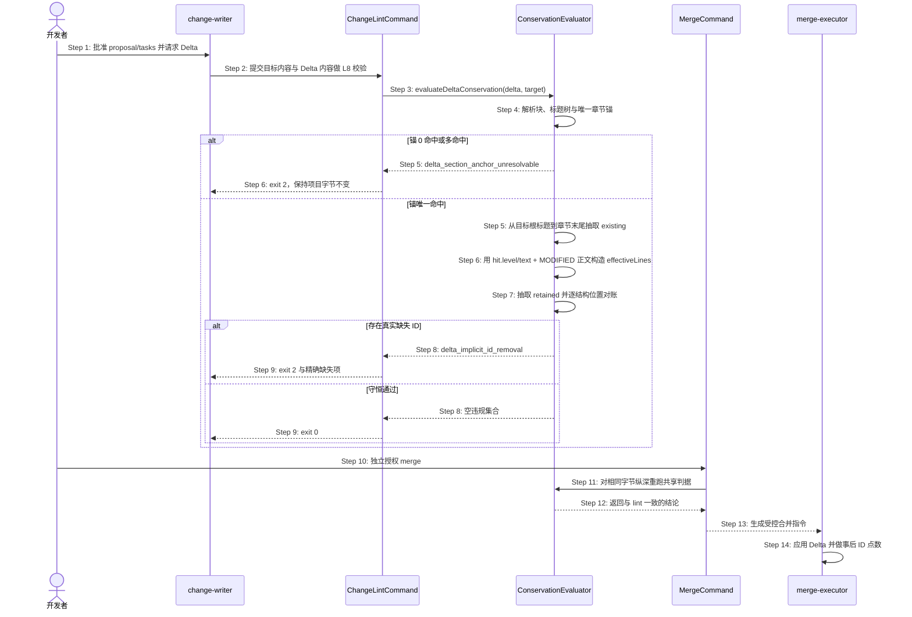
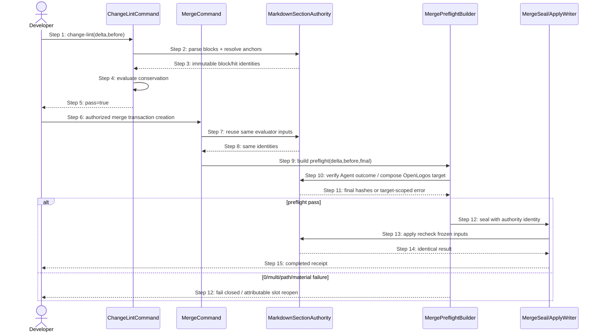

# S37：delta 条目守恒门

> Feature：F04 变更提案与切片生命周期  
> 来源：需求文档 S37、功能规格 §2.33、`spec/change-management.md`、提案 `fix-modified-anchor-root-id-false-removal`

## 场景目标

在 change-writer 完成 Markdown Delta 后，`openlogos change-lint` 与 `openlogos merge` 使用同一个守恒判据，阻断结构化 ID 的隐式删除，同时允许控制锚已经保留目标根标题身份的合法 `MODIFIED`。判据必须比较真实最终章节结构，而不是把目标侧“根标题 + 正文”与 Delta 侧“仅正文”进行不对称对账。

## 用户价值

用户能够在不伪造重复子标题、不错误声明删除根 ID、也不关闭 fail-closed 门禁的前提下修改 `SXX`、`DXX` 或数字节号根章节；真正消失的内嵌场景、测试用例、编号小节和带身份场景表行仍会被确定性拦截。

## 参与者

- **开发者**：批准提案、审阅 Delta，并在独立确认点授权 merge。
- **change-writer**：按批准后的 tasks 生成 Delta，运行 lint 并修正违规。
- **ChangeLintCommand**：枚举提案 Delta，调用共享 L8 判据并输出诊断。
- **ConservationEvaluator**：解析块与章节锚，构造 existing/retained，执行结构化 ID 对账。
- **MergeCommand**：生成 `MERGE_PROMPT.md` 前纵深调用同一 evaluator。
- **merge-executor**：在获授权后应用 Delta，并执行事后点数自检。

## 前置条件

- launched 项目存在有效 guard、已批准的 proposal/tasks 和一个目标为既有 Markdown 主文档的 Delta。
- `MODIFIED` 锚可按单段标题或标题路径解析；目标文档和 Delta 字节均可读。
- `ID_PATTERN_REGISTRY`、标题解析器与 `extractRegistryIds` 是 lint/merge 共用的唯一事实源。

## 成功后置条件

- 合法根标题 ID 被视为真实最终章节的一部分，不产生 `delta_implicit_id_removal`。
- 章节内所有其它既有结构化 ID 均在相同结构位置/表身份保留，或经 `REMOVED` / `REMOVED-ITEMS` 显式退出。
- lint 与 merge 对同一输入给出一致结论；lint 只读，失败 merge 不生成 prompt 或 marker。

## 时序图

## 步骤说明

1. **开发者**批准 proposal/tasks 后，**change-writer**依次生成一目标一 Delta；plan 批准不自动授权 merge。
2. **change-writer**调用 `openlogos change-lint`，命令层读取目标与 Delta 后把两个字符串交给共享 **ConservationEvaluator**。
3. **ConservationEvaluator**以 fence-aware 标题树解析 `MODIFIED / REMOVED / REMOVED-ITEMS` 锚；空锚、零命中、多命中和同锚多写者继续 fail-closed。
4. 对唯一命中的章节，evaluator 从目标命中标题开始到同级/更高级下一标题之前抽取 existing，根标题本身属于 existing 的真实结构。
5. 对唯一的 `MODIFIED` 块，evaluator 以目标的 `hit.level` 与 `hit.text` 重建同一个根标题，随后拼接 `block.lines` 形成 `effectiveLines`；不得从 anchor 字符串扫描 ID。
6. evaluator 对 `effectiveLines` 调用现有 `extractRegistryIds(..., contextTitle, true)` 抽取 retained，使根标题身份与目标侧采用同一结构模型。
7. evaluator 逐项比较 flat ID 与带表身份的场景行；根标题以下真正缺失的 ID 仍按原规则报告，散文、围栏、错误表身份和父路径 token 不构成保留。
8. lint 返回稳定排序的 violations 或空集合；任何结果都不写项目文件、guard 或 marker。
9. 开发者另行授权 merge 后，**MergeCommand**对相同输入调用同一个 evaluator；失败时不生成 `MERGE_PROMPT.md`，成功时才交给 merge-executor。
10. **merge-executor**应用 Delta 后按合并前后结构化 ID 集合执行事后点数，不符则回滚并且不写 `SPEC_MERGED`。

## 异常与边界

### EX-3.1：根标题携带稳定 ID

- **触发条件**：目标标题为 `## S10 ...`、`## D12：...` 或 `## 2.3 ...`，同锚 `MODIFIED` 正文没有重复根标题。
- **期望响应**：唯一命中的真实根标题进入 retained；不报告该根 ID，lint/merge 放行。
- **副作用**：无；不得要求添加重复 `### S10` 或虚构 `REMOVED-ITEMS`。

### EX-3.2：标题路径含其它 ID

- **触发条件**：路径锚的父标题或散文部分出现另一个 `SXX` / `DXX` / 数字 token。
- **期望响应**：只使用最终命中的目标 `hit.text` 重建根标题；父路径 token 不进入 retained。
- **副作用**：无；禁止通过直接扫描 anchor 形成保留伪证。

### EX-7.1：根标题保留但内嵌 ID 消失

- **触发条件**：目标根为 `S10`，原章节还含 `### S11`、测试表 ID、编号小节或场景表行，而 MODIFIED 正文缺少其中一项。
- **期望响应**：不误报 `S10`，但对每个真实缺失项继续报告 `delta_implicit_id_removal`；表行还须匹配原表身份。
- **副作用**：lint 只读；merge 不生成 prompt 或 marker。

### EX-3.3：锚不可解析或多写者

- **触发条件**：锚 0 命中、多命中、空锚，或同一章节存在多个 MODIFIED 写者。
- **期望响应**：维持既有 `delta_section_anchor_unresolvable` / 单写者拒绝，不尝试重建根标题。
- **副作用**：无猜测式回退，无部分写入。

### EX-9.1：lint 后输入漂移

- **触发条件**：lint 通过后目标或 Delta 字节变化，使 merge 纵深判据失败。
- **期望响应**：merge fail-closed；要求重新 lint 与审阅。
- **副作用**：不生成 `MERGE_PROMPT.md`、`MERGE_PROMPT_GENERATED` 或 `SPEC_MERGED`。

## API 与数据库派生结论

- 本场景只在本地 CLI 进程内处理 Markdown 字符串与文件，不出现 HTTP、RPC 或消息边界，因此 API 与 API 编排均为 SKIP。
- 本场景不新增数据库、DDL、查询、迁移或业务持久化实体，因此数据库为 SKIP。

## 非目标与安全边界

- 不关闭或降级 L8，不改变 `ChangeLintViolationCode`、JSON envelope、错误码、稳定排序或 i18n 文案。
- 不改变 `ADDED / MODIFIED / REMOVED / REMOVED-ITEMS` 的合并操作语义。
- 不从 anchor 字符串猜测目标结构，不允许散文 token、代码围栏或错误表身份背书 ID 保留。
- 不执行 npm publish、全局安装、Git tag、GitHub Release、官网发布或 git push。

## 追溯

- 需求：S37 验收条件 1～9。
- 功能规格：§2.33.1～§2.33.5。
- 架构：§二十四的判定流程、实现映射与架构不变量。
- 方法论规格：`spec/change-management.md` 的 L8 最终章节结构合同。
- 测试：UT-S37-32～UT-S37-36、ST-S37-07～ST-S37-08。
- 来源问题：`logos/resources/reference/openlogos-change-lint-modified-anchor-root-id-false-removal-bug-report.md`。

## Merge Transaction 消费 S37 Section Anchor Authority 时序

### 场景目标

把 S37 的 fence-aware block/heading-tree/唯一锚能力从 change-lint 私有实现提升为 `delta.section-anchor-resolution` 共享 authority，使 lint、merge precheck、transaction Agent verifier 与 OpenLogos composer 对同一 Delta/before/final 给出可复算的一致结论。

### 参与者

- **ChangeLintCommand**：读取有效目标与 Delta，消费共享解析结果完成 L8 对账。
- **MergeCommand**：在创建 transaction 前复用 L8 evaluator，不复制 parser。
- **MarkdownSectionAuthority**：唯一解析控制块、标题树、路径锚与真实章节范围。
- **MergePreflightBuilder**：为 Agent/OpenLogos target 构造 candidate final 与结构化错误事实。
- **MergeSealWriter/ApplyWriter**：只消费 authority 决定和 hash，不自行解释章节锚。

### 前置条件

- Delta 与目标均为冻结、可读的 Markdown 字节；代码围栏可能包含伪 heading 或伪控制 marker。
- 标题路径锚使用精确 ` > ` 连接祖先到叶标题；重复叶标题必须通过完整父链消歧。
- Authority Registry 中 `delta.section-anchor-resolution` 的 owner、writer、decision API、投影与 recovery source 已唯一登记。

### 成功后置条件

- 同一输入在 lint、preflight 与 apply 重验中得到相同 block 序列和 `level/text/path/start/end`。
- Agent final bytes 和 OpenLogos composed bytes 都满足同一物质操作后置条件，且正式文档不存在字面量路径标题。
- 任一旧私有 parser/regex 与 authority 结论冲突时，旧来源不可达且不能作为 fallback。

### 同源消费时序

### 步骤说明

1. change-lint 对有效视图只调用共享 parser/resolver，再由 ConservationEvaluator 做结构化 ID existing/retained 对账。
2. MergeCommand 的纵深检查消费同一 evaluator，禁止在 transaction 创建前形成另一份锚解析结论。
3. MergePreflightBuilder 对 Agent target 读取已提交 final bytes，对 OpenLogos target 调用共享 composer；二者都绑定相同 source/before hit identity。
4. seal 保存 candidate hashes 与 preflight identity；apply 首写前重算并比较，不能因重新解析得到不同候选而静默接受。
5. 可归因 Agent 错误交给 S09 局部 reopen；OpenLogos/mixed/unknown 错误保持 fatal，避免错误清空正确 slot。

### 异常与边界

#### EX-AUTH-37-1：代码围栏内伪 marker

- **触发条件**：Delta 正文围栏中出现 `## MODIFIED — 伪章节` 或目标围栏内出现同名 heading。
- **期望响应**：共享 parser 忽略围栏内容，lint/preflight/composer block 数量与命中位置一致。
- **副作用**：不得生成额外 writer、章节替换或 slot reopen。

#### EX-AUTH-37-2：重复叶标题与错误父链

- **触发条件**：目标存在两个同名叶标题，Delta 使用单段锚或不存在的父级路径。
- **期望响应**：所有消费者稳定返回 ambiguous/not-found；禁止叶标题首命中和正文相似度回退。
- **副作用**：lint 只读，merge 不形成正式写入；transaction 仅在结构化归因成立时局部 reopen。

#### EX-AUTH-37-3：旧 parser 冲突

- **触发条件**：旧 `parseDeltaSections`、扁平 heading regex 或精确 H2 matcher 会得出与共享 authority 不同的结果。
- **期望响应**：实现中旧分支已删除或不可达；测试以冲突夹具证明没有 catch/feature flag/legacy fallback。
- **副作用**：不能选择“更宽松”的旧结论继续 seal/apply。

#### EX-AUTH-37-4：投影过期或响应丢失

- **触发条件**：缓存的 lint/preflight result 与 source/before/content hash 不匹配，或 seal/apply 响应丢失。
- **期望响应**：从冻结 authority inputs、transaction 与 receipt 重建；mtime、marker存在性和残留 staging 不构成 freshness。
- **副作用**：只得到 collecting/sealed/completed 唯一状态，不反向改写 authority。

### API、数据库与安全边界

- 本场景只处理本地 CLI Markdown 字节和 transaction 制品，不产生 HTTP/RPC/消息 API、DB/DDL 或 API orchestration。
- 继续执行 containment、symlink、UTF-8、大小、SHA-256、atomic rename 和 journal 安全边界。
- 不改变 `ChangeLintViolationCode`、transaction 公共 JSON 或 reporter schema。

### 追溯

- 需求：AC-MT-ANCHOR-01～05。
- 功能规格：§2.46.2～§2.46.4。
- 架构：§37.1～§37.6，fact `delta.section-anchor-resolution`。
- 测试：UT-S37-37～40、ST-S37-09～10；生命周期联测 UT-S09-271～274、ST-S09-106～107。
