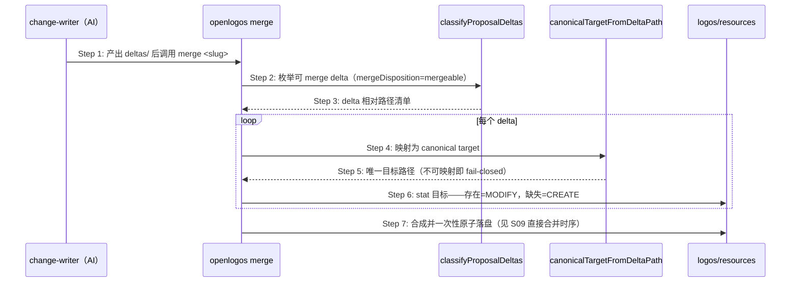
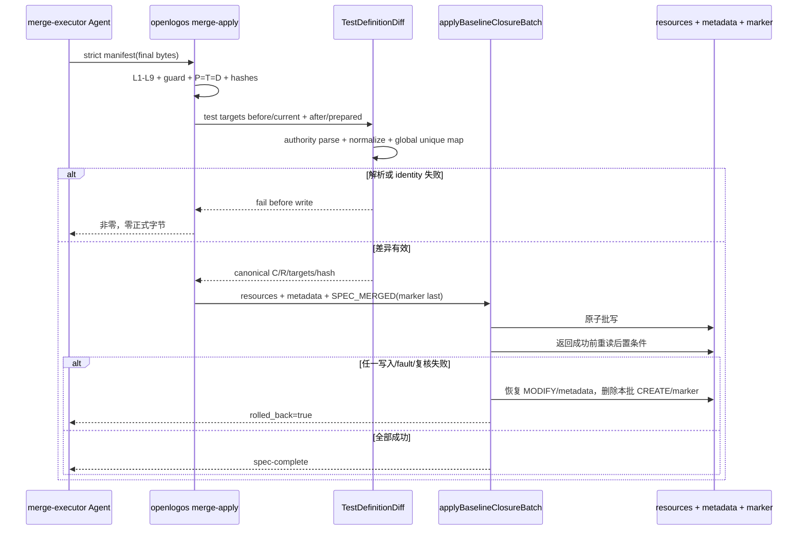
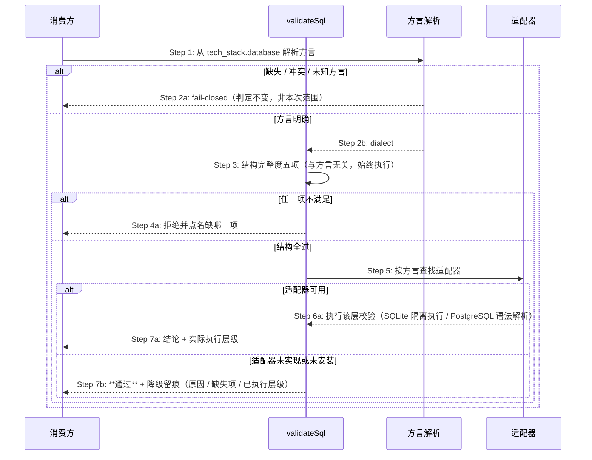
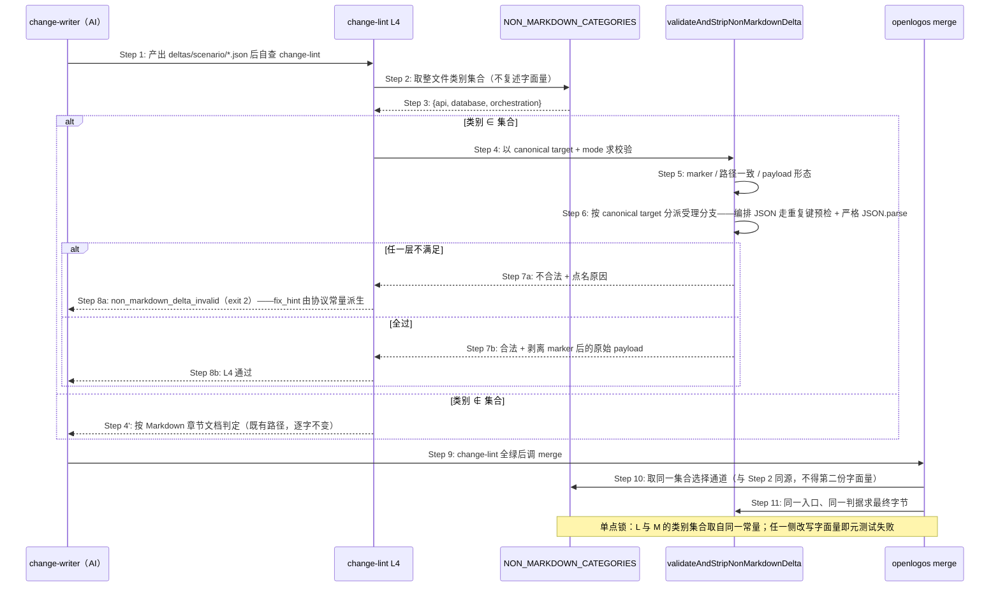

# S39：提案规划时按触达目标形成规格闭包

> **本场景已重新定界（lite-cut2b）**：原主体「按触达目标形成规格闭包」随 change-lint L9 删除；
> 现主体为「delta→canonical target 派生」。文档 H1 标题因 delta 机制无法修改文档级标题而暂留旧名，
> 待后续提案统一订正。

## 场景目标

把「合并要处理哪些目标」这一集合，从作者手工枚举的闭包计划，改为 `deltas/` 目录的无逻辑投影：产出了哪些 delta，就合并哪些目标。集合不需要声明，只需要枚举。

## 用户价值

作者不再需要预测「本次改动波及哪些规格」，也不再需要为每个触达场景补齐四维目标与证据化 disposition。规格是否波及完整，由 `openlogos verify` 的 ID 覆盖检查在验收时暴露——那是机器天然知道的事实，而非人的预测。

## 参与者

| 角色 | 职责 |
|---|---|
| change-writer（AI） | 按变更范围产出 `deltas/` 下的 delta 文件 |
| `classifyProposalDeltas` | 可 merge delta 的枚举判据（与 change-lint L6 同源） |
| `canonicalTargetFromDeltaPath` | delta 相对路径 → 唯一 canonical target 的映射判据 |
| `openlogos merge` | 目标集的唯一消费者，模式按磁盘事实即时判定 |

## 前置条件

`[delta]` 已产出；`logos/resources/` 工作区干净。**不需要**任何闭包声明。

## 成功后置条件

每个可 merge delta 恰好对应一个 canonical target；目标存在的按 MODIFY 合并、缺失的按 CREATE 落盘；`proposal.md` 的任何 YAML 声明均未被读取。

## 时序图

## 步骤说明

1. **change-writer** 按变更范围产出 delta，不写任何闭包声明。
2. **merge** 经共享分类器枚举可 merge delta——路径枚举、隐藏规则、symlink containment 只在 `delta-classify` 实现一次，change-lint L6 与 merge 同源。
3. 分类器返回 delta 相对路径清单；IO 错误 fail-fast，绝不把不可读产物投影成空清单。
4. 逐 delta 经 `canonicalTargetFromDeltaPath` 映射为唯一 canonical target。
5. 不可映射（绝对路径、`..`、symlink escape、未知类别目录）即在写入任何文件前整体失败并点名该文件。
6. 模式按磁盘事实即时判定：目标存在为 MODIFY、缺失为 CREATE。**计划与事实不再是两份数据**，因此不存在需要对账的不一致，也不存在「plan 后目标被外部创建」的模式漂移。
7. 合成与落盘见 S09「merge 直接合并时序」。

## 异常与边界

### EX-39.1：delta 路径不可映射为 canonical target
- **触发条件**：绝对路径、`..` 上跳、symlink 越界、未知类别目录。
- **期望响应**：在写入任何文件前整体失败并点名该 delta 文件；`logos/resources/` 零改动。判据与 change-lint L6 同源，不新增第二份。
- **副作用**：无。

### EX-39.2：两个 delta 映射到同一 canonical target
- **触发条件**：路径别名（`./`、分隔符差异）经规范化后指向同一目标。
- **期望响应**：拒绝并点名两个 delta 文件——顺序应用下后写会覆盖前写。
- **副作用**：无。

### EX-39.3：存量提案仍带 baseline_closure 块
- **触发条件**：历史提案的 `proposal.md` 含 `## 基线闭包计划` 与其 YAML。
- **期望响应**：忽略而非报错，不解析、不校验、不迁移；merge 照常按 `deltas/` 派生目标集。
- **副作用**：无。

## non-Markdown 整文件协议的适用类别与派生结论

**API / DB / 编排 canonical target 不是 Markdown 章节文档**：其 delta 首行为控制标记、正文即最终字节，由 `validateAndStripNonMarkdownDelta` 做标记校验与剥离后整文件落盘。该协议与闭包规划无关，逐行保留；其在 change-lint 中的挂载点由 L9 迁至 **L4（delta 段标记与脱模板）**。

**适用判据是 canonical target 的语义类别，不是文件后缀、也不是 `deltas/` 一级目录名**。判据取 `classifyCanonicalTargetCategory(targetPath)` 的结果，落在 `api` / `database` / `orchestration` 三者之一即走整文件通道；其余类别**默认**走 Markdown 章节合成，但在「新建 Markdown 文档」这一动作下另有一条**按首行显式封装**的受理路径（见本文档「S39 Markdown 新建文档的整文件协议与显式封装分流」）。后缀不参与判定——`logos/resources/api/*.json` 与 `logos/resources/scenario/*.json` 同为 `.json` 却属不同类别、走不同的内容校验；一级目录名同样不参与——它只是路径映射的输入，映射结论才是判据。

**该类别集合恰有一处定义**：导出常量 `NON_MARKDOWN_CATEGORIES`（归属 `canonical-target.ts`，与 `classifyCanonicalTargetCategory` 同文件，因其值域即该函数的值域子集）。**merge 合成侧的通道选择与 change-lint 准入侧的 L4 判定均从该常量派生**，任一侧复述字面量即为违规。依据 S35「语法唯一、读法具名」不变量 3：只共享最后那次比较、各自决定进入比较的集合，等同于把分裂从判据挪到集合——类别白名单正是「进入比较的集合」。

**编排 JSON 的内容校验层级**（`orchestration` 类别，`logos/resources/scenario/**`）：

| 层 | 判据 | 强度 |
|---|---|---|
| marker | 首行 `## ADDED\|MODIFIED — <canonical target>（新文件，整文件\|整文件替换）`，op 与 mode 一致 | 拒绝 |
| 路径一致 | marker 声明 target 与 canonical target 逐字相等（不漂移） | 拒绝 |
| payload 形态 | 剥离 marker 后非空、无残留控制 marker、无模板/TODO 骨架 | 拒绝 |
| JSON 语法 | 严格 `JSON.parse`，根须为对象 | 拒绝 |
| 重复键 | YAML 1.2 duplicate-aware 预检（`JSON.parse` 接受重复 key，故须前置一道） | 拒绝并点名位置 |

**不套用 OpenAPI 3.x schema、也不套用受控根 JSON Schema**——编排文件不是 OpenAPI 文档，强加 schema 会把一次修复变成一次格式收紧。通过上述五层后返回的即是**剥离 marker 后的原始 payload 字节**，不做任何重排或重新序列化。

**类别集合与校验入口是两件必须同批的事**：`validateAndStripNonMarkdownDelta` 的入口分派按 canonical target 前缀受理，此前只认 `logos/resources/api/**` 的 YAML/YML/JSON、`logos/resources/database/**` 的 `.sql`、受控根 `spec/schema/*.json`，其余一律落拒绝分支。故只把 `orchestration` 加进类别集合而不打通入口受理范围，故障只会从合成阶段的「缺少物质控制段」平移为校验器的类别拒绝，仍然不可合并。**登记该入口的受理范围与 `NON_MARKDOWN_CATEGORIES` 同源**：类别集合里有的类别，入口必须有对应的受理分支与校验层级定义。

**新增 delta 类别时该集合须同批评估**：凡新增一个 canonical target 类别（或把既有类别下的目标改为非 Markdown 形态），必须同批判定它属于整文件通道还是章节合成通道，并同批补齐三处——`NON_MARKDOWN_CATEGORIES` 的成员、校验入口的受理分支、该类别的内容校验层级表。与 S35「新增 delta 类别时免计层级表须同批扩充」同构：**默认落入哪一侧都是错的**，未经评估的沉默默认会在下游以「没有任何合法 delta 形态」的形式爆发。

**Markdown 文档类别的扩展入口在语义类别的补集上**：`.md` 目标能否走整文件通道，判据仍然**先看语义类别**——语义类别落在 `NON_MARKDOWN_CATEGORIES` 内的目标（`logos/resources/api/**`、`logos/resources/database/**`、`logos/resources/scenario/**`）即使后缀是 `.md` 也**不受理**为 Markdown 整文件，仍落各自类别的格式契约或校验入口的拒绝分支。换言之扩展的是该集合的**补集**，不是它本身；三类既有整文件行为逐字不变。这条与上文「后缀不参与判定」并不冲突：后缀不能**替代**类别，只能在类别已经判定为 Markdown 文档之后再作一道附加条件。

## 非目标与安全边界

- 不新增命令、不新增 lifecycle/gate/marker。
- 不引入任何形式的「确认」机制（无 `verified` / `confirmed_*` / JIT advisory）。
- 不放宽路径安全判据：越界、`..`、symlink escape 一律拒绝。
- 不承担「规格是否波及完整」的判定——那由 `openlogos verify` 的 ID 覆盖检查负责。

## 追溯

- 需求：merge 目标集由 delta 文件派生要求。
- 功能规格：§2.71。
- 测试：UT-S39-03～06、UT-S39-26～27、UT-S39-68～69、ST-S39-13、ST-S39-30。

## 测试变更集原子 Apply 扩展

### 场景目标

当 baseline closure 批次触及正式测试规格时，`merge-apply` 在自身掌握 before/final 字节的唯一安全时点计算语义 changed/removed ID，并与 resources、metadata、`SPEC_MERGED` 全有或全无提交。

### 参与者

- 用户授权的 merge-executor Agent
- `openlogos merge-apply`
- BaselineClosurePlan / strict apply manifest
- TestDefinitionDiff / TestChangeSetReader
- `applyBaselineClosureBatch()`
- 正式测试 resources、metadata 与提案 marker

### 前置条件

- plan/spec L1～L9 全过，P=T=D。
- `MERGE_APPLY_MANIFEST.json` 严格符合 `openlogos/baseline-merge-apply@1`，每个 prepared target 的 source/before/final hash 已校验。
- `SPEC_MERGED` 不存在，guard 与 slug/module 匹配。

### 成功后置条件

- 所有正式目标和 metadata 等于 prepared final bytes。
- `SPEC_MERGED.test_change_set` 符合 `openlogos/test-change-set@1`，C/R 与 before/final 结构化差异一致。
- marker 中 `manifest_sha256` 继续绑定严格 apply manifest；change-set target identity 与 category=test 的 canonical targets 一致。
- 重启后无需 Git 即可读得相同 C/R。

### 步骤说明

1. 根据 BaselineClosurePlan 确定 category=`test` 的 canonical targets；严格 manifest 本身不增加字段。
2. MODIFY 从当前正式目标读取 before；CREATE 使用空前态；after 使用已校验 `content_base64` 最终字节。
3. 在所有 targets 的 before/after 上建立全局唯一测试记录映射，计算新增、修改、未变与删除。
4. 生成严格字段、ASCII 排序、无时间戳、带 canonical payload hash 的 change set。
5. 构造包含 change set 的完整 `SPEC_MERGED` 字节，并作为批事务最后一个 prepared input。
6. 写入后重读 test targets 与 marker，复核 after hashes、payload hash、change/module、target identity 和 apply-manifest 绑定。
7. 只有后置条件全部成立才报告成功；否则使用事务备份回滚。

### 异常与边界

- 前/后任一侧重复 ID：首写前失败，不采用“最后一行获胜”。
- 非法 UTF-8、表格结构歧义、escaped pipe 解析失败：首写前失败。
- before_sha256 在 Agent 准备 manifest 后漂移：拒绝，不用新磁盘内容静默重算。
- 只触及非 test targets：仍写合法空 C/R 与空 targets，使“无测试变化”和“事实缺失”可区分。
- no-delta merge 不走本批 apply；reader 仅在 marker 类型正确且磁盘确无 mergeable delta 时可信派生空 C/R。
- 事后人为修改正式测试 target 导致 after hash 漂移：后续 reader fail-closed，不从 Delta 重建。
- 不依赖 Git repository、commit、parent、branch、squash 或 rebase 状态。

### 追溯

- 需求：S32/S39 测试变更 ID 语义差异与持久化要求。
- 功能规格：§2.37.1～§2.37.3。
- 架构：§27.3～§27.6。
- 规范：`spec/baseline-closure.md` §18、`spec/test-slice-manifest.md`。
- 测试：UT-S39-33～UT-S39-38、ST-S39-17～ST-S39-19。

## S39 SQL delta 的分层校验与适配器路由

### 场景目标

让 non-Markdown SQL delta 的校验按「结构层 + 方言层」分开：结构层始终执行且与方言无关；方言层按本机可用适配器路由，不可用时降级为跳过并留痕，绝不阻断交付。

### 参与者与前置条件

| 别名 | 组件 | 说明 |
|---|---|---|
| C | 消费方 | change-lint L9 / merge / baseline-apply 三处 |
| V | `validateSql` | SQL delta 校验的唯一判定 |
| R | 方言解析 | 从 `tech_stack.database` 解析方言，缺失/冲突/未知 fail-closed |
| A | 适配器 | SQLite：`sqlite3` 二进制；PostgreSQL：libpg_query WASM |

前置：delta 首行 marker 合法、payload 已剥离、canonical target 落在 `logos/resources/database/**` 且扩展名为 `.sql`。

### 主时序

### 步骤说明

- **Step 3 始终执行**：五项结构检查源码中不引用 `dialect`，本就与方言无关。此前实现亦如此——错误逐级前进正是证据。
- **Step 5 是查找，不是假定**：SQLite 分支此前已经先 `spawnSync` 再判断可用性；非 SQLite 分支此前直接假定不可用并 early return。本次把「先查找」统一到全部方言。
- **Step 7b 是通过而非失败**：适配器未实现（PostgreSQL 之外的方言）与未安装（`sqlite3` 缺失）都走这里。交付照常推进（架构 §四十二.1）。
- **Step 7a/7b 都携带层级**：结论必须自述实际执行到哪一层，消费方据此如实呈现（架构 §四十二.2）。

### 方言路由与强度

| 方言 | 适配器 | 执行层级 |
|---|---|---|
| SQLite | `sqlite3` 二进制 | 隔离执行：`BEGIN` → payload → 表/索引计数 → `ROLLBACK` |
| PostgreSQL | libpg_query WASM | 语法解析（AST），不执行、不连库 |
| MySQL | 无 | 仅结构 + 留痕 |
| 上述任一但适配器不可用 | — | 仅结构 + 留痕 |

**PostgreSQL 得到的是语法级而非执行级**——它不会发现「引用了不存在的表」这类只有执行才能发现的问题。此不对称由 Step 7a 的层级自述如实反映。

### 跨方言冒充禁止

- PostgreSQL / MySQL payload **绝不**进入 sqlite 执行路径；
- 降级是**不执行方言层**，而非改用别的方言执行；
- 不存在「用 SQLite 兜底」这一路径。

既有 `UT-S39-27`（用例名「不冒充通过」）锁的正是此意图，但实现方式是「必须硬失败」。本场景将其改写为正向断言：断言 PG/MySQL payload 未被送入 sqlite 校验器，而非断言它必然失败。

### 不变量

1. **结构层无条件**：五项检查在全部方言、全部适配器可用性下一致生效。
2. **能力缺失只降级**：适配器不可用只能降低层级，不得改变通过与否（架构 §四十二.1）。
3. **层级如实自述**：结论必须携带实际执行层级；不得以结构检查冒充方言校验（架构 §四十二.2）。
4. **不跨方言冒充**：任何 payload 不得送入其它方言的校验器。
5. **三消费方同源**：change-lint、merge、baseline-apply 对同一 payload 与方言得到同一层级结论与同一留痕。

### 异常与边界

- 方言缺失、冲突或未知：维持既有 fail-closed，本次不改——那是提案缺陷而非能力缺失。
- 适配器可用但校验失败（如 PG 语法错误）：正当拒绝，点名错误位置。
- 适配器加载本身抛错：按「未安装」处理，降级并把错误信息计入留痕的缺失项。

### 追溯

- 需求：AC-SQLGATE-01～07。
- 功能规格：§2.52.2～§2.52.6；架构：§四十二.1、§四十二.2。
- 测试：UT-S39-59～UT-S39-64、ST-S39-28；安装态 SMOKE-core-174。

## S39 编排 JSON 的整文件协议适用与校验入口

### 场景目标

让 `logos/resources/scenario/*.json` 这类**编排测试 canonical target** 具备至少一条合法的 delta 形态：纳入既有 non-Markdown 整文件通道，并把决定「谁走该通道」的类别集合收敛为单一具名常量，使 merge 合成侧与 change-lint 准入侧在类别维度上同源。

### 用户价值

下游项目的 `deltas/scenario/*.json` 此前**两条路全堵**——写裸 JSON 报「Markdown Delta 缺少物质控制段」，补整文件 marker 则因 JSON 基线无章节可锚而报「MODIFIED 章节不存在或不唯一」；CREATE 亦因块数为零失败。作者与 AI agent 没有任何可写的正确形态，全自动 run 在 spec-exit 之后硬停于 merge（toolstop 项目 `tools.top`，run `drv-muaq05dn-4qs0`，2026-09-21）。本场景把该类别的可合并性补齐，并让缺口在**准入阶段**可见而非推迟到合成阶段。

### 参与者与前置条件

| 别名 | 组件 | 说明 |
|---|---|---|
| N | `NON_MARKDOWN_CATEGORIES` | 整文件类别集合的**唯一定义点**（`api` / `database` / `orchestration`） |
| K | `classifyCanonicalTargetCategory` | canonical target → 语义类别，判据入口（既有，不改） |
| M | `merge` 合成侧 | 按 N 选择整文件通道或 Markdown 章节合成 |
| L | `change-lint` L4 | 按 N 决定哪些 delta 进入 non-Markdown 形态判定 |
| V | `validateAndStripNonMarkdownDelta` | 整文件 delta 的唯一校验入口，按 canonical target 分派受理分支 |

前置：delta 落在 `deltas/scenario/**` 且经 `canonicalTargetFromDeltaPath` 映射成功（该映射既有且已通，本场景不改）。

### 类别集合单点与入口受理时序

### 步骤说明

1. change-writer 按目标主文档形态产出 delta：编排 JSON 写首行控制 marker + 正文即最终字节。
2-3. L4 从 `NON_MARKDOWN_CATEGORIES` 取集合，**不得**在本文件内重写 `category === 'api' || category === 'database'` 这类字面量——事故现场正是该字面量导致 L4 只扫 5 个 `.md`、而 L6 同时数出 8 个 mergeable，差的 3 个（两份 `api/*.yaml` 与一份 `scenario/*.json`）全部漏检，lint 报 `PASS（10/10）`后故障推迟到合成阶段。
4-6. 校验入口按 canonical target 分派受理分支：`logos/resources/api/**` 走 OpenAPI 3.x schema、`logos/resources/database/**` 走 SQL 分层校验（见本文档「S39 SQL delta 的分层校验与适配器路由」）、受控根 `spec/schema/*.json` 走根 Schema 校验、`logos/resources/scenario/**` 走**重复键预检 + 严格 `JSON.parse`**。既有三条分支的判据、强度与留痕逐字不变。
7a-8a. 不合法即 `non_markdown_delta_invalid` 进 violations、exit 2；`fix_hint` 文案由协议常量派生，与实际 marker 形态逐字一致（见 S35「non-Markdown 类别集合单点与 fix_hint 协议派生」）。
7b-8b. 合法则返回剥离 marker 后的**原始 payload 字节**——不重排、不重新序列化，落盘字节等于 delta 正文。
9-11. merge 取同一常量选择通道、经同一入口求最终字节；两侧结论在类别维度上不可能分叉。

### 不变量

1. **类别集合唯一**：`NON_MARKDOWN_CATEGORIES` 恰一处定义；merge 与 change-lint 均从其派生，任一侧出现等价字面量即违规。
2. **判据取语义类别**：通道选择只看 `classifyCanonicalTargetCategory` 的结论，不看后缀、不看 `deltas/` 一级目录名。
3. **集合与入口同批**：集合内的每个类别在校验入口都有对应受理分支与已定义的校验层级；集合扩容而入口未扩容，等同于未修复。
4. **编排 JSON 不套 schema**：只做 marker + 路径一致 + payload 形态 + JSON 语法 + 重复键五层；通过即返回原始 payload。
5. **既有类别零回归**：`api` / `database` / 受控根 `spec/schema` 三条分支的判定、强度与降级留痕逐字不变；Markdown 类别仍走章节合成通道。
6. **准入先于合成**：凡 merge 合成侧会拒绝的编排 delta 形态，change-lint 必先报——不允许出现「lint 全绿而 merge 必炸」的组合（S35 不变量 5 在本类别上的落点）。

### 异常与边界

- **编排 JSON 写成裸 JSON（无 marker）**：L4 判 `non_markdown_delta_invalid` 并点名首行不合法；**不得**推迟到合成阶段才报——这正是本次事故形态的反例锚。
- **marker 声明 target 与实际 delta 路径漂移**：拒绝并点名两者，不按实际路径静默纠正。
- **JSON 语法错误或重复键**：拒绝并点名位置；重复键必须由 duplicate-aware 预检拦下，不得依赖 `JSON.parse`（其接受重复 key，last-wins）。
- **编排 JSON 内容合法但不是 OpenAPI 文档**：通过——本类别不套用 OpenAPI schema，此为正当形态而非漏网。
- **根不是对象的 JSON（数组 / 标量）**：拒绝，与既有 non-Markdown 判据同口径。
- **CREATE 模式（目标尚不存在）**：走 `## ADDED — <路径>（新文件，整文件）`，落盘后登记 `resource_index`；模式仍按磁盘事实即时判定，不读任何 YAML 声明。
- **本仓自身 `logos/resources/scenario/` 为空**：本场景修复的是**下游项目**该目录的可合并性；openlogos 自身不消费该通道，故端到端验证须在一次性隔离夹具项目内进行。

### 追溯

- 来源变更：fix-orchestration-merge-and-predicate-duplication（toolstop 项目 `tools.top` 全自动 run `drv-muaq05dn-4qs0` 的 `MERGE_DELTA_INVALID` 终局 blocked，2026-09-21）。
- 场景关联：本文档「non-Markdown 整文件协议的适用类别与派生结论」；S35「non-Markdown 类别集合单点与 fix_hint 协议派生」（准入侧同源）；S09「merge 直接合并时序」（合成与落盘）。
- 测试：UT-S39-70～UT-S39-75、ST-S39-31。

## S39 Markdown 新建文档的整文件协议与显式封装分流

### 场景目标

给 `.md` canonical target 补上**「新建文档」这个动作**：CREATE 模式（目标文件不存在）的 Markdown delta 可以把「正文即最终字节」作为一条合法输入形态，从而让新建文档带上 H1、与同目录既有文档格式一致、落盘逐字可预测。

该动作此前不存在。`ADDED` 顶层块**恒发 level 2**（见 `spec/change-management.md` 的章节 op 语义），因此 CREATE 模式下 delta 唯一可用的 `ADDED` **产不出 H1**，新建文档的作者只有两条路：把 H1 写进 body（与锚文本相同，合成后同名标题出现两次、锚解析 ambiguous，merge 必败），或干脆不写 H1（产出与同目录格格不入的文档）。本节定义第三条、也是唯一正确的一条路。

### 参与者与前置条件

| 参与者 | 职责 |
|---|---|
| delta 作者（人或 agent） | 在 CREATE 模式下二选一：写章节 op，或写整文件封装 |
| `change-lint` L4 | 按**共享适用判据**决定该 delta 走哪条校验路径，并在 write-delta 节点给出可执行 `fix_hint` |
| `merge` 的 prepare 阶段 | 按**同一个**适用判据分流；Markdown 整文件目标就地校验剥离，产出 prepared 最终字节 |
| `validateAndStripNonMarkdownDelta` | 整文件 delta 的唯一校验与剥离入口，本节为其新增 Markdown 受理分支 |

前置条件：目标 canonical target 可由 `resolveCanonicalMergeTarget` 解析；本次 mode 由**合并前**的磁盘事实判定（目标文件不存在即 CREATE）。该磁盘事实**只在 spec-complete 之前成立**：合并成功后目标已经存在，若此时再按新写入的事实重判 mode，原本合法的 CREATE 封装会被判成「mode 与 marker 不一致」，把一次成功的合并倒挂成失败。故本节的受理判定与内容校验在 `SPEC_MERGED` 之后**不重放**，见「阶段边界」。

### 分流判据（共享单点，禁止复述）：识别与受理是两件事

**识别与受理必须分开，且识别在先。** 把「受理合法」当成识别的前提，会让一份**已经声明了整文件封装、但声明不自洽**的 delta 因「不满足受理条件」而落回章节路径——那正是残渣文档的产生机制，不是对它的修复。

**第一步：封装形态识别（判别器，只看声明，不问合法性）。** 首行是否匹配整文件控制 marker 的**协议形态**，即 `NON_MD_MARKER` 所定义的 `## <ADDED|MODIFIED> — <任意 target 文本><（新文件，整文件）|（整文件替换）>`。**两个 op 与两种后缀都算「声明了整文件封装」**——识别阶段**不检查** op 与 mode 是否相符、target 是否漂移、类别是否受理。首行不匹配该形态的，才是章节 delta。

**第二步：受理合法性（仅对已识别为封装的输入求值）。** 以下四项的**合取**：

| # | 条件 | 说明 |
|---|---|---|
| 1 | canonical target 后缀为 `.md` | 后缀只在类别已判定之后作附加条件，不替代类别 |
| 2 | 语义类别 ∉ `NON_MARKDOWN_CATEGORIES` | 取既有集合的**补集**；`api` / `database` / `orchestration` 下的 `.md` 一律不受理 |
| 3 | 本次 mode 为 `CREATE`，且 marker 的 op/后缀与之相符（`ADDED` + `（新文件，整文件）`） | 本节只补「新建」这一个动作；MODIFY 的整文件替换不在本次范围 |
| 4 | marker 声明的 target 与 canonical target 逐字相等 | 不漂移 |

**第三步：分流结果是三值，不是二值。** 共享判定函数返回以下三者之一：

| 结果 | 触发条件 | 后续动作 |
|---|---|---|
| `section` | 第一步未识别出封装声明 | 交 `composeOpenLogosMarkdown` 走章节合成，行为逐字不变 |
| `whole-file` | 识别出封装 **且** 四项受理条件全部满足 | 剥离首行，正文即最终字节，走 prepared 通道 |
| `invalid-envelope` | 识别出封装 **但** 任一受理条件不满足 | **fail-closed 拒绝**，`fix_hint` 给出正确的整文件写法；**禁止回退成章节锚**，禁止产出任何合成结果 |

该三值判定**恰有一处实现**（具名导出，归属 `canonical-target.ts`，与 `NON_MARKDOWN_CATEGORIES` 同文件），既有 `isNonMarkdownCategory()` 是它内部消费的子判据。**`change-lint` 的 L4 准入侧与 `merge` 的 prepare 分流侧必须消费同一个函数并对三值结果作相同处置**，任一侧复述等价条件、或把 `invalid-envelope` 私自降级为 `section`，均为违规——这是 S35「语法唯一、读法具名」不变量 3 的直接适用，也是 20260920 toolstop 事故（lint 报 PASS 而 merge 必炸）的成因所在。

### 分流按显式封装，不按 mode 一刀切

**判别器是首行的封装声明形态，不是受理合法性。** 三条路径互斥且穷尽：

- 未声明封装 → **章节写法**。照常交 `composeOpenLogosMarkdown` 走章节合成，`ADDED` / `MODIFIED` / `REMOVED` / `RENAMED` 四个 op 在 CREATE 与 MODIFY 两种模式下的行为**逐字不变**，既有的、不带后缀的 `## ADDED — <锚>` 新建 delta 全部继续可用。
- 声明封装且受理合法 → **整文件**。剥离首行后的正文即目标最终字节，逐字落盘，H1 得以保留。
- 声明封装但受理不合法 → **拒绝**。见下。

两种输入格式都是**显式**的，不会解析成同一结果，因此**不需要**靠禁用章节写法来消歧——本节**不**淘汰任何既有写法。

**已声明整文件封装但受理不合法者，直接拒绝、禁止回退成章节锚。** 具体涵盖：marker 的 op/后缀与本次 mode 不符（CREATE 下写 `（整文件替换）`、或对已存在的 `.md` 目标写 `（新文件，整文件）`）、声明 target 与 canonical target 不一致、语义类别落在 `NON_MARKDOWN_CATEGORIES` 内、payload 不过内容校验层级。一律 fail-closed 报错，**不得**降级为「那就当成章节锚吧」。

**这条禁止回退是必须写死的，因为回退恰恰是现状**：首行 `## ADDED — <正确路径>（整文件替换）` 这类输入，现行 composer 会把它当成章节锚成功合成，产出标题 `## <正确路径>（整文件替换）`；而整文件校验器对完全相同的输入返回「首行 mode 与 CREATE 不一致」。缺的从来不是校验函数，而是**让该输入到得了校验器的识别规则**——若识别仍以「封装已经合法」为前提，这条路径依旧走不到校验器，残渣照旧产生。

这也正是本节对「不再新增同类畸形」的**准确**兑现范围：既有 `（新文件，整文件）` 残渣文档的成因就是「带后缀的首行被当成章节标题」，后缀因此被永久写进落盘标题。改后该形态在识别阶段即落入 `invalid-envelope`，被判违规并给出整文件写法的 `fix_hint`。至于「新建文档一律须有 H1」则**不在本节**：作者选择章节写法时仍可产出无 H1 的文档，那是内容规范问题，须另立依据。

### Markdown 整文件 delta 的校验层级

| 层 | 判据 | 强度 |
|---|---|---|
| marker | 首行 `## ADDED — <canonical target>（新文件，整文件）`，op 与后缀须与 CREATE 一致（由上游三值判定得出 `whole-file`；不符者已在识别阶段落 `invalid-envelope`） | 拒绝 |
| 路径一致 | marker 声明 target 与 canonical target 逐字相等（不漂移） | 拒绝 |
| 类别闸 | 语义类别 ∉ `NON_MARKDOWN_CATEGORIES`（否则落原有拒绝分支） | 拒绝 |
| payload 形态 | 剥离 marker 后非空、无残留控制 marker、无模板/TODO 骨架 | 拒绝 |

**不套用 OpenAPI 3.x schema、不做 SQL 方言校验、不套用受控根 JSON Schema**——Markdown 没有这类语法契约，强加任何一条都会把一次能力补全变成一次格式收紧。通过上述四层后返回的即是**剥离 marker 后的原始 payload 字节**，不做任何重排、重新序列化或换行规整。

**payload 内的标题不受任何额外限制**：首行控制 marker 是**应被剥离的控制行**，不是会被发射到正文的章节锚；payload 首行的 H1 是文档自己的标题。二者之间**不存在「章节重复」这回事**——不得以「正文标题与控制行文本相同/相似」为由拒绝一份四层全过的 payload。「正文即最终字节」是本节的核心语义，任何对正文标题文本的判断都是未经授权的格式收紧。残留控制 marker 判据针对的是 payload 内**真正的控制行**（`## ADDED — ` / `## MODIFIED — ` 开头的行），与 H1 无关。

### 端到端合同：走 prepared 最终字节通道

Markdown 整文件目标**在 merge 的 prepare 阶段就地完成校验与剥离**，以 prepared 最终字节入列，**不进 `non-markdown` 输入分支**。理由是该分支并非「只是换一个字节来源」，它还改变了两件下游事实：

1. **测试变更账本会被跳过**。prepare 循环在把输入推入 `non-markdown` 后立即 `continue`，而测试目标的 before/after 收集在其后——新建的 `logos/resources/test/*.md` 因此不进 `buildTestChangeSet`，`SPEC_MERGED.test_change_set.changed_test_ids` 与 `targets` 双双为空。该集合须与计划测试目标一致，下游切片与验收**无法**靠「文件已经落盘」补回这一事实。
2. **落盘复验的类别闸会拒绝它**。apply 侧在调用整文件校验器前，仍按语义类别拒绝非 API/DB/编排的 `non-markdown` 输入；只打通 merge、lint 与校验器三处入口，新建 Markdown 仍会死在落盘准备的前一步。

故合同定为：prepare 阶段取原始字节，定位首行行结束符，`payload = raw.subarray(newline + 1)`（与 apply 侧同一「零格式化」手法），并与校验器返回的 payload 字符串**交叉核对**以确保剥离结果确定；随后以 prepared 形态入列，并**照常进入测试目标收集**。由此 `test_change_set` 不丢，apply 侧的语义类别闸**零改动**、其对 non-Markdown 的 fail-closed 语义逐字保留。

### 阶段边界（spec-complete 前后）

本节的 mode 判定、受理判定与内容校验**全部依赖合并前的磁盘事实**，因此必须有明确的执行窗口：

**这些判定只在 `SPEC_MERGED` 之前执行；合并完成后不重放。** 合并成功后，CREATE 目标已经落盘存在，而提案目录里的原 delta 仍在场——此时若按新写入的事实重跑受理判定，mode 会被判为 MODIFY，原本合法的 `（新文件，整文件）` marker 立刻变成「mode 不符」，一次成功的合并被倒挂成失败，且下游对 `change-lint` 结论的消费全部受污染。

**复用既有完成标记与阶段判断，不新增快照协议、不新增第二套阶段状态。** L8 条目守恒已有完全同型的处理：合并后没有 merge 前的目标快照，拿 delta 再对最终目标做守恒会制造假阳性，故 post-merge 只跑最终事实检查而不重放 L8。本节两类依赖合并前事实的判定（Markdown 整文件受理判定、以及 S35 的 `ADDED` 锚合成后唯一性）适用**同一条**边界与**同一个**完成标记判据。

**判别口径**：post-merge 判定取既有的 spec-complete 完成标记（含 legacy 形态），不得以「目标文件是否存在」自行推断阶段——那恰好是被污染的那个事实。

### 语义边界

**新建可用整文件，改已有用章节 op。** 整文件封装只在 CREATE 模式受理；MODIFY 模式的 Markdown 文档仍然、且只能走章节 op，本次不为 `.md` 开放 `（整文件替换）`——那是存量文档的整份覆盖，与「新建能力」正交，须另立依据。

`（新文件，整文件）` 后缀在本节获得其**第一个 Markdown 类别的消费点**。须澄清一处既往表述：该后缀并非「至今无消费方的预留位」——它已是整文件 marker 协议的既有成员，API 的 YAML/JSON 与 DB 的 SQL 在 CREATE 模式下本就按 mode 断言它。本节做的是**扩展其受理类别**，不是启用一个从未使用的后缀。

**新增 canonical target 类别时须同批评估**这一既有约定，其检查项自本节起为四处：`NON_MARKDOWN_CATEGORIES` 的成员、校验入口的受理分支、该类别的内容校验层级表，以及**该类别下的 `.md` 是否落入 Markdown 整文件通道**。默认落入哪一侧都是错的。

### 不变量

1. **三值判定恰一处实现**：封装识别 + 四项受理条件 + 三值结果只有一份具名实现，lint 与 merge 共同消费并对三值作相同处置；任一侧出现等价复述、或把 `invalid-envelope` 降级为 `section`，即违规。
2. **类别闸不可绕过**：`api` / `database` / `orchestration` 下的 `.md`，无论 marker 多么合法，都不得被受理为 Markdown 整文件。
3. **章节写法零行为变更**：首行**未声明**整文件封装的 delta，其合成结果与本次变更前逐字一致。
4. **不回退**：已**识别**为整文件封装的输入（含 op/后缀与 mode 不符者），任何受理或校验失败都以拒绝收场，不得降级为章节锚解析、不得产出任何合成结果。
5. **逐字落盘**：受理的 Markdown 整文件 delta，其落盘字节逐字等于剥离首行后的正文，首行 H1 得以保留。
6. **账本不丢**：经本通道新建的测试规格，其 target 与新增用例 ID 必须出现在 `SPEC_MERGED.test_change_set` 中。
7. **apply 侧零改动**：落盘复验的语义类别闸不因本节而放宽。
8. **正文标题不受限**：四层全过的 payload 不因其 H1 文本与控制行相同或相似而被拒绝；不存在「控制行与正文标题构成重复章节」这一判据。
9. **阶段边界**：依赖合并前事实的判定在 `SPEC_MERGED` 之后不重放；合法的章节 `ADDED` 与合法的 Markdown 整文件 CREATE，在 merge 之后重跑 `change-lint` 均应通过且项目级零写入。

### 异常与边界

- **marker 声明 target 与实际 canonical target 不一致**：拒绝并点名两者；不回退成章节锚，不产出任何合成结果。
- **CREATE 模式写 `（整文件替换）` 后缀 / 对已存在的 `.md` 目标写 `（新文件，整文件）`**：**先被识别为封装声明**（两种 op/后缀都算声明），再因 mode 与 marker 不符落 `invalid-envelope` 拒绝；**不得**因「未命中 CREATE marker」而回退成章节锚——现行 composer 对前者会成功合成出带后缀的畸形标题，这正是必须堵死的路径。
- **剥离 marker 后 payload 为空或只含空白**：拒绝。
- **payload 内残留控制 marker、或含 TODO/占位骨架**：拒绝（与既有 non-Markdown 判据同源，不另写一份）。
- **首行声明封装、但 target 位写的是章节标题而非 canonical 路径**（历史残渣文档的真实形态，如 `## ADDED — D09：某决策（新文件，整文件）` 而实际目标为 `logos/resources/decisions/core-D09-*.md`）：识别为封装，因 target 不一致落 `invalid-envelope` 拒绝，**不回退成章节锚**。该形态自此不再产生标题残渣。
- **payload 首行 H1 与控制行文本相同或相似**：**不构成拒绝理由**。控制行被剥离，H1 是文档自身标题，二者之间不存在章节重复关系（见「校验层级」末段）。
- **`logos/resources/api|database|scenario/**` 下的 `.md` 目标**：类别闸拒绝，落整文件校验入口原有的「不支持的格式」分支；三类既有格式契约与拒绝语义逐字不变。
- **路径安全判据不放宽**：越界、`..` 上跳、symlink escape 一律拒绝，与既有整文件通道共用同一判据。

### 追溯

- 来源变更：add-markdown-create-whole-file-protocol；决策 C01（显式封装分流、不强制迁移）、C02（复用既有 marker 与后缀）、C04（prepared 最终字节通道）、C05（语义类别闸）。
- 场景关联：本文档「non-Markdown 整文件协议的适用类别与派生结论」（适用判据的母条款）、「S39 编排 JSON 的整文件协议适用与校验入口」（同族的类别扩展先例）；S35「non-Markdown 类别集合单点与 fix_hint 协议派生」。
- 测试：UT-S39-76～UT-S39-87、ST-S39-32～ST-S39-33。
