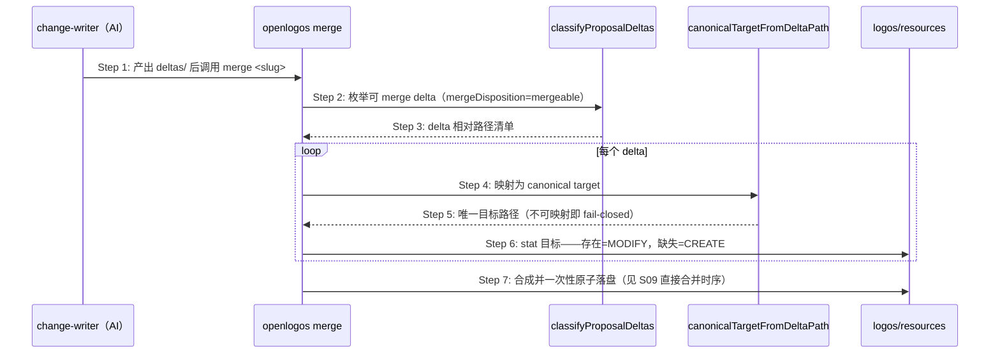
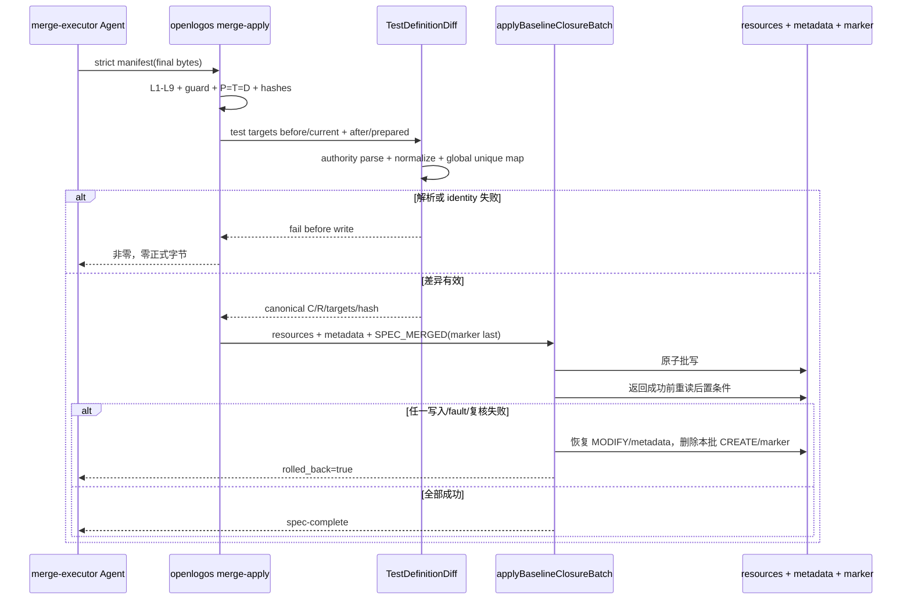
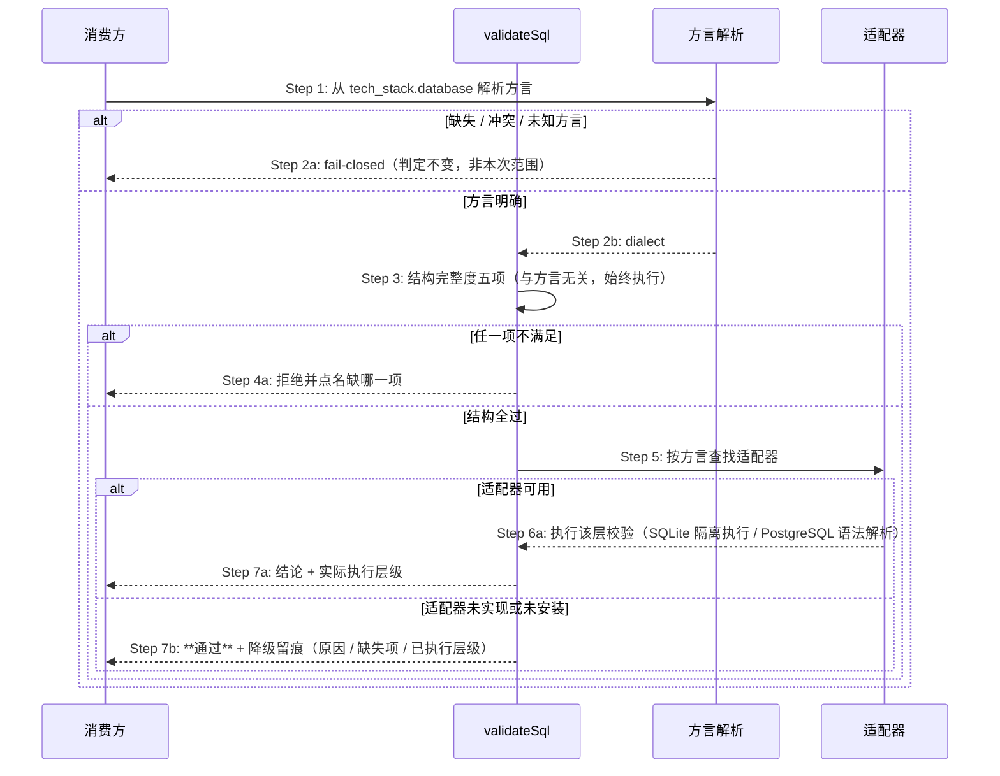
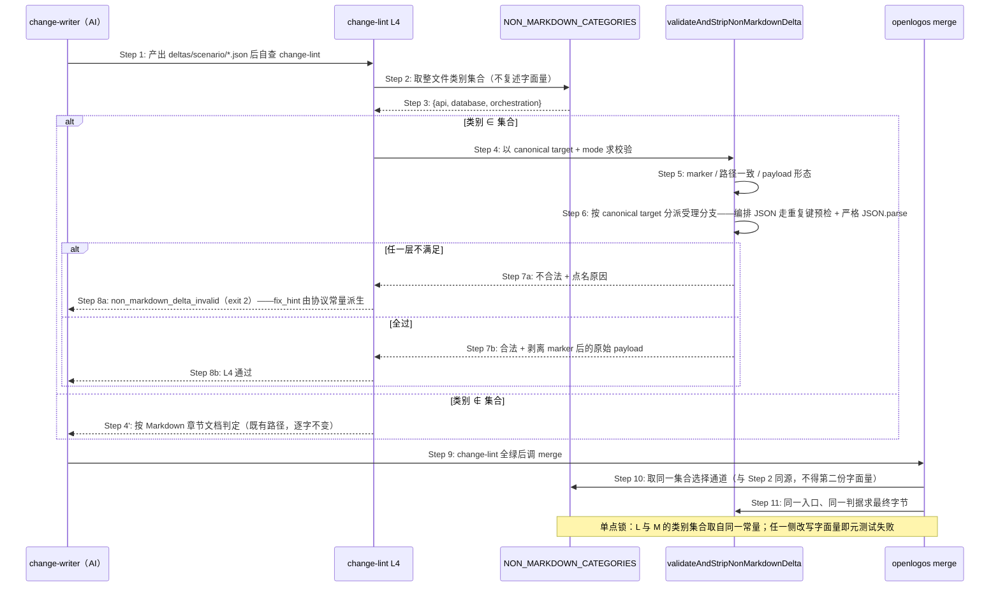

# S39：提案规划时按触达目标形成规格闭包

> **本场景已重新定界（lite-cut2b）**：原主体「按触达目标形成规格闭包」随 change-lint L9 删除；
> 现主体为「delta→canonical target 派生」。文档 H1 标题因 delta 机制无法修改文档级标题而暂留旧名，
> 待后续提案统一订正。

## 场景目标

把「合并要处理哪些目标」这一集合，从作者手工枚举的闭包计划，改为 `deltas/` 目录的无逻辑投影：产出了哪些 delta，就合并哪些目标。集合不需要声明，只需要枚举。

## 用户价值

作者不再需要预测「本次改动波及哪些规格」，也不再需要为每个触达场景补齐四维目标与证据化 disposition。规格是否波及完整，由 `openlogos verify` 的 ID 覆盖检查在验收时暴露——那是机器天然知道的事实，而非人的预测。

## 参与者

| 角色 | 职责 |
|---|---|
| change-writer（AI） | 按变更范围产出 `deltas/` 下的 delta 文件 |
| `classifyProposalDeltas` | 可 merge delta 的枚举判据（与 change-lint L6 同源） |
| `canonicalTargetFromDeltaPath` | delta 相对路径 → 唯一 canonical target 的映射判据 |
| `openlogos merge` | 目标集的唯一消费者，模式按磁盘事实即时判定 |

## 前置条件

`[delta]` 已产出；`logos/resources/` 工作区干净。**不需要**任何闭包声明。

## 成功后置条件

每个可 merge delta 恰好对应一个 canonical target；目标存在的按 MODIFY 合并、缺失的按 CREATE 落盘；`proposal.md` 的任何 YAML 声明均未被读取。

## 时序图

## 步骤说明

1. **change-writer** 按变更范围产出 delta，不写任何闭包声明。
2. **merge** 经共享分类器枚举可 merge delta——路径枚举、隐藏规则、symlink containment 只在 `delta-classify` 实现一次，change-lint L6 与 merge 同源。
3. 分类器返回 delta 相对路径清单；IO 错误 fail-fast，绝不把不可读产物投影成空清单。
4. 逐 delta 经 `canonicalTargetFromDeltaPath` 映射为唯一 canonical target。
5. 不可映射（绝对路径、`..`、symlink escape、未知类别目录）即在写入任何文件前整体失败并点名该文件。
6. 模式按磁盘事实即时判定：目标存在为 MODIFY、缺失为 CREATE。**计划与事实不再是两份数据**，因此不存在需要对账的不一致，也不存在「plan 后目标被外部创建」的模式漂移。
7. 合成与落盘见 S09「merge 直接合并时序」。

## 异常与边界

### EX-39.1：delta 路径不可映射为 canonical target
- **触发条件**：绝对路径、`..` 上跳、symlink 越界、未知类别目录。
- **期望响应**：在写入任何文件前整体失败并点名该 delta 文件；`logos/resources/` 零改动。判据与 change-lint L6 同源，不新增第二份。
- **副作用**：无。

### EX-39.2：两个 delta 映射到同一 canonical target
- **触发条件**：路径别名（`./`、分隔符差异）经规范化后指向同一目标。
- **期望响应**：拒绝并点名两个 delta 文件——顺序应用下后写会覆盖前写。
- **副作用**：无。

### EX-39.3：存量提案仍带 baseline_closure 块
- **触发条件**：历史提案的 `proposal.md` 含 `## 基线闭包计划` 与其 YAML。
- **期望响应**：忽略而非报错，不解析、不校验、不迁移；merge 照常按 `deltas/` 派生目标集。
- **副作用**：无。

## non-Markdown 整文件协议的适用类别与派生结论

**API / DB / 编排 canonical target 不是 Markdown 章节文档**：其 delta 首行为控制标记、正文即最终字节，由 `validateAndStripNonMarkdownDelta` 做标记校验与剥离后整文件落盘。该协议与闭包规划无关，逐行保留；其在 change-lint 中的挂载点由 L9 迁至 **L4（delta 段标记与脱模板）**。

**适用判据是 canonical target 的语义类别，不是文件后缀、也不是 `deltas/` 一级目录名**。判据取 `classifyCanonicalTargetCategory(targetPath)` 的结果，落在 `api` / `database` / `orchestration` 三者之一即走整文件通道，其余类别走 Markdown 章节合成。后缀不参与判定——`logos/resources/api/*.json` 与 `logos/resources/scenario/*.json` 同为 `.json` 却属不同类别、走不同的内容校验；一级目录名同样不参与——它只是路径映射的输入，映射结论才是判据。

**该类别集合恰有一处定义**：导出常量 `NON_MARKDOWN_CATEGORIES`（归属 `canonical-target.ts`，与 `classifyCanonicalTargetCategory` 同文件，因其值域即该函数的值域子集）。**merge 合成侧的通道选择与 change-lint 准入侧的 L4 判定均从该常量派生**，任一侧复述字面量即为违规。依据 S35「语法唯一、读法具名」不变量 3：只共享最后那次比较、各自决定进入比较的集合，等同于把分裂从判据挪到集合——类别白名单正是「进入比较的集合」。

**编排 JSON 的内容校验层级**（`orchestration` 类别，`logos/resources/scenario/**`）：

| 层 | 判据 | 强度 |
|---|---|---|
| marker | 首行 `## ADDED\|MODIFIED — <canonical target>（新文件，整文件\|整文件替换）`，op 与 mode 一致 | 拒绝 |
| 路径一致 | marker 声明 target 与 canonical target 逐字相等（不漂移） | 拒绝 |
| payload 形态 | 剥离 marker 后非空、无残留控制 marker、无模板/TODO 骨架 | 拒绝 |
| JSON 语法 | 严格 `JSON.parse`，根须为对象 | 拒绝 |
| 重复键 | YAML 1.2 duplicate-aware 预检（`JSON.parse` 接受重复 key，故须前置一道） | 拒绝并点名位置 |

**不套用 OpenAPI 3.x schema、也不套用受控根 JSON Schema**——编排文件不是 OpenAPI 文档，强加 schema 会把一次修复变成一次格式收紧。通过上述五层后返回的即是**剥离 marker 后的原始 payload 字节**，不做任何重排或重新序列化。

**类别集合与校验入口是两件必须同批的事**：`validateAndStripNonMarkdownDelta` 的入口分派按 canonical target 前缀受理，此前只认 `logos/resources/api/**` 的 YAML/YML/JSON、`logos/resources/database/**` 的 `.sql`、受控根 `spec/schema/*.json`，其余一律落拒绝分支。故只把 `orchestration` 加进类别集合而不打通入口受理范围，故障只会从合成阶段的「缺少物质控制段」平移为校验器的类别拒绝，仍然不可合并。**登记该入口的受理范围与 `NON_MARKDOWN_CATEGORIES` 同源**：类别集合里有的类别，入口必须有对应的受理分支与校验层级定义。

**新增 delta 类别时该集合须同批评估**：凡新增一个 canonical target 类别（或把既有类别下的目标改为非 Markdown 形态），必须同批判定它属于整文件通道还是章节合成通道，并同批补齐三处——`NON_MARKDOWN_CATEGORIES` 的成员、校验入口的受理分支、该类别的内容校验层级表。与 S35「新增 delta 类别时免计层级表须同批扩充」同构：**默认落入哪一侧都是错的**，未经评估的沉默默认会在下游以「没有任何合法 delta 形态」的形式爆发。

## 非目标与安全边界

- 不新增命令、不新增 lifecycle/gate/marker。
- 不引入任何形式的「确认」机制（无 `verified` / `confirmed_*` / JIT advisory）。
- 不放宽路径安全判据：越界、`..`、symlink escape 一律拒绝。
- 不承担「规格是否波及完整」的判定——那由 `openlogos verify` 的 ID 覆盖检查负责。

## 追溯

- 需求：merge 目标集由 delta 文件派生要求。
- 功能规格：§2.71。
- 测试：UT-S39-03～06、UT-S39-26～27、UT-S39-68～69、ST-S39-13、ST-S39-30。

## 测试变更集原子 Apply 扩展

### 场景目标

当 baseline closure 批次触及正式测试规格时，`merge-apply` 在自身掌握 before/final 字节的唯一安全时点计算语义 changed/removed ID，并与 resources、metadata、`SPEC_MERGED` 全有或全无提交。

### 参与者

- 用户授权的 merge-executor Agent
- `openlogos merge-apply`
- BaselineClosurePlan / strict apply manifest
- TestDefinitionDiff / TestChangeSetReader
- `applyBaselineClosureBatch()`
- 正式测试 resources、metadata 与提案 marker

### 前置条件

- plan/spec L1～L9 全过，P=T=D。
- `MERGE_APPLY_MANIFEST.json` 严格符合 `openlogos/baseline-merge-apply@1`，每个 prepared target 的 source/before/final hash 已校验。
- `SPEC_MERGED` 不存在，guard 与 slug/module 匹配。

### 成功后置条件

- 所有正式目标和 metadata 等于 prepared final bytes。
- `SPEC_MERGED.test_change_set` 符合 `openlogos/test-change-set@1`，C/R 与 before/final 结构化差异一致。
- marker 中 `manifest_sha256` 继续绑定严格 apply manifest；change-set target identity 与 category=test 的 canonical targets 一致。
- 重启后无需 Git 即可读得相同 C/R。

### 步骤说明

1. 根据 BaselineClosurePlan 确定 category=`test` 的 canonical targets；严格 manifest 本身不增加字段。
2. MODIFY 从当前正式目标读取 before；CREATE 使用空前态；after 使用已校验 `content_base64` 最终字节。
3. 在所有 targets 的 before/after 上建立全局唯一测试记录映射，计算新增、修改、未变与删除。
4. 生成严格字段、ASCII 排序、无时间戳、带 canonical payload hash 的 change set。
5. 构造包含 change set 的完整 `SPEC_MERGED` 字节，并作为批事务最后一个 prepared input。
6. 写入后重读 test targets 与 marker，复核 after hashes、payload hash、change/module、target identity 和 apply-manifest 绑定。
7. 只有后置条件全部成立才报告成功；否则使用事务备份回滚。

### 异常与边界

- 前/后任一侧重复 ID：首写前失败，不采用“最后一行获胜”。
- 非法 UTF-8、表格结构歧义、escaped pipe 解析失败：首写前失败。
- before_sha256 在 Agent 准备 manifest 后漂移：拒绝，不用新磁盘内容静默重算。
- 只触及非 test targets：仍写合法空 C/R 与空 targets，使“无测试变化”和“事实缺失”可区分。
- no-delta merge 不走本批 apply；reader 仅在 marker 类型正确且磁盘确无 mergeable delta 时可信派生空 C/R。
- 事后人为修改正式测试 target 导致 after hash 漂移：后续 reader fail-closed，不从 Delta 重建。
- 不依赖 Git repository、commit、parent、branch、squash 或 rebase 状态。

### 追溯

- 需求：S32/S39 测试变更 ID 语义差异与持久化要求。
- 功能规格：§2.37.1～§2.37.3。
- 架构：§27.3～§27.6。
- 规范：`spec/baseline-closure.md` §18、`spec/test-slice-manifest.md`。
- 测试：UT-S39-33～UT-S39-38、ST-S39-17～ST-S39-19。

## S39 SQL delta 的分层校验与适配器路由

### 场景目标

让 non-Markdown SQL delta 的校验按「结构层 + 方言层」分开：结构层始终执行且与方言无关；方言层按本机可用适配器路由，不可用时降级为跳过并留痕，绝不阻断交付。

### 参与者与前置条件

| 别名 | 组件 | 说明 |
|---|---|---|
| C | 消费方 | change-lint L9 / merge / baseline-apply 三处 |
| V | `validateSql` | SQL delta 校验的唯一判定 |
| R | 方言解析 | 从 `tech_stack.database` 解析方言，缺失/冲突/未知 fail-closed |
| A | 适配器 | SQLite：`sqlite3` 二进制；PostgreSQL：libpg_query WASM |

前置：delta 首行 marker 合法、payload 已剥离、canonical target 落在 `logos/resources/database/**` 且扩展名为 `.sql`。

### 主时序

### 步骤说明

- **Step 3 始终执行**：五项结构检查源码中不引用 `dialect`，本就与方言无关。此前实现亦如此——错误逐级前进正是证据。
- **Step 5 是查找，不是假定**：SQLite 分支此前已经先 `spawnSync` 再判断可用性；非 SQLite 分支此前直接假定不可用并 early return。本次把「先查找」统一到全部方言。
- **Step 7b 是通过而非失败**：适配器未实现（PostgreSQL 之外的方言）与未安装（`sqlite3` 缺失）都走这里。交付照常推进（架构 §四十二.1）。
- **Step 7a/7b 都携带层级**：结论必须自述实际执行到哪一层，消费方据此如实呈现（架构 §四十二.2）。

### 方言路由与强度

| 方言 | 适配器 | 执行层级 |
|---|---|---|
| SQLite | `sqlite3` 二进制 | 隔离执行：`BEGIN` → payload → 表/索引计数 → `ROLLBACK` |
| PostgreSQL | libpg_query WASM | 语法解析（AST），不执行、不连库 |
| MySQL | 无 | 仅结构 + 留痕 |
| 上述任一但适配器不可用 | — | 仅结构 + 留痕 |

**PostgreSQL 得到的是语法级而非执行级**——它不会发现「引用了不存在的表」这类只有执行才能发现的问题。此不对称由 Step 7a 的层级自述如实反映。

### 跨方言冒充禁止

- PostgreSQL / MySQL payload **绝不**进入 sqlite 执行路径；
- 降级是**不执行方言层**，而非改用别的方言执行；
- 不存在「用 SQLite 兜底」这一路径。

既有 `UT-S39-27`（用例名「不冒充通过」）锁的正是此意图，但实现方式是「必须硬失败」。本场景将其改写为正向断言：断言 PG/MySQL payload 未被送入 sqlite 校验器，而非断言它必然失败。

### 不变量

1. **结构层无条件**：五项检查在全部方言、全部适配器可用性下一致生效。
2. **能力缺失只降级**：适配器不可用只能降低层级，不得改变通过与否（架构 §四十二.1）。
3. **层级如实自述**：结论必须携带实际执行层级；不得以结构检查冒充方言校验（架构 §四十二.2）。
4. **不跨方言冒充**：任何 payload 不得送入其它方言的校验器。
5. **三消费方同源**：change-lint、merge、baseline-apply 对同一 payload 与方言得到同一层级结论与同一留痕。

### 异常与边界

- 方言缺失、冲突或未知：维持既有 fail-closed，本次不改——那是提案缺陷而非能力缺失。
- 适配器可用但校验失败（如 PG 语法错误）：正当拒绝，点名错误位置。
- 适配器加载本身抛错：按「未安装」处理，降级并把错误信息计入留痕的缺失项。

### 追溯

- 需求：AC-SQLGATE-01～07。
- 功能规格：§2.52.2～§2.52.6；架构：§四十二.1、§四十二.2。
- 测试：UT-S39-59～UT-S39-64、ST-S39-28；安装态 SMOKE-core-174。

## S39 编排 JSON 的整文件协议适用与校验入口

### 场景目标

让 `logos/resources/scenario/*.json` 这类**编排测试 canonical target** 具备至少一条合法的 delta 形态：纳入既有 non-Markdown 整文件通道，并把决定「谁走该通道」的类别集合收敛为单一具名常量，使 merge 合成侧与 change-lint 准入侧在类别维度上同源。

### 用户价值

下游项目的 `deltas/scenario/*.json` 此前**两条路全堵**——写裸 JSON 报「Markdown Delta 缺少物质控制段」，补整文件 marker 则因 JSON 基线无章节可锚而报「MODIFIED 章节不存在或不唯一」；CREATE 亦因块数为零失败。作者与 AI agent 没有任何可写的正确形态，全自动 run 在 spec-exit 之后硬停于 merge（toolstop 项目 `tools.top`，run `drv-muaq05dn-4qs0`，2026-09-21）。本场景把该类别的可合并性补齐，并让缺口在**准入阶段**可见而非推迟到合成阶段。

### 参与者与前置条件

| 别名 | 组件 | 说明 |
|---|---|---|
| N | `NON_MARKDOWN_CATEGORIES` | 整文件类别集合的**唯一定义点**（`api` / `database` / `orchestration`） |
| K | `classifyCanonicalTargetCategory` | canonical target → 语义类别，判据入口（既有，不改） |
| M | `merge` 合成侧 | 按 N 选择整文件通道或 Markdown 章节合成 |
| L | `change-lint` L4 | 按 N 决定哪些 delta 进入 non-Markdown 形态判定 |
| V | `validateAndStripNonMarkdownDelta` | 整文件 delta 的唯一校验入口，按 canonical target 分派受理分支 |

前置：delta 落在 `deltas/scenario/**` 且经 `canonicalTargetFromDeltaPath` 映射成功（该映射既有且已通，本场景不改）。

### 类别集合单点与入口受理时序

### 步骤说明

1. change-writer 按目标主文档形态产出 delta：编排 JSON 写首行控制 marker + 正文即最终字节。
2-3. L4 从 `NON_MARKDOWN_CATEGORIES` 取集合，**不得**在本文件内重写 `category === 'api' || category === 'database'` 这类字面量——事故现场正是该字面量导致 L4 只扫 5 个 `.md`、而 L6 同时数出 8 个 mergeable，差的 3 个（两份 `api/*.yaml` 与一份 `scenario/*.json`）全部漏检，lint 报 `PASS（10/10）`后故障推迟到合成阶段。
4-6. 校验入口按 canonical target 分派受理分支：`logos/resources/api/**` 走 OpenAPI 3.x schema、`logos/resources/database/**` 走 SQL 分层校验（见本文档「S39 SQL delta 的分层校验与适配器路由」）、受控根 `spec/schema/*.json` 走根 Schema 校验、`logos/resources/scenario/**` 走**重复键预检 + 严格 `JSON.parse`**。既有三条分支的判据、强度与留痕逐字不变。
7a-8a. 不合法即 `non_markdown_delta_invalid` 进 violations、exit 2；`fix_hint` 文案由协议常量派生，与实际 marker 形态逐字一致（见 S35「non-Markdown 类别集合单点与 fix_hint 协议派生」）。
7b-8b. 合法则返回剥离 marker 后的**原始 payload 字节**——不重排、不重新序列化，落盘字节等于 delta 正文。
9-11. merge 取同一常量选择通道、经同一入口求最终字节；两侧结论在类别维度上不可能分叉。

### 不变量

1. **类别集合唯一**：`NON_MARKDOWN_CATEGORIES` 恰一处定义；merge 与 change-lint 均从其派生，任一侧出现等价字面量即违规。
2. **判据取语义类别**：通道选择只看 `classifyCanonicalTargetCategory` 的结论，不看后缀、不看 `deltas/` 一级目录名。
3. **集合与入口同批**：集合内的每个类别在校验入口都有对应受理分支与已定义的校验层级；集合扩容而入口未扩容，等同于未修复。
4. **编排 JSON 不套 schema**：只做 marker + 路径一致 + payload 形态 + JSON 语法 + 重复键五层；通过即返回原始 payload。
5. **既有类别零回归**：`api` / `database` / 受控根 `spec/schema` 三条分支的判定、强度与降级留痕逐字不变；Markdown 类别仍走章节合成通道。
6. **准入先于合成**：凡 merge 合成侧会拒绝的编排 delta 形态，change-lint 必先报——不允许出现「lint 全绿而 merge 必炸」的组合（S35 不变量 5 在本类别上的落点）。

### 异常与边界

- **编排 JSON 写成裸 JSON（无 marker）**：L4 判 `non_markdown_delta_invalid` 并点名首行不合法；**不得**推迟到合成阶段才报——这正是本次事故形态的反例锚。
- **marker 声明 target 与实际 delta 路径漂移**：拒绝并点名两者，不按实际路径静默纠正。
- **JSON 语法错误或重复键**：拒绝并点名位置；重复键必须由 duplicate-aware 预检拦下，不得依赖 `JSON.parse`（其接受重复 key，last-wins）。
- **编排 JSON 内容合法但不是 OpenAPI 文档**：通过——本类别不套用 OpenAPI schema，此为正当形态而非漏网。
- **根不是对象的 JSON（数组 / 标量）**：拒绝，与既有 non-Markdown 判据同口径。
- **CREATE 模式（目标尚不存在）**：走 `## ADDED — <路径>（新文件，整文件）`，落盘后登记 `resource_index`；模式仍按磁盘事实即时判定，不读任何 YAML 声明。
- **本仓自身 `logos/resources/scenario/` 为空**：本场景修复的是**下游项目**该目录的可合并性；openlogos 自身不消费该通道，故端到端验证须在一次性隔离夹具项目内进行。

### 追溯

- 来源变更：fix-orchestration-merge-and-predicate-duplication（toolstop 项目 `tools.top` 全自动 run `drv-muaq05dn-4qs0` 的 `MERGE_DELTA_INVALID` 终局 blocked，2026-09-21）。
- 场景关联：本文档「non-Markdown 整文件协议的适用类别与派生结论」；S35「non-Markdown 类别集合单点与 fix_hint 协议派生」（准入侧同源）；S09「merge 直接合并时序」（合成与落盘）。
- 测试：UT-S39-70～UT-S39-75、ST-S39-31。
