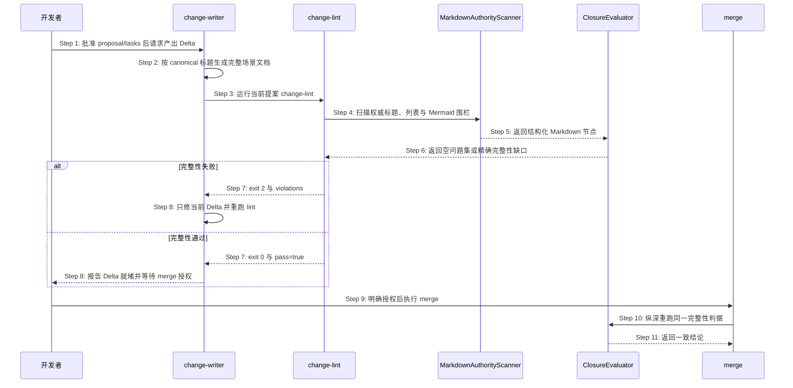

# S39：提案规划时按触达目标形成规格闭包

> Feature：F04 变更提案与切片生命周期  
> 来源：需求文档 S39、功能规格 §2.35、`spec/baseline-closure.md`、提案 `fix-scenario-create-completeness-contract`

## 场景目标

当 launched change 触达某个场景时，change-writer 形成一目标一 Delta 的规格闭包；对缺失的场景目标生成结构完整、可被 change-lint 与 merge 同源验收的文档。语义完整的历史步骤标题能够兼容读取，依赖散文关键词的残缺文档不能误通过。

## 用户价值

用户可以在 plan-exit 批准后一次完成合法 Delta，不会因为 `主流程` 等兼容标题遭到假阴性阻断，也不会让没有真实步骤、时序、异常或追溯内容的骨架进入合并阶段。

## 参与者

- **开发者**：提出变更、确认方案，并在独立人类确认点授权 merge。
- **change-writer**：按已批准闭包计划生成唯一 Delta，并消费 lint 诊断修复。
- **MarkdownAuthorityScanner**：提取围栏与注释之外的权威 Markdown 结构。
- **ClosureEvaluator**：依据共享合同判断 CREATE 最低完整性。
- **change-lint**：在 producer 完成点只读运行结构门。
- **merge**：在生成 apply 指令前纵深重跑相同判据。

## 前置条件

- launched 项目存在活跃 change、有效 guard、已完成澄清的 proposal/tasks 和已消费的 `PLAN_APPROVED`。
- proposal 的 `baseline_closure` 将 S39 scenario 目标声明为 `CREATE`，目标文件在主资源视图中确实不存在。
- API、数据库和 API 编排已依据纯本地 CLI 边界证据标为 SKIP；部署/smoke 已由 C01 用户决定纳入。

## 成功后置条件

- 唯一场景 Delta 通过 change-lint，且其 canonical target 与 proposal/tasks 完全一致。
- 后续获得 merge 授权时，merge 对同一字节得出相同完整性结论；成功 apply 后目标文档不包含 Delta marker。
- 任何无效结构均在写资源前失败，不改变 guard、counter、resource index 或 lifecycle marker。

## 时序图

## 步骤说明

1. **开发者**明确批准完整 proposal/tasks，plan-exit 写入 `PLAN_APPROVED`，流程进入 `write-delta`。
2. **change-writer**依据 effective view 生成场景 CREATE Delta；新写入只使用 `## 步骤说明`，并补齐目标、参与者、前后置、时序、异常/边界和追溯。
3. **change-writer**在项目根运行 `openlogos change-lint --slug fix-scenario-create-completeness-contract --format json`，不得以文件存在或自然语言 done 代替机器门。
4. **change-lint**把目标字节交给 **MarkdownAuthorityScanner**；scanner 排除 fenced code 与 HTML 注释后提取标题、章节范围、有序列表和 Mermaid fence。
5. **MarkdownAuthorityScanner**把结构化节点交给 **ClosureEvaluator**，不自行推断业务适用性。
6. **ClosureEvaluator**验证唯一步骤章节、至少 3 个非空有序列表项、有效 sequenceDiagram、至少 2 个参与者和 1 条消息，以及非空异常/边界与追溯。
7. 若存在缺口，**change-lint** 返回 exit 2 和精确 violation；若完整则返回 exit 0 与 `pass=true`。失败路径见 EX-7.1～EX-7.4。
8. **change-writer**对失败只修当前提案内被指向的 Delta 并重跑；全部通过后向开发者报告 Delta 就绪，等待独立 merge 授权。
9. **开发者**在审阅 Delta 后另行明确授权 `openlogos merge`；当前 plan 批准不自动授予 merge。
10. **merge**在生成 `MERGE_PROMPT.md` 或写资源前调用同一个 **ClosureEvaluator**，不复制正则。
11. **ClosureEvaluator**返回与 change-lint 一致的结论；失败时 merge 原子停止，成功时才允许进入 merge-executor apply。

## 异常与边界

### EX-7.1：兼容标题合法但旧正则无法命中

- **触发条件**：步骤章节标题是 `主流程`、`主路径步骤`、`主路径` 或 `正常流程`，且正文含至少 3 个非空有序列表项。
- **期望响应**：按受控别名解析为唯一步骤章节并通过该维度，不要求改写历史标题。
- **副作用**：无；兼容读取不改变目标字节。

### EX-7.2：散文或样例伪造步骤证据

- **触发条件**：没有步骤章节，只在普通散文、fenced code、HTML 注释或样例中出现“步骤”或兼容标题。
- **期望响应**：返回 `create_target_incomplete`，指出步骤章节缺失。
- **副作用**：lint 只读；merge 不生成 `MERGE_PROMPT.md`、不写资源或 marker。

### EX-7.3：章节存在但内容不完整

- **触发条件**：步骤章节重复、少于 3 个有效有序项、存在空列表项，或异常/边界、追溯章节只有标题。
- **期望响应**：一次返回稳定排序的精确缺口与修复提示。
- **副作用**：保留当前 Delta 供同一 producer 幂等修复。

### EX-7.4：伪 Mermaid 或残缺时序

- **触发条件**：`sequenceDiagram` 仅在普通 fence/散文中，或 Mermaid fence 少于 2 个参与者、没有消息箭头。
- **期望响应**：完整性失败，不退回关键词正则，也不把 Mermaid 样例当权威时序。
- **副作用**：无项目状态写入。

### EX-10.1：lint 后结构漂移

- **触发条件**：lint 通过后 Delta 被外部修改，导致 merge 纵深检查失败。
- **期望响应**：merge fail-closed，输出同源 violation；要求修复并重新 lint/审阅。
- **副作用**：guard、counter、resource index、资源文件和 `SPEC_MERGED` 全部保持原值。

## API 与数据库派生结论

- 本场景所有交互均为本地进程内函数调用和文件读取，不出现 HTTP、RPC 或消息边界，因此 API 与 API 编排为 SKIP。
- 本场景不读写数据库或业务持久化实体，因此 DB 为 SKIP；文件系统 lifecycle 写入沿用既有 change/merge 事务规格。

## 非目标与安全边界

- 不在本场景实现 RunLogos 的普通 write-delta lint barrier 或 UI 诊断。
- 不放宽 merge fail-closed，不吞掉非零退出，不允许手工伪造 `MERGE_PROMPT.md`/`SPEC_MERGED`。
- 不授权 npm 公开发布、Git tag、GitHub Release、官网发布或 git push。

## 追溯

- 需求：S39 验收条件 8～12。
- 功能规格：F04 / §2.35.9 场景 CREATE 结构化完整性合同。
- 架构：场景 CREATE 的结构化 Markdown 完整性架构（S39）。
- 方法论规格：`spec/baseline-closure.md`、`spec/change-management.md`。
- 测试：UT-S39-28～UT-S39-32、ST-S39-14～ST-S39-16、SMOKE-core-67～SMOKE-core-69。
- 来源问题：`logos/resources/reference/bug-report-scenario-create-completeness-contract-mismatch.md`。
