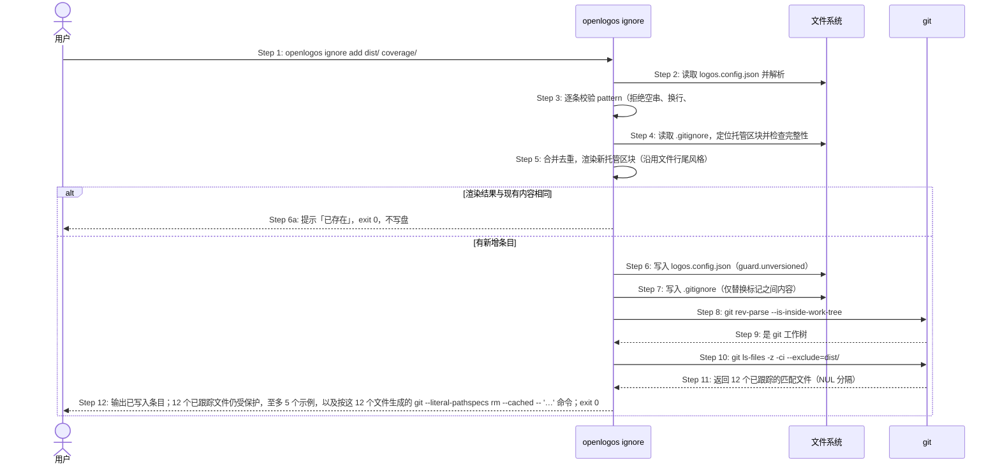
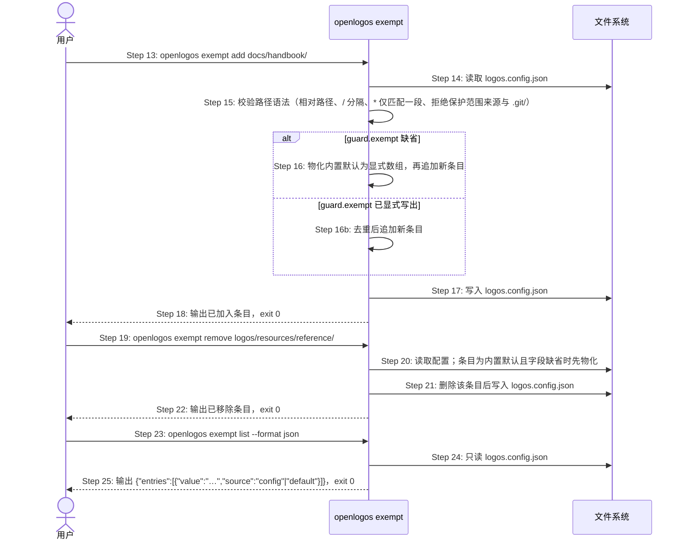
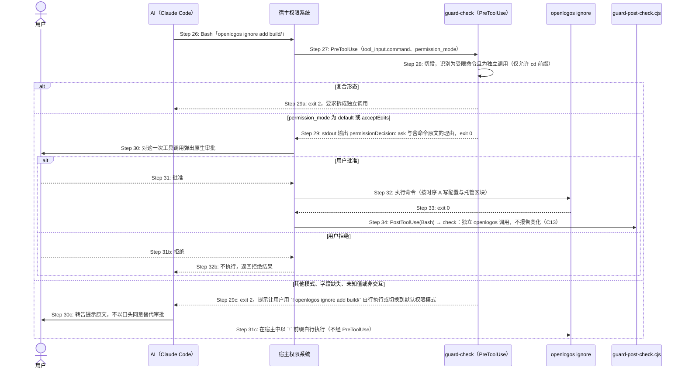
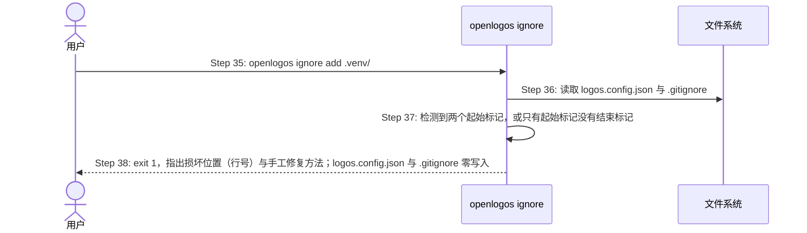

# S40：ignore / exempt 子命令与 .gitignore 托管区块

> 模块：core｜来源：需求「版本管理范围配置」、提案 `guard-versioned-content-scope`（决策 C02、C03、C14，以及 C13 的 CLI 自身写入豁免）

## 场景目标

用户（或经用户在宿主界面批准的 AI）通过 `openlogos ignore add|remove|list` 与 `openlogos exempt add|remove|list` 维护 `logos/logos.config.json` 中的两张清单：`guard.unversioned`（不入库，渲染进 `.gitignore` 托管区块）与 `guard.exempt`（入库，但写入不需立案）。`ignore` 只改写 `.gitignore` 中 `# >>> openlogos managed >>>` 与 `# <<< openlogos managed <<<` 之间的内容，区块外逐字节不变；目标下已有被 git 跟踪的文件时，按实际匹配到的文件生成可直接执行的 `git rm --cached` 命令作为提示，但不代为移出版本控制。AI 发起的 `add` / `remove` 属于保护范围变更，必须经宿主对这一次实际工具调用的原生审批：Claude Code 在 `permission_mode` 为 `default` / `acceptEdits` 时由 PreToolUse 返回 `permissionDecision: ask`，用户批准即执行；宿主不会弹出审批的模式一律阻断，并提示用户在终端用 `! <命令原文>` 自行执行。

## 用户价值

- 用户不再需要为依赖安装、构建产物、日志、缓存等不入库内容立案，也能把 reference 一类「入库但不需立案」的目录告诉 guard，且两类语义互不混淆（C02）。
- 配置入口是所有宿主共用的 CLI 子命令（C03），配置的单一事实源是 `logos.config.json`，`.gitignore` 托管区块由它渲染，用户手写的 `.gitignore` 内容不会被改动。
- 用户只需在宿主弹出的审批界面批准一次，由 AI 代为执行命令；确认来自宿主界面而非 AI 自述或本地文件，AI 无法在用户不知情时先扩大豁免再写代码（C14）。
- 忽略已入库目录时，用户拿到的是按实际文件生成、可直接粘贴执行的命令，执行结果恰好移出被匹配的文件。

## 参与者

| 角色 | 职责 |
|---|---|
| 用户 | 直接在终端执行子命令（含 Claude Code 中以 `!` 前缀自行执行）；或在 AI 发起时，于宿主审批界面批准或拒绝这一次工具调用 |
| AI（Claude Code / Cursor 等宿主内的 agent） | 按用户意图拼出完整命令并以独立调用形态执行；被阻断时把 `! <命令原文>` 转告用户，不以对话中的口头同意替代审批 |
| 宿主权限系统（Claude Code / Cursor） | 收到 `ask` 后对这一次实际工具调用弹出原生审批；按用户选择执行或不执行 |
| guard（`guard-check`，PreToolUse；Cursor 为 `beforeShellExecution`） | 识别受限命令与复合形态；按 hook 输入的 `permission_mode` 返回 `permissionDecision: ask` 或 exit 2 阻断 |
| guard-post-check（`guard-post-check.cjs check`） | 在 Bash 的 PostToolUse 中按 C13 把独立 openlogos 调用视为不报告变化，只更新未关闭执行记录的基线 |
| openlogos CLI（`ignore` / `exempt` 子命令） | 校验参数、读写 `logos.config.json`、渲染托管区块、列举已跟踪的匹配文件并生成移出命令 |
| 文件系统 | `logos/logos.config.json`、项目根 `.gitignore`、`logos/.openlogos-runtime/untrack-<时间戳>.lst`（匹配文件超过 20 个时） |
| git | 判断项目根是否位于 git 工作树内；`git ls-files -z -ci --exclude=<pattern>` 按 gitignore 语义列举被该模式命中的已跟踪文件 |

## 前置条件

- 当前目录是项目根（`logos/logos.config.json` 所在目录），且该文件是合法 JSON。
- 用户在终端直接执行子命令（含 Claude Code 的 `!` 前缀）时，命令不经过 PreToolUse，不需要审批。
- AI 经宿主执行 `add` / `remove` 时，宿主已按 S08 部署 guard（PreToolUse / `beforeShellExecution`）与 `guard-post-check.cjs`（PostToolUse matcher 覆盖 Bash）。
- `list` 为只读命令，在任何状态下都可执行，不受审批约束。

## 成功后置条件

- `ignore add|remove`：`logos.config.json` 的 `guard.unversioned` 与 `.gitignore` 托管区块同时反映新清单；托管区块固定含 `logos/.openlogos-runtime/` 一行，其后按配置顺序逐行列出 `guard.unversioned` 条目；区块外内容逐字节不变；任一侧写入失败时两侧都回到命令执行前的字节。
- `exempt add|remove`：`logos.config.json` 的 `guard.exempt` 为显式数组并反映新清单；首次修改时内置默认（`logos/resources/reference/`、`logos/resources/verify/baseline-seed-runs/*/staging/`）先物化为显式数组，未被删除的默认项保留。
- 参数非法、配置不可解析或托管区块损坏时，退出码为 1，且 `logos.config.json`、`.gitignore` 均零写入。
- 重复执行相同命令不产生任何写盘（幂等）。
- 经 AI 执行的受限命令：只有在宿主对该次调用弹出审批且用户批准后才执行；guard 不读写任何本地授权文件，每一次调用都单独审批。
- 提示的 `git rm --cached` 命令按实际匹配文件生成，执行后恰好移出这些文件，其他已跟踪文件不变；CLI 不代为执行。

## 时序图

### 时序 A：用户执行 ignore add（正常路径，含已跟踪文件提示）

### 时序 B：exempt add / remove / list

### 时序 C：AI 发起受限命令 → 宿主原生审批 / 阻断

### 时序 D：托管区块损坏 fail loud

## 步骤说明

1. **[A] 用户**执行 `openlogos ignore add <pattern...>`；可一次给出多个条目。
2. **[A] CLI** 读取并解析 `logos/logos.config.json`；不可解析即 exit 1，零写入。
3. **[A] CLI** 逐条校验 `unversioned` 语法：单行 gitignore 模式，拒绝空串、含换行、以 `#` 或 `!` 开头、含 `..` 段；任一条非法则整条命令 exit 1，零写入，不做部分写入。
4. **[A] CLI** 读取 `.gitignore`（不存在视为空），定位托管区块；完整性检查在任何写盘之前完成（损坏处理见步骤 37–38）。
5. **[A] CLI** 把新条目按输入顺序追加到 `guard.unversioned` 并去重（保持插入顺序），渲染托管区块：起始标记、说明行、固定的 `logos/.openlogos-runtime/`、各配置条目、结束标记；行尾风格沿用文件首个换行（CRLF 则全区块用 CRLF）。
6. **[A] CLI** 渲染结果与现有内容逐字节相同（全部条目已存在）时提示「已存在」并 exit 0，不写盘；否则先以临时文件 + 原子重命名写入 `logos.config.json`。
7. **[A] CLI** 写入 `.gitignore`：已有区块则只替换两个标记之间的内容；无区块则在文件末尾追加（前面补一个空行）；文件不存在则新建仅含区块的文件。此步失败时把 `logos.config.json` 恢复为命令执行前的字节后 exit 1。
8. **[A] CLI** 判断项目根是否在 git 工作树内；不在则跳过已跟踪统计，输出「当前目录不在 git 仓库中，guard 新判据不生效」，exit 0。
9. **[A] git** 确认是工作树。
10. **[A] CLI** 对每个新增条目执行 `git ls-files -z -ci --exclude=<pattern>`，以 gitignore 语义（与该条目写进 `.gitignore` 后的匹配结果一致，含 `/build/` 根锚定、`*.pyc` 任意层级）列举已跟踪且被该模式命中的文件；模式本身不再进入任何 pathspec。该调用失败时只输出警告并跳过统计，不影响已完成的写入与退出码。
11. **[A] git** 返回 NUL 分隔的已跟踪匹配文件清单，CLI 按 NUL 切分，文件名中的空格、`*`、引号等字符原样保留。
12. **[A] CLI** 匹配数 > 0 时输出数量、至多 5 个示例，说明这些文件在移出版本控制前继续受保护，并按实际文件生成移出命令：不超过 20 个时为 `git --literal-pathspecs rm --cached -- '<路径1>' '<路径2>' …`，每个路径按 POSIX 单引号规则转义（路径中的 `'` 写作 `'\''`）；超过 20 个时把 NUL 分隔的清单写入 `logos/.openlogos-runtime/untrack-<时间戳>.lst`，提示 `git --literal-pathspecs rm --cached --pathspec-file-nul --pathspec-from-file=logos/.openlogos-runtime/untrack-<时间戳>.lst`。CLI 不代为执行该命令。exit 0。
13. **[B] 用户**执行 `openlogos exempt add <path...>`。
14. **[B] CLI** 读取并解析配置。
15. **[B] CLI** 校验 `exempt` 语法：项目根相对路径，`/` 分隔；以 `/` 结尾表示目录及其后代（完整段匹配），否则为单个文件；`*` 只匹配一个路径段且该段须满足 `^[A-Za-z0-9][A-Za-z0-9._-]*$`；拒绝绝对路径、含 `..` / `.` / 空段、含 `\`、空串、`/`、单独 `*`、以 `logos/.openlogos-runtime/` 开头；另拒绝忽略规则来源（任意层级的 `.gitignore`，如 `.gitignore`、`src/.gitignore`，以及 `.git/info/exclude`）与 `.git/` 下任何路径（含 `.git/` 本身）。拒绝范围之外的父目录可以加入 exempt，但 guard 判定时 guard 自有状态、保护范围来源（任意层级 `.gitignore`、`info/exclude`、项目内 `core.excludesFile`、`logos/logos.config.json`）与 git 元数据先于硬编码白名单与 exempt 判定：即使 exempt 了 `docs/` 或 `logos/`，`docs/.gitignore`、`logos/logos.config.json` 仍受保护（见功能规格「保护范围变更的人类确认与忽略规则来源受保护」）。
16. **[B] CLI** `guard.exempt` 缺省时先把内置默认物化为显式数组再追加，保证默认项不被新数组覆盖丢失；已显式写出时直接去重追加。条目已存在（含字段缺省时与内置默认相同）则提示「已存在」，exit 0，不写盘。
17. **[B] CLI** 原子写入 `logos.config.json`；`exempt` 不涉及 `.gitignore`。
18. **[B] CLI** 输出已加入条目，exit 0。
19. **[B] 用户**执行 `openlogos exempt remove <path...>`。
20. **[B] CLI** 读取配置；目标是内置默认且字段缺省时，先物化内置默认为显式数组；条目不存在则提示「不存在」，exit 0，不写盘。
21. **[B] CLI** 删除条目后原子写入；删除全部条目后写出空数组 `[]`，表示用户明确不要任何豁免（不回落到内置默认）。
22. **[B] CLI** 输出已移除条目，exit 0。
23. **[B] 用户**执行 `openlogos exempt list [--format json]`（`ignore list` 同理）。
24. **[B] CLI** 只读配置，不写盘、不调用 git。
25. **[B] CLI** 文本模式逐行输出条目与来源；JSON 模式输出 `{"entries":[{"value":"dist/","source":"config"}]}`，`exempt` 字段缺省时内置默认项 `source` 为 `default`；`ignore list` 只列 `guard.unversioned` 条目（`source` 均为 `config`）。
26. **[C] AI** 经 Bash 发起受限命令（`openlogos exempt add|remove`、`openlogos ignore add|remove`）；无论是否存在活跃提案都受此约束。
27. **[C] 宿主**以真实工具调用触发 PreToolUse，hook 输入含 `tool_input.command` 与 `permission_mode`。
28. **[C] guard-check** 按 C10 / C13 的切段规则判断：命令是受限命令，且除 `cd` 段外只有这一条 openlogos 调用时为独立调用；任一处出现引号外的 `|`、`>`、`<`、`$(`、反引号、括号、单独 `&`、`<<`，或与其他命令组合，即为复合形态。
29. **[C] guard-check** 复合形态一律 exit 2，要求拆成独立调用（步骤 29a）。独立调用且 `permission_mode` 为 `default` 或 `acceptEdits` 时，stdout 输出 `{"hookSpecificOutput":{"hookEventName":"PreToolUse","permissionDecision":"ask","permissionDecisionReason":"该命令会改变 guard 的保护范围（<命令原文>），需要您确认后执行"}}` 并 exit 0。`permission_mode` 为 `bypassPermissions`、`dontAsk`、`auto`、`plan`，字段缺失、未知值或非交互运行时，exit 2，reason 为「当前权限模式（<mode>）下宿主不会弹出确认，无法证明由用户批准。请让用户在终端用 `! <命令原文>` 自行执行，或切换到默认权限模式后重试；不要用对话中的口头同意替代。」（步骤 29c）。依据官方 hooks 文档：`ask` 在 `bypassPermissions` / `dontAsk` 下静默放行、在非交互模式下按 `defer` 处理，实施时以真实宿主再核实。
30. **[C] 宿主**收到 `ask` 后，对这一次实际工具调用弹出原生审批，展示命令与理由（步骤 30）；阻断分支中 AI 把提示原文转告用户（步骤 30c）。
31. **[C] 用户**批准（步骤 31）或拒绝（步骤 31b）；阻断分支中用户可在宿主中以 `!` 前缀自行执行同一命令，该命令不经 PreToolUse（步骤 31c）。
32. **[C] 宿主**用户批准时执行命令，CLI 按时序 A 或 B 运行（步骤 32）；用户拒绝时不执行并把拒绝结果返回 AI（步骤 32b）。下一次同样的调用仍会重新触发审批，guard 不记忆任何批准结果。
33. **[C] CLI** 返回退出码。
34. **[C] guard-post-check** `check` 识别为独立 openlogos 调用，不报告变化；存在未关闭执行记录时只把本次改动路径的基线更新为调用后内容（C13）。
35. **[D] 用户**执行 `ignore add` 或 `ignore remove`。
36. **[D] CLI** 读取配置与 `.gitignore`。
37. **[D] CLI** 发现多个起始标记、只有起始没有结束标记、或结束标记出现在起始标记之前。
38. **[D] CLI** exit 1，输出损坏标记所在行号，提示用户手工修复后重试；`logos.config.json` 与 `.gitignore` 零写入。

## 异常与边界

### EX-40.1：非法路径或模式

- **触发条件**：`exempt` 给出绝对路径、含 `..` / `.` / 空段、含 `\`、空串、`/`、单独 `*`、`*` 段含非法字符、以 `logos/.openlogos-runtime/` 开头、指向任意层级 `.gitignore` 或 `.git/info/exclude`、位于 `.git/` 下；`ignore` 给出空串、含换行、以 `#` 或 `!` 开头、含 `..` 段。
- **期望响应**：exit 1，逐条点名非法条目及原因；同一命令中合法条目也不写入。拒绝范围之外的父目录（如 `docs/`、`logos/`）可以加入 exempt，但其中的保护范围来源与 `logos/logos.config.json` 仍受保护，判定先于 exempt。
- **副作用**：`logos.config.json`、`.gitignore` 零写入。

### EX-40.2：重复条目与不存在条目

- **触发条件**：`add` 已在清单中的条目（含同一命令内重复给出）；`remove` 不在清单中的条目。
- **期望响应**：分别提示「已存在」「不存在」，exit 0；同一命令内的其他有效条目照常处理。
- **副作用**：全部条目都无变化时不写盘，文件 mtime 不变。

### EX-40.3：删除内置默认 exempt 项

- **触发条件**：`guard.exempt` 缺省时执行 `exempt remove logos/resources/reference/`。
- **期望响应**：先物化内置默认为显式数组，再删除该项，结果为仅含 `logos/resources/verify/baseline-seed-runs/*/staging/` 的显式数组；之后 guard 以显式数组为准，不再合并内置默认。
- **副作用**：只写 `logos.config.json`。

### EX-40.4：固定运行时条目

- **触发条件**：`ignore add logos/.openlogos-runtime/` 或 `ignore remove logos/.openlogos-runtime/`。
- **期望响应**：`add` 提示该条目已由 openlogos 固定写入托管区块，exit 0，不写盘；`remove` 提示该条目为固定条目、不可移除，按参数非法 exit 1。
- **副作用**：零写入。

### EX-40.5：非 git 仓库

- **触发条件**：项目根不在 git 工作树内，或 git 不可用。
- **期望响应**：子命令照常读写配置与托管区块；`ignore add` 跳过已跟踪统计，提示「当前目录不在 git 仓库中，guard 新判据不生效」；exit 0。
- **副作用**：与 git 仓库内相同的配置与区块写入。

### EX-40.6：CRLF 与区块外逐字节不变

- **触发条件**：`.gitignore` 首个换行为 CRLF；或区块外含用户注释、空行、无结尾换行、非 ASCII 内容。
- **期望响应**：托管区块按 CRLF 渲染；区块外每个字节（含末尾是否有换行）与执行前一致；无区块追加时只在原内容后补一个空行再追加区块。
- **副作用**：仅区块内部字节变化。

### EX-40.7：托管区块损坏

- **触发条件**：出现多个起始标记、只有起始没有结束标记、结束标记先于起始标记。
- **期望响应**：fail loud，exit 1，指出行号与修复方法；不尝试自动修复或猜测区块范围。
- **副作用**：零写入（区块检查在写配置之前）。

### EX-40.8：配置写入与区块写入的原子性

- **触发条件**：`logos.config.json` 已写入后，`.gitignore` 写入失败（权限、磁盘满、目标为目录）。
- **期望响应**：把 `logos.config.json` 恢复为命令执行前的字节，exit 1，提示失败原因。
- **副作用**：两个文件都与命令执行前逐字节一致；不留临时文件。

### EX-40.9：配置不可解析

- **触发条件**：`logos.config.json` 不是合法 JSON，或 `guard.unversioned` / `guard.exempt` 不是字符串数组。
- **期望响应**：exit 1，提示配置位置与错误；`list` 同样以 exit 1 报错，不输出猜测的清单。
- **副作用**：零写入。

### EX-40.10：已跟踪文件提示与统计失败

- **触发条件**：`git ls-files -z -ci --exclude=<pattern>` 返回已跟踪的匹配文件；或该调用以非零退出（例如仓库索引损坏、git 进程被终止）。
- **期望响应**：有匹配文件时，提示命令按实际文件生成：不超过 20 个时为 `git --literal-pathspecs rm --cached -- '<路径>' …`（逐个 POSIX 单引号转义）；超过 20 个时写入 NUL 分隔的 `logos/.openlogos-runtime/untrack-<时间戳>.lst`，提示 `git --literal-pathspecs rm --cached --pathspec-file-nul --pathspec-from-file=logos/.openlogos-runtime/untrack-<时间戳>.lst`。在仓库根执行该命令恰好移出匹配文件，其他已跟踪文件不变。统计失败时输出警告「无法统计已跟踪文件」，不生成命令，不影响已完成的写入，exit 0。
- **副作用**：超过 20 个时多写一个清单文件（位于已被托管区块忽略的运行时目录）；CLI 从不执行 `git rm --cached`。

### EX-40.11：宿主不会弹出审批的权限模式

- **触发条件**：AI 执行独立形态的受限命令时，hook 输入的 `permission_mode` 为 `bypassPermissions`、`dontAsk`、`auto`、`plan`，或字段缺失、为未知值，或宿主以非交互方式运行。
- **期望响应**：exit 2 阻断，reason 写明当前模式、`! <命令原文>` 与「切换到默认权限模式后重试」，并明确不得以对话中的口头同意替代；不输出 `ask`（`ask` 在这些模式下会被静默放行或按 `defer` 处理，不能证明由用户批准）。
- **副作用**：命令未执行，配置与 `.gitignore` 不变。

### EX-40.12：用户在审批界面拒绝

- **触发条件**：`permission_mode` 为 `default` / `acceptEdits`，宿主弹出审批后用户选择拒绝。
- **期望响应**：宿主不执行命令，把拒绝结果返回 AI；AI 不得改写命令文字或换用其他形态重试以规避审批。
- **副作用**：零写入。

### EX-40.13：伪造授权文件或伪造 hook 输入

- **触发条件**：AI 或脚本在 `logos/.openlogos-runtime/` 等目录写入形似「已批准」的文件；或以间接脚本直接调用 `guard-check` 并喂入伪造的 `permission_mode: default` 输入。
- **期望响应**：guard 判定只依据宿主传入的真实 hook 输入，不读取任何本地批准记录，伪造文件对判定结果没有影响。直接调用 `guard-check` 得到的 `ask` 只是一段 stdout 文本，不会触发宿主审批，也不会使任何命令被执行；真正执行受限命令时，宿主仍以真实输入重新触发 PreToolUse。以间接形态执行受限命令（如 `node -e` 中调用 `openlogos exempt add src/`）不被识别为独立 openlogos 调用、不享受 C13 豁免，`logos/logos.config.json` 与 `.gitignore` 属于受保护内容，其变化由事后检查报告。
- **副作用**：无；guard 不为本场景写任何文件。
- **威胁模型**：guard 防的是 AI 无意或惯性越界，不防有意对抗的 agent（例如修改白名单内 `.claude/` 的 hook 注册）；C14 的保证范围是在宿主会弹出审批的模式下，保护范围变更必须经用户在宿主界面批准。

### EX-40.14：复合命令

- **触发条件**：受限命令与其他命令组合，如 `openlogos exempt add src/ && echo x > src/a.js`、`openlogos ignore add src/ | tee log`、`echo $(openlogos ignore add src/)`。
- **期望响应**：受限命令必须是独立调用（只允许 `cd` 前缀段），复合形态在任何权限模式下一律 exit 2 阻断，不输出 `ask`；`cd <根> && openlogos exempt add docs/` 按独立调用处理。
- **副作用**：不执行命令。

### EX-40.15：--auto、有活跃提案与 list

- **触发条件**：`openlogos next --auto` 无人值守运行（通常处于 `bypassPermissions` / `auto` 或非交互模式）；存在活跃提案的 `logos/.openlogos-guard`；执行 `ignore list` / `exempt list`。
- **期望响应**：`--auto` 下受限命令按 EX-40.11 被阻断，不另设机制，宿主 driver 不得代替用户批准；有活跃提案时受限命令仍需审批；`list` 不受限，不输出 `ask`。
- **副作用**：被阻断的命令零写入。

### EX-40.16：Cursor 与其他宿主

- **触发条件**：在 Cursor 中执行受限命令；或在 qoder / workbuddy / zcode 中执行。
- **期望响应**：Cursor 的 `beforeShellExecution` 返回 `{"permission":"ask", ...}`，由宿主弹出审批；宿主在自动运行模式下能否仍弹出审批以真实宿主实测为准，实测不能保证时改为 deny，并写入 `spec/cursor-plugin.md`。其他宿主不能保证人机审批时阻断；本案不改其适配层的，在规范「已知限制」中如实写明。
- **副作用**：guard 不写任何文件。

### EX-40.17：特殊文件名与大量匹配文件

- **触发条件**：匹配到的已跟踪文件名含空格、`*`、`?`、`[`、单引号或以 `-` 开头；或匹配文件超过 20 个。
- **期望响应**：路径逐个用 POSIX 单引号转义，并以 `--literal-pathspecs` 让 git 按字面解释，`*` 不再作为通配符扩展到其他文件；`--` 之后的路径不会被当作选项。超过 20 个时改用 NUL 清单文件，避免命令行过长。
- **副作用**：仅在超过 20 个时写清单文件。

## API 与数据库派生结论

- 本场景是本地 CLI 与宿主 hook 进程内的文件读写，不经过 HTTP、RPC 或消息边界，API 与 API 编排为 SKIP。
- 不新增数据库或业务持久化实体，数据库为 SKIP；配置字段定义见 `spec/logos.config.schema.json` 的 `guard.unversioned` / `guard.exempt`。

## 非目标与安全边界

- 不提供 RunLogos 图形化管理入口（C03，另行立案）。
- CLI 从不执行 `git rm --cached`，已入库文件是否移出版本控制由用户决定。
- 不改写托管区块之外的任何 `.gitignore` 内容；不修改 `.git/info/exclude` 或 `core.excludesFile` 指向的文件。
- 不新增「本次跳过 guard」一类放行开关；不使用本地批准记录；AI 对话中转述的「用户已同意」不作为批准依据。
- 不防有意对抗的 agent；该边界写入根规范的已知覆盖限制。

## 追溯

- 需求：「版本管理范围配置」（ignore / exempt 子命令、`.gitignore` 托管区块、已跟踪文件提示、保护范围变更须人类确认）；验收标准 6「保护范围变更须人类确认」、验收标准 7「子命令」。
- 功能规格：「两张清单」「.gitignore 托管区块」「已跟踪文件提示」「保护范围变更的人类确认与忽略规则来源受保护」；CLI 交互设计「openlogos ignore / openlogos exempt」与「AI 发起保护范围变更的审批交互」。
- 根规范：`spec/pretooluse-guard.md` 保护范围变更的宿主原生审批与已知覆盖限制；`spec/cursor-plugin.md` 的 `beforeShellExecution` 审批；`spec/logos.config.schema.json` 的 `guard` 字段。
- 决策：C02（两张清单）、C03（本案只做 CLI 子命令）、C14（保护范围变更经宿主原生审批、AI 执行），以及 C13（独立 openlogos 调用不报告变化）。
- 测试：UT-S40-01～UT-S40-28、ST-S40-01～ST-S40-15（`core-S40-test-cases.md`）。
