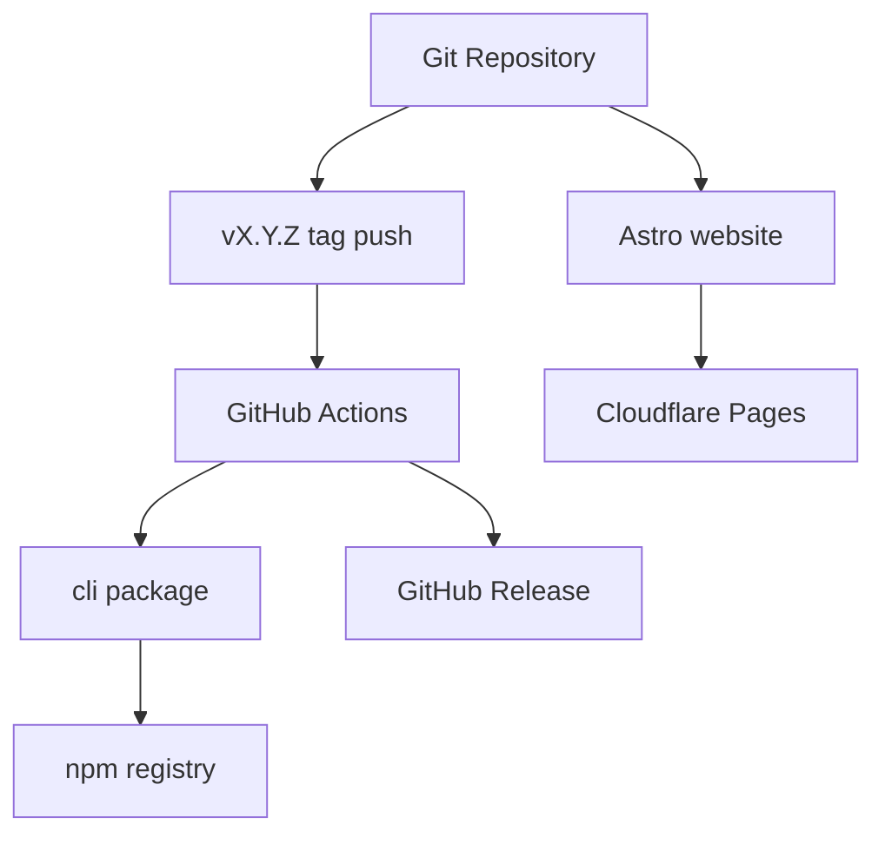

# core-01-deployment-plan

## 一、部署目标
- npm 包：发布 `@miniidealab/openlogos`。
- 发布入口：统一采用 `git tag vX.Y.Z`，由 GitHub Actions 在 tag 推送后自动执行 npm publish，并创建对应 GitHub Release。
- 插件模板：随 npm 包打包 Claude Code、OpenCode、Codex 模板。
- 官网：构建 `website/` 并部署到 Cloudflare Pages。

## 二、部署拓扑

## 三、环境变量与密钥
- npm 发布令牌由发布环境持有，不提交仓库。
- Cloudflare Pages 发布凭据由平台或本地环境持有。

## 四、构建与发布命令
- CLI 构建：`cd cli && npm run build`
- CLI 测试：`cd cli && npm test`
- CLI 打包验证：`cd cli && npm pack`
- 官网构建：`cd website && npm run build`
- 官网部署：`cd website && npm run deploy`
- CLI 发布入口：更新 `cli/package.json`、`plugin/.claude-plugin/plugin.json`、`CHANGELOG.md` 后提交代码，创建并推送 `vX.Y.Z` tag；GitHub Actions 自动执行 npm publish 并创建 GitHub Release。

## 五、数据迁移策略
无业务数据库迁移。

## 六、回滚策略
- npm：通过发布补丁版本回滚。
- 官网：通过 Cloudflare Pages 回滚到上一部署。
- 插件模板：随 npm 包版本回滚。

## 七、部署后检查清单
- `openlogos --version` 可用。
- `openlogos init --locale zh --ai-tool all` 可生成资产。
- 官网核心页面可访问。
- 插件模板包含 Claude Code、OpenCode、Codex 资产。

## 八、冒烟测试方案
见 `logos/resources/test/smoke/core-smoke-test-cases.md`。

## 九、门禁结论
本项目需要发布与部署方案；CLI 发布由 tag 驱动，npm publish 与 GitHub Release 同步生成。部署执行和 smoke 必须由用户明确授权。

## 十、提案级发布决策
本部署方案描述 core 模块具备的发布能力，不表示每个提案都必须发布 npm 包或部署官网。是否执行部署必须以活跃提案的 `## 部署影响` 和 `tasks.md` 的 `[deploy]` section 为准。

判定规则：
1. 文档-only、规格-only、资源索引修正类提案声明无需部署时，不发布 npm 包，不部署 Cloudflare Pages，不运行部署后 smoke。
2. CLI 运行时代码、插件模板、打包配置、官网构建或发布脚本受影响时，提案应声明需要部署，并保留 `[deploy]` section。
3. `openlogos verify` PASS 后，只有提案级 `deployment_required: true` 才能进入部署执行。
4. `openlogos smoke` 只在部署完成且提案级 `smoke_required: true` 时执行。
5. 若 `proposal.md` 与 `[deploy]` section 冲突，先修正提案，不执行部署。
6. CLI 发布时必须保持 `cli/package.json`、`plugin/.claude-plugin/plugin.json`、`CHANGELOG.md` 和 Git tag `vX.Y.Z` 一致，GitHub Release 由同一 tag 自动生成。

本提案 `proposal-level-deploy-gate` 会修改 CLI 运行时代码，因此后续实现验收通过后需要按本方案构建、测试、打包，并由用户决定是否发布 npm 包。
