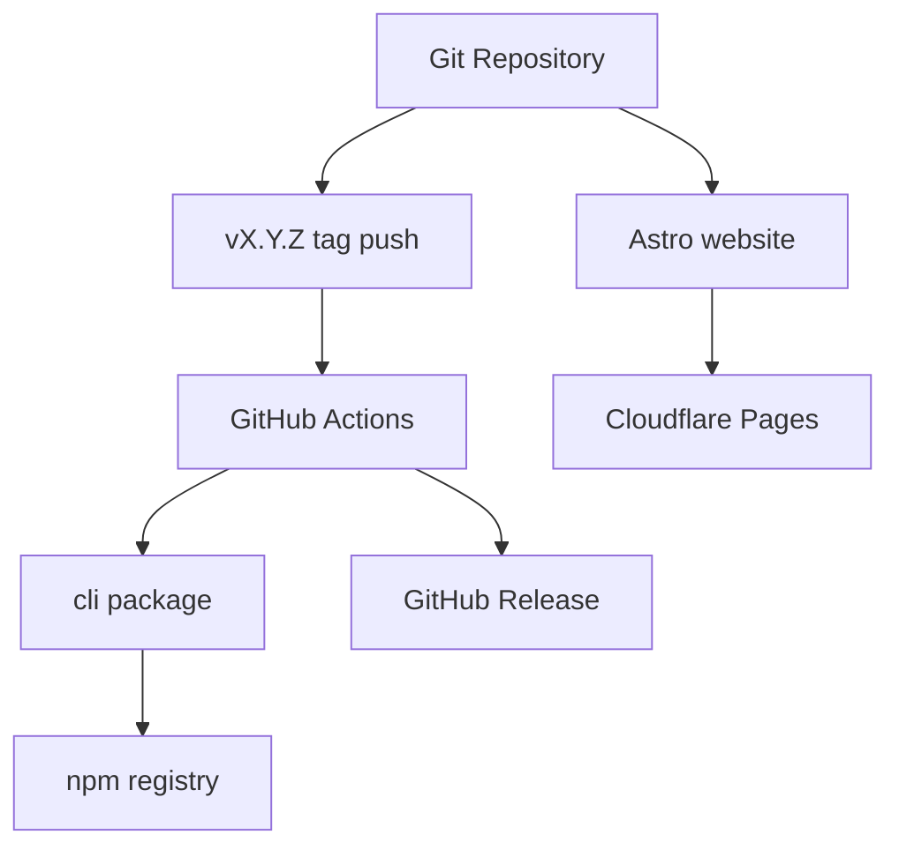

# core-01-deployment-plan

## 一、部署目标
- npm 包：发布 `@miniidealab/openlogos`。
- 发布入口：统一采用 `git tag vX.Y.Z`，由 GitHub Actions 在 tag 推送后自动执行 npm publish，并创建对应 GitHub Release。
- 插件模板：随 npm 包打包 Claude Code、OpenCode、Codex 模板。
- 官网：构建 `website/` 并部署到 Cloudflare Pages。

## 二、部署拓扑

## 三、环境变量与密钥
- npm 发布令牌由发布环境持有，不提交仓库。
- Cloudflare Pages 发布凭据由平台或本地环境持有。

## 四、构建与发布命令
- CLI 构建：`cd cli && npm run build`
- CLI 测试：`cd cli && npm test`
- CLI 打包验证：`cd cli && npm pack`
- 官网发布数据生成：`cd website && npm run generate:releases`
- 官网构建：`cd website && npm run build`
- 官网部署：`cd website && npm run deploy`
- CLI 发布入口：更新 `cli/package.json`、`plugin/.claude-plugin/plugin.json`、`CHANGELOG.md` 后提交代码，创建并推送 `vX.Y.Z` tag；GitHub Actions 自动执行 npm publish、创建 GitHub Release，并串联官网 release 数据同步与站点部署。

## 五、数据迁移策略
无业务数据库迁移。

## 六、回滚策略
- npm：通过发布补丁版本回滚。
- 官网：通过 Cloudflare Pages 回滚到上一部署。
- 插件模板：随 npm 包版本回滚。

## 七、部署后检查清单
- `openlogos --version` 可用。
- `openlogos init --locale zh --ai-tool all` 可生成资产。
- 官网核心页面可访问。
- 官网 `/releases` 页面可访问，并展示 npm latest 版本、发布时间和安装命令。
- 官网 `/releases` 页面可访问，并展示英文主摘要、中文原文次级内容，以及英文摘要缺失时的固定回退提示。
- 官网首页存在最近发布动态入口，并能跳转 `/releases`。
- 插件模板包含 Claude Code、OpenCode、Codex 资产。
- `openlogos detect --format json` 与 `openlogos status --format json` 在 launched 项目中可输出 `modules[]` 与 launched 生命周期，即使 `logos-project.yaml` 存在可恢复解析错误也不应回退成 `initial`。
- tag 发版一致性检查：发布完成后，`/releases` 的 latest 版本必须等于本次 tag 版本（去掉 `v` 前缀后的语义化版本号）；不一致则判定本次发布未完成。

## 八、冒烟测试方案
见 `logos/resources/test/smoke/core-smoke-test-cases.md`。

部署进度摘要面板是 CLI 的展示能力，不改变部署拓扑、环境变量或发布命令本身。
但是，本次发布后的检查清单必须增加一项：

- `openlogos status --format json` 能输出 `deployment_progress` 和 `deployment_document`
- `deployment_progress` 只统计当前提案 `tasks.md` 的 `[deploy]` section
- `deployment_document` 必须指向当前提案的 `tasks.md`

## 九、门禁结论
本项目需要发布与部署方案；CLI 发布由 tag 驱动，npm publish 与 GitHub Release 同步生成。部署执行和 smoke 必须由用户明确授权。

## 十、提案级发布决策
本部署方案描述 core 模块具备的发布能力，不表示每个提案都必须发布 npm 包或部署官网。是否执行部署必须以活跃提案的 `## 部署影响` 和 `tasks.md` 的 `[deploy]` section 为准。

判定规则：
1. 文档-only、规格-only、资源索引修正类提案声明无需部署时，不发布 npm 包，不部署 Cloudflare Pages，不运行部署后 smoke。
2. CLI 运行时代码、插件模板、打包配置、官网构建或发布脚本受影响时，提案应声明需要部署，并保留 `[deploy]` section。
3. `openlogos verify` PASS 后，只有提案级 `deployment_required: true` 才能进入部署执行。
4. `openlogos smoke` 只在部署完成且提案级 `smoke_required: true` 时执行。
5. 若 `proposal.md` 与 `[deploy]` section 冲突，先修正提案，不执行部署。
6. CLI 发布时必须保持 `cli/package.json`、`plugin/.claude-plugin/plugin.json`、`CHANGELOG.md` 和 Git tag `vX.Y.Z` 一致，GitHub Release 由同一 tag 自动生成。
7. `openlogos status --format json` 输出的 `deployment_progress` 与 `deployment_document` 仅用于展示当前提案 `tasks.md` 的部署进度，不代表部署拓扑或发布门禁发生变化。

本提案 `deploy-progress-summary-panel` 会修改 CLI 运行时代码，因此后续实现验收通过后需要按本方案构建、测试、打包，并由用户决定是否发布 npm 包。

## 十一、官网发布动态构建策略
- 官网构建前必须执行发布数据生成脚本，从 npm registry 读取 `@miniidealab/openlogos` 的 `dist-tags`、`versions` 和 `time`。
- 生成结果写入官网源码可导入的静态 JSON 文件，Astro 页面在构建时读取该文件。
- 正式发版约束：由 tag 触发的发布流程中，发布数据生成失败必须直接失败，不允许回退到历史缓存继续发布。
- 发布数据生成失败时应保留已提交的缓存数据；若缓存不存在，构建应失败，避免官网展示空白或伪造数据。
- 英文 release summary 数据必须与仓库内维护的 bilingual summary 数据同步生成；构建过程中不得临时调用外部翻译服务或 AI 生成英文摘要。
- 中文原文摘要继续从 `CHANGELOG.md` 结构化提取，作为 secondary content 和追溯依据。
- Cloudflare Pages 部署仍以 `website/dist/` 为部署产物，不引入运行时服务端依赖。
- 回滚时通过 Cloudflare Pages 回滚到上一部署；如发布数据异常，可回滚到上一份静态 JSON 产物对应的部署版本。

## 十二、verify 预执行模型发布检查
本提案会修改 CLI 运行时行为、配置 schema、公开规范和 Skill 文档，因此需要执行 CLI/npm 发布与官网 / 文档站同步。

发布前检查：
- `cd cli && npm test` 覆盖 `verify.pre_run_command` 兼容路径。
- `cd cli && npm test` 覆盖 `verify.regression_command` + `verify.incremental_command` 两阶段执行与结果合并。
- `openlogos verify --format json` 输出 `pre_run` 状态、诊断和建议字段。
- `openlogos init`、`openlogos adopt`、`openlogos sync` 对可识别测试栈补齐 verify 预跑配置，无法推断时输出 TODO。
- `logos/spec/logos.config.schema.json` 与官网配置说明同步。

部署后检查：
- 安装发布后的 CLI，构造一个缺少预跑配置且 JSONL 覆盖不足的项目，`openlogos verify` 应输出局部测试诊断。
- 构造两阶段测试 fixture，`openlogos verify --format json` 应展示 regression / incremental 命令状态，并按最后一次同 ID 结果计算。
- 官网 / 文档站能展示新的 verify 配置字段、两阶段结果合并语义和 code-implementor 强制检查规则。

回滚策略：
- npm 包通过发布补丁版本回滚，必要时撤回客户端推荐版本。
- 官网通过 Cloudflare Pages 回滚到上一成功部署。
- 若两阶段模型存在兼容问题，旧项目仍可保留 `verify.pre_run_command` 单阶段路径作为临时降级方案。

## 十三、Reference 子目录发布检查
本提案会修改 CLI `init` / `adopt` 运行时生成的标准目录结构，因此需要执行 CLI/npm 发布，并在部署后检查初始化产物。

发布前检查：
- `cd cli && npm test` 覆盖 `openlogos init` 生成 `logos/resources/reference/requirement`、`todolist`、`code`、`image`、`temp`、`note`。
- `cd cli && npm test` 覆盖 `openlogos adopt` 复用同一套 Reference 子目录结构。

部署后检查：
- 安装发布后的 CLI，执行 `openlogos init smoke --locale zh --ai-tool all` 后，确认 `logos/resources/reference/` 下存在 `requirement/`、`todolist/`、`code/`、`image/`、`temp/`、`note/`。
- 在已有项目接入 fixture 中执行 `openlogos adopt --locale zh --ai-tool cursor` 后，确认 Reference 子目录存在。

回滚策略：
- 若初始化目录结构变更影响发布版本，按既有 npm 补丁版本回滚策略修复；旧项目已生成的 Reference 子目录无需迁移。
