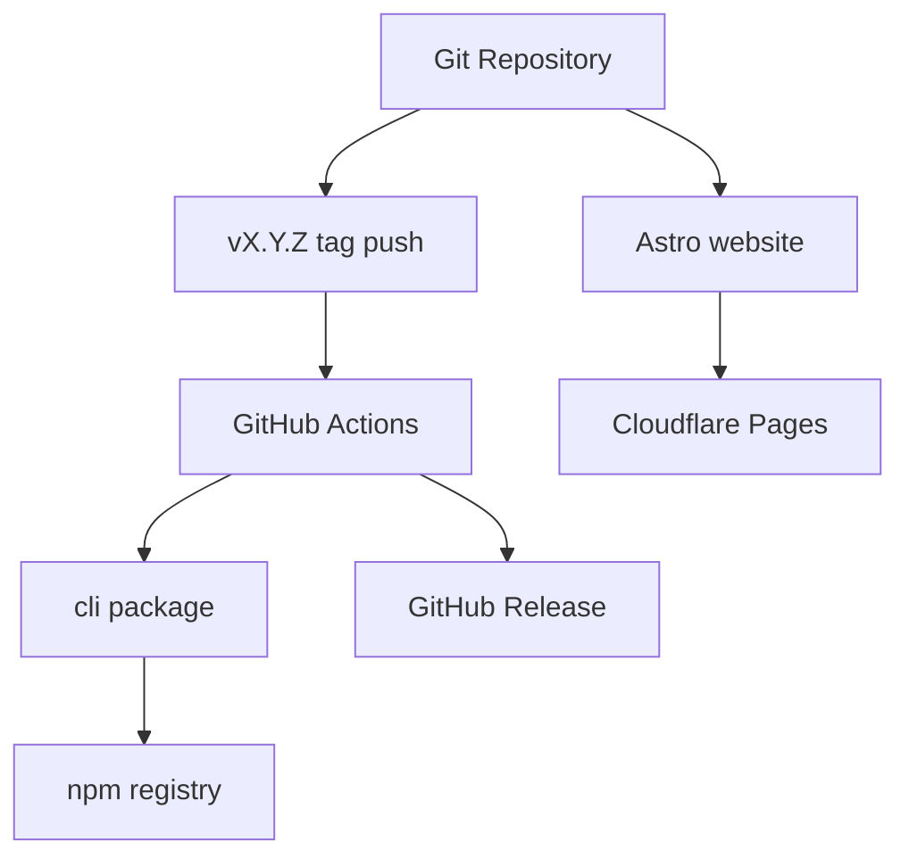
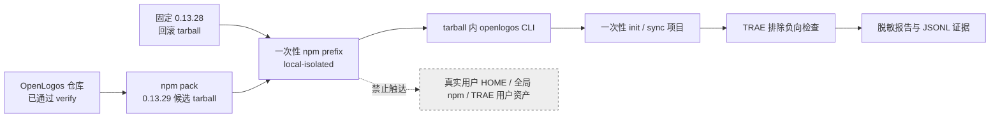
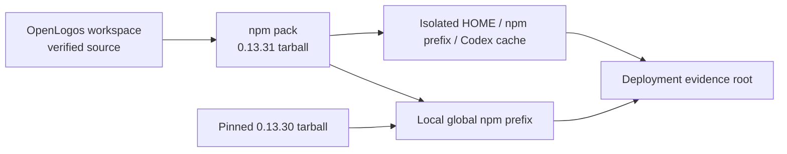
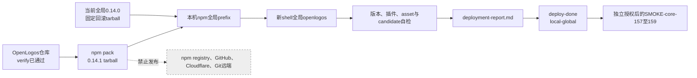

# core-01-deployment-plan

## 一、部署目标
- npm 包：发布 `@miniidealab/openlogos`。
- 发布入口：统一采用 `git tag vX.Y.Z`，由 GitHub Actions 在 tag 推送后自动执行 npm publish，并创建对应 GitHub Release。
- 插件模板：随 npm 包打包 Claude Code、OpenCode、Codex 模板。
- 官网：构建 `website/` 并部署到 Cloudflare Pages。

## 二、部署拓扑

```mermaid
graph TB
    Repo[Git Repository] --> Tag[vX.Y.Z tag push]
    Tag --> CI[GitHub Actions]
    CI --> CLI[cli package]
    Repo --> Website[Astro website]
    CLI --> NPM[npm registry]
    CI --> Release[GitHub Release]
    Website --> Pages[Cloudflare Pages]
```

## 三、环境变量与密钥
- npm 发布令牌由发布环境持有，不提交仓库。
- Cloudflare Pages 发布凭据由平台或本地环境持有。

## 四、构建与发布命令
- CLI 构建：`cd cli && npm run build`
- CLI 测试：`cd cli && npm test`
- CLI 打包验证：`cd cli && npm pack`
- 官网发布数据生成：`cd website && npm run generate:releases`
- 官网构建：`cd website && npm run build`
- 官网部署：`cd website && npm run deploy`
- CLI 发布入口：更新 `cli/package.json`、`plugin/.claude-plugin/plugin.json`、`CHANGELOG.md` 后提交代码，创建并推送 `vX.Y.Z` tag；GitHub Actions 自动执行 npm publish、创建 GitHub Release，并串联官网 release 数据同步与站点部署。

## 五、数据迁移策略
无业务数据库迁移。

## 六、回滚策略
- npm：通过发布补丁版本回滚。
- 官网：通过 Cloudflare Pages 回滚到上一部署。
- 插件模板：随 npm 包版本回滚。

## 七、部署后检查清单
- `openlogos --version` 可用。
- `openlogos init --locale zh --ai-tool all` 可生成资产。
- 官网核心页面可访问。
- 官网 `/releases` 页面可访问，并展示 npm latest 版本、发布时间和安装命令。
- 官网 `/releases` 页面可访问，并展示英文主摘要、中文原文次级内容，以及英文摘要缺失时的固定回退提示。
- 官网首页存在最近发布动态入口，并能跳转 `/releases`。
- 插件模板包含 Claude Code、OpenCode、Codex 资产。
- `openlogos detect --format json` 与 `openlogos status --format json` 在 launched 项目中可输出 `modules[]` 与 launched 生命周期，即使 `logos-project.yaml` 存在可恢复解析错误也不应回退成 `initial`。
- tag 发版一致性检查：发布完成后，`/releases` 的 latest 版本必须等于本次 tag 版本（去掉 `v` 前缀后的语义化版本号）；不一致则判定本次发布未完成。

## 八、冒烟测试方案
见 `logos/resources/test/smoke/core-smoke-test-cases.md`。

部署进度摘要面板是 CLI 的展示能力，不改变部署拓扑、环境变量或发布命令本身。
但是，本次发布后的检查清单必须增加一项：

- `openlogos status --format json` 能输出 `deployment_progress` 和 `deployment_document`
- `deployment_progress` 只统计当前提案 `tasks.md` 的 `[deploy]` section
- `deployment_document` 必须指向当前提案的 `tasks.md`

## 九、门禁结论
本项目需要发布与部署方案；CLI 发布由 tag 驱动，npm publish 与 GitHub Release 同步生成。部署执行和 smoke 必须由用户明确授权。

## 十、提案级发布决策

本部署方案描述 core 模块具备的发布能力，不表示每个提案都必须发布 npm 包或部署官网。是否执行部署必须以活跃提案的 `## 部署影响` 和 `tasks.md` 的 `[deploy]` section 为准。

判定规则：
1. 文档-only、规格-only、资源索引修正类提案声明无需部署时，不发布 npm 包，不部署 Cloudflare Pages，不运行部署后 smoke。
2. CLI 运行时代码、插件模板、打包配置、官网构建或发布脚本受影响时，提案应声明需要部署，并保留 `[deploy]` section。
3. `openlogos verify` PASS 后，只有提案级 `deployment_required: true` 才能进入部署执行。
4. `openlogos smoke` 只在部署完成且提案级 `smoke_required: true` 时执行。
5. 若 `proposal.md` 与 `[deploy]` section 冲突，先修正提案，不执行部署。
6. CLI 发布时必须保持 `cli/package.json`、`plugin/.claude-plugin/plugin.json`、`CHANGELOG.md` 和 Git tag `vX.Y.Z` 一致，GitHub Release 由同一 tag 自动生成。
7. `openlogos status --format json` 输出的 `deployment_progress` 与 `deployment_document` 仅用于展示当前提案 `tasks.md` 的部署进度，不代表部署拓扑或发布门禁发生变化。

本提案 `deploy-progress-summary-panel` 会修改 CLI 运行时代码，因此后续实现验收通过后需要按本方案构建、测试、打包，并由用户决定是否发布 npm 包。

本提案 `brownfield-adopter` 修改/新增 CLI 运行时代码（新增 `baseline-seed.ts`，并修改 `adopt.ts`、`next.ts`、`status.ts`、`verify.ts`、`project-yaml.ts`、`migrate-lifecycle.ts`）与 Skill/方法论规格，据判定规则第 2 条声明 `deployment_required: true` 并保留 `[deploy]` section。发布后的 `baseline-seed` 是显式可选的 eager seed 加速器；adopt、required 或安全 partial 不再自动派发扫描，默认入口是 change。恢复门通过后 seed 状态只作旁路信息；未终结 journal 无法恢复时必须在读取 resources/index/coverage 前硬报错。回滚走 npm `dist-tag` 回退与对应 tag 回退；legacy provenance/seed 状态迁移须幂等、写前备份、失败可恢复、旧版 CLI 忽略未知字段。部署后 smoke 覆盖显式 seed、三态默认 change、partial 恢复与不可恢复 journal 硬门（SMOKE-core-11/44…48 及本提案新增用例）。

## 十一、官网发布动态构建策略
- 官网构建前必须执行发布数据生成脚本，从 npm registry 读取 `@miniidealab/openlogos` 的 `dist-tags`、`versions` 和 `time`。
- 生成结果写入官网源码可导入的静态 JSON 文件，Astro 页面在构建时读取该文件。
- 正式发版约束：由 tag 触发的发布流程中，发布数据生成失败必须直接失败，不允许回退到历史缓存继续发布。
- 发布数据生成失败时应保留已提交的缓存数据；若缓存不存在，构建应失败，避免官网展示空白或伪造数据。
- 英文 release summary 数据必须与仓库内维护的 bilingual summary 数据同步生成；构建过程中不得临时调用外部翻译服务或 AI 生成英文摘要。
- 中文原文摘要继续从 `CHANGELOG.md` 结构化提取，作为 secondary content 和追溯依据。
- Cloudflare Pages 部署仍以 `website/dist/` 为部署产物，不引入运行时服务端依赖。
- 回滚时通过 Cloudflare Pages 回滚到上一部署；如发布数据异常，可回滚到上一份静态 JSON 产物对应的部署版本。

## 十二、verify 预执行模型发布检查
本提案会修改 CLI 运行时行为、配置 schema、公开规范和 Skill 文档，因此需要执行 CLI/npm 发布与官网 / 文档站同步。

发布前检查：
- `cd cli && npm test` 覆盖 `verify.pre_run_command` 兼容路径。
- `cd cli && npm test` 覆盖 `verify.regression_command` + `verify.incremental_command` 两阶段执行与结果合并。
- `openlogos verify --format json` 输出 `pre_run` 状态、诊断和建议字段。
- `openlogos init`、`openlogos adopt`、`openlogos sync` 对可识别测试栈补齐 verify 预跑配置，无法推断时输出 TODO。
- `logos/spec/logos.config.schema.json` 与官网配置说明同步。

部署后检查：
- 安装发布后的 CLI，构造一个缺少预跑配置且 JSONL 覆盖不足的项目，`openlogos verify` 应输出局部测试诊断。
- 构造两阶段测试 fixture，`openlogos verify --format json` 应展示 regression / incremental 命令状态，并按最后一次同 ID 结果计算。
- 官网 / 文档站能展示新的 verify 配置字段、两阶段结果合并语义和 code-implementor 强制检查规则。

回滚策略：
- npm 包通过发布补丁版本回滚，必要时撤回客户端推荐版本。
- 官网通过 Cloudflare Pages 回滚到上一成功部署。
- 若两阶段模型存在兼容问题，旧项目仍可保留 `verify.pre_run_command` 单阶段路径作为临时降级方案。

## 十三、Reference 子目录发布检查
本提案会修改 CLI `init` / `adopt` 运行时生成的标准目录结构，因此需要执行 CLI/npm 发布，并在部署后检查初始化产物。

发布前检查：
- `cd cli && npm test` 覆盖 `openlogos init` 生成 `logos/resources/reference/requirement`、`todolist`、`code`、`image`、`temp`、`note`。
- `cd cli && npm test` 覆盖 `openlogos adopt` 复用同一套 Reference 子目录结构。

部署后检查：
- 安装发布后的 CLI，执行 `openlogos init smoke --locale zh --ai-tool all` 后，确认 `logos/resources/reference/` 下存在 `requirement/`、`todolist/`、`code/`、`image/`、`temp/`、`note/`。
- 在已有项目接入 fixture 中执行 `openlogos adopt --locale zh --ai-tool cursor` 后，确认 Reference 子目录存在。

回滚策略：
- 若初始化目录结构变更影响发布版本，按既有 npm 补丁版本回滚策略修复；旧项目已生成的 Reference 子目录无需迁移。

## 十四、deploy-done 发布检查

本提案新增 CLI 运行时命令和随包分发的 Skill / Spec，因此需要执行 CLI/npm 发布，并在部署后验证 `openlogos deploy-done` 可用。

发布前检查：
- `cd cli && npm test` 覆盖 `openlogos deploy-done` 的成功与失败分支。
- `cd cli && npm run build` 通过，且命令入口已注册到 CLI help。
- `openlogos deploy-done --format json` 输出稳定 JSON envelope。
- `deployment-executor` skill 已改为部署成功后调用 `openlogos deploy-done`，不再要求 AI 手写 `DEPLOY_DONE`。

部署后检查：
- 安装发布后的 CLI，构造已 `VERIFY_PASS`、需要部署且存在 `[deploy]` section 的提案。
- 写入 `logos/resources/verify/deployment-report.md` 后执行 `openlogos deploy-done --env staging`。
- 确认 `[deploy]` section 全部勾选，`DEPLOY_DONE` 写入，旧 `SMOKE_PASS` / `SMOKE_FAIL` 被清理。
- 执行 `openlogos status --format json`，确认提案进入 `ready-to-smoke` 或 `deploy-done`。

回滚策略：
- 若 `deploy-done` 命令导致状态机兼容问题，按既有 npm 补丁版本回滚策略修复。
- 已写入的 `DEPLOY_DONE` marker 是提案局部状态；回滚 CLI 不应删除用户提案文件。

## 十五、Mermaid Skill 文档发布检查

本提案 `mermaid-syntax-safety` 修改随包分发的 Mermaid 相关 Skill 文档，并同步官网中英文 Skill 文档，因此需要执行官网文档构建与 staging 部署检查。若本次变更随 CLI 版本发布，仍沿用 `cli_tag_release` 的 tag 驱动发布约束；若仅部署官网文档，则只执行 `website_release_sync` 的文档站构建与部署链路。

发布前检查：
- `logos/skills/architecture-designer/SKILL.md` 已包含 Mermaid flowchart/graph 节点标签安全规则，覆盖 `ID["标签文本"]`、`subgraph "名称"`、`<br/>` 多行标签和避免误触发形状语法。
- `logos/skills/scenario-architect/SKILL.md` 已包含 Mermaid sequenceDiagram 安全规则，保留单行约束，并要求复杂路径、JSON、错误码和长说明下沉到步骤说明。
- `logos/skills/deployment-designer/SKILL.md` 已包含部署拓扑图的 Mermaid flowchart/graph 语法安全规则。
- `website/src/content/docs/skills/` 与 `website/src/content/docs/zh/skills/` 下三个对应 Skill 页面已同步展示 Mermaid 语法安全规则。
- `cd website && npm run build` 通过。

部署后检查：
- 官网英文 Skill 页面可访问，并展示 architecture / scenario / deployment 三类 Mermaid 语法安全规则。
- 官网中文 Skill 页面可访问，并展示 architecture / scenario / deployment 三类 Mermaid 语法安全规则。
- architecture / deployment 页面的 flowchart 示例使用 `ID["标签文本"]` 形式，不出现 `PROXY[/voice/api 代理]` 这类会误触发形状语法的普通文本节点。
- scenario 页面的 sequenceDiagram 规则仍要求箭头消息单行，并提示复杂内容放到步骤说明。

回滚策略：
- 官网内容异常时，通过 Cloudflare Pages 回滚到上一成功部署。
- 若随 CLI 包发布后发现 Skill 规则有误，通过补丁版本修正；已生成在用户项目中的历史规格文档不做自动迁移。


## 十六、根目录 AI 指令文件合并发布检查

本提案会修改 CLI `init` / `sync` / `adopt` / `launch` 对根目录 `AGENTS.md` / `CLAUDE.md` 的运行时写入行为，因此需要执行 CLI/npm 发布，并在部署后验证用户自定义配置不会被覆盖。

发布前检查：
- 合并 `deltas/spec/agents-md.md` 后，确认 `spec/agents-md.md` 与 `logos/spec/agents-md.md` 已同步，避免根规格和 dogfooding 副本漂移。
- `cd cli && npm test` 覆盖 `openlogos init` 在已有 `AGENTS.md` / `CLAUDE.md` 时保留用户自定义内容并追加 OpenLogos managed block。
- `cd cli && npm test` 覆盖 `openlogos init --ai-tool <tool>` 在已初始化项目中刷新托管片段但不覆盖用户内容。
- `cd cli && npm test` 覆盖 `openlogos sync` 只替换 `OPENLOGOS:BEGIN` / `OPENLOGOS:END` 内内容，保留 block 外配置。
- `cd cli && npm test` 覆盖 `openlogos adopt` 在存量项目已有 `AGENTS.md` / `CLAUDE.md` 时保留原配置。
- `cd cli && npm test` 覆盖 `openlogos launch` 刷新 launched 指令时保留用户配置。
- `cd cli && npm test` 覆盖大小写变体（如 `agents.md` / `claude.md`）识别，避免误覆盖或重复创建入口。

部署后检查：
- 安装发布后的 CLI，在临时目录预置 `AGENTS.md` 与 `CLAUDE.md` 用户自定义内容后执行 `openlogos init --locale zh --ai-tool all smoke`，确认自定义内容仍存在且 OpenLogos 托管片段已写入。
- 在同一项目中执行 `openlogos sync`，确认自定义内容仍存在，OpenLogos 托管片段被刷新且未重复追加。
- 在存量项目 fixture 中预置 `agents.md` / `claude.md` 小写文件后执行 `openlogos adopt --locale zh --ai-tool cursor`，确认 CLI 复用既有真实路径并保留用户内容。

回滚策略：
- 若根指令文件合并逻辑影响初始化或同步，可按既有 npm 补丁版本回滚策略修复。
- 已在用户项目中追加的 managed block 是普通 Markdown 内容；回滚 CLI 不应删除用户根指令文件。必要时用户可手动移除 `OPENLOGOS:BEGIN` / `OPENLOGOS:END` 托管片段。

## 十七、smoke runner 覆盖发布检查

本提案会修改 smoke 覆盖规则、CLI 预检行为、随包分发的 Skill / Spec 和官网文档，因此需要执行 CLI/npm 发布与官网文档同步。

发布前检查：
- `cd cli && npm test` 覆盖新增 smoke 用例时 runner 缺失、reporter 缺失、用例 uncovered 的诊断。
- `cd cli && npm test` 覆盖 `openlogos smoke --format json` 对 `smoke_runner_missing`、`smoke_reporter_missing`、`smoke_cases_uncovered` 的结构化输出。
- `skills/change-writer/SKILL.md`、`skills/test-writer/SKILL.md`、`skills/code-implementor/SKILL.md` 已要求新增或修改 smoke 用例时同步交付 smoke runner/reporter/dispatcher。
- `logos.config.json.smoke.command` 的推荐配置指向统一 dispatcher，或文档明确项目 runner 如何接入现有 command。

部署后检查：
- 安装发布后的 CLI，构造一个新增 `SMOKE-*` 用例但没有 runner 的提案，执行 smoke 覆盖预检应返回 `smoke_runner_missing`。
- 构造一个 runner 存在但未写入 `smoke-results.jsonl` 的提案，预检或 `openlogos smoke --format json` 应返回 `smoke_reporter_missing`。
- 构造一个结果文件缺少新增 `SMOKE-*` ID 的提案，预检或 `openlogos smoke --format json` 应返回 `smoke_cases_uncovered` 并列出缺失 ID。
- 构造统一 dispatcher 可发现 `scripts/smoke-*.sh` 或等效 runner 的项目，执行 `openlogos smoke --format json` 后新增 smoke ID 不应进入 `uncovered_cases`。

回滚策略：
- 若 smoke 覆盖预检误阻断正常提案，按既有 npm 补丁版本策略修复；必要时临时回退到上一版本 CLI。
- 官网文档异常时，通过 Cloudflare Pages 回滚到上一成功部署。
- 用户项目中已存在的 smoke runner 与 `smoke-results.jsonl` 属普通项目文件，回滚 CLI 不应删除。

## 十八、verify 结果账本一致性发布检查

本提案 `verify-result-consistency-gate` 修改 CLI 运行时代码、测试结果规范与 S13 验收门禁，因此需要执行 CLI/npm 发布，并在部署后验证自动化消费方不能再被不自洽的 verify 结果误导。

发布前检查：
- `cd cli && npm test` 覆盖非法 `status`、未定义结果 ID、统计守恒失败和合法 last-write-wins 的回归用例。
- `cd cli && npm run build` 通过。
- `openlogos verify --format json` 在不自洽账本 fixture 下返回非零退出码，`gate.result="FAIL"`，`gate.reason` 非空。
- 正常全绿且统计自洽的 fixture 仍返回 `gate.result="PASS"`。

部署后检查：
- 安装发布后的 CLI，构造只定义 1 个用例、JSONL 含 1 个 pass 用例和 1 个非法 `status` 结果的项目，执行 `openlogos verify --format json`，应返回 FAIL。
- 构造 defined 用例全部 pass、JSONL 另含未定义 `UT-*` ID 的项目，执行 `openlogos verify --format json`，应返回 FAIL 并列出未定义 ID。
- 构造合法重复 ID 的项目，确认最后一次结果生效且统计自洽时仍可 PASS。
- 使用 RunLogos / driver 消费该 FAIL 响应时，不得继续触发 archive / deploy / release。

回滚策略：
- 若一致性硬门误阻断合法项目，按既有 npm 补丁版本策略修复并发布新 patch。
- 旧项目的 `test-results.jsonl` 是运行时产物，不做迁移；用户可通过清空旧结果文件并重新运行完整测试恢复。
- 官网文档异常时，通过 Cloudflare Pages 回滚到上一成功部署。

## 十九、Codex / Claude Skill 命名空间边界发布检查

本提案 `codex-claude-skill-namespace-separation` 会修改 CLI `init` / `sync` / `launch` 的 AI 工具资产生成行为、Codex 插件模板、Claude Code 插件边界说明、随包分发的规范文档和官网文档，因此需要执行 CLI/npm 发布与官网文档同步。

### 发布前检查
- `cd cli && npm test` 覆盖 Codex repo marketplace 生成、`openlogos` 插件条目刷新和项目插件条目保留。
- `cd cli && npm test` 覆盖历史 `.codex-plugin/` 与 `.agents/skills/*` 兼容路径，确认未知项目 skill 不会被复制到 OpenLogos 插件命名空间。
- `cd cli && npm test` 覆盖 Claude Code `.claude/skills/*` 项目技能保留，确认项目 skill 不进入 OpenLogos 官方 Claude 插件。
- `cd cli && npm test` 覆盖 `AGENTS.md` / `CLAUDE.md` 生成内容中 OpenLogos 方法论技能与项目专属技能分组展示。
- `cd cli && npm run build` 通过，且 npm pack 产物包含更新后的 `plugin-codex/`、`plugin/`、`spec/agents-md.md`、`spec/codex-plugin.md` 与同步后的官网文档源码。
- 官网中英文文档已说明 Codex `openlogos:<skill>`、Claude Code `/openlogos:*` 与项目专属 skill 的边界。

### 部署后检查
- 安装发布后的 CLI，在临时项目执行 `openlogos init smoke --locale zh --ai-tool codex`，确认 `.agents/plugins/marketplace.json` 存在 `openlogos` 条目，OpenLogos 官方技能位于 `openlogos` 插件命名空间。
- 在包含 `.agents/plugins/adcn/skills/release-guard/SKILL.md` 的项目中执行 `openlogos sync`，确认 `adcn` 插件条目和 skill 内容不变，且不存在 `openlogos:release-guard`。
- 在包含历史 `.agents/skills/release-guard/SKILL.md` 的项目中执行 `openlogos sync`，确认该 skill 原样保留，OpenLogos 插件不吸收该 skill。
- 在包含 `.claude/skills/release-guard/SKILL.md` 的项目中执行 `openlogos init --ai-tool claude-code` 和 `openlogos sync`，确认项目 skill 原样保留，`CLAUDE.md` 单独说明项目专属技能。
- 访问官网相关文档页，确认 Codex / Claude Code Skill 命名空间边界说明可见。

### 回滚策略
- 若 Codex marketplace 生成影响已有项目，可通过 npm 补丁版本回滚或修复；历史 `.codex-plugin/` 兼容路径保留，作为临时降级入口。
- 若 Claude Code 项目 skill 边界说明或同步逻辑误阻断用户项目，可按既有 npm 补丁版本策略修复；用户项目中的 `.claude/skills/*` 文件不做自动迁移或删除。
- 若官网文档异常，通过 Cloudflare Pages 回滚到上一成功部署。

## 二十、契约自描述发布检查（contract-self-description）

本提案 `contract-self-description` 修改 CLI 运行时代码（status/next JSON 契约、`loop_state` 挂出判据、verify 同 ID 去重）并新增随包分发的 `spec/schema/` JSON Schema，据「十、提案级发布决策」判定规则第 2 条声明 `deployment_required: true` 并保留 `[deploy]` section。影响环境：本地（全局 npm 安装）；公开 npm 发布沿既有 tag → npm publish + GitHub Release 链路，须经人类确认另行执行。无数据迁移。

### 大版本发布口径

- 本提案的契约破坏性变更——`data` 顶层新增 `contract`（全部 9 个 golden 基线快照重拍）、`next_node` 新增 `dispatch` / `requires_reviewed`（破 R8 八字段锚）、`loop_state` 挂出判据收紧（破「launched 常驻输出」）——**集中在一次大版本（major）发布**交付，破坏面一次说清，不拆散成多个小版本零敲碎打。
- **C2（loop_state 挂出时机收紧）可独立先行以小版本发布救火**：此时 `contract` 字段尚不存在（0.x 前契约时代），「既有字段挂出判据变更即 contract major」的规则自 contract 1.0.0 发布起才起算；且现役 runlogos driver 对「loop_state 缺席」本就走普通推进（runlogos S48 EX-48.9），对消费方向后兼容。先行发布 C2 可立即消灭 loop 劫持整类假死，不必等大版本。
- 交付顺序与提案概述一致（供 slice-planner 参考，非其约束）：C2 最小独立先行（可选救火）→ C1+C3+C5（破坏性集中的大版本核心）→ C4+C6+C7 随同一大版本收尾。

### 契约版本演进策略（D1）

- 大版本发布交付的契约形态即 `contract.version = "1.0.0"`（语义化契约版本，独立于 CLI 版本演进）；此前无 `contract` 字段的历史输出视为「0.x 前契约时代」，消费方按缺字段保守分支处理。
- SemVer 规则：**major** = 必填字段删除/改义、闭合枚举语义变化（含移除值）、既有字段挂出判据变更；**minor** = 向后兼容扩展（新增可选字段、闭合枚举新增值）；**patch** = 不改形态与语义的澄清。
- 版本-schema 一一映射：`spec/schema/status.schema.json`、`spec/schema/next.schema.json` 内嵌契约版本号；响应 `contract.version` 必须与打包 schema 版本一致，CI 校验（见下发布前检查）。

### spec/schema/ 随包打包与包内容验证

- `spec/schema/status.schema.json`、`spec/schema/next.schema.json` 随 npm `prepack` 打入发布包，发布包内 schema 与响应契约同版本演进。

发布前检查：
- `cd cli && npm test` 通过，覆盖：注册表/step_meta/schema 三方同步与 schema 校验（含 dispatch 必填、overlay-add 保守默认后过校验）、漂移注入 `x-future-step` 生产者一致性测试（含 pre-implement 步骤不输出 `loop_state` 反面锚）、响应 `contract.version` 与打包 schema 版本一一对应校验、verify timestamp 去重混合用例。
- `cd cli && npm run build` 通过。
- `cd cli && npm pack` 后验证包内容包含 `spec/schema/*.schema.json`，且 schema 内嵌契约版本 == 响应 `contract.version`（包内容验证测试）。

部署后检查（smoke）：
- 安装发布后的 CLI，在 launched fixture 中执行 `openlogos status --format json` / `openlogos next --format json`，确认 `data.contract.version` 在场、`active_change` 携带 `step_meta` / `facts`、`next_node` 携带完整 `dispatch`。
- 确认 spec 阶段（未消费 slice-exit）的活跃提案确不输出 `loop_state`。
- 详见 `logos/resources/test/smoke/core-smoke-test-cases.md`。

### 回滚预案

- **回装上一版本即可**：npm 全局回装旧版（公开发布则 `dist-tag` 回退 + 回退对应 tag），无数据迁移、无状态文件需要清理。
- 契约新增字段（`contract` / `step_meta` / `facts` / `dispatch` / `requires_reviewed`）对旧消费方为向后兼容扩展：旧 driver 忽略未知字段即可，不因新字段出现而失效。
- `loop_state` 缺席语义旧 driver 本就处理（runlogos S48 EX-48.9，缺席即走普通推进）：新版收紧挂出不会使旧 driver 进入不可用状态；回滚后 `loop_state` 恢复旧挂出行为，同样不破坏消费方。
- 结构化 `SLICES_APPROVED` marker 对旧版 CLI 无碍（旧版仅做存在性判断），回滚不需迁移；`activated_at` 字段随回滚消失，属可接受降级。

## 二十一、change-lint 发布检查（change-lint-shift-left）

### 发布前检查（本地链路）

1. 版本号：`cli/package.json` `version` patch +1（当前 `0.13.14` → `0.13.15`，以部署时实际当前版本为准；`major.minor` 不动）。
2. 构建打包：`cd cli && npm run build && npm pack`；构建产物含 `change-lint` 命令入口（`dist/` 内可 grep 到命令注册）。
3. 回滚来源留存：打包前保留上一版 tarball（`openlogos-cli-<prev>.tgz`）于本地，作为回滚安装源。

### 部署（本机全局）

- `npm install -g <生成的 tarball>`；
- 版本一致性校验：`openlogos --version` 输出与 `cli/package.json` 一致；不一致 → 部署失败，按回滚策略处理。

### 部署后检查

- 冒烟经 `openlogos smoke` 门禁运行 SMOKE-core-51…53（见 `test/smoke/` 补充节）：命令可见性、`--help` 可发现、text/JSON 调用契约（exit 0/2/1）、只读性。
- 冒烟任一失败 → 不得 archive，按失败处理。

### 失败处理与回滚

- 安装失败 / 版本不一致 / 冒烟失败：`npm install -g <上一版 tarball>` 回滚；lint 为纯增量只读命令，回滚零数据副作用、零迁移。
- 回滚后复核 `openlogos --version` 恢复为上一版。

## 二十二、baseline-on-touch 发布检查（S39）

### 发布目标

把 on-touch 提案模板、根/分发 Skills、闭包共享判据、change-lint L9、adopt/next/status 引导与 CREATE merge 支撑作为同一 CLI 版本交付。仅更新仓库源码而未验证打包内容不算部署完成。

### 发布前检查

1. 运行项目规定的全量测试与构建，确认 S09/S20/S33/S35/S39 UT/ST 和 reporter 覆盖全部真实 ID。
2. 生成 npm tarball，检查包内至少包含：
   - 新版 CLI build 产物与 L9 code 注册表；
   - `spec/baseline-closure.md` 及更新后的根 specs；
   - change-writer、brownfield-adopter、scenario/API/DB/test/orchestrator/merge Skills；
   - 初始化/同步模板中的对应 dogfood 副本。
3. 在隔离 staging/本机从 tarball 真实安装，确认 `openlogos --version` 与 `cli/package.json` 一致。
4. 对真实安装包运行 `openlogos smoke` 所承载的 SMOKE-core-54…58；源码目录直调不能替代。
5. 核对 CLI/package、插件 manifest、CHANGELOG、tag 版本一致；标准发布入口仍为 tag 驱动 GitHub Actions，禁止本地手工 npm publish。

### 部署与发布链路

```text
全量测试/构建
  → npm pack
  → staging/本机真实安装
  → smoke 54…58
  → 准备版本/CHANGELOG/tag
  → push tag
  → GitHub Actions publish npm + GitHub Release + website release sync
  → npm view / release / website 交叉核对
```

### 数据与兼容

- 无数据迁移：不批量改写 `baseline_seed_state`、`skip_phases`、provenance、coverage、现有资源或活跃提案。
- 旧项目由新版读取语义立即受益；legacy proposal 无 on-touch-v1 时只走 L1–L8。
- seed JSON shape 保留；消费者无需同步迁移即可继续读取。
- 已经通过普通 delta 合并的用户规格不依赖新运行时闭包状态，回滚 CLI 不删除这些文档。

### 部署后检查

- adopt 后默认主动作是直接 change；required/安全 partial/seeded 均不阻断。另做未终结 journal 故障注入：恢复失败必须返回 `baseline_commit_in_progress` 且读取哨兵证明未访问半新 resources/index。
- 新 change 模板能生成闭包声明与 target mode，change-lint 可见 L9。
- 重复目标/模式冲突返回稳定诊断；合法 CREATE 能在 merge-executor apply 后形成完整文件。
- 包内 Skills 明确无 baseline task、JIT advisory、verified 写回与 baseline warning。
- npm、GitHub Release 与官网展示同一版本。

### 回滚方案

1. 保留上一版 npm tarball、版本号与 dist-tag 指向；发布失败时安装上一版恢复 CLI。
2. tag 发布失败不复用失败 tag，修复后递增 patch 重发。
3. 若新版默认引导或 L9 存在严重回归，回退 CLI/Skills 资产；不回滚用户已经合法合并的规格。
4. 回滚不得改写/删除 seed/provenance、当前 change delta 或 `logos/resources/**`。
5. 记录回滚原因、受影响版本和 smoke 结果到部署报告。

### 发布门结论

本能力需要部署且需要 smoke；verify PASS 后方可执行 `[deploy]`，部署完成后由既有 `openlogos smoke` 独立门判定。此处不新增 baseline 专用部署门。

## 二十三、决策澄清协议 v0.13.25 本地全局部署检查

### 部署目标与边界

- 目标版本：OpenLogos CLI 与插件元数据 `0.13.25`。
- 目标环境：当前开发机的 npm 全局环境。
- 交付方式：从已完成实现且 verify PASS 的工作树构建 CLI，生成本地 npm tarball，再以 tarball 全局安装。
- 数据迁移：无；本次只扩展 proposal 模板、CLI JSON 契约、Skill 和测试能力。
- 明确排除：不创建/推送 `v0.13.25` Git 标签，不执行 npm publish，不创建 GitHub Release，不部署官网，不因本地安装自然推导任何公开发布授权。

### 部署前条件

1. 规格已经合并，代码与测试切片全部完成，OpenLogos reporter 已记录本提案 UT/ST 结果。
2. `openlogos verify` 已由相应授权方执行并得到 PASS。
3. `cli/package.json`、`plugin/.claude-plugin/plugin.json` 和 `CHANGELOG.md` 均声明 0.13.25，构建产物与包内容不含旧版本漂移。
4. 已确认本地部署决定：目标环境、tarball 全局安装方式、0.13.24 回滚来源和 smoke 成功证据均有 `source: user` 记录。
5. 安装前记录当前 `openlogos` 命令解析路径、全局包版本与 Node/npm 环境；准备可重新安装的 0.13.24 tarball 或等价、可验证的回滚来源。

### 构建与打包步骤

在仓库根目录按项目现行脚本完成依赖检查、TypeScript 构建、测试和 npm 包内容检查，然后在 `cli/` 包目录生成 tarball。tarball 文件名和摘要必须写入部署报告，不以工作区源码版本代替安装包版本。

建议核对项：

- 包内包含 CLI 可执行入口、`spec/schema/status.schema.json`、`spec/schema/next.schema.json` 和所需 Skills。
- 包内不包含提案临时文件、guard、测试结果或凭据。
- `npm pack --dry-run`/等价检查显示版本为 0.13.25。
- 实际 tarball 的 `package.json.version` 为 0.13.25。

### 本机全局安装

1. 仅在 verify PASS 且部署执行获得授权后，使用刚生成的 0.13.25 tarball执行 npm 全局安装。
2. 安装后重新解析 `openlogos` 命令路径，避免 shell 缓存或另一个 prefix 下的旧二进制造成假成功。
3. `openlogos --version` 必须返回精确值 `0.13.25`；运行时读取到的 schema 与 Skill 必须来自本次安装包。
4. 部署报告记录：环境、安装前版本、tarball 路径/摘要、安装后版本、命令路径、执行时间、回滚包和结果。
5. 完成部署执行后按既有 `deploy-done` 受控流程记录部署完成；不得手写部署完成 marker。

### 部署后 smoke

部署完成后由独立 `openlogos smoke` 人类确认点执行 `SMOKE-core-59`～`SMOKE-core-61`：

- `SMOKE-core-59`：全局命令路径与版本/包元数据均为 0.13.25。
- `SMOKE-core-60`：已安装 CLI 的 status/next JSON 暴露 clarification 状态、`required_categories` 和完整 `next_decision`。
- `SMOKE-core-61`：需要部署但缺用户 deployment 决定的 proposal 被 fail-closed，且 `next --auto` 不越过 `write-proposal`。

smoke 未执行或未 PASS 时不得归档本提案。

### 失败处理与回滚

以下任一情况立即停止继续推进并恢复 0.13.24：构建/打包失败、全局安装失败、命令解析到错误路径、版本不是 0.13.25、运行时 schema/Skill 缺失、任一 smoke 失败。

回滚步骤：

1. 使用部署前准备的 0.13.24 tarball或等价来源重新执行 npm 全局安装。
2. 重新解析命令路径并确认 `openlogos --version` 返回 0.13.24。
3. 记录失败阶段、错误输出、已恢复版本和遗留诊断材料；不得用公开 npm 发布、tag 或远端 push 作为本地回滚手段。
4. 修复后重新从 verify 开始，重新获得所需执行授权并重走部署/smoke。

### 授权边界

proposal 内的 deployment 决定确认“采用什么部署方案”；实际安装仍属于部署执行授权。人工模式下 verify、部署、smoke 分别确认；全自动模式只按既有 run-scoped standing authorization 推进。无论哪种模式，公开发布都必须由独立 `release` 决定和相应执行权限覆盖。

## 二十四、切片感知 verify v0.13.26 本地全局部署检查

### 部署目标与边界

- 目标版本：当前 `0.13.25` 的下一 patch `0.13.26`。
- 目标环境：当前开发机 npm 全局环境。
- 交付物：本地构建的 tarball、制品 SHA-256、实际安装版本与 smoke 报告。
- 明确不授权：npm publish、Git tag、GitHub Release、官网发布、远端部署或 git push。

### 部署前条件

1. `openlogos verify` 已 final PASS，且本提案的 `[code]` 全部完成。
2. 人类明确授权执行部署。
3. 保存当前全局 `0.13.25` 的命令路径、npm prefix、版本输出和可重新安装 tarball；记录其 SHA-256。
4. 新包的 package/plugin 版本均为 `0.13.26`，包含更新后的 spec、Skill 与 JSON Schema。
5. `npm pack --dry-run` 或等价包内容检查确认不含工作区临时状态和凭证。

### 构建与本机安装

```bash
cd cli
npm test
npm run build
npm pack
shasum -a 256 miniidealab-openlogos-0.13.26.tgz
npm install -g ./miniidealab-openlogos-0.13.26.tgz
```

部署执行必须记录实际 tarball 文件名、哈希、全局 prefix、命令解析路径和安装时间。不得在本阶段执行 `npm publish`。

### 部署后成功证据

1. 新 shell 的 `openlogos --version` 精确为 `0.13.26`，命令路径位于预期 npm 全局 prefix。
2. 全局包中存在 `skills/slice-planner/SKILL.md`、`spec/test-slice-manifest.md` 与对应 JSON Schema。
3. 隔离临时项目验证五切片依次 checkpoint PASS，前四片不生成 `VERIFY_PASS`，最后 checkpoint 后 final 全量 PASS。
4. 验证缺 manifest 输出 `test-slice-manifest-missing` 与 `plan-slices`，恢复后可续跑且 `LOOP_ITERS` 未增加。
5. 验证 checkpoint 真实失败在进程重启后仍归属相同 `attempted_slice_id`。
6. 所有 smoke 结果由统一 reporter 写入，独立 `openlogos smoke` 门禁通过后才允许归档。

### 数据与迁移

无业务数据迁移。新 manifest/checkpoint 文件只位于活跃提案目录；旧多切片活跃提案由 `plan-slices` 恢复，不批量改写。未知 manifest 主版本保持原文件并阻塞。

### 回滚方案

任一版本、包内容、checkpoint/final、恢复或 reporter 检查失败时：

```bash
npm install -g ./miniidealab-openlogos-0.13.25.tgz
openlogos --version
```

回滚成功标准是新 shell 中版本精确返回 `0.13.25`、命令路径恢复到原 prefix，且原 tarball 哈希匹配部署前记录。保留 `0.13.26` 失败制品、日志和临时 fixture 用于诊断；不得以重发同版本掩盖失败。

### 门禁结论

本节只定义部署步骤，不构成执行授权。verify 通过后仍须人类明确授权部署；部署完成后须另行授权 `openlogos smoke`。

## 场景 CREATE 完整性修复 v0.13.27 本地全局部署检查

### 部署目标与边界

- 目标版本：当前 `0.13.26` 的下一 patch `0.13.27`。
- 目标环境：当前开发机的 npm 全局 OpenLogos 环境。
- 交付物：本地构建的 npm tarball、SHA-256、安装前后命令路径/版本证据、SMOKE-core-67～69 结果。
- 部署方式：在 verify PASS 且用户另行授权部署执行后，从 `cli/` 构建并 `npm pack`，以生成的 tarball 执行 `npm install -g`。
- 数据迁移：无；不批量改写项目规格、活跃提案或用户业务数据。
- 明确排除：不执行 npm publish、Git tag、GitHub Release、官网发布、远端部署或 git push；C01 的本机安装决定不构成这些动作的授权。

### 部署前条件

1. 本提案 Delta 已获独立 merge 授权并完成合并，代码切片、UT-S39-28～32、ST-S39-14～16 和相关回归全部实现且由 reporter 记录。
2. `openlogos verify` 已在相应人类确认点执行并 PASS；缺失、失败或 loop-exhausted 时不得部署。
3. `cli/package.json`、插件 manifest 与需要随包分发的元数据均声明精确 `0.13.27`，构建产物无旧版本漂移。
4. 记录当前全局 `openlogos` 的解析路径、npm prefix、精确版本 `0.13.26` 与 Node/npm 环境。
5. 保留可重新安装的 `miniidealab-openlogos-0.13.26.tgz` 或等价可信 tarball，记录其绝对路径和 SHA-256，并准备可复制回滚命令。
6. `npm pack --dry-run` 或等价检查证明新包包含更新后的 CLI build、`spec/baseline-closure.md`、`spec/change-management.md`、change-writer/scenario-architect Skills，不包含 guard、活跃 change、测试结果或凭据。

### 构建、制品校验与本机安装

在仓库根进入 `cli/` 后执行项目现行脚本；具体包管理命令以合并后 `package.json` 为准，最低步骤为：

```bash
cd cli
npm test
npm run build
npm pack --dry-run
npm pack
shasum -a 256 miniidealab-openlogos-0.13.27.tgz
npm install -g ./miniidealab-openlogos-0.13.27.tgz
```

安装操作必须在独立部署授权后执行。安装完成后开启新 shell 或刷新命令哈希，重新解析 `openlogos`，避免旧 prefix/缓存命令造成假成功。部署报告记录 tarball 绝对路径、哈希、安装时间、npm prefix、命令路径、安装前后版本和回滚制品。

### 部署后成功证据

1. 新 shell 的 `openlogos --version` 精确返回 `0.13.27`，命令路径位于部署前确认的 npm 全局 prefix。
2. 全局包的 CLI/package/plugin 版本一致，且包含更新后的 baseline closure/change management 规格与两个 Skill。
3. 隔离临时项目中，完整 `步骤说明`、`主流程`、`主路径步骤`、`主路径`、`正常流程`、`main path` 场景 CREATE 均通过 change-lint。
4. 同一安装包拒绝仅在散文/围栏/注释中出现“步骤”的夹具，拒绝不足 3 步、伪 Mermaid、空异常/追溯夹具。
5. 真正缺少步骤章节时，change-lint exit 2、merge 非零，项目根快照证明无写入副作用。
6. SMOKE-core-67～69 全部由统一 smoke dispatcher 执行并写 `logos/resources/verify/smoke-results.jsonl`；只有独立 `openlogos smoke` 门 PASS 后才能归档。

### 环境隔离与安全

- 所有正反例在 `mktemp -d` 或等价安全临时目录创建，不复用真实活跃提案，不修改本仓 guard/resources。
- 测试输出不得包含凭据、用户文档全文或不必要的绝对路径；失败 fixture 可保留其临时路径供诊断。
- change-lint 的只读快照覆盖文件集合和逐文件 SHA-256；merge 负例额外覆盖 guard、counter、resource index 与 lifecycle markers。

### 失败处理与回滚

构建、包内容、安装、路径/版本、结构化 lint、merge 原子性、runner/reporter 或 smoke 任一失败时立即停止后续归档，保留新 tarball、哈希、日志与隔离 fixture，并执行：

```bash
npm install -g /absolute/path/to/miniidealab-openlogos-0.13.26.tgz
hash -r
openlogos --version
```

回滚成功标准：新 shell 中版本精确为 `0.13.26`，命令解析路径恢复到原 npm prefix，回滚 tarball 哈希与部署前记录一致。回滚只恢复本机全局 CLI，不删除已经合法合并的规格，不触发公开发布。修复部署问题后必须重新从 verify/部署授权点开始。

### 门禁结论

本节只设计部署与 smoke，不执行命令。人工模式下 merge、verify、部署执行、smoke、archive、git push 仍分别需要明确授权；本轮只已获得 plan approval 和 C01 方案选择，尚未获得这些后续动作授权。

## ZCode Adapter staging 真实 tarball 部署检查

### 部署目标与边界

- 目标环境仅为 **staging**：安装本提案构建的真实 npm tarball，并由真实 ZCode CLI/客户端验证随包插件与 Hook 协议。
- 本次不是公开发布：禁止 `npm publish`、Git tag、GitHub Release、官网发布、Cloudflare 部署和 `git push`。
- 部署执行仍在 verify PASS 后，并需要独立的人类部署授权；本节只定义可执行方案，不构成当前执行授权。

### 前置门禁

1. 本提案所有实现切片与 OpenLogos reporter 已完成，验收报告为 PASS。
2. staging 主机安装受支持的 Node.js/npm 与真实 ZCode CLI，能启动全新 ZCode session。
3. 记录当前 staging CLI 版本、来源、上一可用 tarball 路径和 SHA-256；确认回滚 tarball 可离线安装。
4. 使用一次性临时项目与隔离的 ZCode 用户/插件目录，不复用生产凭据或生产工作区。
5. 确认网络、凭据和 npm registry 均非验证必需；tarball 来自当前受控构建目录。

### 制品构建与证明

在未来获部署授权后，部署执行者按仓库真实脚本解析等价命令，不在本 Delta 阶段执行：

1. 安装锁文件依赖，执行 CLI build 与全部自动化测试。
2. 在 `cli/` 运行真实 `npm pack`，保存生成的 `.tgz`，不得以源码链接或 workspace 直连替代。
3. 记录 tarball 文件名、package name、version、字节数和 SHA-256。
4. 展开或列出 tarball，证明包含编译后 CLI、ZCode plugin manifest、Skills、Commands、Agents、`hooks/hooks.json`、共享 Node.js runtime、双语模板与所需规范。
5. 从隔离目录用 tarball 安装 CLI，记录 `openlogos --version` 和实际解析的可执行文件路径，证明未命中全局旧版本。

### staging 安装与真实 ZCode 验证

1. 创建两套一次性 fixture：全新项目用于 init，含既有 AGENTS/`.zcode/config.json`/用户插件的存量项目用于 adopt。
2. 以 tarball 安装的 CLI 分别选择 `zcode` 和 `all`，检查配置、插件 identity、资产布局与用户文件哈希。
3. 按真实 ZCode 的插件安装/启用方式指向 tarball 生成的 OpenLogos 插件，不直接引用仓库 `plugin` 源目录。
4. 启动**新 ZCode session**，确认插件、Skills、Commands、Agents 可发现，SessionStart 注入当前 lifecycle/guard 上下文。
5. 在活跃提案允许范围内发起一项写入并确认执行；再对源码或阶段外路径发起写入，确认 PreToolUse 返回 deny、原因和 exit 2，目标哈希不变。
6. 执行 sync 与 adopted launch，重开 session，证明 launched 资产刷新且重复执行幂等。
7. 对 Claude Code、OpenCode、Codex、Cursor 跑既有最小资产回归，证明 Registry 加法未破坏原宿主。

### 证据清单

- 构建/测试退出状态与 OpenLogos JSONL 结果摘要。
- tarball 路径、版本、大小、SHA-256 及完整文件清单。
- staging 安装命令、实际 CLI 路径、ZCode 版本和隔离目录说明。
- 插件发现、Skills/Commands/Agents、SessionStart 与 PreToolUse allow/deny 的脱敏原始输出。
- 用户资产前后哈希、两次 sync/launch 差异与既有四宿主回归结果。
- 回滚演练结果和恢复后版本/插件状态。

### 失败与回滚

- 任一 build、测试、pack、安装、插件发现、Hook hard guard 或回归检查失败即停止，不进入公开发布。
- 禁用/卸载本次 staging OpenLogos ZCode 插件，移除隔离 fixture 和本次 tarball 安装。
- 从预先记录的上一 tarball 恢复 CLI，恢复上一插件版本或禁用插件；重新启动 ZCode session。
- 校验恢复后的 CLI 版本、插件发现与既有项目用户资产哈希；保留失败日志和本次 tarball，不伪造部署成功标记。
- 回滚只作用于 staging 隔离目标，不删除用户工作区、全局 ZCode 配置或未知 owner 插件。

### 完成判据

只有 SMOKE-core-100～SMOKE-core-107 全部产生可追溯 PASS、制品和回滚证据齐全，且没有 npm/GitHub/官网/git push 外部副作用，才可将本提案 staging 部署判为完成。

## Qoder Adapter staging 真实 tarball 部署方案

### 部署目标与授权边界

- 目标仅为隔离 staging：安装本提案构建的真实 npm tarball，并由真实 Qoder CLI 验证插件与 Hook。
- 禁止 npm publish、Git tag、GitHub Release、官网/Cloudflare 部署和 `git push`。
- 部署必须在 verify PASS 后获得独立人类授权；本节不构成当前执行授权。

### 前置条件

1. 所有实现切片、UT/ST 与 OpenLogos reporter 完成，最终 verify 为 PASS。
2. staging 具备受支持的 Node.js/npm 与真实 Qoder CLI；记录 CLI 绝对路径、版本和可启动新 session 的证明。
3. 保存当前 staging OpenLogos CLI/插件状态、上一可用 tarball 与 SHA-256，确保可离线回滚。
4. 使用一次性 init/adopt fixture 和隔离 Qoder 用户/插件数据目录，不读取生产凭据或生产工作区。
5. 真实 Qoder CLI 缺失、版本不可识别或插件功能不可用时停止；不得用 mock/合同测试替代。

### 制品构建与证明

未来获部署授权后执行仓库真实 build/test/pack 流程：

1. 依据锁文件安装依赖并运行 CLI build、全部自动化测试与 reporter 完整性检查。
2. 在 `cli/` 生成真实 `.tgz`；禁止 workspace link、源码直跑或已发布包替代。
3. 记录 package、version、tarball 字节数和 SHA-256。
4. 列出 tarball，证明包含编译 CLI、`.qoder-plugin/plugin.json`、Skills、Commands、Agents、`hooks/hooks.json`、runtime 与必要规范。
5. 从隔离目录安装 tarball，记录 `openlogos --version` 和实际可执行文件路径，排除全局旧版本。

### staging 安装与真实 Qoder CLI 验证

1. 创建空项目和包含既有 AGENTS、Qoder settings、用户插件/未知文件的存量项目。
2. 分别执行 qoder 与 all 的 init/adopt，核对配置、plugin identity、资产清单与用户文件前后哈希。
3. 按 Qoder CLI 官方插件安装/启用流程加载安装产物；不得引用仓库模板源码。
4. 启动新 Qoder CLI session，验证唯一插件 identity、Skills、Commands、Agents 与 SessionStart 上下文。
5. delta-writing 下用真实 Qoder 发起允许写入；再请求源码、提案外和 symlink 逃逸写入，验证 permissionDecision、reason、exit 2 与目标哈希。
6. 连续 sync、两次 adopted launch，每次刷新后重开 session；第二次托管资产应 unchanged，用户资产不变。
7. 对 Claude Code、OpenCode、Codex、Cursor、ZCode 运行既有最小回归。

### 证据清单

- build/test 退出状态、UT/ST JSONL 摘要。
- tarball 路径、版本、大小、SHA-256 与完整文件清单。
- staging 安装命令、实际 OpenLogos/Qoder CLI 路径、Qoder 版本、隔离目录说明。
- 插件发现、Skills/Commands/Agents、SessionStart、PreToolUse allow/deny 的脱敏原始 stdout/stderr/exit code。
- 用户资产前后哈希、两次 sync/launch 差异、五个既有宿主回归和回滚结果。

### 失败与回滚

- 任一 build、test、pack、安装、真实插件发现、hard guard 或回归失败即停止，不产生部署成功结论。
- 禁用/卸载本次隔离 Qoder 插件与 tarball CLI，恢复上一 tarball/插件状态并启动新 session。
- 校验恢复后的 CLI 版本、插件状态和用户资产哈希；保留脱敏失败日志与失败制品。
- 回滚只作用于 staging 隔离目标，不删除真实用户工作区、全局 Qoder settings 或未知 owner 插件。

### 完成判据

只有 SMOKE-core-108～SMOKE-core-115 全部产生可追溯 PASS、制品与回滚证据齐全，且无公开发布、部署或 push 外部副作用，才能判定本提案 staging 部署完成。

## WorkBuddy Adapter v0.13.28 隔离 staging 部署方案

### 部署目标与授权边界

- 仅在隔离 staging 安装本提案构建的 `0.13.28` 真实 npm tarball，并由真实 WorkBuddy 5.3.5+ 验证插件、组件和 Hook。
- 禁止 npm publish、Git tag、GitHub Release、官网/Cloudflare 部署和 `git push`。
- 本节只定义未来步骤；必须在代码实现、verify PASS 和用户另行授权部署后执行。

### 前置条件

1. 所有代码切片、UT/ST 和 reporter 完成，最终 `openlogos verify` 为 PASS。
2. staging 具备受支持的 Node.js/npm 和真实 WorkBuddy 5.3.5+；记录绝对路径、版本及新 session 启动证据。
3. 保存部署前 OpenLogos CLI、插件状态、上一可用 `0.13.27` tarball 和 SHA-256，确保可离线回滚。
4. 使用一次性 init/adopt workspace 与隔离 WorkBuddy profile/plugin 根，不读取生产凭据或真实用户工作区。
5. 对 settings、用户插件、项目资产和原生记忆建立脱敏的前后不透明证据；不得读取记忆正文。

### 制品构建与证明

未来获授权后按仓库真实脚本执行 build/test/pack：

1. 依据锁文件安装依赖，执行构建、全部测试及 reporter 完整性检查。
2. 在 `cli/` 运行真实 `npm pack`；禁止 workspace link、源码直跑或公开 registry 包替代。
3. 记录 package name、精确版本 `0.13.28`、tarball 路径、字节数和 SHA-256。
4. 列出 tarball，证明包含编译 CLI、`.workbuddy-plugin/plugin.json`、Skills、Commands、Agents、`hooks/hooks.json`、runtime 和相关规范。
5. 从隔离目录安装 tarball，记录 `openlogos --version` 与解析路径，排除全局旧版本。

### 真实 capability probe 与安装

1. 执行真实 WorkBuddy 版本探测，要求 `>=5.3.5`；无法识别或版本过低即停止。
2. 按官方插件安装/启用流程加载 tarball 产物生成的插件，不引用仓库模板源码。
3. 由真实宿主证明唯一插件 identity 可发现，Skills/Commands/Agents 可列出，扩展 SessionStart/PreToolUse Hook capability 可用。
4. 插件或 Hook capability 缺失时不得仅凭文件存在继续，也不得用 mock/直接调用 runtime 冒充。
5. 刷新后始终启动新 WorkBuddy session；旧 session 不作为成功或失败的唯一依据。

### staging 验证顺序

1. 空项目执行 `init --ai-tool workbuddy`，存量 fixture 执行 `adopt --ai-tool workbuddy`，另验证 `all` 稳定展开。
2. 核对配置、plugin identity、资产清单与用户边界前后证据。
3. 在真实新 session 验证插件、Skills、Commands、Agents 和 SessionStart 磁盘上下文。
4. 在 delta-writing 中执行一项允许写入，再请求源码、提案外和 symlink 逃逸写入；验证 allow/deny、reason、exit code 与文件哈希。
5. 连续 sync、两次 adopted launch，每次刷新后重开 session，证明第二次托管资产 unchanged。
6. 对 Claude Code、OpenCode、Codex、Cursor、ZCode、Qoder 执行最小回归。

### 证据清单

- build/test/reporter 状态，tarball 路径、版本、大小、SHA-256 和完整清单。
- OpenLogos 与 WorkBuddy 的真实路径、版本、隔离 profile/workspace 标识及 capability probe 原始脱敏输出。
- 插件/组件发现、SessionStart、PreToolUse allow/deny 的 stdout/stderr/exit code 与目标 SHA-256。
- settings、用户插件、项目资产、原生记忆边界前后证据，两次 sync/launch 差异和既有宿主回归。
- 回滚演练及恢复后的 CLI 版本、插件状态和边界哈希。

### 失败与回滚

- 任一 build、test、pack、安装、版本、真实插件发现、Hook hard guard、记忆零写入或回归失败即停止，不产生部署成功结论。
- 禁用/卸载本次隔离 WorkBuddy 插件和 `0.13.28` CLI，重新安装已校验 SHA-256 的 `0.13.27` tarball，启动新 session。
- 校验恢复后的 CLI 版本、插件状态和用户边界证据；保留脱敏失败日志与失败制品。
- 回滚只作用于隔离 staging；不修改真实用户 WorkBuddy settings、工作区、原生记忆或未知插件。

### 完成判据

只有 SMOKE-core-116～SMOKE-core-123 全部产生可追溯 PASS、制品/capability/回滚证据齐全，且没有公开发布或 push 副作用，才能判定 staging 部署完成。

## TRAE 本地负向制品验证部署方案（0.13.29）

### 一、部署目标与门禁

- 部署对象：本仓库构建的真实 `@miniidealab/openlogos@0.13.29` npm tarball，而非 TRAE Adapter 或插件。
- 环境：仅 `local-isolated`；一次性 npm prefix、HOME、cache、workspace 和 evidence root。
- 前置门禁：规格已合并、代码完成、`openlogos verify` 已通过且用户明确授权部署。
- 完成标记：全部部署检查和回滚恢复通过、`[deploy]` 勾满后，才允许受控执行 `openlogos deploy-done --env local-isolated`。
- 后续 smoke：部署完成后须再次获得明确授权，才执行 `openlogos smoke --env local-isolated`。

### 二、隔离部署拓扑


```mermaid
flowchart LR
  W["OpenLogos 仓库<br/>已通过 verify"] --> P["npm pack<br/>0.13.29 候选 tarball"]
  B["固定 0.13.28<br/>回滚 tarball"] --> I["一次性 npm prefix<br/>local-isolated"]
  P --> I
  I --> C["tarball 内 openlogos CLI"]
  C --> Q["一次性 init / sync 项目"]
  Q --> N["TRAE 排除负向检查"]
  N --> E["脱敏报告与 JSONL 证据"]
  X["真实用户 HOME / 全局 npm / TRAE 用户资产"]:::external
  I -. "禁止触达" .-> X
  classDef external fill:#eee,stroke:#777,stroke-dasharray:4 4
```

### 三、输入、环境变量与目录

| 输入/变量 | 必需 | 合同 |
|---|---:|---|
| `OPENLOGOS_TRAE_LOCAL_TARBALL` | 是 | 本次真实 tarball；包名正确、版本精确 `0.13.29`、SHA-256 可追溯 |
| `OPENLOGOS_TRAE_ROLLBACK_TARBALL` | 是 | 已校验真实 tarball；版本精确 `0.13.28`、SHA-256 可追溯且可离线安装 |
| `OPENLOGOS_TRAE_LOCAL_ROOT` | 由执行器创建 | `mktemp -d` 产生的一次性根，禁止指向仓库根、`$HOME`、`~` 或 `/` |
| `HOME` | 隔离覆盖 | `$OPENLOGOS_TRAE_LOCAL_ROOT/home`，不得继承真实用户 HOME |
| npm prefix/cache | 隔离覆盖 | 分别位于 `$OPENLOGOS_TRAE_LOCAL_ROOT/prefix` 与 `cache` |
| workspace/evidence | 隔离创建 | 位于一次性根的 `workspace` 与 `evidence`；报告不得含凭据或记忆正文 |

执行器必须先解析所有目录 realpath，并证明可写目标均位于一次性根下；不得通过 symlink、PATH 或 npm 配置逃逸。无需任何网络密钥、TRAE 凭据或发布凭据。

### 四、构建、打包与身份核验

1. 在仓库 `cli/` 执行既有测试与 build，再执行 `npm pack` 生成候选 tarball；任一步失败即停止。
2. 校验源码版本元数据：`cli/package.json`、`cli/package-lock.json` 与随包插件 manifest 均为 `0.13.29`。
3. 对打包产物执行只读清单检查，记录包名、version、文件列表、字节数和 SHA-256；清单必须含 CLI 运行入口及负向 smoke runner/reporter 所需文件。
4. 独立校验回滚 tarball 的包名、版本 `0.13.28`、清单和 SHA-256；禁止从公共 registry 临时解析或用目录/link 替代。
5. 将两个输入 tarball 的绝对路径、大小、SHA-256 写入脱敏部署证据，不修改 tarball 字节。

### 五、`0.13.29` 隔离安装与检查

1. 创建一次性根及 home/prefix/cache/workspace/evidence 子目录，设置最小 PATH 使 tarball 内 CLI 优先。
2. 以本地 tarball 安装到隔离 prefix；禁止全局安装、workspace link 和源码直跑。
3. 解析 `openlogos` 可执行文件 realpath，断言位于隔离 prefix；执行版本检查，必须精确输出 `0.13.29`。
4. 在隔离 workspace 运行最小 init/sync 负向检查：显式 `trae` 首写前失败，`all` 只含既有七宿主，配置含 `trae` 的 sync 在总事务前失败。
5. 对合成 `.trae/**`、settings、账号占位、`enabled_folders` 和不透明记忆 fixture 比较前后清单/大小/SHA-256；不读取记忆正文。
6. 记录命令、退出码、脱敏 stderr、入口、版本、七宿主结果、写入审计和哈希证据。

### 六、回滚与恢复演练

1. 保存候选安装态证据后，在同一隔离 prefix 卸载/替换候选包并从固定输入安装 `0.13.28`。
2. 重新解析 CLI realpath，确认仍位于同一 prefix 且版本精确为 `0.13.28`；执行既有七宿主最小状态检查，TRAE fixture 哈希必须不变。
3. 再从原候选 tarball 恢复 `0.13.29`，核验入口、版本、tarball SHA 关联和最小 TRAE 排除检查。
4. 任一卸载、安装、入口、版本、用户边界或恢复检查失败时部署 FAIL；不得用“命令可执行”或“重新安装理论可行”替代实际演练。
5. 回滚只作用于一次性 prefix，不修改真实全局 CLI、真实项目、TRAE 应用或用户状态。

### 七、清理、失败保留与公开副作用

- 成功后可删除一次性根；清理目标必须先核验为本次显式创建的具体路径，禁止宽泛递归目标。
- 失败默认保留一次性根中的脱敏证据以供诊断；仅由显式保留策略决定，绝不保存凭据、账号内容或真实记忆正文。
- deployment report 必须声明：npm publish/dist-tag、Git tag、GitHub Release、官网/Cloudflare 部署和 `git push` 均未执行。
- 本方案无数据库、数据迁移、生产流量、域名、证书或远程服务变更。

### 八、部署完成检查清单

- [ ] 候选 tarball 包名、版本 `0.13.29`、清单、大小和 SHA-256 可追溯。
- [ ] 回滚 tarball 包名、版本 `0.13.28`、清单、大小和 SHA-256 可追溯。
- [ ] HOME、prefix、cache、workspace、evidence realpath 全部位于一次性根。
- [ ] 实际 CLI 入口来自隔离 prefix；不存在 workspace link、源码入口或全局回退。
- [ ] 显式 TRAE 首写前失败，`all`/sync 只含既有七宿主，TRAE fixture 哈希不变。
- [ ] `0.13.29 → 0.13.28 → 0.13.29` 已实际完成，恢复后最小排除检查通过。
- [ ] `deployment-report.md` 已记录脱敏证据、失败模型、清理策略和公开副作用为零。

### 九、Smoke 输入与门禁结论

部署后的独立 smoke 必须覆盖：SMOKE-core-124 真实制品身份、SMOKE-core-125 隔离边界、SMOKE-core-126 显式 TRAE 首写前拒绝、SMOKE-core-127 `all`/sync 七宿主排除、SMOKE-core-128 软控制不得判定 PASS 与用户资产零触达、SMOKE-core-129 真实回滚恢复。

六个 ID 任一缺失、skip 或失败即整体 FAIL。全部通过只证明 OpenLogos `0.13.29` 候选 tarball 在本地安装态保持 TRAE non-deployable，并且可在隔离环境回滚；不授权公开发布，也不改变 D06 hard guard BLOCKED。

## 测试变更语义修复 v0.13.30 本机全局部署方案

### 一、部署目标与授权边界

- 部署对象：本仓库完成 build/test 后由 `npm pack` 生成的真实 `@miniidealab/openlogos@0.13.30` tarball。
- 目标环境：本机当前 npm 全局 prefix；验证项目必须是一次性 fixture，不得对本仓库活跃提案执行 merge 事故夹具。
- 前置门禁：规格已合并、代码和 reporter 已完成、`openlogos verify` PASS，且用户另行明确授权部署。
- 本节只定义部署方案，不构成当前部署、smoke 或公开发布授权。
- 禁止 `npm publish`、dist-tag、Git tag、GitHub Release、官网/Cloudflare 部署、`git push`，也禁止以公开 registry 包或 workspace link 代替本次制品。

### 二、部署前快照与回滚输入

1. 解析并记录当前 `openlogos` 命令 realpath、shell command resolution、npm global prefix、全局包名/版本和插件版本；刷新 shell hash 后重复确认。
2. 固定可离线恢复的真实 `0.13.29` tarball，记录绝对路径、包名、版本、字节数、文件清单与 SHA-256；不得把临时网络下载作为唯一回滚来源。
3. 对当前全局安装包清单及关键入口计算 SHA-256，记录安装前状态；不得读取或记录 npm token、registry 凭据或其它秘密。
4. 创建仅用于验证的一次性 fixture/evidence 根，核验 realpath 不等于仓库根、真实用户项目、`$HOME`、`~` 或 `/`；失败证据须脱敏。
5. 任一版本、路径、权限或回滚制品不可证时停止，不卸载或覆盖当前全局包。

### 三、候选制品构建与身份核验

1. 按锁文件执行仓库既有依赖、build、全部 UT/ST 和 OpenLogos reporter 完整性检查；任何失败都阻止 pack/install。
2. 在 `cli/` 运行真实 `npm pack`，记录 tarball 绝对路径、包名、精确版本 `0.13.30`、大小和 SHA-256。
3. 校验 `cli/package.json`、`cli/package-lock.json` 根包版本、Claude/Codex/ZCode/Qoder/WorkBuddy 有版本字段的 plugin manifest 与 tarball 元数据均为 `0.13.30`；无版本字段的目录不得新增伪字段。
4. 列出 tarball 内容，确认包含编译后 CLI、各既有插件资产、`spec/test-slice-manifest.md`、`spec/baseline-closure.md`、运行时和 smoke dispatcher/runner/reporter；禁止源码直跑或目录/link 安装。
5. 对候选 tarball 做一次只读解包核验；解包内容、package metadata 与记录 SHA-256 不一致即失败。

### 四、本机全局安装与入口证明

1. 保存部署前快照后，从已固定候选 tarball 安装到已记录的 npm global prefix；安装命令必须显式引用本地 tarball。
2. 刷新 shell command cache，在新 shell 中解析 `openlogos` realpath，必须位于该全局 prefix 的候选包入口；不得命中仓库源码、workspace link、临时 prefix 或旧缓存。
3. 执行 `openlogos --version` 并读取全局 package/plugin metadata，全部应精确为 `0.13.30`；比较 tarball 清单中的关键文件 hash。
4. 在一次性 fixture 项目仅执行无破坏性的 status/version/协议资产读取，证明安装态 CLI 可启动且 TestChangeSetReader 资产随包；本阶段不运行事故 merge 或写本仓库 marker。
5. 记录安装命令、exit code、prefix、realpath、版本、关键文件 SHA-256 与 fixture 路径；所有证据必须可关联候选 tarball hash。

### 五、实际回滚与恢复演练

1. 候选入口证明通过后，从固定本地 `0.13.29` tarball 替换全局安装；刷新新 shell，确认 realpath 仍在同一 prefix、版本精确为 `0.13.29`，并执行上一版最小只读入口检查。
2. 再从原始候选 tarball 恢复 `0.13.30`，重复 realpath、版本、package/plugin metadata、关键文件 hash 与最小启动检查。
3. 两次切换都必须引用已记录 SHA-256 的本地 tarball；不得在回滚中从 registry 解析 latest 或重新打包一个“等价”版本。
4. 任一步失败立即尝试恢复部署前快照所指版本和入口；若恢复也失败，明确报告全局环境处于未恢复状态并停止，不产生部署完成标记。
5. 回滚/恢复不删除未知全局包、真实用户项目、配置或凭据；仅替换本次明确识别的 OpenLogos 全局包。

### 六、失败处理与证据

- build/test/pack/版本/清单/SHA、全局安装、入口、回滚或恢复任一失败即部署 FAIL，保留脱敏命令、stderr、exit code 与具体制品。
- `deployment-report.md` 必须记录部署前快照、候选/回滚 tarball、安装与两次切换、最终全局状态、失败处置和公开副作用审计。
- 报告必须逐项声明未执行 npm publish/dist-tag、Git tag、GitHub Release、官网/Cloudflare 部署与 `git push`。
- 部署通过后只说明 `0.13.30` 已安装并可回滚；仍须用户独立授权后，才可执行 SMOKE-core-130～SMOKE-core-134。

### 七、完成判据

- 候选与回滚 tarball 的包名、版本、清单、大小和 SHA-256 均固定且可离线读取。
- 本机全局实际入口来自 `0.13.30` tarball，版本和所有既有 plugin 版本元数据一致。
- `0.13.30 → 0.13.29 → 0.13.30` 已真实完成，每一步入口、版本与 tarball identity 可证。
- 最终全局状态为 `0.13.30`，临时 fixture 未触达本仓库活跃提案或真实用户项目。
- deployment report 完整，公开发布与 push 副作用为零，并停在独立 smoke 授权点。

### 一、部署目标与授权边界

构建真实 `@miniidealab/openlogos@0.13.31` npm tarball，证明 CLI、proposal/tasks 模板、双语 change-writer、生成插件、JSON Schema 与 asset manifest 属于同一合同；verify 通过且用户另行授权后，部署到本机 npm 全局环境并保留 0.13.30 可恢复制品。

本方案不授权 smoke、npm publish、dist-tag、Git tag、GitHub Release、官网/Cloudflare 部署或 git push。RunLogos companion 不在本部署中安装或修改。

### 二、部署拓扑


```mermaid
flowchart LR
    Repo["OpenLogos workspace<br/>verified source"]
    Pack["npm pack<br/>0.13.31 tarball"]
    Iso["Isolated HOME / npm prefix / Codex cache"]
    Global["Local global npm prefix"]
    Rollback["Pinned 0.13.30 tarball"]
    Evidence["Deployment evidence root"]

    Repo --> Pack
    Pack --> Iso
    Iso --> Evidence
    Pack --> Global
    Rollback --> Global
    Global --> Evidence
```

### 三、前置条件与输入

- `openlogos verify` 已 PASS，全部目标测试由 OpenLogos reporter 形成可追溯结果。
- 工作区改动已由规格/代码提交边界隔离，不用脏工作树临时文件替代随包资产。
- 固定候选 tarball 绝对路径、大小、SHA-256；固定当前 0.13.30 tarball、SHA-256、全局 prefix、命令 realpath 与版本。
- 一次性 HOME、npm prefix、Codex cache、fixture workspace 和 evidence root 均由安全临时目录创建并逐一 realpath 校验。
- 不要求 registry、发布 token、Cloudflare/GitHub Secret 或 RunLogos 仓库写权限。

### 四、制品构建与身份核验

1. 在 `cli/` 执行全量测试与 build，再执行 `npm pack --json` 生成本地 tarball。
2. 校验 tarball 包名、version、bin 入口、文件清单、大小和 SHA-256。
3. 校验 CLI/package 与所有有版本字段的插件 manifest 精确为 0.13.31。
4. 解包检查 `openlogos/asset-manifest@1`：package version、Plan contract version、proposal/tasks 模板、`SKILL.md`、`SKILL.en.md` 与生成插件 hash 完整。
5. 重新计算每个资产 hash；任一缺失、重复、同 semver 不同字节或 plugin build diff 均在安装前失败。

### 五、隔离安装态验证

1. 将候选包安装到一次性 npm prefix，清除 shell command cache，并从新 shell 解析 `openlogos` realpath/version。
2. 在一次性中文与英文 launched fixture 分别执行 init/change，核对 canonical proposal summary 与空 `[code]` 锚点。
3. 写入合法/缺 summary/旧 code checkbox 三种 plan，分别运行 change-lint/status/next/flow fixture，验证四方一致和精确 issues。
4. 在一次性 Codex cache 安装候选插件，核对版本 + asset hash；同版本旧字节必须被识别而非复用。
5. 运行 sync 两次，验证 stamp 的 `planContractVersion/managedAssetsHash`、幂等、用户/项目自有 Skill 与未知资产字节不变；每次刷新后用新 session 读取。

### 六、本机全局部署与入口证明

仅在隔离验证全绿且用户明确授权部署后：

1. 安装固定 0.13.31 tarball 到已记录的本机全局 prefix。
2. 新 shell 核验命令 realpath、prefix、CLI/package/plugin versions 与 asset manifest hash。
3. 不在本仓活跃提案运行破坏性 merge fixture；只读 status/next 可运行，写路径使用一次性项目。
4. 生成 `logos/resources/verify/deployment-report.md`，记录命令、exit code、版本、realpath、tarball SHA、资产对账与公开副作用审计。

### 七、回滚与恢复

1. 在相同 prefix 实际安装固定 0.13.30 tarball，打开新 shell 核验版本与入口。
2. 用固定 0.13.31 tarball恢复，重新核验版本、入口与最小合法 Plan Package fixture。
3. 任一步失败立即恢复部署前快照；不得从网络临时下载未固定制品作为唯一回滚来源。
4. 恢复失败保留脱敏 evidence，提案保持未完成，不写 DEPLOY_DONE 或 SMOKE_PASS。

### 八、数据、密钥与清理策略

- 无数据库或业务数据迁移；sync stamp 是向后兼容新增字段。
- 不读取账号、token、真实 Codex 对话缓存或项目自有 Skill 内容；资产比较只保存路径、大小和 hash。
- 仅清理本次创建且 realpath 位于一次性根内的 fixture；真实全局 prefix 只通过 npm 安装/回滚管理，不递归删除。

### 九、部署后检查与 smoke 输入

- 全局制品与 asset manifest 身份：SMOKE-core-135。
- 中英文 scaffold 与 L0 精确 issues：SMOKE-core-136。
- change-lint/status/next/flow 四方一致与零写：SMOKE-core-137。
- sync stamp、用户资产、幂等与新 session：SMOKE-core-138。
- plugin/Codex cache 同版本漂移识别：SMOKE-core-139。
- `0.13.31 → 0.13.30 → 0.13.31` 回滚恢复与公开副作用为零：SMOKE-core-140。

### 十、门禁结论

部署需要：是；数据迁移：否；回滚：必须；部署后 smoke：必须且独立授权。任一制品、资产、四方一致性、隔离或回滚证据缺失均不得执行 `openlogos deploy-done`。

## OpenLogos 0.14.0 merge transaction 本机全局 candidate 部署

### 部署目标与授权边界

本部署只把当前仓库构建出的 `@miniidealab/openlogos` `0.14.0` npm tarball 安装到本机全局环境，供安装态 smoke 和后续 RunLogos 真实跨仓 E2E 使用。它必须在 `openlogos verify` PASS 且用户明确授权部署后执行。

该授权不包含 `npm publish`、Git tag、GitHub Release、官网部署或 `git push`；部署脚本和 runner 的调用图不得包含这些命令。

### 部署前冻结

在改变全局安装前记录：

```bash
command -v openlogos
openlogos --version
npm prefix -g
npm root -g
npm list -g @miniidealab/openlogos --depth=0
```

部署报告必须保存旧命令绝对路径、精确版本 `0.13.31`、npm 全局 prefix/root、安装来源和可复制回滚命令。若无法证明旧版本恢复来源，不得覆盖全局安装。

### 构建与制品校验

在 `cli/` 内执行项目锁定的测试/build/prepack流程，再生成 tarball：

```bash
npm test
npm run build
npm pack
shasum -a 256 miniidealab-openlogos-0.14.0.tgz
```

`cli/package.json`、lockfile、插件/随包版本事实必须精确为 `0.14.0`。解包检查必须证明 tarball 含：

- `openlogos/merge-transaction@1` schema；
- next/status 更新后的 schema；
- 中文和英文 merge-executor Skill；
- contract hash/golden 所需资产；
- `merge-transaction status|seal|apply` 命令实现。

只生成 tarball而不安装，部署状态仍为未完成。

### 本机全局安装

```bash
npm install -g ./miniidealab-openlogos-0.14.0.tgz
hash -r 2>/dev/null || true
command -v openlogos
openlogos --version
openlogos merge-transaction --help
```

必须在新 shell 或清除命令缓存后验证：

1. `command -v openlogos` 指向预期全局 prefix 下的可执行文件；
2. `openlogos --version` 精确输出 `0.14.0`；
3. `merge-transaction --help` 暴露 status/seal/apply 且不暴露外部 manifest 成功入口；
4. 运行时 schema/contract hash 与 tarball 冻结值一致；
5. 全局二进制不通过仓库源码相对路径或开发 symlink 启动。

完成后按既有 `deploy-done` 合同记录环境、命令路径、版本、tarball 绝对路径/SHA-256、schema/contract hash 与回滚事实；禁止手写不含证据的 `DEPLOY_DONE`。

### 安装态 smoke 与 RunLogos 交接

部署完成后，在独立 smoke 人类门运行 `openlogos smoke`，覆盖 SMOKE-core-141～SMOKE-core-150。smoke PASS 后冻结以下 candidate facts 供 RunLogos companion change 消费：

- 全局 `openlogos` 绝对路径；
- 版本 `0.14.0`；
- tarball SHA-256；
- merge transaction schema hash 与 contract hash；
- OpenLogos smoke report/marker identity。

RunLogos 必须调用该绝对全局命令完成 CREATE、MODIFY、mixed、no-delta、validator retry、crash recovery 和 response-lost E2E。若下游使用源码路径、mock、手工 target/marker 或预造 receipt，验收无效。

### 回滚

出现安装失败、命令路径/版本错误、随包资产缺失、contract hash 漂移或安装态 smoke FAIL 时：

1. 停止向 RunLogos 宣布 candidate ready；
2. 使用部署前冻结的 0.13.31 安装来源执行可复制回滚命令；
3. 清除 shell 命令缓存并重新验证路径与 `openlogos --version`；
4. 记录失败阶段、候选 tarball hash、脱敏诊断、回滚命令和回滚结果；
5. 未恢复到已记录旧事实前，不得归档本提案。

回滚只恢复全局安装，不回退仓库内已提交规格/代码；后者遵循变更流程另行修复。

### 成功标准

- verify PASS；
- 0.14.0 tarball、SHA-256 与随包资产完整；
- 本机全局命令路径和版本正确；
- 安装态 smoke PASS；
- RunLogos 真实跨仓 E2E PASS；
- 无公开发布副作用；
- 回滚事实可复现。

## 0.14.0 消费者合同修正 candidate 部署计划


### 部署目标与前置条件

目标为本机全局 npm prefix，不含公开发布。前置条件：本 follow-up canonical verify PASS、部署任务获得独立授权、旧全局 candidate 已冻结为可回滚 tarball，并记录入口、realpath、版本和 SHA-256。

### 执行步骤

1. 从 follow-up worktree 构建并测试，执行真实 npm pack。
2. 记录新 tarball 绝对路径、大小、SHA-256；明确旧 tarball/schema/contract hash 失效。
3. 在隔离 prefix 安装并执行 version/help、abort、slot descriptor、无环 receipt、status/recover golden 自检。
4. 使用显式 tarball 安装到本机全局；复核 `command -v`、realpath、0.14.0、随包 schema/Skill 与新双 hash。
5. 写部署报告并通过 `openlogos deploy-done` 标记 follow-up 部署完成。
6. 暂停 follow-up 正式 smoke，先把新合同交给 RunLogos 实现真实 E2E。
7. RunLogos 回传后按旧 slug smoke/archive → follow-up smoke/archive → branch 合入 master 的顺序交接。

### 回滚与失败

pack、安装、自检或全局身份任一失败，立即用冻结的旧 candidate tarball 恢复，复核版本/入口/hash 并记录失败。不得使用 registry 不确定版本或源码 link 代替回滚。

### Smoke 策略

SMOKE-core-151+ 覆盖新合同；旧 SMOKE-core-150 仍由原提案运行。两个 slug 的报告和 marker 独立，均 PASS 前不得完成最终集成。

## OpenLogos 0.14.1 本机全局 patch candidate 部署方案

### 部署目标与授权边界

- 部署对象：当前仓库构建的真实 `@miniidealab/openlogos@0.14.1` npm tarball。
- 目标环境：本机 npm 全局 prefix；计划阶段已观测为 `/opt/homebrew`，执行时必须重新读取，不把历史值当作实时事实。
- 当前回滚基线：本机全局 `openlogos` 0.14.0；执行时冻结命令路径、realpath、package root、安装来源和本地回滚 tarball SHA-256。
- 前置门禁：规格已合并、实现切片全部完成、OpenLogos reporter 完整、`openlogos verify` 为 PASS，且用户明确授权本地全局部署。
- 本地部署授权不包含 npm publish、dist-tag、Git tag、GitHub Release、官网/Cloudflare 部署或 git push；调用图出现任一此类动作即失败。
- smoke 是部署后的独立确认点；部署完成只允许执行受控 `openlogos deploy-done --env local-global`，不得自动运行 smoke。

### 部署拓扑


```mermaid
flowchart LR
    Repo["OpenLogos仓库<br/>verify已通过"] --> Pack["npm pack<br/>0.14.1 tarball"]
    Old["当前全局0.14.0<br/>固定回滚tarball"] --> Prefix["本机npm全局prefix"]
    Pack --> Prefix
    Prefix --> CLI["新shell全局openlogos"]
    CLI --> Check["版本、插件、asset与candidate自检"]
    Check --> Report["deployment-report.md"]
    Report --> Gate["deploy-done<br/>local-global"]
    Gate --> Smoke["独立授权后的SMOKE-core-157至159"]
    Remote["npm registry、GitHub、Cloudflare、Git远端"]:::external
    Pack -. "禁止发布" .-> Remote
    classDef external fill:#eee,stroke:#777,stroke-dasharray:4 4
```

### 环境、凭据与数据边界

- 需要本机 Node.js 18+、npm、可写的当前 npm 全局 prefix，以及创建隔离临时目录的权限。
- 不需要 `NPM_TOKEN`、GitHub token、Cloudflare token、生产凭据、域名或远程服务账号；发现部署命令要求这些凭据时停止。
- 无业务数据库、schema 或用户数据迁移。npm 全局 package 是唯一运行环境变更；测试 fixture、证据与回滚包放在 realpath 已验证的一次性或提案局部路径。
- 不读取或修改其它用户项目、真实 HOME 下未知配置、未知 owner 插件或 npm prefix 之外的文件。

### 部署前事实冻结

执行者在任何全局安装前完成并记录：

1. `command -v openlogos`、可执行文件 realpath、`openlogos --version`、`npm prefix -g` 与 `npm root -g`。
2. 从全局 package root 读取 package、五类插件 manifest 与 asset manifest，确认当前状态精确为 0.14.0 且不是 workspace link。
3. 从当前已安装 0.14.0 package root 生成本地回滚 tarball，或选择已有固定 tarball；核验包名、版本、bin、文件清单与 SHA-256，并实际在隔离 prefix 试装/执行 `--version`。
4. 形成可复制回滚命令：从该绝对 tarball 路径重新全局安装，启动新 shell，复核入口、realpath、版本和 package/plugin/asset identity。
5. 若无法得到可验证的 0.14.0 回滚制品，停止部署；不得把未固定的 registry 下载当作唯一恢复方案。

### 0.14.1 构建与制品证明

未来获得部署执行授权后，在项目根按以下等价步骤执行；本 Delta 阶段不运行命令：

1. `cd cli && npm test`：全量 UT/ST 与 OpenLogos reporter 必须通过，覆盖 UT-S19-22、UT-S19-23、ST-S19-15。
2. `cd cli && npm run build`：TypeScript 构建通过，`dist/index.js` 存在且 bin 可执行。
3. `cd cli && npm pack --json`：生成真实 0.14.1 `.tgz`；prepack 重新生成 asset manifest 并打入当前 skills、spec 与五类插件模板。
4. 解析 pack JSON 与 tarball，记录绝对路径、package name、version、bin、文件数、压缩/解压大小和 SHA-256。
5. 解包重算 package、Claude/Codex/ZCode/Qoder/WorkBuddy manifest 和 asset manifest：当前 identity 均为 0.14.1，manifest 文件 hash 与 tarball 字节一致。
6. 在隔离 prefix 先执行 ST-S19-15；真实完成 `0.14.1 → 0.14.0 → 0.14.1`，每一步新 shell 入口、版本、package root 和制品 SHA 都一致，失败注入可恢复。

任一 test、build、pack、清单、版本、hash、隔离安装或回滚检查失败即停止，不触碰本机真实全局安装。

### 本机全局安装与自检

1. 只对已冻结 SHA-256 的 0.14.1 tarball 绝对路径执行 `npm install -g <tarball>`；禁止 `npm link`、相对 workspace 安装、仓库 `node dist` 或公开 registry 包替代。
2. 清除当前 shell 命令 hash，启动新 shell，重新读取 `command -v openlogos` 与 realpath；二者必须位于执行时读取的 npm 全局 prefix/bin。
3. 执行 `openlogos --version`，必须精确输出 0.14.1；读取全局 package、五类插件和 asset manifest，版本必须全部为 0.14.1。
4. 从全局 package 重算 merge transaction schema/contract、双语 Skill 和 asset hash，并与部署前冻结的源码/tarball 事实对账。
5. 运行不改用户工作区的最小命令面检查和 candidate evidence validator；0.14.0 旧 facts、混合版本或缺字段必须稳定拒绝。
6. 全部通过后写 `logos/resources/verify/deployment-report.md`，记录时间、环境 `local-global`、命令摘要、制品 SHA、安装前后入口/版本、回滚点、数据迁移“无”、公开副作用“零”和未解决风险。
7. 报告完整且 `[deploy]` 任务全部完成后，执行 `openlogos deploy-done --env local-global`；随后停在独立 smoke 授权点。

### 失败与回滚

- 安装或自检失败：立即从冻结的 0.14.0 tarball 绝对路径重新全局安装，启动新 shell，验证入口、realpath、版本、package/plugin/asset identity 和 rollback SHA。
- 回滚成功：报告失败阶段、0.14.1 candidate SHA 与恢复后的 0.14.0 事实；不执行 `deploy-done`，不运行 smoke。
- 回滚失败：停止一切后续动作，保留脱敏诊断和两个 tarball，不再重试未知安装源；显式报告全局环境可能处于混合状态。
- 仅清理本次创建且 realpath containment 已验证的临时目录；不得递归删除 npm prefix、HOME、仓库或未知目录。
- 不使用手写 marker 代替部署状态，也不在失败后写 `DEPLOY_DONE` / `SMOKE_PASS`。

### 部署后检查与 smoke 输入

部署完成后的独立 smoke 必须覆盖：

- SMOKE-core-157：新 shell 全局入口、0.14.1 package/五类插件/asset manifest、tarball SHA 与文件清单同源。
- SMOKE-core-158：使用该绝对全局入口验证 merge transaction 公共消费者合同、candidate evidence 与 reporter 归属，不读取仓库源码或内部私有文件。
- SMOKE-core-159：真实执行 `0.14.1 → 0.14.0 → 0.14.1` 并逐步核对入口/版本/SHA，扫描调用图确认 npm/GitHub/Cloudflare/Git 远程副作用为零。

三个 ID 必须由统一 dispatcher 发现的真实 runner 执行，并向 `logos/resources/verify/smoke-results.jsonl` 写唯一结果。任一缺失、skip、fail、重复矛盾、环境/candidate/hash 不一致或证据不完整，Smoke Gate 必须 FAIL。

### 完成判据

只有真实 0.14.1 tarball、本机全局安装、自检、部署报告和受控 `DEPLOY_DONE` 均完成，且后续独立授权的 SMOKE-core-157～159 全部真实 PASS、最终全局版本恢复为 0.14.1、公开发布副作用为零，才可认为本地候选交付闭环完成。

## OpenLogos 0.14.2 Preflight/Reopen 本机候选部署方案


### 部署目标与授权边界

目标是构建并验证固定字节的 `@miniidealab/openlogos@0.14.2` npm tarball，在隔离 prefix 证明新/旧事务行为与完整回滚后，再在独立授权下覆盖本机全局0.14.1，并在后续独立授权下执行smoke和RunLogos恢复。

本节是部署计划，不构成执行授权。npm publish、dist-tag、Git tag、GitHub Release、官网/Cloudflare部署和git push均不在范围内。

### 前置条件

1. 25个Delta已合并，代码切片与全部UT/ST/SMOKE runner/reporter完成，`openlogos verify`为PASS。
2. 用户明确授权本机部署后才开始pack/install；smoke与RunLogos恢复分别再次确认。
3. 工作区待部署字节已形成可追溯提交或固定source hash集合，避免脏工作区混入tarball。
4. 记录当前全局0.14.1命令路径、realpath、npm prefix、package version及随包schema/skill/golden/asset hashes。
5. 冻结可离线安装的0.14.1回滚tarball及SHA-256；无法取得固定回滚制品时不得覆盖全局。

### 0.14.2 构建与制品证明

1. 在仓库真实CLI目录运行完整测试、build和package asset生成流程。
2. 执行真实`npm pack --json`，记录tarball绝对路径、文件名、字节数和SHA-256。
3. 校验package/plugin/asset版本均为0.14.2，且tarball包含编译CLI、merge transaction schemas、status/next schemas、双语merge-executor Skill、golden和smoke runner。
4. 从tarball而非源码/workspace link导入语义validator，验证completed golden及公共字段集合。
5. candidate facts任一不一致立即停止并重新build/pack，不复用旧hash或覆盖同名不同字节。

### 隔离安装与行为矩阵

在一次性npm prefix安装0.14.2，并使用新shell/绝对入口运行：

| 类别 | 必须证明 |
|---|---|
| 新事务 | 歧义after表在seal前退回collecting；无seal、journal、apply staging或正式写入 |
| 新事务成功 | preflight-bound seal与apply重算一致并completed |
| legacy sealed | 无preflight record的0.14.1 fixture通过时沿用legacy seal；可归因失败时只退回错误slot |
| 崩溃窗口 | transaction rename前/后fault分别收敛完整sealed/collecting；残留私有字节不影响status/next |
| fatal边界 | OpenLogos producer、mixed attribution、metadata drift、journal存在均不清slot |
| 回滚 | 0.14.1→0.14.2→0.14.1→0.14.2，入口及全部资产hash与所选版本一致，无混装 |

### 本机全局安装

只有隔离矩阵全部PASS后才安装同一SHA-256 tarball到已冻结全局prefix。新shell必须核验：

- `openlogos --version`、命令路径和realpath；
- package/plugin/asset identity；
- merge/status/next schema与contract hashes；
- 新事务seal正反例、legacy最小reopen、reporter可写临时fixture；
- 全局旧文件不存在、npm缓存或shell hash未指向0.14.1。

### Smoke 与 RunLogos 交接

获得smoke授权后执行SMOKE-core-160～162并写`smoke-results.jsonl`。获得RunLogos恢复授权后：

1. 在RunLogos项目根确认guard、transaction ID `mtx_7e0341e3719feccd22ef7615`、plan/target-set/seal和15个slot。
2. apply触发preflight reopen，确认只`core-S44-test-cases.md` slot缺失、其余14个submitted。
3. 在声明staging修正`UT-S44-24`六列表格，submit同slot；不得写正式baseline或transaction私有文件。
4. 同transaction重新seal/apply至completed，核验receipt、final/artifact hashes、test-change-set和`SPEC_MERGED`。
5. 出现不可归因fatal、drift或recovery错误立即停止，不abort/新建transaction掩盖。

### 失败与回滚

- pack/隔离/回滚任一步失败：不覆盖全局。
- 全局安装或自检失败：立即用固定0.14.1 tarball恢复，并复核入口和全部资产hash。
- smoke失败：不生成SMOKE_PASS；修复后重新verify/pack/install/smoke，或回滚0.14.1。
- RunLogos失败：不伪造completed/receipt/marker，不修改未授权仓库事实。

### 完成判据

部署完成只证明0.14.2固定制品已正确安装且可回滚；smoke与RunLogos transaction completed分别由其独立报告/receipt证明。任何公开发布、archive或push仍需独立授权。

## Authority Closure 本机 candidate 部署方案

### 部署目标与授权边界

以固定 npm tarball 在隔离 prefix 验证 Authority Closure evaluator、根规范、六个 Skill、插件/cache 投影与 asset manifest 同源；verify 通过后仍需用户分别授权部署和 smoke。不执行公开 npm publish、tag、release、官网发布或 git push。

### 部署前冻结

- 当前全局 `openlogos` 版本、入口、realpath、package root、plugin/asset manifest hash。
- 可恢复的当前版本 tarball/安装命令及 SHA-256。
- candidate 版本、tarball 绝对路径、文件清单、大小和 SHA-256。
- 当前工作区与活跃 change 状态；不把未提交源码作为安装态证据。

### 构建与隔离安装

1. 全量测试与 build 通过后 pack candidate，只使用该固定 tarball完成后续步骤。
2. 在 `mktemp -d` 创建隔离 npm prefix，安装 tarball并从新 shell 解析入口。
3. 核对 CLI version、package realpath、根 `spec/authority-closure.md`、六个 Skill 及插件/cache 资产 hash 与 manifest。
4. 运行 required/not_applicable、五类 violation、status/next/flow 同源夹具。
5. 运行 stale/conflict/response-lost/restart/legacy-writer/cutover rollback 行为矩阵。

### writer cutover 与 projection 校验

冻结 authority identity 后先证明旧 writer 被拒绝，再启用新 mutation entry；从 authority 重建投影并以 generation/version/hash/receipt 校验 freshness。未取得 exit evidence 前不得宣称 cutover 完成。不得让两个独立 writer 同时成功。

### 回滚

candidate 产生任何不可逆业务写入前可以恢复冻结版本。失败时移除 candidate 入口、重装固定旧 tarball，验证 version/realpath/assets/最小行为全部回到 before。随后再次安装同一 candidate，证明过程幂等且无混合资产。

### Smoke 与完成条件

SMOKE-core-163～167 全部通过并写入 `logos/resources/verify/smoke-results.jsonl`；candidate identity、asset hashes、共享 evaluator、stale/restart/cutover 和回滚证据齐全。任一失败不得写伪成功 marker，不进入 archive。

## OpenLogos 0.14.4 嵌套章节锚修复本机全局部署方案

### 部署目标与授权边界

把嵌套章节锚同源解析修复冻结为唯一 `@miniidealab/openlogos@0.14.4` npm tarball，先在隔离 prefix 完成正反例与回滚演练，再在 verify PASS 且用户明确授权后覆盖本机全局 `openlogos@0.14.3`。部署完成后仍需独立 smoke 授权；RunLogos 原 transaction 的 submit/seal/apply 还需该仓库独立 merge 授权。

本方案不包含 npm publish、dist-tag、Git tag、GitHub Release、官网/Cloudflare 部署或 git push。规格 merge、verify、部署、smoke、RunLogos merge 与 archive 互不替代授权。

### 部署前置与冻结事实

1. 本提案全部 Delta 已 merge，代码切片和 UT-S09-271～274、ST-S09-106～107、UT-S37-37～40、ST-S37-09～10 已真实实现并由 OpenLogos reporter 报告，`openlogos verify` 为 PASS。
2. 冻结当前本机全局 `0.14.3`：`command -v openlogos`、realpath、npm prefix、package root、package/plugin/asset manifest version/hash 与最小 transaction 行为。
3. 冻结可离线恢复的 `0.14.3` tarball、SHA-256 与可复制安装命令；若没有固定回滚制品或回滚自检失败，不得覆盖全局。
4. 冻结 RunLogos transaction `mtx_e7f7b924499d49f96aaf8a2f` 的 plan/target-set identity、7 个 slot descriptor、当前 6 个 submitted hash、唯一 missing slot、phase/classification 与正式目标 before hash。该读取只做证据，不写 RunLogos。
5. 部署输入必须绑定可追溯 source commit 或完整 source hash 集合；不得把无关脏工作区字节打入 candidate。

### 0.14.4 版本与制品身份

实现阶段必须同步以下 identity 后再 build/pack：

- CLI `package.json` 与 lockfile 根包版本；
- Claude/Codex/ZCode/Qoder/WorkBuddy 等随包 plugin manifest 版本；
- package asset manifest、managed asset hash 与需要携带版本的 schema/golden/runner 元数据；
- `openlogos --version` 编译输出与 tarball 包名版本。

禁止继续以 `0.14.3` 构建新字节。任一 package/plugin/asset 仍为旧版或出现同版异字节，candidate identity 失败，必须重新生成资产、build 与 pack。

### 构建与 Tarball 冻结

1. 在仓库真实 CLI package 执行项目规定的完整 test/build/package-assets 流程。
2. 执行真实 `npm pack --json`，记录 tarball 绝对路径、文件名、字节数、文件清单和 SHA-256；后续隔离、全局与恢复安装只能使用该固定 tarball。
3. 从解包后的 tarball 而非 workspace/source 入口核对 CLI entry、`0.14.4` version、transaction schema/contract、根规范、Skill、plugin/cache、smoke runner 与 reporter 资产。
4. 对 tarball 运行 manifest/hash 自检；任何重新 pack 都产生新 candidate identity，旧 SHA-256 立即作废。

### 隔离 Prefix 行为矩阵

使用 `mktemp -d` 创建一次性 npm prefix，安装固定 `0.14.4` tarball，并从新 shell/绝对入口执行：

| 类别 | 必须证明 |
|---|---|
| candidate identity | version、entry realpath、package/plugin/asset/schema/Skill hash 全部来自固定 tarball，无 workspace link |
| raw submit | 合法 Agent final bytes 通过声明 staging path submit；submit 不因标题路径语义拒绝 |
| nested MODIFIED | `父标题 > 叶标题` 在 before/final 唯一解析，seal/apply 完成且正式标题保持真实 level/text，不出现字面量路径标题 |
| fence/ambiguity | 围栏内伪 marker/heading被忽略；0 命中、多命中、错误父链、同锚多 writer 稳定 fail-closed |
| producer parity | change-lint、Agent verifier、OpenLogos composer 对同一 hit identity 一致；旧私有 parser/regex 不可达 |
| local reopen | 错误 Agent slot 在 seal preflight 只退回自身；修正后同 transaction completed，其它 slot hash不变 |
| apply identity | seal 后 source/before/content/parser identity 漂移均在首写前拒绝，零 journal/正式副作用 |
| rollback roundtrip | `0.14.3→0.14.4→0.14.3→0.14.4` 每阶段 entry/version/assets/行为对应固定制品，无混装 |

隔离矩阵任一失败不得覆盖本机全局；保留脱敏 fixture 与稳定错误摘要，修复后重新 verify/build/pack/install 全链路。

### 本机全局部署

只有隔离矩阵与 `0.14.3` 回滚演练全部 PASS，且用户明确授权本机部署后，才把同一 SHA-256 的 `0.14.4` tarball 安装到已冻结 npm global prefix。必须在新 shell 中清除命令 hash 并复核：

- `command -v openlogos`、realpath、package root 与安装来源；
- `openlogos --version` 精确为 `0.14.4`；
- package/plugin/asset/schema/Skill/runner identity 与 tarball 逐项一致；
- 最小嵌套锚 submit/seal/apply 正反例和 reporter 写入临时 fixture；
- 全局旧文件、缓存入口与任一 `0.14.3` 混合资产均不存在。

部署成功只表示固定 candidate 已安装；不生成 `SMOKE_PASS`，不自动执行 RunLogos transaction，不视为公开发布。

### Smoke 与 RunLogos 原事务交接

获得独立 smoke 授权后，使用本机全局绝对入口执行 SMOKE-core-168，并将逐步证据写入 `logos/resources/verify/smoke-results.jsonl`。获得 RunLogos merge 独立授权后：

1. 在 RunLogos 项目根只读核对 guard、slug、transaction ID、plan/target-set、6 个 submitted hash与唯一 missing slot仍等于冻结事实。
2. 生成产品设计目标的完整 final bytes，写入 transaction 声明 staging path并 submit；不得写正式 resources、transaction JSON、receipt 或 marker。
3. 调用 seal，证明共享 resolver 命中 `七、项目文件夹动态 watcher 交互规则 > 7.1 已打开文件外部变化感知`，phase 进入 sealed而非再次局部 reopen。
4. 调用 apply至 completed，核对 receipt、final/artifact hashes、`SPEC_MERGED` 与正式目标，确认其它 6 个 slot hash及 transaction identity 未变。
5. 失败时按 stable classification/target归因修复并重试；不 abort、不创建新 transaction、不伪造 completed/receipt/marker。

### 失败、自愈与回滚

- build/pack/隔离/回滚演练失败：不触碰全局，修复后重新 verify 和制品链。
- 全局安装或身份自检失败：立即使用冻结 `0.14.3` tarball恢复，并核验 entry/version/assets/最小行为；无法证明恢复完整时报告全局环境不一致并停止。
- smoke 失败：不得写 `SMOKE_PASS` 或 archive；修复代码后重新 verify、提升/保持合法 candidate identity、pack、部署与 smoke，或恢复固定 `0.14.3`。
- RunLogos 原事务失败：保留 transaction 权威状态；只在可归因 missing slot 上自愈。source/before/plan drift、apply journal 或 recovery_required 必须停止并按对应仓库授权处理。
- 原 transaction 成功 apply 后 rollback boundary 关闭：不得重新启用旧 parser 或用 `0.14.3` 重写该 transaction，只能前滚修复。

### 完成判据

以下证据必须分别成立：

1. 固定 `0.14.4` tarball identity 与隔离矩阵 PASS；
2. 本机全局 entry/version/package/plugin/asset 全部指向同一 candidate；
3. `0.14.3↔0.14.4` 回滚/恢复可复制且无混装；
4. SMOKE-core-168 由真实安装态 runner 唯一 PASS；
5. RunLogos 原 transaction `mtx_e7f7b924499d49f96aaf8a2f` 在独立授权后 completed，7/7 与 receipt/hash可复算；
6. npm registry、tag、release、官网和 Git 远端均零副作用。

## OpenLogos 0.14.5 sync YAML 与 overlay 版本修复本机全局部署方案

### 部署目标与授权边界

把「资源索引结构化写入 + 降级告警可见 + overlay 内容版本单一权威与存量有条件迁移」冻结为唯一 `@miniidealab/openlogos@0.14.5` npm tarball，先在隔离 prefix 完成正反例与回滚演练，再在 verify PASS 且用户明确授权后覆盖本机全局 `openlogos@0.14.4`。部署完成后仍需独立 smoke 授权。

本方案不包含 npm publish、dist-tag、Git tag、GitHub Release、官网/Cloudflare 部署或 git push。规格 merge、verify、部署、smoke 与 archive 互不替代授权。

**本次为何必须走安装态**：缺陷的触发前提是真实 `openlogos init` 模板产出的 `resource_index: []`，而既有回归测试的 fixture 与该模板形态不一致，正是这一点让缺陷长期漏网。源码测试通过不能替代「安装态真实 init → 放文档 → sync → 解析」这条路径的证据。

### 部署前置与冻结事实

1. 本提案全部 Delta 已 merge，代码切片与 UT-S08-43～46、ST-S08-30～31、UT-S09-275～278、ST-S09-108、UT-S11-75～77、ST-S11-44 已真实实现并由 OpenLogos reporter 报告，`openlogos verify` 为 PASS。
2. 冻结当前本机全局 `0.14.4`：`command -v openlogos`、realpath、npm prefix、package root、package/plugin/asset manifest version/hash 与最小 `init`/`sync`/`flow show` 行为。
3. 冻结可离线恢复的 `0.14.4` tarball、SHA-256 与可复制安装命令；若没有固定回滚制品或回滚自检失败，不得覆盖全局。
4. 部署输入必须绑定可追溯 source commit 或完整 source hash 集合；不得把无关脏工作区字节打入 candidate。

### 0.14.5 版本与制品身份

实现阶段必须同步以下 identity 后再 build/pack：

- CLI `package.json` 与 lockfile 根包版本；
- Claude/Codex/ZCode/Qoder/WorkBuddy 等随包 plugin manifest 版本；
- package asset manifest、managed asset hash 与需要携带版本的 schema/golden/runner 元数据；
- `openlogos --version` 编译输出与 tarball 包名版本。

禁止继续以 `0.14.4` 构建新字节。任一 package/plugin/asset 仍为旧版或出现同版异字节，candidate identity 失败，必须重新生成资产、build 与 pack。

### 构建与 Tarball 冻结

1. 在仓库真实 CLI package 执行项目规定的完整 test/build/package-assets 流程。
2. 执行真实 `npm pack --json`，记录 tarball 绝对路径、文件名、字节数、文件清单与 SHA-256；后续隔离、全局与恢复安装只能使用该固定 tarball。
3. 从解包后的 tarball 而非 workspace/source 入口核对 CLI entry、`0.14.5` version、内置 flow 模板、根规范、Skill、plugin/cache、smoke runner 与 reporter 资产。
4. 对 tarball 运行 manifest/hash 自检；任何重新 pack 都产生新 candidate identity，旧 SHA-256 立即作废。

### 隔离 Prefix 行为矩阵

使用 `mktemp -d` 创建一次性 npm prefix，安装固定 `0.14.5` tarball，并从新 shell/绝对入口执行：

| 类别 | 必须证明 |
|---|---|
| candidate identity | version、entry realpath、package/plugin/asset/schema/Skill hash 全部来自固定 tarball，无 workspace link |
| 缺陷复现路径 | 真实 `init` 新项目 → 放入任意可识别文档 → `sync` → `logos-project.yaml` 可被 CLI 捆绑解析器解析，新条目挂在 `resource_index` 下 |
| 三形态补录 | 空 flow sequence、空 block、键缺失三种形态补录后均可解析；既有条目、其它顶层键与注释守恒 |
| 幂等与原子 | 重复 `sync` 不重复追加、无键序/注释漂移；序列化自检失败时目标文件字节不变 |
| 降级可见 | 人为构造 `recovered` / `error` 两态，`status` 与 `next` 人类可读输出均出现告警并点名 `resource_index`；命令执行后目标文件字节不变 |
| golden 零漂移 | 健康项目的 `status` / `next` / `flow show` 输出逐字节不变 |
| overlay 写入端 | GUI 项目 `sync` 写出的 overlay `extends` 等于 loader 映射值，产物无字面量版本号；`flow show --resolved --lifecycle launched` 无版本不匹配告警 |
| overlay 迁移 | 落后且引用全部可解析 → 自动提升并提示、用户自定义 ops 保留；存在失效 node id → 保持原值并继续告警（负向） |
| rollback roundtrip | `0.14.4→0.14.5→0.14.4→0.14.5` 每阶段 entry/version/assets/行为对应固定制品，无混装 |

隔离矩阵任一失败不得覆盖本机全局；保留脱敏 fixture 与稳定错误摘要，修复后重新 verify/build/pack/install 全链路。

### 本机全局部署

只有隔离矩阵与 `0.14.4` 回滚演练全部 PASS，且用户明确授权本机部署后，才把同一 SHA-256 的 `0.14.5` tarball 安装到已冻结 npm global prefix。必须在新 shell 中清除命令 hash 并复核：

- `command -v openlogos`、realpath、package root 与安装来源；
- `openlogos --version` 精确为 `0.14.5`；
- package/plugin/asset/schema/Skill/runner identity 与 tarball 逐项一致；
- 在临时 fixture 上跑通最小复现路径与 overlay 版本正反例，reporter 正常写入；
- 全局旧文件、缓存入口与任一 `0.14.4` 混合资产均不存在。

部署成功只表示固定 candidate 已安装；不生成 `SMOKE_PASS`，不视为公开发布。

### Smoke 与完成条件

获得独立 smoke 授权后，使用本机全局绝对入口执行 SMOKE-core-169，并将逐步证据写入 `logos/resources/verify/smoke-results.jsonl`。smoke 只在一次性临时项目上操作，不得触碰本仓或用户其它项目的 `logos-project.yaml` 与 `logos/flow/*.yaml`。

### 失败、自愈与回滚

- build/pack/隔离/回滚演练失败：不触碰全局，修复后重新 verify 和制品链。
- 全局安装或身份自检失败：立即使用冻结 `0.14.4` tarball 恢复，并核验 entry/version/assets/最小行为；无法证明恢复完整时报告全局环境不一致并停止。
- smoke 失败：不得写 `SMOKE_PASS` 或 archive；修复代码后重新 verify、提升/保持合法 candidate identity、pack、部署与 smoke，或恢复固定 `0.14.4`。
- 任何阶段都不得为让断言通过而改写用户项目的正式文档；降级态样本必须在一次性 fixture 中构造。

### 完成判据

以下证据必须分别成立：

1. 固定 `0.14.5` tarball identity 与隔离矩阵 PASS；
2. 本机全局 entry/version/package/plugin/asset 全部指向同一 candidate；
3. `0.14.4↔0.14.5` 回滚/恢复可复制且无混装；
4. SMOKE-core-169 由真实安装态 runner 唯一 PASS；
5. 健康项目 golden 零漂移可复核；
6. npm registry、tag、release、官网和 Git 远端均零副作用。

## OpenLogos 0.14.6 归档寻址与 smoke 账本修复本机全局部署方案

### 部署目标与授权边界

把「归档事务只读寻址 + 写动作 fail-closed + 环境不具备显式 skip」冻结为唯一 `@miniidealab/openlogos@0.14.6` npm tarball，先在隔离 prefix 完成正反例与回滚演练，再在 verify PASS 且用户明确授权后覆盖本机全局 `openlogos@0.14.5`。部署完成后仍需独立 smoke 授权。

本方案不包含 npm publish、dist-tag、Git tag、GitHub Release、官网/Cloudflare 部署或 git push。

**本次为何必须走安装态**：`SMOKE-core-168` 由 runner 调用**全局** `openlogos` 求值，因此「归档事务可寻址」与「Gate 3.8 恢复可达」这两个事实只能在安装态取证；源码 verify 只能证明判据成立，不能证明门禁真的从恒红回到了可用。

### 部署前置与冻结事实

1. 本提案全部 Delta 已 merge，代码切片与 UT-S09-279～282、ST-S09-109、UT-S19-29～32、ST-S19-18 已真实实现并由 OpenLogos reporter 报告，`openlogos verify` 为 PASS。
2. 冻结当前本机全局 `0.14.5`：`command -v openlogos`、realpath、npm prefix、package root、package/plugin/asset manifest version/hash 与最小 `merge transaction status` / `smoke` 行为。
3. 冻结可离线恢复的 `0.14.5` tarball、SHA-256 与可复制安装命令；没有固定回滚制品或回滚自检失败时不得覆盖全局。
4. 冻结一个**已归档**提案的 slug 及其事务 ID / receipt_sha256 作为只读寻址的对照事实；该读取只做证据，不改写任何归档内容。
5. 部署输入必须绑定可追溯 source commit 或完整 source hash 集合。

### 0.14.6 版本与制品身份

实现阶段必须同步以下 identity 后再 build/pack：

- CLI `package.json` 与 lockfile 根包版本；
- Claude/Codex/ZCode/Qoder/WorkBuddy 等随包 plugin manifest 版本；
- package asset manifest、managed asset hash 与需要携带版本的 schema/golden/runner 元数据；
- `openlogos --version` 编译输出与 tarball 包名版本；
- `LOCAL_RELEASE_CANDIDATE_VERSION` 提升为 `0.14.6`、`LOCAL_RELEASE_ROLLBACK_VERSION` 置为 `0.14.5`，并同步更新以字面量钉住候选版本的发布身份 tripwire 断言。

禁止继续以 `0.14.5` 构建新字节。任一 package/plugin/asset 仍为旧版或出现同版异字节，candidate identity 失败。

### 构建与 Tarball 冻结

1. 在仓库真实 CLI package 执行完整 test/build/package-assets 流程。
2. 执行真实 `npm pack --json`，记录 tarball 绝对路径、文件名、字节数、文件清单与 SHA-256；后续隔离、全局与恢复安装只能使用该固定 tarball。
3. 从解包后的 tarball 而非 workspace/source 入口核对 CLI entry、`0.14.6` version、根规范、Skill、plugin/cache、smoke runner 与 reporter 资产。
4. 对 tarball 运行 manifest/hash 自检；任何重新 pack 都产生新 candidate identity。

### 隔离 Prefix 行为矩阵

使用 `mktemp -d` 创建一次性 npm prefix，安装固定 `0.14.6` tarball，并从新 shell/绝对入口执行：

| 类别 | 必须证明 |
|---|---|
| candidate identity | version、entry realpath、package/plugin/asset/schema/Skill hash 全部来自固定 tarball，无 workspace link |
| 归档只读寻址 | 对已归档提案以其 slug 只读查询事务，返回的 transaction_id 与 receipt_sha256 与归档前冻结事实一致 |
| 活跃路径零回归 | 未归档提案经 guard 与显式 slug 两条既有路径解析，输出与 `0.14.5` 逐字节一致 |
| 写动作 fail-closed | 对归档提案发起 submit-content / seal / apply / recover / abort 全部被拒且给出稳定 classification；事务文件与 receipt 字节不变 |
| 歧义 fail-closed | 同一 slug 命中多个归档目录时报歧义、不取第一个 |
| 不适用显式 skip | 缺宿主 / 缺历史制品 / 缺 env 的 runner 为其全部 owned ID 写 skip + 原因并成功退出；账本无零记录退出 |
| 账本三态 | 真实失败仍判 fail；不存在伪造 pass；skip 在 JSON 与报告的 skipped_cases 中可审计 |
| 一次性用例重放 | 目标事务已 completed 时走幂等重放核对判 pass，不重复提交、不重新 seal/apply、不新建事务 |
| rollback roundtrip | `0.14.5→0.14.6→0.14.5→0.14.6` 每阶段 entry/version/assets/行为对应固定制品，无混装 |

隔离矩阵任一失败不得覆盖本机全局。

### 本机全局部署

只有隔离矩阵与 `0.14.5` 回滚演练全部 PASS，且用户明确授权本机部署后，才把同一 SHA-256 的 `0.14.6` tarball 安装到已冻结 npm global prefix。必须在新 shell 中清除命令 hash 并复核：

- `command -v openlogos`、realpath、package root 与安装来源；
- `openlogos --version` 精确为 `0.14.6`；
- package/plugin/asset/schema/Skill/runner identity 与 tarball 逐项一致；
- 在临时 fixture 上跑通归档只读寻址与写动作拒绝的最小正反例；
- 全局旧文件、缓存入口与任一 `0.14.5` 混合资产均不存在。

部署成功只表示固定 candidate 已安装；不生成 `SMOKE_PASS`，不视为公开发布。

### Smoke 与完成条件

获得独立 smoke 授权后，使用本机全局绝对入口执行 `SMOKE-core-170`，并在同一轮账本中复核 `SMOKE-core-168` 由永久失败恢复为可重放通过。

**本次 smoke 的验收目标是门禁本身**：修复前 Gate 3.8 结构上不可达。修复后应观察到——`SMOKE-core-168` 转 pass；环境不具备的用例转为带原因的 skip 并从 uncovered 中消失；Gate 3.8 的结果重新反映真实防线。若 Gate 仍 FAIL，必须逐条给出归因（哪条 fail、哪条仍 uncovered、为何），**不得以放宽判据、伪造记录或改写 guard 收尾**。

### 失败、自愈与回滚

- build/pack/隔离/回滚演练失败：不触碰全局，修复后重新 verify 和制品链。
- 全局安装或身份自检失败：立即使用冻结 `0.14.5` tarball 恢复并核验；无法证明恢复完整时报告全局环境不一致并停止。
- smoke 失败：不得写 `SMOKE_PASS` 或 archive；修复后重新 verify、pack、部署与 smoke，或恢复固定 `0.14.5`。
- 任何阶段都不得为让断言通过而改写已归档提案、guard 或用户正式文档。

### 完成判据

1. 固定 `0.14.6` tarball identity 与隔离矩阵 PASS；
2. 本机全局 entry/version/package/plugin/asset 全部指向同一 candidate；
3. `0.14.5↔0.14.6` 回滚/恢复可复制且无混装；
4. `SMOKE-core-170` 由真实安装态 runner 唯一 PASS，且同轮 `SMOKE-core-168` 恢复通过；
5. 账本中不存在零记录退出的 runner，skip 均带不适用原因；
6. npm registry、tag、release、官网和 Git 远端均零副作用。

## OpenLogos 0.14.7 资源索引扫描与描述规则修复本机全局部署方案

### 部署目标与授权边界

把「候选集合排除事务工作区 + 路径判据从根锚定 + 场景目录兜底规则」冻结为唯一 `@miniidealab/openlogos@0.14.7` npm tarball，先在隔离 prefix 完成正反例与回滚演练，再在 verify PASS 且用户明确授权后覆盖本机全局 `openlogos@0.14.6`。部署完成后仍需独立 smoke 授权。

本方案不包含 npm publish、dist-tag、Git tag、GitHub Release、官网/Cloudflare 部署或 git push。

**本次为何必须走安装态**：三条缺陷的净效果只在真实 `openlogos init` 产出的目录形状 + 真实 `sync` 扫描上完整显现。源码测试可以覆盖每条判据，但「索引产出真的对了」这一事实要靠安装态四步路径取证——前两次发布也都是在安装态才发现真问题。

### 部署前置与冻结事实

1. 本提案全部 Delta 已 merge，代码切片与 UT-S08-47～50、ST-S08-32～33 已真实实现并由 OpenLogos reporter 报告，`openlogos verify` 为 PASS。
2. 冻结当前本机全局 `0.14.6`：`command -v openlogos`、realpath、npm prefix、package root、package/plugin/asset manifest version/hash 与最小 `init` / `sync` 行为。
3. 冻结可离线恢复的 `0.14.6` tarball、SHA-256 与可复制安装命令；没有固定回滚制品或回滚自检失败时不得覆盖全局。
4. 部署输入必须绑定可追溯 source commit 或完整 source hash 集合。

### 0.14.7 版本与制品身份

实现阶段必须同步以下 identity 后再 build/pack：

- CLI `package.json` 与 lockfile 根包版本；
- Claude/Codex/ZCode/Qoder/WorkBuddy 等随包 plugin manifest 版本；
- package asset manifest、managed asset hash 与需要携带版本的 schema/golden/runner 元数据；
- `openlogos --version` 编译输出与 tarball 包名版本；
- `LOCAL_RELEASE_CANDIDATE_VERSION` 提升为 `0.14.7`、`LOCAL_RELEASE_ROLLBACK_VERSION` 置为 `0.14.6`，并同步更新以字面量钉住候选版本的发布身份 tripwire 断言。

禁止继续以 `0.14.6` 构建新字节。

### 构建与 Tarball 冻结

1. 在仓库真实 CLI package 执行完整 test/build/package-assets 流程。
2. 执行真实 `npm pack --json`，记录 tarball 绝对路径、文件名、字节数、文件清单与 SHA-256；后续隔离、全局与恢复安装只能使用该固定 tarball。
3. 从解包后的 tarball 而非 workspace/source 入口核对 CLI entry、`0.14.7` version、根规范、Skill、plugin/cache、smoke runner 与 reporter 资产。
4. 对 tarball 运行 manifest/hash 自检；任何重新 pack 都产生新 candidate identity。

### 隔离 Prefix 行为矩阵

使用 `mktemp -d` 创建一次性 npm prefix，安装固定 `0.14.7` tarball，并从新 shell/绝对入口执行：

| 类别 | 必须证明 |
|---|---|
| candidate identity | version、entry realpath、package/plugin/asset/schema/Skill hash 全部来自固定 tarball，无 workspace link |
| 四步复现路径 | init → 两份权威文档 → 同名 seed 快照 → sync：索引恰含 2 条权威条目、0 条快照条目 |
| 权威场景文档 | `core-scenario-candidates.md` 被收录，且描述为场景实现语义，不得是「验收报告」 |
| verify 分层 | `verify/` 顶层报告仍正常收录；其子目录（事务工作区/证据包/部署制品）下的文件一律不进候选 |
| 判据锚定 | 对每条规则，权威路径命中、同名嵌套路径不命中；嵌套路径不得获得与权威相同的描述 |
| kind 对齐 | baseline-seed 每个 kind 的规范产出路径均能推断出非空描述 |
| 既有条目守恒 | sync 前后既有 `resource_index` 条目逐字不变，CLI 未删除任何条目 |
| 零回归 | 其余扫描根的收录集合、`SXX-` 文档描述、幂等与守恒与 `0.14.6` 一致 |
| rollback roundtrip | `0.14.6→0.14.7→0.14.6→0.14.7` 每阶段 entry/version/assets/行为对应固定制品，无混装 |

隔离矩阵任一失败不得覆盖本机全局。

### 本机全局部署

只有隔离矩阵与 `0.14.6` 回滚演练全部 PASS，且用户明确授权本机部署后，才把同一 SHA-256 的 `0.14.7` tarball 安装到已冻结 npm global prefix。必须在新 shell 中清除命令 hash 并复核：

- `command -v openlogos`、realpath、package root 与安装来源；
- `openlogos --version` 精确为 `0.14.7`；
- package/plugin/asset/schema/Skill/runner identity 与 tarball 逐项一致；
- 在临时 fixture 上跑通四步复现路径的最小正反例；
- 全局旧文件、缓存入口与任一 `0.14.6` 混合资产均不存在。

部署成功只表示固定 candidate 已安装；不生成 `SMOKE_PASS`，不视为公开发布。

### Smoke 与完成条件

获得独立 smoke 授权后，使用本机全局绝对入口执行 `SMOKE-core-171`，并将逐步证据写入 `logos/resources/verify/smoke-results.jsonl`。

smoke 只在一次性临时项目上操作；**不得触碰本仓或用户其它项目的 `logos-project.yaml`**，也不得为构造断言而清理任何既有索引条目。

### 失败、自愈与回滚

- build/pack/隔离/回滚演练失败：不触碰全局，修复后重新 verify 和制品链。
- 全局安装或身份自检失败：立即使用冻结 `0.14.6` tarball 恢复并核验；无法证明恢复完整时报告全局环境不一致并停止。
- smoke 失败：不得写 `SMOKE_PASS` 或 archive；修复后重新 verify、pack、部署与 smoke，或恢复固定 `0.14.6`。
- 任何阶段都不得为让断言通过而删除用户项目的既有索引条目或改写正式文档。

### 完成判据

1. 固定 `0.14.7` tarball identity 与隔离矩阵 PASS；
2. 本机全局 entry/version/package/plugin/asset 全部指向同一 candidate；
3. `0.14.6↔0.14.7` 回滚/恢复可复制且无混装；
4. `SMOKE-core-171` 由真实安装态 runner 唯一 PASS；
5. 四步复现路径的索引产出恰含 2 条权威条目、0 条快照条目；
6. npm registry、tag、release、官网和 Git 远端均零副作用。

## OpenLogos 0.14.8 plan 门死锁修复本机全局部署方案

### 部署目标与授权边界

把「authority closure 分阶段校验 + 复用测试 ID 接入」冻结为唯一 `@miniidealab/openlogos@0.14.8` npm tarball，先在隔离 prefix 完成正反例与回滚演练，再在 verify PASS 且用户明确授权后覆盖本机全局 `openlogos@0.14.7`。部署完成后仍需独立 smoke 授权。

本方案不包含 npm publish、dist-tag、Git tag、GitHub Release、官网/Cloudflare 部署或 git push。

**本次为何必须走安装态**：死锁的观察面是 `openlogos next` 的 `proposal_step` 派生与 `guard-check` 的实际拦截，二者都是安装态行为。源码测试能证明判据分级正确，但「新建 fact 的提案真的能走到 `ready-to-delta` 并被 `plan-exit` 消费」只有在装好的 CLI 上跑一遍才算数。

### 部署前置与冻结事实

1. 本提案全部 Delta 已 merge，代码切片与 UT-S05-47～48、ST-S05-22、UT-S35-121～124、ST-S35-22 已真实实现并由 OpenLogos reporter 报告，`openlogos verify` 为 PASS。
2. 冻结当前本机全局 `0.14.7`：`command -v openlogos`、realpath、npm prefix、package root、package/plugin/asset manifest version/hash 与最小 `next` / `change-lint` 行为。
3. 冻结可离线恢复的 `0.14.7` tarball、SHA-256 与可复制安装命令；没有固定回滚制品或回滚自检失败时不得覆盖全局。
4. 部署输入必须绑定可追溯 source commit 或完整 source hash 集合。

### 0.14.8 版本与制品身份

实现阶段必须同步以下 identity 后再 build/pack：

- CLI `package.json` 与 lockfile 根包版本；
- Claude/Codex/ZCode/Qoder/WorkBuddy 等随包 plugin manifest 版本；
- package asset manifest、managed asset hash 与需要携带版本的 schema/golden/runner 元数据；
- `openlogos --version` 编译输出与 tarball 包名版本；
- `LOCAL_RELEASE_CANDIDATE_VERSION` 提升为 `0.14.8`、`LOCAL_RELEASE_ROLLBACK_VERSION` 置为 `0.14.7`，并同步更新以字面量钉住候选版本的发布身份 tripwire 断言。

禁止继续以 `0.14.7` 构建新字节。

### 构建与 Tarball 冻结

1. 在仓库真实 CLI package 执行完整 test/build/package-assets 流程。
2. 执行真实 `npm pack --json`，记录 tarball 绝对路径、文件名、字节数、文件清单与 SHA-256；后续隔离、全局与恢复安装只能使用该固定 tarball。
3. 从解包后的 tarball 而非 workspace/source 入口核对 CLI entry、`0.14.8` version、根规范、Skill、plugin/cache、smoke runner 与 reporter 资产。
4. 对 tarball 运行 manifest/hash 自检；任何重新 pack 都产生新 candidate identity。

### 隔离 Prefix 行为矩阵

使用 `mktemp -d` 创建一次性 npm prefix，安装固定 `0.14.8` tarball，并从新 shell/绝对入口执行：

| 类别 | 必须证明 |
|---|---|
| candidate identity | version、entry realpath、package/plugin/asset/schema/Skill hash 全部来自固定 tarball，无 workspace link |
| 死锁解除 | 含 `change: create` 的 required fact 提案、无任何 test delta 时，`next --format json` 的 `proposal_step == "ready-to-delta"` |
| plan 门可消费 | 该提案经正常 gate 路径写入 `PLAN_APPROVED` 与 `GATE_AUTO_PASSED`，无需手工创建 marker |
| plan 非放行 | `tests` 为空或含非法 ID 时，plan 阶段仍判 `authority_closure_incomplete` 并停在 `writing` |
| spec 强度不降 | `tests` 引用不存在的 ID 时，`change-lint` 全量门仍判 `authority_closure_incomplete` |
| merge 强度不降 | 同一情形在 merge preflight 仍 fail-closed |
| 阶段对称 | 同一提案下 `tests` 与 `authority_ref` 在 plan 阶段的判定宽严一致 |
| 复用测试 ID 生效 | 「## 复用测试 ID」小节所列的既有 ID 被 closure 采信 |
| 零回归 | 不含 required fact 的提案、fact 全为 `change: modify` 的提案，其 `proposal_step` 与 L10 结果与 `0.14.7` 一致 |
| 判据单点回归 | 从解包 tarball 的 dist 入口核验：`HISTORICAL_MARKERS` 只有一处定义；`next.schema.json` 的 `proposalStep` 枚举与 `REGISTERED_STEPS` 键集逐项相等——**打包产物本身**而非仅 workspace 满足单点与锚 |
| rollback roundtrip | `0.14.7→0.14.8→0.14.7→0.14.8` 每阶段 entry/version/assets/行为对应固定制品，无混装 |

隔离矩阵任一失败不得覆盖本机全局。

### 本机全局部署

只有隔离矩阵与 `0.14.7` 回滚演练全部 PASS，且用户明确授权本机部署后，才把同一 SHA-256 的 `0.14.8` tarball 安装到已冻结 npm global prefix。必须在新 shell 中清除命令 hash 并复核：

- `command -v openlogos`、realpath、package root 与安装来源；
- `openlogos --version` 精确为 `0.14.8`；
- package/plugin/asset/schema/Skill/runner identity 与 tarball 逐项一致；
- 在临时 fixture 上跑通「新建 fact 提案可达 `ready-to-delta`」与「虚假 ID 仍被 spec 阶段拦下」两个最小正反例；
- 全局旧文件、缓存入口与任一 `0.14.7` 混合资产均不存在。

部署成功只表示固定 candidate 已安装；不生成 `SMOKE_PASS`，不视为公开发布。

### Smoke 与完成条件

获得独立 smoke 授权后，使用本机全局绝对入口执行 `SMOKE-core-172`，并将逐步证据写入 `logos/resources/verify/smoke-results.jsonl`。

smoke 只在一次性临时项目上操作；**不得触碰本仓或用户其它项目的活跃提案、guard 与 marker**，也不得为构造断言而手工创建 `PLAN_APPROVED`。

### 失败、自愈与回滚

- build/pack/隔离/回滚演练失败：不触碰全局，修复后重新 verify 和制品链。
- 全局安装或身份自检失败：立即使用冻结 `0.14.7` tarball 恢复并核验；无法证明恢复完整时报告全局环境不一致并停止。
- smoke 失败：不得写 `SMOKE_PASS` 或 archive；修复后重新 verify、pack、部署与 smoke，或恢复固定 `0.14.7`。
- 任何阶段都不得为让断言通过而手工写 marker、放宽 spec 阶段校验或改写用户正式文档。

### 完成判据

1. 固定 `0.14.8` tarball identity 与隔离矩阵 PASS；
2. 本机全局 entry/version/package/plugin/asset 全部指向同一 candidate；
3. `0.14.7↔0.14.8` 回滚/恢复可复制且无混装；
4. `SMOKE-core-172` 由真实安装态 runner 唯一 PASS；
5. 死锁解除与强度不降两侧证据同时成立；
6. npm registry、tag、release、官网和 Git 远端均零副作用。

## OpenLogos 0.14.9 merge 准入单点化本机全局部署方案

### 部署目标与授权边界

把「merge 准入判据与 change-lint 同源 + 三处判据单点化 + 门禁可满足性断言」冻结为唯一 `@miniidealab/openlogos@0.14.9` npm tarball，先在隔离 prefix 完成正反例与回滚演练，再在 verify PASS 且用户明确授权后覆盖本机全局 `openlogos@0.14.8`。部署完成后仍需独立 smoke 授权。

本方案不包含 npm publish、dist-tag、Git tag、GitHub Release、官网/Cloudflare 部署或 git push。

**本次为何必须走安装态**：准入收紧的观察面是「一个 lint 不干净的提案能否合入主规格」。源码测试能证明判据正确，但**判据是否随包分发并在装好的 CLI 上生效**只有安装态能证明。更关键的是误伤面——合法提案是否仍能正常 merge，必须在真实 CLI 上跑一遍完整流程才算数。

### 部署前置与冻结事实

1. 本提案全部 Delta 已 merge，代码切片与 UT/ST 已真实实现并由 OpenLogos reporter 报告，`openlogos verify` 为 PASS。
2. 冻结当前本机全局 `0.14.8`：`command -v openlogos`、realpath、npm prefix、package root、package/plugin/asset manifest version/hash 与最小 `merge` / `change-lint` 行为。
3. 冻结可离线恢复的 `0.14.8` tarball、SHA-256 与可复制安装命令；没有固定回滚制品或回滚自检失败时不得覆盖全局。
4. 部署输入必须绑定可追溯 source commit 或完整 source hash 集合。

### 0.14.9 版本与制品身份

实现阶段必须同步以下 identity 后再 build/pack：

- CLI `package.json` 与 lockfile 根包版本；
- Claude/Codex/ZCode/Qoder/WorkBuddy 等随包 plugin manifest 版本；
- package asset manifest、managed asset hash 与需要携带版本的 schema/golden/runner 元数据；
- `openlogos --version` 编译输出与 tarball 包名版本；
- `LOCAL_RELEASE_CANDIDATE_VERSION` 提升为 `0.14.9`、`LOCAL_RELEASE_ROLLBACK_VERSION` 置为 `0.14.8`，并同步更新以字面量钉住候选版本的发布身份 tripwire 断言。

禁止继续以 `0.14.8` 构建新字节。

### 构建与 Tarball 冻结

1. 在仓库真实 CLI package 执行完整 test/build/package-assets 流程。
2. 执行真实 `npm pack`，记录 tarball 绝对路径、文件名、字节数、文件清单与 SHA-256；后续隔离、全局与恢复安装只能使用该固定 tarball。
3. 从解包后的 tarball 而非 workspace/source 入口核对 CLI entry、`0.14.9` version、根规范、Skill、plugin/cache、smoke runner 与 reporter 资产。
4. 对 tarball 运行 manifest/hash 自检；任何重新 pack 都产生新 candidate identity。

### 隔离 Prefix 行为矩阵

使用 `mktemp -d` 创建一次性 npm prefix，安装固定 `0.14.9` tarball，并从新 shell/绝对入口执行：

| 类别 | 必须证明 |
|---|---|
| candidate identity | version、entry realpath、package/plugin/asset/schema/Skill hash 全部来自固定 tarball，无 workspace link |
| **合法提案不被误拦** | change-lint PASS 的提案能正常 merge 并生成事务——这是收紧后最重要的一条 |
| 准入同源 | 对同一提案，`change-lint` 与 `merge` 的准入结论一致；lint 红则 merge 必红，lint 绿则 merge 必绿 |
| 无信号提案也经预检 | 不带 `baseline_closure` 声明、也无 `[MODIFY]`/`[CREATE]` 标记的不合规提案同样被拒 |
| 阻断可归因 | 拒绝输出逐条含 code、路径、具体字段与 fix_hint；不得只给聚合结论 |
| 诊断点名 | 违规诊断中出现导致失败的实体本身（fact_id / 测试 ID / 文件路径） |
| 围栏提取单点 | 含嵌套围栏的 proposal 下，authority closure 的候选数与 fence-aware 结果一致；多命中产出点名诊断而非静默空集 |
| 测试 ID 语法单点 | 从解包 tarball 的 dist 入口核验语法恰一处定义；已合并规格中每个表格首列 ID 都被接纳 |
| 门禁可满足性 | 每道门的「该阶段合法最小提案」在安装态 CLI 上通过 |
| 零回归 | 既有合规提案的 `change-lint` 结论与 `0.14.8` 逐字一致 |
| rollback roundtrip | `0.14.8→0.14.9→0.14.8→0.14.9` 每阶段 entry/version/assets/行为对应固定制品，无混装 |

隔离矩阵任一失败不得覆盖本机全局。**「合法提案不被误拦」失败时必须停止部署并回到实现**——那意味着收紧引入了误伤，是本次最需要防的后果。

### 本机全局部署

只有隔离矩阵与 `0.14.8` 回滚演练全部 PASS，且用户明确授权本机部署后，才把同一 SHA-256 的 `0.14.9` tarball 安装到已冻结 npm global prefix。必须在新 shell 中清除命令 hash 并复核：

- `command -v openlogos` 与 realpath 指向全局 prefix，不指向 workspace；
- `openlogos --version` 精确为 `0.14.9`；
- package / plugin / asset manifest version 全部为 `0.14.9`，无混装。

### Smoke 与完成条件

部署完成后需独立 smoke 授权，执行 `SMOKE-core-173`。runner 必须使用 `command -v openlogos` 解析出的本机全局绝对入口。

### 失败、自愈与回滚

- 隔离矩阵失败：修复后重新 verify / build / pack / install，产生新 candidate identity；不得在旧 tarball 上打补丁。
- 全局部署后发现误伤：立即以固定 `0.14.8` tarball 回滚，并在报告中说明触发条件。
- 任何阶段不得为让断言通过而放宽判据、跳过违规或伪造记录。

### 完成判据

1. 固定 `0.14.9` tarball identity 与隔离矩阵 PASS（含「合法提案不被误拦」）；
2. 本机全局安装态 identity 一致、无混装；
3. `0.14.8↔0.14.9` 回滚/恢复可复制且无混装；
4. `SMOKE-core-173` PASS 且 Gate 3.8 通过；
5. 全程无 npm publish、tag、release、官网或 git push 副作用。

### 追溯

- 需求：AC-MERGEGATE-11（及 01～10 的安装态验证）。
- 功能规格：§2.51.9；场景：S05、S09、S13、S19、S32、S35。
- 安装态：SMOKE-core-173。

## OpenLogos 0.14.10 SQL 分层校验本机全局部署方案

### 部署目标与授权边界

把「SQL delta 分层校验 + 能力缺失降级 + PostgreSQL 权威解析器」冻结为唯一 `@miniidealab/openlogos@0.14.10` npm tarball，先在隔离 prefix 完成正反例与回滚演练，再在 verify PASS 且用户明确授权后覆盖本机全局 `openlogos@0.14.9`。部署完成后仍需独立 smoke 授权。

本方案不包含 npm publish、dist-tag、Git tag、GitHub Release、官网/Cloudflare 部署或 git push。

**本次为何必须走安装态**：本次新增运行时依赖。「解析器是否随包分发、在装好的 CLI 中能否加载」是纯安装态事实——源码测试跑的是 workspace 的 `node_modules`，证明不了 tarball 里有它。这是本次相较以往部署最需要安装态验证的一点。

### 部署前置与冻结事实

1. 本提案全部 Delta 已 merge，代码切片与 UT/ST 已真实实现并由 OpenLogos reporter 报告，`openlogos verify` 为 PASS。
2. 冻结当前本机全局 `0.14.9`：`command -v openlogos`、realpath、npm prefix、package root、package/plugin/asset manifest version/hash 与最小 SQL 校验行为。
3. 冻结可离线恢复的 `0.14.9` tarball、SHA-256 与可复制安装命令；没有固定回滚制品或回滚自检失败时不得覆盖全局。
4. 部署输入必须绑定可追溯 source commit 或完整 source hash 集合。

### 0.14.10 版本与制品身份

实现阶段必须同步以下 identity 后再 build/pack：

- CLI `package.json` 与 lockfile 根包版本；
- Claude/Codex/ZCode/Qoder/WorkBuddy 等随包 plugin manifest 版本；
- package asset manifest、managed asset hash 与需要携带版本的 schema/golden/runner 元数据；
- `openlogos --version` 编译输出与 tarball 包名版本；
- `LOCAL_RELEASE_CANDIDATE_VERSION` 提升为 `0.14.10`、`LOCAL_RELEASE_ROLLBACK_VERSION` 置为 `0.14.9`，并同步更新以字面量钉住候选版本的发布身份 tripwire 断言。

禁止继续以 `0.14.9` 构建新字节。

### 新增运行时依赖的冻结与核验

本次首次为 CLI 增加第三个运行时依赖，须额外冻结：

1. 依赖名与**精确版本**（不使用范围符），连同其完整性哈希一并记录；
2. 从**解包后的 tarball**（非 workspace）核验：解析器目录存在、可被 `createRequire(entry)` 加载、解析一段已知 PG DDL 返回 AST；
3. 核验其 `package.json` **无 `postinstall` / `preinstall` 等安装脚本**——安装脚本会在用户机器上执行任意代码，是供应链风险；
4. 记录安装体积增量，并与预期（约 4.4 MB）比对；显著超出须停下核查。

### 构建与 Tarball 冻结

1. 在仓库真实 CLI package 执行完整 test/build/package-assets 流程。
2. 执行真实 `npm pack`，记录 tarball 绝对路径、文件名、字节数、文件清单与 SHA-256；后续隔离、全局与恢复安装只能使用该固定 tarball。
3. 从解包后的 tarball 而非 workspace/source 入口核对 CLI entry、`0.14.10` version、根规范、Skill、plugin/cache、smoke runner 与 reporter 资产。
4. 对 tarball 运行 manifest/hash 自检；任何重新 pack 都产生新 candidate identity。

### 隔离 Prefix 行为矩阵

使用 `mktemp -d` 创建一次性 npm prefix，安装固定 `0.14.10` tarball，并从新 shell/绝对入口执行：

| 类别 | 必须证明 |
|---|---|
| candidate identity | version、entry realpath、package/plugin/asset/schema/Skill hash 全部来自固定 tarball，无 workspace link |
| **解析器随包可加载** | 从解包 tarball 的入口加载解析器成功，并对已知 PG DDL 返回 AST——证明它真的随包分发，而非借用 workspace 依赖 |
| **PG delta 可交付** | `tech_stack.database: postgresql` 的项目，结构完整的 `.sql` delta 通过 change-lint L9 与 merge——这是本次最核心的一条 |
| PG 语法错被拒 | 同一项目下语法错误的 `.sql` 仍被拒绝并点名错误位置 |
| **MySQL 降级而非阻断** | `tech_stack.database: mysql` 的项目，结构完整的 `.sql` 通过并产出降级 warning |
| sqlite3 缺失降级 | 在 PATH 无 `sqlite3` 的环境下，SQLite 项目同样通过并留痕，而非判失败 |
| 不跨方言冒充 | PG/MySQL payload 未进入 sqlite 执行路径（可由不产生 sqlite 进程 / 无 sqlite 相关诊断佐证） |
| 结构检查不放宽 | 缺 `CREATE TABLE` / 主键 / 约束 / 索引 / 迁移回滚语义的 payload 在全部方言下仍被拒 |
| 留痕不计违规 | 降级项目的 change-lint 整体通过，warning 出现在 `warnings` 而非 `violations` |
| 零回归 | SQLite 项目在 `sqlite3` 可用时仍走隔离执行，结论与 `0.14.9` 逐字一致 |
| rollback roundtrip | `0.14.9→0.14.10→0.14.9→0.14.10` 每阶段 entry/version/assets/行为对应固定制品，无混装 |

隔离矩阵任一失败不得覆盖本机全局。**「PG delta 可交付」与「MySQL 降级而非阻断」失败时必须停止部署并回到实现**——那意味着本次修复没有真正解除阻断。

### 本机全局部署

只有隔离矩阵与 `0.14.9` 回滚演练全部 PASS，且用户明确授权本机部署后，才把同一 SHA-256 的 `0.14.10` tarball 安装到已冻结 npm global prefix。必须在新 shell 中清除命令 hash 并复核：

- `command -v openlogos` 与 realpath 指向全局 prefix，不指向 workspace；
- `openlogos --version` 精确为 `0.14.10`；
- package / plugin / asset manifest version 全部为 `0.14.10`，无混装；
- 解析器存在于全局 package root 下且可加载。

### Smoke 与完成条件

部署完成后需独立 smoke 授权，执行 `SMOKE-core-174`。runner 必须使用 `command -v openlogos` 解析出的本机全局绝对入口。

### 失败、自愈与回滚

- 隔离矩阵失败：修复后重新 verify / build / pack / install，产生新 candidate identity；不得在旧 tarball 上打补丁。
- 全局部署后发现 PG 项目仍被阻断：立即以固定 `0.14.9` tarball 回滚并报告触发条件。
- 依赖体积或安装脚本核查异常：停止部署并核查供应链，不得以「先装上再说」推进。
- 任何阶段不得为让断言通过而放宽判据、跳过违规或伪造记录。

### 完成判据

1. 固定 `0.14.10` tarball identity 与隔离矩阵 PASS（含「PG delta 可交付」与「MySQL 降级而非阻断」）；
2. 解析器随包分发、可加载、无安装脚本，体积增量符合预期；
3. 本机全局安装态 identity 一致、无混装；
4. `0.14.9↔0.14.10` 回滚/恢复可复制且无混装；
5. `SMOKE-core-174` PASS 且 Gate 3.8 通过；
6. 全程无 npm publish、tag、release、官网或 git push 副作用。

### 追溯

- 需求：AC-SQLGATE-09（及 01～08 的安装态验证）。
- 功能规格：§2.52.8、§2.52.9；场景：S35、S39。
- 安装态：SMOKE-core-174。

## OpenLogos 0.14.11 测试切片事务本机全局部署方案

### 部署目标与授权边界

把「测试切片事务权威集中化」冻结为唯一 `@miniidealab/openlogos@0.14.11` npm tarball，先在隔离 prefix 完成正反例与回滚演练，再在 verify PASS 且用户明确授权后覆盖本机全局 `openlogos@0.14.10`。部署完成后仍需独立 smoke 授权。

本方案不包含 npm publish、dist-tag、Git tag、GitHub Release、官网/Cloudflare 部署或 git push。

**本次为何必须走安装态**：新增的是**公共命令面**，且它同时是跨仓消费方的锚点。源码测试证明不了三件事——命令面随包分发且可从全局入口调用；`schema_sha256` / `contract_sha256` 在打包产物中稳定；旧路径（Agent 直接写两产物）在装好的包里确已不可用。**源码里删掉一条路径，与用户装到的包里没有这条路径，是两件事。**

### 部署前置与冻结事实

1. 本提案全部 Delta 已 merge，代码切片与 UT/ST 已真实实现并由 OpenLogos reporter 报告，`openlogos verify` 为 PASS。
2. 冻结当前本机全局 `0.14.10`：`command -v openlogos`、realpath、npm prefix、package root、package/plugin/asset manifest version/hash。
3. 冻结可离线恢复的 `0.14.10` tarball、SHA-256 与可复制安装命令；没有固定回滚制品或回滚自检失败时不得覆盖全局。
4. 部署输入必须绑定可追溯 source commit 或完整 source hash 集合。

### 0.14.11 版本与制品身份

实现阶段必须同步以下 identity 后再 build/pack：

- CLI `package.json` 与 lockfile 根包版本；
- Claude/Codex/ZCode/Qoder/WorkBuddy 等随包 plugin manifest 版本；
- package asset manifest、managed asset hash 与需要携带版本的 schema/golden/runner 元数据；
- `openlogos --version` 编译输出与 tarball 包名版本；
- `LOCAL_RELEASE_CANDIDATE_VERSION` 提升为 `0.14.11`、`LOCAL_RELEASE_ROLLBACK_VERSION` 置为 `0.14.10`，并同步更新以字面量钉住候选版本的发布身份 tripwire 断言。

禁止继续以 `0.14.10` 构建新字节。

### 跨仓锚点的冻结

本次产出同时是跨仓阶段 B 的输入，须额外冻结并记录在案：

1. `openlogos/test-slice-transaction@1` 的 **`schema_sha256`** 与 **`contract_sha256`**；
2. 产生上述哈希的固定 tarball SHA-256 与版本号；
3. 命令面的完整动作集合与各 phase 的 `allowed_actions`。

**跨仓消费方只能锚定上述冻结值**。阶段 A 未产出真实 candidate 前，不得把猜测的 schema 字段或哈希写进消费方提案当作已确认事实。

### 构建与 Tarball 冻结

1. 在仓库真实 CLI package 执行完整 test/build/package-assets 流程。
2. 执行真实 `npm pack`，记录 tarball 绝对路径、文件名、字节数、文件清单与 SHA-256；后续隔离、全局与恢复安装只能使用该固定 tarball。
3. 从解包后的 tarball 而非 workspace/source 入口核对 CLI entry、`0.14.11` version、根规范、Skill、plugin/cache、smoke runner 与 reporter 资产。
4. 对 tarball 运行 manifest/hash 自检；任何重新 pack 都产生新 candidate identity。

### 隔离 Prefix 行为矩阵

使用 `mktemp -d` 创建一次性 npm prefix，安装固定 `0.14.11` tarball，并从新 shell/绝对入口执行：

| 类别 | 必须证明 |
|---|---|
| candidate identity | version、entry realpath、package/plugin/asset/schema/Skill hash 全部来自固定 tarball，无 workspace link |
| 命令面随包可用 | `slice transaction status` 可从全局入口调用并返回合法 envelope |
| 契约哈希稳定 | 成功 envelope 的 `schema_sha256` / `contract_sha256` 与冻结值逐字一致 |
| **两产物原子写出** | initial-plan 全链后 `[code]` 段与 manifest 同时存在且 `task_fingerprint` 与实际 `[code]` 一致 |
| **apply 回滚无半写态** | 注入失败后两产物**同时不存在**，事务转 failed 并保留可归因诊断 |
| 恢复事务 slot 收窄 | `manifest-recovery` 下 `required=1`，`[code]` 段字节恒等，仅 manifest 被重写 |
| 整节守恒 | apply 后 `[delta]` / `[deploy]` 段与其 checkbox 状态字节恒等 |
| 归档只读 | 归档提案的写动作被拒且无副作用 |
| 旧路径不可用 | 安装态下不存在 Agent 直接写两产物的可用入口 |
| 零回归 | 既有已完成提案的 verify 判定与 `0.14.10` 逐字一致 |
| rollback roundtrip | `0.14.10→0.14.11→0.14.10→0.14.11` 每阶段 entry/version/assets/行为对应固定制品，无混装 |

隔离矩阵任一失败不得覆盖本机全局。**「两产物原子写出」与「apply 回滚无半写态」失败时必须停止部署并回到实现**——它们是不变量 H 唯一的直接证据。

### 本机全局部署

只有隔离矩阵与 `0.14.10` 回滚演练全部 PASS，且用户明确授权本机部署后，才把同一 SHA-256 的 `0.14.11` tarball 安装到已冻结 npm global prefix。必须在新 shell 中清除命令 hash 并复核：

- `command -v openlogos` 与 realpath 指向全局 prefix，不指向 workspace；
- `openlogos --version` 精确为 `0.14.11`；
- package / plugin / asset manifest version 全部为 `0.14.11`，无混装；
- `slice transaction status` 可调用且 envelope 的契约哈希与冻结值一致。

### 自举风险与处置

本仓自身的下一个提案将立即使用新流程，而新 Skill 尚未在实战中验证。这是唯一已知的自举风险，处置方式：

- 部署后的第一个提案由人工全程观察切片阶段，不使用无人值守模式；
- 若新流程在实战中暴露阻断，立即以固定 `0.14.10` 回滚，不在活动提案中途修补；
- 不为「执行期间替换 CLI」设计兼容——该情形只出现在自举开发，由人工处理。

### Smoke 与完成条件

部署完成后需独立 smoke 授权，执行 `SMOKE-core-175`。runner 必须使用 `command -v openlogos` 解析出的本机全局绝对入口。

### 失败、自愈与回滚

- 隔离矩阵失败：修复后重新 verify / build / pack / install，产生新 candidate identity；不得在旧 tarball 上打补丁。
- 全局部署后发现切片流程阻断：立即以固定 `0.14.10` tarball 回滚并报告触发条件。
- 任何阶段不得为让断言通过而放宽判据、跳过违规或伪造记录。

### 完成判据

1. 固定 `0.14.11` tarball identity 与隔离矩阵 PASS（含两条红线）；
2. `schema_sha256` / `contract_sha256` 已冻结并记录，可供跨仓阶段 B 锚定；
3. 本机全局安装态 identity 一致、无混装；
4. `0.14.10↔0.14.11` 回滚/恢复可复制且无混装；
5. `SMOKE-core-175` PASS 且 Gate 3.8 通过；
6. 全程无 npm publish、tag、release、官网或 git push 副作用。

### 追溯

- 需求：AC-SLICETX-12（及 01～11 的安装态验证）。
- 功能规格：§2.53.7、§2.53.10；场景：S09、S13、S19、S28、S32；架构：§四十三.4。
- 安装态：SMOKE-core-175。

## OpenLogos 0.14.12 切片事务终态自校验本机全局部署方案


### 部署目标与授权边界

把「apply 终态自校验 + 终态事务不堵恢复」冻结为唯一 `@miniidealab/openlogos@0.14.12` npm tarball，先在隔离 prefix 完成正反例与回滚演练，再在 verify PASS 且用户明确授权后覆盖本机全局 `openlogos@0.14.11`。部署完成后仍需独立 smoke 授权。

本方案不包含 npm publish、dist-tag、Git tag、GitHub Release、官网/Cloudflare 部署或 git push。

**本次为何必须部署**：缺陷位于**已发布的 0.14.11 全局 CLI** 中，RunLogos 现场提案正被它永久锁死在 `plan-slices`。只改代码不部署，现场仍在 0.14.11 上，修复不产生任何实际效果。

**本次为何必须走安装态**：要证明的两件事都只在装好的包里才成立——`apply` 的自校验分支确实位于主路径上（而不是又一个零调用方的导出函数），以及终态事务在场时恢复入口确实可达。源码里接上一条调用，与用户装到的包里跑到这条调用，是两件事。

### 部署前置与冻结事实

1. 本提案全部 Delta 已 merge，代码切片与 UT/ST 已真实实现并由 OpenLogos reporter 报告，`openlogos verify` 为 PASS。
2. 冻结当前本机全局 `0.14.11`：`command -v openlogos`、realpath、npm prefix、package root、package/plugin/asset manifest version/hash。
3. 冻结可离线恢复的 `0.14.11` tarball、SHA-256 与可复制安装命令；没有固定回滚制品或回滚自检失败时不得覆盖全局。
4. **回滚制品必须由 `0.14.11` 的实际提交构建，不得用当前工作树打包。** 当前工作树虽然版本串仍是 `0.14.11`，但已包含 `0.14.12` 的修复代码；用它当回滚件，往返演练将验不出任何东西——两端跑的是同一份行为。
5. 部署输入必须绑定可追溯 source commit 或完整 source hash 集合。

### 0.14.12 版本与制品身份

实现阶段必须同步以下 identity 后再 build/pack：

- CLI `package.json` 与 lockfile 根包版本；
- Claude/Codex/ZCode/Qoder/WorkBuddy 等随包 plugin manifest 版本；
- package asset manifest、managed asset hash 与需要携带版本的 schema/golden/runner 元数据；
- `openlogos --version` 编译输出与 tarball 包名版本；
- `LOCAL_RELEASE_CANDIDATE_VERSION` 提升为 `0.14.12`、`LOCAL_RELEASE_ROLLBACK_VERSION` 置为 `0.14.11`，并同步更新以字面量钉住候选版本的发布身份 tripwire 断言。

禁止继续以 `0.14.11` 构建新字节。

### 跨仓锚点的连续性

本次不改变 `openlogos/test-slice-transaction@1` 的 schema 字段，仅**收紧 `completed` 的含义**（从「写盘成功」收紧为「写盘成功且判定为 valid」）。因此：

1. `schema_sha256` 与 `contract_sha256` 若因规范文本更新而变化，必须重新冻结并记录**新旧两组值**，供 RunLogos 侧对照；
2. 不做主版本跃迁——字段未变，跃迁会迫使消费方无谓适配；
3. 语义收紧本身必须在部署记录中显式写明：消费方对 `completed` 的既有理解只会变得更强（不再可能拿到非法产物），不需要改代码，但需要知道。

### 构建与 Tarball 冻结

1. 在仓库真实 CLI package 执行完整 test/build/package-assets 流程。
2. 执行真实 `npm pack`，记录 tarball 绝对路径、文件名、字节数、文件清单与 SHA-256；后续隔离、全局与恢复安装只能使用该固定 tarball。
3. 从解包后的 tarball 而非 workspace/source 入口核对 CLI entry、`0.14.12` version、根规范、Skill、plugin/cache、smoke runner 与 reporter 资产。
4. 对 tarball 运行 manifest/hash 自检；任何重新 pack 都产生新 candidate identity。

### 隔离 Prefix 行为矩阵

使用 `mktemp -d` 创建一次性 npm prefix，安装固定 `0.14.12` tarball，并从新 shell/绝对入口执行：

| 类别 | 必须证明 |
|---|---|
| candidate identity | version、entry realpath、package/plugin/asset/schema/Skill hash 全部来自固定 tarball，无 workspace link |
| **业务非法 slot 被拦截** | 结构合法但业务非法的 slot 经 seal 后 `apply` **必须失败**；两产物同时恢复到 apply 前字节；`phase=failed`、`classification=recovery_required` |
| **violations 保真** | 失败投影含 `code`/`path`/`message`/`fix_hint`，可定位到具体 `spec_targets` 值与具体 `task_text` 行 |
| **修正后可收敛** | 修正两处后重提 → `completed`，manifest 判 `valid`，全程未删除任何 OpenLogos 拥有的文件 |
| **终态不堵恢复** | 健康 apply 抵达 `completed` 后删除 manifest（**保留事务文件**），仍能创建 `origin=manifest-recovery` 事务，`required=1`、`[code]` 字节恒等 |
| 投影与事实一致 | 终态事务下 detail 不含「（无缺口）」、不对 `allowed_actions=[]` 提示提交内容；`recover` 文案不含不成立前提 |
| 零回归 | 既有 `SMOKE-core-175` 的 initial-plan 全链、写盘失败回滚、`[code]` 冻结、归档只读断言全部保持通过 |
| rollback roundtrip | `0.14.11→0.14.12→0.14.11→0.14.12` 每阶段 entry/version/assets/行为对应固定制品，无混装 |

隔离矩阵任一失败不得覆盖本机全局。**「业务非法 slot 被拦截」与「终态不堵恢复」失败时必须停止部署并回到实现**——它们分别是缺陷 A 与缺陷 B 的直接证据。

### 零回归对照（强制，不可省略）

同一矩阵必须在固定 `0.14.11` 上执行一次并**记录其失败点**：

| 矩阵项 | 在 0.14.11 上的预期表现 |
|---|---|
| 业务非法 slot 被拦截 | **失败**——apply 会成功并置 `completed`（缺陷 A） |
| 终态不堵恢复 | **失败**——返回 `origin=initial-plan` 的终态事务（缺陷 B） |

**若矩阵在 0.14.11 上也全过，说明断言是空转，必须重写矩阵而非放行部署。** 这一条不是形式要求：本次缺陷之所以逃过 `SMOKE-core-175`，正是因为既有断言在有缺陷的版本上同样全绿。

### 本机全局部署

只有隔离矩阵、零回归对照与 `0.14.11` 回滚演练全部 PASS，且用户明确授权本机部署后，才把同一 SHA-256 的 `0.14.12` tarball 安装到已冻结 npm global prefix。必须在新 shell 中清除命令 hash 并复核：

- `command -v openlogos` 与 realpath 指向全局 prefix，不指向 workspace；
- `openlogos --version` 精确为 `0.14.12`；
- package / plugin / asset manifest version 全部为 `0.14.12`，无混装；
- `slice transaction status` 可调用且 envelope 的契约哈希与冻结值一致。

### 失败处置与回滚边界

- 隔离矩阵失败：停止部署，回到实现，重新 verify/build/pack。
- 全局安装后行为异常：立即以固定 `0.14.11` tarball 回滚，并报告触发条件与观察到的现象。
- 回滚后必须复核 identity 全部回到 `0.14.11`，未证明「全旧或全新」时阻断后续动作。
- 不得为让矩阵通过而放宽 slot 校验、跳过自校验、手工写产物或删除事务文件。

### 追溯

- 需求：AC-SLICEFIX-01～12。
- 功能规格：§2.53.5.1、§2.53.6.1、§2.53.6.2；架构：§四十三.2.1。
- 安装态：SMOKE-core-176；回归：SMOKE-core-175。

## OpenLogos 0.14.13 读锁竞争假阳性修复本机全局部署方案

### 部署目标与授权边界

把「读路径锁获取有界重试」冻结为唯一 `@miniidealab/openlogos@0.14.13` npm tarball，先在隔离 prefix 完成正反例与回滚演练，再在 verify PASS 且用户明确授权后覆盖本机全局 `openlogos@0.14.12`。部署完成后仍需独立 smoke 授权。

本方案不包含 npm publish、dist-tag、Git tag、GitHub Release、官网/Cloudflare 部署或 git push。

**本次为何必须部署**：缺陷位于**已发布的 0.14.12 全局 CLI** 中（2026-09-03 现场与本仓均以 8 并发 status 7 失败原样复现）。只改代码不部署，RunLogos 现场仍在 0.14.12 上，并发假阳性不消除，修复不产生任何实际效果。

**本次为何必须走安装态**：要证明的是**跨进程**并发行为——多个独立 CLI 进程对同一把文件锁的竞争。单进程 UT 里的注入时钟只能证明重试逻辑存在；只有装好的全局包被 N 个真实进程并发执行且全部零退出，才证明修复在用户实际形态下生效。

### 部署前置与冻结事实

1. 本提案全部 Delta 已 merge，代码切片与 UT/ST 已真实实现并由 OpenLogos reporter 报告，`openlogos verify` 为 PASS。
2. 冻结当前本机全局 `0.14.12`：`command -v openlogos`、realpath、npm prefix、package root、package/plugin/asset manifest version/hash。
3. 冻结可离线恢复的 `0.14.12` tarball、SHA-256 与可复制安装命令；没有固定回滚制品或回滚自检失败时不得覆盖全局。
4. **回滚制品必须由 `0.14.12` 的实际提交构建，不得用当前工作树打包。** 当前工作树包含 `0.14.13` 的修复代码；用它当回滚件，往返演练与零回归对照将验不出任何东西——两端跑的是同一份行为。
5. 部署输入必须绑定可追溯 source commit 或完整 source hash 集合。

### 0.14.13 版本与制品身份

实现阶段必须同步以下 identity 后再 build/pack：

- CLI `package.json` 与 lockfile 根包版本；
- Claude/Codex/ZCode/Qoder/WorkBuddy 等随包 plugin manifest 版本；
- package asset manifest、managed asset hash 与需要携带版本的 schema/golden/runner 元数据；
- `openlogos --version` 编译输出与 tarball 包名版本；
- `LOCAL_RELEASE_CANDIDATE_VERSION` 提升为 `0.14.13`、`LOCAL_RELEASE_ROLLBACK_VERSION` 置为 `0.14.12`，并同步更新以字面量钉住候选版本的发布身份 tripwire 断言。

禁止继续以 `0.14.12` 构建新字节。

### 跨仓合同的连续性

本次不改变命令面、JSON envelope 或任何错误码字段：`baseline_commit_in_progress` 的**语义收窄**（从「锁被占」收窄为「写事务确实在飞行或 journal 不可恢复」）属兼容收敛。RunLogos 侧已按「瞬时错误可恢复」自行止血，上游修复只减少该错误的出现频率；消费方不需要改代码，但需在部署记录中显式写明该收窄。`cli-json-output` / `test-slice-manifest` 等跨仓合同字段与语义零改动。

### 构建与 Tarball 冻结

1. 在仓库真实 CLI package 执行完整 test/build/package-assets 流程。
2. 执行真实 `npm pack`，记录 tarball 绝对路径、文件名、字节数、文件清单与 SHA-256；后续隔离、全局与恢复安装只能使用该固定 tarball。
3. 从解包后的 tarball 而非 workspace/source 入口核对 CLI entry、`0.14.13` version、根规范、Skill、plugin/cache、smoke runner 与 reporter 资产。
4. 对 tarball 运行 manifest/hash 自检；任何重新 pack 都产生新 candidate identity。

### 隔离 Prefix 行为矩阵

使用 `mktemp -d` 创建一次性 npm prefix，安装固定 `0.14.13` tarball，并从新 shell/绝对入口执行：

| 类别 | 必须证明 |
|---|---|
| candidate identity | version、entry realpath、package/plugin/asset/schema/Skill hash 全部来自固定 tarball，无 workspace link |
| **并发只读全零退出** | 一次性临时项目内 8 路并发 `openlogos status --format json`（无 writer、无未终结 journal）全部零退出，各输出投影一致，无 `baseline_commit_in_progress` |
| **writer 真持锁仍如实报错** | 人为持有模块锁超过读者预算期间执行 status，仍非零退出且错误码为 `baseline_commit_in_progress`，envelope 合同不变 |
| **写路径 fail-fast 不变** | baseline-seed `begin`/`commit` 在锁被占时立即失败，无等待迹象 |
| 零回归 | 既有 `SMOKE-core-176` 的切片事务断言与既有 status/next 单路径行为全部保持通过 |
| rollback roundtrip | `0.14.12→0.14.13→0.14.12→0.14.13` 每阶段 entry/version/assets/行为对应固定制品，无混装 |

隔离矩阵任一失败不得覆盖本机全局。**「并发只读全零退出」失败时必须停止部署并回到实现**——它是本次缺陷的直接证据。

### 零回归对照（强制，不可省略）

同一矩阵必须在固定 `0.14.12` 上执行一次并**记录其失败点**：

| 矩阵项 | 在 0.14.12 上的预期表现 |
|---|---|
| 并发只读全零退出 | **失败**——8 并发中多路以 `baseline_commit_in_progress` 非零退出（缺陷本身） |
| writer 真持锁仍如实报错 | 通过（该行为两版本一致） |

**若矩阵在 0.14.12 上也全过，说明并发断言是空转（并发度不足或时序未撞锁），必须重写矩阵而非放行部署。**

### 本机全局部署

只有隔离矩阵、零回归对照与 `0.14.12` 回滚演练全部 PASS，且用户明确授权本机部署后，才把同一 SHA-256 的 `0.14.13` tarball 安装到已冻结 npm global prefix。必须在新 shell 中清除命令 hash 并复核：

- `command -v openlogos` 与 realpath 指向全局 prefix，不指向 workspace；
- `openlogos --version` 精确为 `0.14.13`；
- package / plugin / asset manifest version 全部为 `0.14.13`，无混装。

### 失败处置与回滚边界

- 隔离矩阵失败：停止部署，回到实现，重新 verify/build/pack。
- 全局安装后行为异常：立即以固定 `0.14.12` tarball 回滚，并报告触发条件与观察到的现象。
- 回滚后必须复核 identity 全部回到 `0.14.12`，未证明一致前阻断后续动作。
- 不得为让矩阵通过而降低并发度、延长读临界区外的人工间隔、放宽断言或跳过零回归对照。

### 追溯

- 需求：AC-READLOCK-01～08。
- 功能规格：§2.54；架构：§四.B。
- 安装态：SMOKE-core-177；回归：SMOKE-core-176。

## OpenLogos 0.14.14 单切片终态判定修复本机全局部署方案

### 部署目标与授权边界

把「终态守门区分判定器不适用与判定为非法」冻结为唯一 `@miniidealab/openlogos@0.14.14` npm tarball，先在隔离 prefix 完成正反例与回滚演练，再在 verify PASS 且用户明确授权后覆盖本机全局 `openlogos@0.14.13`。部署完成后仍需独立 smoke 授权。

本方案不包含 npm publish、dist-tag、Git tag、GitHub Release、官网/Cloudflare 部署或 git push。

**本次为何必须部署**：缺陷位于**已发布的 0.14.13 全局 CLI** 中，跨仓消费方 RunLogos 的单切片提案（`fix-transient-errorcode-classification-authority`）正被它阻断在 `plan-slices`——两 slot 已 sealed，apply 必然回滚。只改代码不部署，现场仍在 0.14.13 上，阻断不解除。

**本次为何必须走安装态**：要证明的是装好的包在真实 CLI 进程里对单切片放行——判据形如「不适用即放行」，源码级一行改动极易被后续无声退化；且零回归对照（0.14.13 上必须失败）只有安装态才能构造。

### 部署前置与冻结事实

1. 本提案全部 Delta 已 merge，代码切片与 UT/ST 已真实实现并由 OpenLogos reporter 报告，`openlogos verify` 为 PASS。
2. 冻结当前本机全局 `0.14.13`：`command -v openlogos`、realpath、npm prefix、package root、package/plugin/asset manifest version/hash。
3. 冻结可离线恢复的 `0.14.13` tarball、SHA-256 与可复制安装命令；没有固定回滚制品或回滚自检失败时不得覆盖全局。
4. **回滚制品必须由 `0.14.13` 的实际部署提交构建（git worktree checkout），不得用当前工作树打包。** 当前工作树已含 `0.14.14` 的修复代码；用它当回滚件，零回归对照与往返演练将验不出任何东西。
5. 部署输入必须绑定可追溯 source commit 或完整 source hash 集合。

### 0.14.14 版本与制品身份

实现阶段必须同步以下 identity 后再 build/pack：

- CLI `package.json` 与 lockfile 根包版本；
- Claude/Codex/ZCode/Qoder/WorkBuddy 等随包 plugin manifest 版本；
- package asset manifest、managed asset hash 与需要携带版本的 schema/golden/runner 元数据；
- `openlogos --version` 编译输出与 tarball 包名版本；
- `LOCAL_RELEASE_CANDIDATE_VERSION` 提升为 `0.14.14`、`LOCAL_RELEASE_ROLLBACK_VERSION` 置为 `0.14.13`，并同步更新以字面量钉住候选版本的发布身份 tripwire 断言。

禁止继续以 `0.14.13` 构建新字节。

### 跨仓合同的连续性

`openlogos/test-slice-transaction@1` 的 schema、字段与 slot 契约零变化，仅**放宽 `completed` 的达成条件**（从「判定器判 valid」放宽为「判定器未给出负面结论」）。因此：

1. 不做主版本跃迁——字段未变，且只放行此前被误拒的合法场景，不收紧任何既有行为，消费方无需适配；
2. 若根规范文本更新使 `schema_sha256` / `contract_sha256` 变化，必须重新冻结并记录**新旧两组值**，供 RunLogos 侧对照；
3. 语义放宽必须在部署记录中显式写明：消费方对 `completed` 的既有理解不受收紧，单切片提案自 0.14.14 起可正常写出 `[code]`。

### 构建与 Tarball 冻结

1. 在仓库真实 CLI package 执行完整 test/build/package-assets 流程。
2. 执行真实 `npm pack`，记录 tarball 绝对路径、文件名、字节数、文件清单与 SHA-256；后续隔离、全局与恢复安装只能使用该固定 tarball。
3. 从解包后的 tarball 而非 workspace/source 入口核对 CLI entry、`0.14.14` version、根规范、Skill、plugin/cache、smoke runner 与 reporter 资产。
4. 对 tarball 运行 manifest/hash 自检；任何重新 pack 都产生新 candidate identity。

### 隔离 Prefix 行为矩阵

使用 `mktemp -d` 创建一次性 npm prefix，安装固定 `0.14.14` tarball，并从新 shell/绝对入口执行：

| 类别 | 必须证明 |
|---|---|
| candidate identity | version、entry realpath、package/plugin/asset/schema/Skill hash 全部来自固定 tarball，无 workspace link |
| **单切片 apply 达 completed** | 临时 spec-complete 提案提交单切片 slot → seal → apply → `completed`；`[code]` 正确写出、manifest 落盘、输出不含 `unknown` |
| **多切片零回归** | 两切片健康全链 `completed`；业务非法 slot 仍整体回滚、violations 保真且非零 |
| **终态不堵恢复（多切片形态）** | 多切片健康提案 completed 后删 manifest（保留事务文件），仍可创建 `origin=manifest-recovery` 事务、`required=1`、`[code]` 字节恒等；单切片下判定器按设计不适用、manifest 惰性，删除后不产生恢复事务属正确形态 |
| 零回归 | 既有 `SMOKE-core-176` 的矩阵断言与 `SMOKE-core-177` 的并发断言全部保持通过 |
| rollback roundtrip | `0.14.13→0.14.14→0.14.13→0.14.14` 每阶段 entry/version/assets/行为对应固定制品，无混装 |

隔离矩阵任一失败不得覆盖本机全局。**「单切片 apply 达 completed」与「多切片零回归」失败时必须停止部署并回到实现**——前者是缺陷的直接证据，后者说明放宽越界。

### 零回归对照（强制，不可省略）

同一矩阵必须在固定 `0.14.13` 上执行一次并**记录其失败点**：

| 矩阵项 | 在 0.14.13 上的预期表现 |
|---|---|
| 单切片 apply 达 completed | **失败**——apply 整体回滚并报「判为 unknown，已整体回滚：0 条违规」（缺陷本身） |
| 多切片零回归 / 业务非法拦截 | 通过（该行为两版本一致） |

**若矩阵在 0.14.13 上也全过，说明断言是空转，必须重写矩阵而非放行部署。**

### 本机全局部署

只有隔离矩阵、零回归对照与 `0.14.13` 回滚演练全部 PASS，且用户明确授权本机部署后，才把同一 SHA-256 的 `0.14.14` tarball 安装到已冻结 npm global prefix。必须在新 shell 中清除命令 hash 并复核：

- `command -v openlogos` 与 realpath 指向全局 prefix，不指向 workspace；
- `openlogos --version` 精确为 `0.14.14`；
- package / plugin / asset manifest version 全部为 `0.14.14`，无混装。

### 失败处置与回滚边界

- 隔离矩阵失败：停止部署，回到实现，重新 verify/build/pack。
- 全局安装后行为异常：立即以固定 `0.14.13` tarball 回滚，并报告触发条件与观察到的现象。
- 回滚后必须复核 identity 全部回到 `0.14.13`，未证明一致前阻断后续动作。
- 不得为让矩阵通过而放宽业务非法拦截、跳过自校验、手工写产物或删除事务文件。

### 追溯

- 需求：AC-VERDICT-01～07。
- 功能规格：§2.55；架构：§四十三.2.1；根规范：`spec/test-slice-manifest.md` §2.2.1。
- 安装态：SMOKE-core-178；回归：SMOKE-core-176、SMOKE-core-177。

## OpenLogos 0.14.15 切片重划本机全局部署方案

### 部署目标与授权边界

把「已完成切片规划的受控重划」冻结为唯一 `@miniidealab/openlogos@0.14.15` npm tarball，先在隔离 prefix 完成正反例与回滚演练，再在 verify PASS 且用户明确授权后覆盖本机全局 `openlogos@0.14.14`。部署完成后仍需独立 smoke 授权。

本方案不包含 npm publish、dist-tag、Git tag、GitHub Release、官网/Cloudflare 部署或 git push。

**本次为何必须部署**：缺口位于**已发布的 0.14.14 全局 CLI** 中——`completed` 无出边，RunLogos 的 `fix-canonical-ledger-id-discipline` 规划被证伪后卡死。只改代码不部署，现场仍在 0.14.14 上，阻断不解除。

**本次为何必须走安装态**：重划是动作准入、留痕、归档、marker 作废与产物整体替换的多步组合，任何一步在源码级被无声退化都会让出口重新消失；零回归对照（0.14.14 上 `reopen` 必须被拒）也只有安装态能构造。

### 部署前置与冻结事实

1. 本提案全部 Delta 已 merge，代码切片与 UT/ST 已真实实现并由 OpenLogos reporter 报告，`openlogos verify` 为 PASS。
2. 冻结当前本机全局 `0.14.14`：`command -v openlogos`、realpath、npm prefix、package root、package/plugin/asset manifest version/hash。
3. 冻结可离线恢复的 `0.14.14` tarball、SHA-256 与可复制安装命令；没有固定回滚制品或回滚自检失败时不得覆盖全局。
4. **回滚制品必须由 `0.14.14` 的实际部署提交构建（git worktree checkout），不得用当前工作树打包。** 当前工作树已含 `0.14.15` 的修复代码；用它当回滚件，零回归对照与往返演练将验不出任何东西。
5. 部署输入必须绑定可追溯 source commit 或完整 source hash 集合。

### 0.14.15 版本与制品身份

实现阶段必须同步以下 identity 后再 build/pack：

- CLI `package.json` 与 lockfile 根包版本；
- Claude/Codex/ZCode/Qoder/WorkBuddy 等随包 plugin manifest 版本；
- package asset manifest、managed asset hash 与需要携带版本的 schema/golden/runner 元数据；
- `openlogos --version` 编译输出与 tarball 包名版本；
- `LOCAL_RELEASE_CANDIDATE_VERSION` 提升为 `0.14.15`、`LOCAL_RELEASE_ROLLBACK_VERSION` 置为 `0.14.14`，并同步更新以字面量钉住候选版本的发布身份 tripwire 断言。

禁止继续以 `0.14.14` 构建新字节。

### 跨仓合同的连续性

`openlogos/test-slice-transaction@1` 的 schema、字段与 slot 契约零变化，仅**扩充 `completed` 的 `allowed_actions` 域**（新值 `reopen`）。因此：

1. 不做主版本跃迁——已发布 JSON schema 未枚举切片事务动作域，无校验破坏；本次只增加此前不存在的合法出路，不收紧任何既有行为；
2. 若根规范文本更新使 `schema_sha256` / `contract_sha256` 变化，必须重新冻结并记录**新旧两组值**，供 RunLogos 侧对照；
3. 部署记录须显式写明：`completed` 自 0.14.15 起携带 `reopen` 出边，消费方的动作→子命令映射应纳入该动作（未纳入前忽略之即可，不影响既有流程）。

### 构建与 Tarball 冻结

1. 在仓库真实 CLI package 执行完整 test/build/package-assets 流程。
2. 执行真实 `npm pack`，记录 tarball 绝对路径、文件名、字节数、文件清单与 SHA-256；后续隔离、全局与恢复安装只能使用该固定 tarball。
3. 从解包后的 tarball 而非 workspace/source 入口核对 CLI entry、`0.14.15` version、根规范、Skill、plugin/cache、smoke runner 与 reporter 资产。
4. 对 tarball 运行 manifest/hash 自检；任何重新 pack 都产生新 candidate identity。

### 隔离 Prefix 行为矩阵

使用 `mktemp -d` 创建一次性 npm prefix，安装固定 `0.14.15` tarball，并从新 shell/绝对入口执行：

| 类别 | 必须证明 |
|---|---|
| candidate identity | version、entry realpath、package/plugin/asset/schema/Skill hash 全部来自固定 tarball，无 workspace link |
| **重划全链** | completed → `reopen --reason` → collecting（`required=2`）→ 提交不同划分 → seal/apply → completed；留痕含旧 `transaction_id`、旧事务归档、marker 作废语义正确 |
| **产物整体替换** | 重开后 apply 前两产物保持旧值；apply 后完全为新划分、无旧残留、manifest sha 变化 |
| **未重开零回归** | 不执行 `reopen` 的 completed 行为与 0.14.14 逐项一致（submit-content/abort 仍被拒） |
| 既有能力零回归 | 0.14.14 单切片 apply、0.14.12 业务非法拦截与终态不堵恢复、`SMOKE-core-176`/`SMOKE-core-178` 矩阵断言全部保持通过 |
| rollback roundtrip | `0.14.14→0.14.15→0.14.14→0.14.15` 每阶段 entry/version/assets/行为对应固定制品，无混装 |

隔离矩阵任一失败不得覆盖本机全局。**「重划全链」与「产物整体替换」失败时必须停止部署并回到实现**——前者是缺口的直接证据，后者意味着半新半旧（比无法重划更坏）。

### 零回归对照（强制，不可省略）

同一矩阵必须在固定 `0.14.14` 上执行一次并**记录其失败点**：

| 矩阵项 | 在 0.14.14 上的预期表现 |
|---|---|
| 重划全链 | **失败**——`reopen` 被拒（动作不可用），completed 后 submit-content/abort 被拒的锁死现场复现（缺口本身） |
| 未重开零回归 / 既有能力 | 通过（该行为两版本一致） |

**若矩阵在 0.14.14 上也能重开，说明断言是空转，必须重写矩阵而非放行部署。**

### 本机全局部署

只有隔离矩阵、零回归对照与 `0.14.14` 回滚演练全部 PASS，且用户明确授权本机部署后，才把同一 SHA-256 的 `0.14.15` tarball 安装到已冻结 npm global prefix。必须在新 shell 中清除命令 hash 并复核：

- `command -v openlogos` 与 realpath 指向全局 prefix，不指向 workspace；
- `openlogos --version` 精确为 `0.14.15`；
- package / plugin / asset manifest version 全部为 `0.14.15`，无混装。

### 失败处置与回滚边界

- 隔离矩阵失败：停止部署，回到实现，重新 verify/build/pack。
- 全局安装后行为异常：立即以固定 `0.14.14` tarball 回滚，并报告触发条件与观察到的现象。
- 回滚后必须复核 identity 全部回到 `0.14.14`，未证明一致前阻断后续动作。
- 不得为让矩阵通过而放宽准入、跳过留痕、手工写产物或删除事务文件。

### 追溯

- 需求：AC-REPLAN-01～10。
- 功能规格：§2.56；架构：§四十四；根规范：`spec/test-slice-manifest.md` §2.4。
- 安装态：SMOKE-core-179；回归：SMOKE-core-176、SMOKE-core-178。

## OpenLogos 0.14.16 勘误散文订正通道本机全局部署方案

### 部署目标与授权边界

把「勘误提案的 deployment/smoke 散文订正通道」冻结为唯一 `@miniidealab/openlogos@0.14.16` npm tarball，先在隔离 prefix 完成正反例与回滚演练，再在 verify PASS 且用户明确授权后覆盖本机全局 `openlogos@0.14.15`。部署完成后仍需独立 smoke 授权。

本方案不包含 npm publish、dist-tag、Git tag、GitHub Release、官网/Cloudflare 部署或 git push。

**本次为何必须部署**：缺口位于**已发布的 0.14.15 全局 CLI** 的闭包 evaluator 中——docs-only 勘误提案的 deployment/smoke 散文订正在现场仍被 disposition 检查拒绝，已知错误文本只能滞留搭车。只改代码不部署，现场仍在 0.14.15 上，缺口不闭合。

**本次为何必须走安装态**：change-lint L9 与 merge 准入是安装态 CLI 门，例外判据（仅 MODIFIED 块 + ID 守恒相等）在源码级被无声退化即形同虚设；零回归对照（errata 形态在 0.14.15 上必须被拒）也只有安装态才能构造。

### 部署前置与冻结事实

1. 本提案全部 Delta 已 merge，代码切片与 UT/ST 已真实实现并由 OpenLogos reporter 报告，`openlogos verify` 为 PASS。
2. 冻结当前本机全局 `0.14.15`：`command -v openlogos`、realpath、npm prefix、package root、package/plugin/asset manifest version/hash。
3. 冻结可离线恢复的 `0.14.15` tarball、SHA-256 与可复制安装命令；没有固定回滚制品或回滚自检失败时不得覆盖全局。
4. **回滚制品必须由 `0.14.15` 的实际部署提交构建（git worktree checkout），不得用当前工作树打包。** 当前工作树已含 `0.14.16` 的修复代码；用它当回滚件，零回归对照与往返演练将验不出任何东西。
5. 部署输入必须绑定可追溯 source commit 或完整 source hash 集合。

### 0.14.16 版本与制品身份

实现阶段必须同步以下 identity 后再 build/pack：

- CLI `package.json` 与 lockfile 根包版本；
- Claude/Codex/ZCode/Qoder/WorkBuddy 等随包 plugin manifest 版本；
- package asset manifest、managed asset hash 与需要携带版本的 schema/golden/runner 元数据；
- `openlogos --version` 编译输出与 tarball 包名版本；
- `LOCAL_RELEASE_CANDIDATE_VERSION` 提升为 `0.14.16`、`LOCAL_RELEASE_ROLLBACK_VERSION` 置为 `0.14.15`，并同步更新以字面量钉住候选版本的发布身份 tripwire 断言。

禁止继续以 `0.14.15` 构建新字节。

### 跨仓合同的连续性

change-lint / merge 的 violation 合同 schema 与 `openlogos/test-slice-transaction@1` 等跨仓合同**零变化**，仅**放宽 deployment/smoke disposition 的准入**（`deployment_required=false` 下新增受控 errata 散文订正形态）。因此：

1. 不做主版本跃迁——字段与 exit code 语义未变，且只放行此前被拒的合法勘误形态，不收紧任何既有行为，消费方无需适配；
2. 若根规范文本更新使相关 schema/contract hash 变化，必须重新冻结并记录**新旧两组值**，供 RunLogos 侧对照；
3. 部署记录须显式写明：docs-only 勘误提案自 0.14.16 起可携带 deployment/smoke 散文订正 delta（判据见功能规格 §2.57.1），其余形态维持 `deployment_required=true` 硬绑不变。

### 构建与 Tarball 冻结

1. 在仓库真实 CLI package 执行完整 test/build/package-assets 流程。
2. 执行真实 `npm pack`，记录 tarball 绝对路径、文件名、字节数、文件清单与 SHA-256；后续隔离、全局与恢复安装只能使用该固定 tarball。
3. 从解包后的 tarball 而非 workspace/source 入口核对 CLI entry、`0.14.16` version、根规范、Skill、plugin/cache、smoke runner 与 reporter 资产。
4. 对 tarball 运行 manifest/hash 自检；任何重新 pack 都产生新 candidate identity。

### 隔离 Prefix 行为矩阵

使用 `mktemp -d` 创建一次性 npm prefix，安装固定 `0.14.16` tarball，并从新 shell/绝对入口执行：

| 类别 | 必须证明 |
|---|---|
| candidate identity | version、entry realpath、package/plugin/asset/schema/Skill hash 全部来自固定 tarball，无 workspace link |
| **errata 放行正例** | 临时 launched 项目构造 docs-only 勘误提案（deployment/smoke 散文订正 delta：仅 MODIFIED 块、目标 ID 守恒相等），`change-lint` exit 0、merge 准入放行 |
| **errata fail-closed 反例** | 同夹具的违例变体（ID 增删 / 含 ADDED 块 / CREATE）逐一被拒，violation 可归因；无需部署提案携带 `[deploy]` section 仍被拒 |
| **既有能力零回归** | `deployment_required=true` 提案的 deployment/smoke 判定、既有 SKIP 判定、0.14.14 单切片 apply、0.14.15 重划全链与 `SMOKE-core-176`/`SMOKE-core-178`/`SMOKE-core-179` 矩阵断言全部保持通过 |
| rollback roundtrip | `0.14.15→0.14.16→0.14.15→0.14.16` 每阶段 entry/version/assets/行为对应固定制品，无混装 |

隔离矩阵任一失败不得覆盖本机全局。**「errata 放行正例」与「errata fail-closed 反例」失败时必须停止部署并回到实现**——前者是缺口的直接证据，后者意味着放宽越界（实质变更混入无部署提案，比无法勘误更坏）。

### 零回归对照（强制，不可省略）

同一矩阵必须在固定 `0.14.15` 上执行一次并**记录其失败点**：

| 矩阵项 | 在 0.14.15 上的预期表现 |
|---|---|
| errata 放行正例 | **失败**——docs-only 勘误的 deployment/smoke delta 被 disposition 检查拒绝（缺口本身） |
| errata fail-closed 反例 / 既有能力 | 通过（拒绝语义与既有行为两版本一致） |

**若正例在 0.14.15 上也放行，说明断言是空转，必须重写矩阵而非放行部署。**

### 本机全局部署

只有隔离矩阵、零回归对照与 `0.14.15` 回滚演练全部 PASS，且用户明确授权本机部署后，才把同一 SHA-256 的 `0.14.16` tarball 安装到已冻结 npm global prefix。必须在新 shell 中清除命令 hash 并复核：

- `command -v openlogos` 与 realpath 指向全局 prefix，不指向 workspace；
- `openlogos --version` 精确为 `0.14.16`；
- package / plugin / asset manifest version 全部为 `0.14.16`，无混装。

### 失败处置与回滚边界

- 隔离矩阵失败：停止部署，回到实现，重新 verify/build/pack。
- 全局安装后行为异常：立即以固定 `0.14.15` tarball 回滚，并报告触发条件与观察到的现象。
- 回滚后必须复核 identity 全部回到 `0.14.15`，未证明一致前阻断后续动作。
- 不得为让矩阵通过而放宽判据、跳过守恒点数、手工写产物或伪造夹具结论。

### 追溯

- 需求：AC-ERRATA-01～05。
- 功能规格：§2.57；根规范：`spec/baseline-closure.md` §7；场景：S39 勘误散文订正通道（EX-ERRATA-1/2）。
- 安装态：SMOKE-core-180；回归：SMOKE-core-176、SMOKE-core-178、SMOKE-core-179。

## OpenLogos 0.14.17 合并事务终态出路本机全局部署方案

### 部署目标与授权边界

把「合并事务终态出路（spec-mutability）」冻结为唯一 `@miniidealab/openlogos@0.14.17` npm tarball，先在隔离 prefix 完成正反例与回滚演练，再在 verify PASS 且用户明确授权后覆盖本机全局 `openlogos@0.14.16`。部署完成后仍需独立 smoke 授权。

本方案不包含 npm publish、dist-tag、Git tag、GitHub Release、官网/Cloudflare 部署或 git push。

**本次为何必须部署**：三个死锁面位于**已发布的 0.14.16 全局 CLI** 的合并事务状态机中——abort/fatal/completed 终态在现场只能靠人工删事务文件脱困。只改代码不部署，现场仍在 0.14.16 上，死锁面不消除。

**本次为何必须走安装态**：终态出路是准入、留痕、归档、作废与重建的多步组合，任何一步在源码级被无声退化都会让出路重新消失；零回归对照（三个死锁面在 0.14.16 上必须锁死复现）也只有安装态才能构造。

### 部署前置与冻结事实

1. 本提案全部 Delta 已 merge，代码切片与 UT/ST 已真实实现并由 OpenLogos reporter 报告，`openlogos verify` 为 PASS。
2. 冻结当前本机全局 `0.14.16`：`command -v openlogos`、realpath、npm prefix、package root、package/plugin/asset manifest version/hash。
3. 冻结可离线恢复的 `0.14.16` tarball、SHA-256 与可复制安装命令；没有固定回滚制品或回滚自检失败时不得覆盖全局。
4. **回滚制品必须由 `0.14.16` 的实际部署提交构建（git worktree checkout 或沿用其部署窗口冻结件），不得用当前工作树打包。** 当前工作树已含 `0.14.17` 的修复代码；用它当回滚件，零回归对照与往返演练将验不出任何东西。
5. 部署输入必须绑定可追溯 source commit 或完整 source hash 集合。

### 0.14.17 版本与制品身份

实现阶段必须同步以下 identity 后再 build/pack：

- CLI `package.json` 与 lockfile 根包版本；
- Claude/Codex/ZCode/Qoder/WorkBuddy 等随包 plugin manifest 版本；
- package asset manifest、managed asset hash 与需要携带版本的 schema/golden/runner 元数据；
- `openlogos --version` 编译输出与 tarball 包名版本；
- `LOCAL_RELEASE_CANDIDATE_VERSION` 提升为 `0.14.17`、`LOCAL_RELEASE_ROLLBACK_VERSION` 置为 `0.14.16`，并同步更新以字面量钉住候选版本的发布身份 tripwire 断言。

禁止继续以 `0.14.16` 构建新字节。

### 跨仓合同的连续性

`openlogos/merge-transaction@1` 的字段与 exit code **零变化**，仅**扩充终态 allowed_actions**（`completed`→`reopen`、fatal `failed`→`abort`）与消费者动作映射（`reopen`→`reopen`）。因此：

1. 不做主版本跃迁——只增加此前不存在的合法出路，不收紧任何既有行为；消费方未纳入 `reopen` 前忽略之即可（0.14.15 切片 reopen 同一先例）；
2. 若根规范文本更新使 `schema_sha256` / `contract_sha256` 变化，必须重新冻结并记录**新旧两组值**，供 RunLogos 侧对照；
3. 部署记录须显式写明：`completed` 自 0.14.17 起携带 `reopen` 出边、fatal `failed` 携带 `abort` 出边，终态事务不再占用活跃名额。

### 构建与 Tarball 冻结

1. 在仓库真实 CLI package 执行完整 test/build/package-assets 流程。
2. 执行真实 `npm pack`，记录 tarball 绝对路径、文件名、字节数、文件清单与 SHA-256；后续隔离、全局与恢复安装只能使用该固定 tarball。
3. 从解包后的 tarball 而非 workspace/source 入口核对 CLI entry、`0.14.17` version、根规范、Skill、plugin/cache、smoke runner 与 reporter 资产。
4. 对 tarball 运行 manifest/hash 自检；任何重新 pack 都产生新 candidate identity。

### 隔离 Prefix 行为矩阵

使用 `mktemp -d` 创建一次性 npm prefix，安装固定 `0.14.17` tarball，并从新 shell/绝对入口执行：

| 类别 | 必须证明 |
|---|---|
| candidate identity | version、entry realpath、package/plugin/asset/schema/Skill hash 全部来自固定 tarball，无 workspace link |
| **abort 重建** | 临时项目构造提案 → merge → abort → 重跑 merge：终态归档让位、新事务新 id/plan；修正 delta 后可全链 completed |
| **completed 重开全链** | completed + SPEC_MERGED → `reopen --reason --confirm-spec-merged`：留痕/归档/作废齐备 → 修正 delta 重合并 → SPEC_MERGED 重写；未附确认被拒零副作用 |
| **fail-closed 反例** | 空 reason / 非 completed 执行 reopen / completed 未确认直接重跑 merge，逐一被拒且零副作用 |
| **既有能力零回归** | seal/apply/preflight/receipt 判据、0.14.2 preflight-reopen、非终态幂等返回、abort 既有拒绝面与 `SMOKE-core-176`/`SMOKE-core-178`/`SMOKE-core-179`/`SMOKE-core-180` 矩阵断言全部保持通过 |
| rollback roundtrip | `0.14.16→0.14.17→0.14.16→0.14.17` 每阶段 entry/version/assets/行为对应固定制品，无混装 |

隔离矩阵任一失败不得覆盖本机全局。**「abort 重建」与「completed 重开全链」失败时必须停止部署并回到实现**——前者是死锁面①的直接证据，后者是缺口①未修的直接证据。

### 零回归对照（强制，不可省略）

同一矩阵必须在固定 `0.14.16` 上执行一次并**记录其失败点**：

| 矩阵项 | 在 0.14.16 上的预期表现 |
|---|---|
| abort 重建 | **失败**——重跑 merge 原样返回 aborted 投影、无法重建（死锁面①本身） |
| completed 重开全链 | **失败**——reopen 动作不可用（缺口①本身） |
| fail-closed 反例 / 既有能力 | 通过（拒绝与既有行为两版本一致） |

**若矩阵在 0.14.16 上也能重建或重开，说明断言是空转，必须重写矩阵而非放行部署。**

### 本机全局部署

只有隔离矩阵、零回归对照与 `0.14.16` 回滚演练全部 PASS，且用户明确授权本机部署后，才把同一 SHA-256 的 `0.14.17` tarball 安装到已冻结 npm global prefix。必须在新 shell 中清除命令 hash 并复核：

- `command -v openlogos` 与 realpath 指向全局 prefix，不指向 workspace；
- `openlogos --version` 精确为 `0.14.17`；
- package / plugin / asset manifest version 全部为 `0.14.17`，无混装。

### 失败处置与回滚边界

- 隔离矩阵失败：停止部署，回到实现，重新 verify/build/pack。
- 全局安装后行为异常：立即以固定 `0.14.16` tarball 回滚，并报告触发条件与观察到的现象。
- 回滚后必须复核 identity 全部回到 `0.14.16`，未证明一致前阻断后续动作。
- 不得为让矩阵通过而放宽准入、跳过留痕/归档、手工删事务文件或伪造 marker。

### 追溯

- 需求：AC-MTXOUT-01～07。
- 功能规格：§2.58；架构：§三十四、§四十五；根规范：`spec/change-management.md`、`spec/cli-json-output.md` 终态出路修订。
- 安装态：SMOKE-core-181；回归：SMOKE-core-176、SMOKE-core-178、SMOKE-core-179、SMOKE-core-180。
