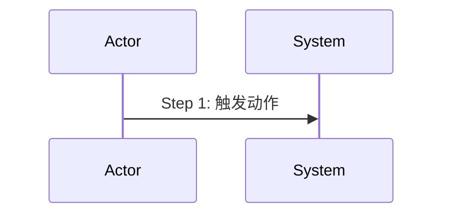

# Skill: Change Writer

> 辅助填写变更提案——分析变更影响范围，生成结构化的 proposal.md 和按阶段拆解的 tasks.md，确保变更可追溯、影响可控。

## 触发条件

- 用户刚运行完 `openlogos change <slug>` 并希望 AI 帮忙填写提案
- 用户描述需要修改、新增或删除某个场景/功能
- 用户提到"变更提案"、"change proposal"、"迭代"、"改需求"

## 前置依赖

1. 项目已初始化（`logos/logos.config.json` 存在）
2. 变更提案目录已由 CLI 创建（`logos/changes/<slug>/` 存在）
3. 主文档可读（`logos/resources/` 中有已生效的文档）

如果前置条件不满足，提示用户先运行 `openlogos change <slug>` 创建提案目录。

## 核心能力

1. 理解用户描述的变更意图
2. 扫描 `logos/resources/` 中的现有文档，定位受影响范围
3. 根据变更传播规则判断变更类型（需求级 / 设计级 / 接口级 / 部署级 / 代码级）
4. 判断本次变更是否需要部署、是否需要数据迁移、是否需要 smoke 验证
5. 生成符合规范的 proposal.md
6. 按变更类型自动拆解 tasks.md

## 执行步骤

### Step 1: 理解变更意图

与用户确认以下信息（信息不足则追问，最多 2 轮）：

- **变更是什么**：要新增、修改还是删除什么？
- **变更原因**：为什么要做这个变更？来自需求反馈、Bug 还是优化？
- **关联场景**：涉及哪些已有场景编号（S01, S02...）？

### Step 2: 分析影响范围

扫描 `logos/resources/` 中的文档，确定影响范围：

1. 读取需求文档（`prd/1-product-requirements/`），检查相关场景定义
2. 读取产品设计（`prd/2-product-design/`），检查相关功能规格和原型
3. 读取技术方案（`prd/3-technical-plan/`），检查相关架构、时序图、部署方案
4. 读取 API 文档（`api/`），检查相关端点
5. 读取 DB 文档（`database/`），检查相关表结构
6. 读取编排测试（`scenario/`），检查相关测试用例
7. 读取 smoke 测试用例（`test/smoke/`），检查部署后冒烟覆盖是否需要更新

### Step 3: 判断变更类型

参照变更传播规则确定变更类型及最小更新范围：

| 变更类型 | 最少需要更新 |
|---------|------------|
| 需求级变更 | 全链路（需求 → 设计 → 架构 → 部署 → API/DB → 测试 → 编排 → 代码） |
| 设计级变更 | 原型 + 场景 + API/DB + 测试/编排 + 代码 + 部署影响分析 |
| 接口级变更 | API/DB + 编排 + 代码 + 部署影响分析 |
| 部署级变更 | 部署方案 + smoke 用例 + `[deploy]` 任务 |
| 代码级修复 | 代码 + 重新验收 + 部署影响分析 |

### Step 4: 生成 proposal.md

`openlogos change <slug>` 已经在磁盘上写出完整的 `logos/changes/<slug>/proposal.md` 脚手架。
**在该文件上原地逐段填写，禁止整篇重写。**

理由：脚手架含若干**不由 lint 强制**的段（当前为「最小实现论证」）。整篇重写会把它们连同正文一起覆盖掉，
而没有任何检查会报错——这是一个静默丢失。

别把「canonical 段历次都幸存」当作整篇重写安全的证据：那只是 **L0** 在挡着，逼你把它们补回来。
而这层兜底比你以为的薄——**L7 的「UI/UX 声明段缺失」现已降为警告**（进 `warnings`、不计入 violations、
不影响退出码、不挡 merge，见功能规格 §2.83.1）；只有该段**在场但结构损坏**（fenced YAML 缺失 / 损坏 /
非对象、`ui_impact` 非布尔）才 fail-closed 拒绝 merge。它在 20260914 确实硬阻断过一次全自动 run，
正是那次事故之后被降级的。

所以如今真正被门守住的，只有 **L0 的 6 个 canonical 段**。其余的段——包括曾经硬阻断过的 UI 声明段、
以及从一开始就不设门的「最小实现论证」——都只能靠「不整篇重写」这条填写规则来保障。

填写规则见本 Skill **§canonical scaffold 保真**（先读脚手架、只替换占位正文、不删段）。此处不再复述，
也**不要**另写一套等价指令——那就是在制造下一个会漂移的来源。

**canonical 必填章节的唯一判据是 `PLAN_SECTION_REGISTRY`（`cli/src/lib/plan-package-contract.ts`）+ change-lint（L0 / L7）。**
本 Skill 不自列必填章节清单：清单写在文档里就会与脚手架、与判据三方漂移，而「某段是否必填」从来不由文档决定。
要知道当前必填哪些段，跑 `openlogos change-lint`，别查文档。

**逐段填写要点**（脚手架已给出段名与占位提示，这里只说每段要回答什么、什么算填好）：

- **变更原因** — 为什么要做？来源于哪个需求 / 反馈 / Bug？病灶写到可复现的程度，别停在「不够好」。
- **最小实现论证** — 三问必答：先检索了哪些既有机制（逐项说为何不够用或如何复用）、为什么不能更小、
  本提案主动砍掉了什么。**这一段不受任何检查约束，完全靠自律**——它作用在设计发生之前，是防过度设计
  三批里唯一的事前环节。写不出「砍掉了什么」，通常说明还没想清楚边界。
- **变更类型** — 需求级 / 设计级 / 接口级 / 代码级，四选一，并在括号里点明判断依据。
- **变更范围** — 逐类列出受影响的文档 / 场景 / API / DB / 测试 / 代码，精确到文件名与章节；
  无影响的类别写「无」，不要省略该行。范围必须与 `tasks.md` 的 `[delta]` 目标对账一致（见 Step 5）。
- **部署影响** — 六个字段全部给出明确布尔或枚举值，它是人工审核依据，也是 `[deploy]` section 的决策源。
- **UI/UX 变更声明** — GUI 模块必须在场并如实声明 `ui_impact`（判定规则见 Step 6 补充二）。
- **决策澄清** — 五类 impact 逐项给 status + reason；每条 decision 写清 choice 与 reason，
  `status: ready` 意味着你认为无待澄清项。
- **变更概述** — 1-3 段话说清具体改什么，让审阅者不读 delta 也能判断方案是否合理。

按段名给出的要点到此为止——**本步骤不提供、也不得提供任何可整块复制的 proposal 模板**。
形态来源只有一个：`openlogos change` 写在磁盘上的那份脚手架。

生成 `proposal.md` 后必须先保留部署决策结论，Step 5 生成 `tasks.md` 时必须与该结论一致。

### Step 5: 生成 tasks.md

根据变更类型和影响范围，使用结构化 section 格式生成任务清单。完整格式规范见 `spec/tasks-spec.md`。

> **禁止在 tasks.md 中写入 verify / smoke / 人工验证类条目**——这些属于独立 CLI 操作节点。tasks.md 只追踪 delta、代码和部署执行任务。

> ⛔ **严禁在 `write-tasks` 阶段规划或填写 `[code]` 切片**（enforce-slice-stage-ordering / split-slice-planner-stage）：`write-tasks` 节点**只产** `## [delta]` / `## [deploy]`。`## [code]` 切片由独立环节 **`slice-planner`** 在 **merge / no-delta spec-complete 之后**、对**已定稿规格 + 真实测试 ID** 划分（见 `skills/slice-planner/SKILL.md`）。**即使某些切片此刻看起来"显而易见"，也绝不在此处写任何 `[code]` 条目**——提前填充会被 CLI 在 `openlogos merge` 进入 spec-complete 前**自动清理作废**：把 `[code]` 重置为占位并把旧内容备份到提案目录 `CODE_AUTORESET`（可追溯、非无痕删除，见 `spec/flow-spec.md` §12.7）。清理不阻断流程、无人值守自愈，但**你提前划的切片一律作废**——因为它是对未定稿规格 + 占位测试 ID 划的，信息不全必然切错。本步骤**只保留空 `## [code]` 标题**（切片项不在 plan 段填写，由 spec-complete 后 slice-planner 划分）；下方模板中的 `[code]` 块仅示意最终形态。
>
> ⚠️ **`## [code]` 标题行必须保留**（fix-nodelta-proposal-routing）：`write-tasks` 产出的 `tasks.md` **至少要含一个 `## [tag]` section 标题**，否则 `parseTaskSections` 返回 `null`、派生降级为「旧格式兜底」而误判为 `delta-writing`（把纯代码提案错误派到 `write-delta` 节点、无人值守下死锁）。因此：有 `[delta]` 的提案 `[code]` 标题可留空或省略（已有 `[delta]` 标题）；**无 `[delta]` 的纯代码提案必须写出空的 `## [code]` 标题行**（标题在、条目空，由 no-delta `SPEC_MERGED` 后的 slice-planner 填切片）。

**格式规则**：
- `## [delta] <描述>` section：只列 delta 文档产出任务，每条对应一个 delta 文件
- `## [code] <描述>` section：launched 变更下**不在 plan 段填写**，由 merge 后的 `slice-planner` 产出；只列代码实现任务，直接修改源文件，不产出 delta
- `## [deploy] <描述>` section：只列部署执行任务，只能在 verify PASS 后、人类明确确认后执行
- 不需要部署的提案不得创建 `[deploy]` section
- 需要部署的提案必须创建 `[deploy]` section
- 需要部署的提案必须在 `[delta]` section 中包含部署方案和 smoke 用例变更（如受影响）
- **严禁混用**：delta 任务不得写入 `[code]` section，代码任务不得写入 `[delta]` section

**部署决策一致性自检（强制）**：

生成 `proposal.md` 和 `tasks.md` 后，必须逐项检查：

| 检查项 | 合法状态 |
|---|---|
| `proposal.md` 声明 `是否需要部署：否` | `tasks.md` 不存在 `[deploy]` section |
| `proposal.md` 声明 `是否需要部署：是` | `tasks.md` 必须存在 `[deploy]` section |
| `proposal.md` 声明 `是否需要 smoke：是` | `proposal.md` 必须同时声明 `是否需要部署：是` |
| `proposal.md` 声明无需部署 | 不得在 `[code]` 或 `[delta]` 中写部署执行任务 |

若自检失败，必须先修正 `proposal.md` 或 `tasks.md`，不得继续产出 delta。

**需要部署的变更模板**（`[code]` 块示意，merge 后由 slice-planner 填写）：

```markdown
# 实现任务

## [delta] 规格变更
- [ ] 产出 delta 文件到 `deltas/prd/3-technical-plan/3-deployment/` — 更新部署方案
- [ ] 产出 delta 文件到 `deltas/test/smoke/` — 更新部署后冒烟测试用例

## [deploy] 部署任务
- [ ] 按部署方案部署到 staging
- [ ] 确认迁移、配置、服务启动和回滚预案
```

**需求级 / 设计级变更模板**（有 delta + 有代码；`[code]` 由 merge 后 slice-planner 填写）：

```markdown
# 实现任务

## [delta] 规格变更
- [ ] 产出 delta 文件到 `deltas/prd/1-product-requirements/` — 更新需求文档中 S0x 的验收条件
- [ ] 产出 delta 文件到 `deltas/prd/1-product-requirements/` — 在场景总览表中新增/修改场景
- [ ] 产出 delta 文件到 `deltas/prd/2-product-design/1-feature-specs/` — 更新功能规格中 S0x 的交互设计
- [ ] 产出 delta 文件到 `deltas/prd/2-product-design/2-page-design/` — 更新原型
- [ ] 产出 delta 文件到 `deltas/prd/3-technical-plan/1-architecture/` — 更新技术架构
- [ ] 产出 delta 文件到 `deltas/prd/3-technical-plan/2-scenario-implementation/` — 更新 S0x 的时序图
- [ ] 产出 delta 文件到 `deltas/api/` — 更新 API YAML
- [ ] **验证 API YAML** — `logos/resources/api/` 下所有文件必须为有效 YAML 且符合 OpenAPI 3.x 规范（所有包含 `:` 或特殊字符的 `description`/`summary` 值必须用双引号包裹）
- [ ] 产出 delta 文件到 `deltas/database/` — 更新 DB DDL
- [ ] 产出 delta 文件到 `deltas/scenario/` — 更新编排测试用例
```

**纯代码修复模板（无 delta；保留空 `## [code]` 标题，切片由 no-delta merge 后 slice-planner 填写）**：

```markdown
# 实现任务

## [code] 代码实现
（本段在 plan 段留空：无 `[delta]` 时不进入 `write-delta`，但仍需执行 no-delta `openlogos merge <slug>` 写入 `SPEC_MERGED`，表示 spec-complete 已完成；随后由 `slice-planner` 基于已完成 spec-complete 的规格与真实测试 ID 划分 `[code]` 切片。此处仅保留 `## [code]` 标题，勿提前填写切片项。）
```

> **为什么保留空 `## [code]` 并仍需 no-delta merge**：`## [code]` 标题用于表达 `code_required==true` 与后续切片承载区；no-delta `SPEC_MERGED` 用于表达“规格阶段已完成且本次无文档 delta”。两者缺一不可。`change-writer` 不得把无 `[delta]` 解释为可直接进入 `plan-slices`，也不得提前填写 `[code]` 切片。

**有 delta 的代码必需提案也必须保留 `[code]` 标题（fix-missing-code-section-slice-gate）**：

在 split-slice-planner-stage 下，`change-writer` 仍然严禁在 plan 段填写 `[code]` 切片条目；但“保留空 `## [code]` 标题”和“提前填写切片条目”是两件不同的事。

- 凡 proposal / 用户描述 / delta 任务表明后续需要代码实现，`tasks.md` 必须保留空 `## [code] 代码实现` 标题。
- 该规则同时适用于有 `[delta]` 的代码级提案和无 `[delta]` 的纯代码提案。
- 如果 `[delta]` 会新增或修改 `UT-*` / `ST-*` / `SMOKE-*` 测试用例，且这些用例需要业务代码、测试代码、runner、reporter 或 golden 落地，则必须保留空 `## [code]` 标题。
- `## [code]` 标题下只能写占位说明，不得写任何 `- [ ]` 切片任务；真实切片由 merge 后 `slice-planner` 统一填写。

推荐占位：

```markdown
## [code] 代码实现
（本段在 plan 段留空：本提案需要代码实现，但 `[code]` 切片由 merge 后的 `slice-planner` 基于已合并规格和真实 UT/ST ID 统一规划。此处仅保留 `## [code]` 标题，勿提前填写切片项。）
```

缺失 `## [code]` 标题会让后续状态派生失去“需要切片”的结构锚点。在有 `[delta]` 且新增测试规格的代码级提案中，缺失标题不得被下游解释为“无需代码”；但 change-writer 必须从产物源头减少这种异常态。若不确定是否需要代码，优先保留空 `## [code]` 标题，让 merge 后的 slice-planner 基于已合并规格和真实测试 ID 作最终规划。

### Step 5 补充：[code] 良构切片（已迁至 slice-planner）

> **split-slice-planner-stage 起，`[code]` 切片划分整体迁出 change-writer**，由独立环节 **`slice-planner`** 在 **merge 之后**决定（见 `skills/slice-planner/SKILL.md`）。原"六维打分 + 良构切片"规则连同新增的"垂直/横向判别器"和"删后续证伪门"全部归 slice-planner 维护，是 launched 变更下 `[code]` 切片的**唯一事实源**。

为什么迁出：切片在 plan 段（merge 前）产出，会对**未合并规格 + 占位测试 ID**划分，信息不全易切错（实测曾切成横向分层）。挪到 merge 后，slice-planner 对**已合并规格 + 真实 UT/ST ID**切，并以删后续证伪门强制每片自闭环。

change-writer 在 launched 下**不再产出、不再打分、不再划分 `[code]` 切片**。

### Step 6: 产出 Delta 文件

**触发时机**：tasks.md 填写完成、用户确认提案后，按 `[delta]` section 的任务清单逐项产出 delta 文件。

**重要**：只执行 `[delta]` section 中的任务。`[code]` section 的任务在规格合并（SPEC_MERGED）后才开始执行。

#### 目录映射

Delta 文件写入 `logos/changes/<slug>/deltas/` 下对应子目录，与合并目标一一对应：

| 目标目录 | Delta 子目录 |
|---|---|
| `logos/resources/prd/` | `deltas/prd/` |
| `logos/resources/api/` | `deltas/api/` |
| `logos/resources/database/` | `deltas/database/` |
| `logos/resources/scenario/` | `deltas/scenario/` |
| `logos/resources/test/` | `deltas/test/` |
| 项目根 `spec/`（方法论规范，权威） | `deltas/spec/` |
| 项目根 `skills/`（Skill 文档，权威） | `deltas/skills/` |

> **根权威 → dogfood 副本为单向同步**：`deltas/spec/` 与 `deltas/skills/` 的合并目标是项目根 `spec/`、`skills/`；`logos/spec/`、`logos/skills/` 是 merge 后由既有同步机制再生成的副本，**不得作为 delta 直接目标**。该映射与 CLI `DELTA_TO_RESOURCE` 常量保持一致（一致性由回归测试锚定）。

`prd/` 下按子目录进一步对应：

| 目标主文档子目录 | Delta 子目录 |
|---|---|
| `logos/resources/prd/1-product-requirements/` | `deltas/prd/1-product-requirements/` |
| `logos/resources/prd/2-product-design/1-feature-specs/` | `deltas/prd/2-product-design/1-feature-specs/` |
| `logos/resources/prd/2-product-design/2-page-design/` | `deltas/prd/2-product-design/2-page-design/` |
| `logos/resources/prd/3-technical-plan/1-architecture/` | `deltas/prd/3-technical-plan/1-architecture/` |
| `logos/resources/prd/3-technical-plan/2-scenario-implementation/` | `deltas/prd/3-technical-plan/2-scenario-implementation/` |
| `logos/resources/prd/3-technical-plan/3-deployment/` | `deltas/prd/3-technical-plan/3-deployment/` |
| `logos/resources/test/smoke/` | `deltas/test/smoke/` |

代码实现（`src/`、`test/`）**不产出 delta**，直接修改源文件。

部署相关行为规范：

- 需要部署时，必须产出部署方案 delta
- 需要部署且 smoke 覆盖受影响时，必须产出 smoke 测试用例 delta
- 不允许把部署执行命令写入 `[code]` section
- 不允许 AI 在 delta-writing 阶段执行部署命令

#### 文件命名

与目标主文档**同名**（含子目录层级）。例如：
- 目标：`logos/resources/api/core-api.yaml` → delta：`deltas/api/core-api.yaml`
- 目标：`logos/resources/prd/1-product-requirements/core-01-requirements.md` → delta：`deltas/prd/1-product-requirements/core-01-requirements.md`
- 目标：`logos/resources/test/core-S01-test-cases.md` → delta：`deltas/test/core-S01-test-cases.md`

#### 文件格式

每个 delta 文件使用 `ADDED / MODIFIED / REMOVED / REMOVED-ITEMS` 标记，每个标记块对应主文档中的一个章节：

```markdown
## ADDED — [新增章节标题]
[新增的完整内容]

## MODIFIED — [修改章节标题]
[修改后的完整内容，merge 时替换主文档中同名章节]

## REMOVED — [删除章节标题]
[说明删除原因，merge 时删除主文档中同名章节；建议列出该节 ID 供审计]

## REMOVED-ITEMS — [被删条目所在章节锚]
[纯声明性标记，merge 不据其执行编辑：逐行点名被删 ID]
```

**守恒写作规范（S37，merge-conservation-archive-audit，强制）**：

1. **MODIFIED 必须携带整节全量内容**——它是整章节替换，不是"只写改动的部分"。凡目标章节内未变更的**结构化条目**（测试表 ID 行、场景表行、编号小节），必须原样抄入 MODIFIED 块的对应结构位置；漏抄 = 隐式删除，会被 change-lint L8 与 `openlogos merge` 双侧拒绝。**注意：仅在散文里提及 ID 不算保留**——守恒按结构位置计数（测试表 ID 首列、场景标题/表行首列、标题行节号）。
2. **删除整个章节**用既有 `REMOVED — <唯一章节锚>`（语义不变，整节删除；该节 ID 随节显式删除）。
3. **删除章节内部分条目**必须成对写：`MODIFIED — <章节锚>` 携带删除后剩余的全量内容 + `REMOVED-ITEMS — <同一章节锚>` 逐行点名被删 ID，固定语法：

   ```markdown
   ## MODIFIED — 四、smoke runner 覆盖强制规则发布后冒烟用例 > 二、冒烟测试用例补充
   [该小节删除后剩余的全量内容]

   ## REMOVED-ITEMS — 四、smoke runner 覆盖强制规则发布后冒烟用例 > 二、冒烟测试用例补充
   - SMOKE-core-31 — runner 覆盖检查项已由 SMOKE-core-51 取代
   ```

   REMOVED-ITEMS 是纯声明（merge 不据其编辑），点名 ID 必须属于锚定章节；只点名不配 MODIFIED、或点名别的章节的 ID，都会被拒绝。
4. **章节锚必须唯一可定位**：目标标题在主文档中重复时（如 smoke 规格中 `二、冒烟测试用例补充` 出现 7 次），必须用标题路径锚 `父级标题 > 目标标题`；锚解析不到或命中多个会被 fail-closed 拒绝（`delta_section_anchor_unresolvable`），不要指望工具猜。
5. 产出 delta 前先读目标主文档被触及章节，抄录其全部既有结构化 ID 清单核对一遍——"合并后这些 ID 是否都有去处（结构位置保留 / REMOVED-ITEMS 点名 / 随整节 REMOVED 删除）"。
6. 无稳定 ID 的散文改写不受机器门约束，但同样不得借 MODIFIED 顺手删除与本次变更无关的内容。

#### 行为规范

- 每完成一个 delta 文件，立即将 `tasks.md` 中对应条目从 `[ ]` 更新为 `[x]`
- **禁止直接修改 `logos/resources/` 下的主文档**——所有规格变更必须通过 delta 文件，由 `openlogos merge` 统一合并
- 全部 delta 产出完成后，提醒用户明确授权运行 `openlogos merge <slug>`

### Step 6 补充：plan 门与 delta / no-delta spec-complete 时机

change-flow-redesign 把前段流程拆为 `plan{写提案, 划分tasks}` → `spec{写delta 或 no-delta spec-complete}` → `merge/spec-complete`，并在 `plan` 出口新增「批准方案」人类门。split-slice-planner-stage 起，`[code]` 切片划分移出 plan 门，改在 spec-complete 后 `slice` 段由 `slice-planner` 产出。

- 有 `[delta]` 的提案：plan 门确认后，change-writer 只按 `[delta]` section 产出 delta 文件；全部完成后提醒用户或 driver 执行 `openlogos merge <slug>`。
- 无 `[delta]` 的纯代码提案：change-writer 不产 delta；plan 门确认后，下一步是 no-delta `openlogos merge <slug>` 写入 `SPEC_MERGED`，再由 `slice-planner` 规划 `[code]`。
- 任意代码提案：测试 ID 未稳定时不得进入 `plan-slices`，不得用占位 ID 预写切片。

## Step 6 补充二：GUI 项目提案阶段前置 UI/UX 原型（proposal-ui-ux-first）

对已 `launched` 的 **GUI 产品项目**（网站 / 桌面应用 / 移动 App），当本次变更触及界面时，change-writer 在**提案阶段**（plan 节点、`plan-exit` 门**前**）就用 `ui-ux-pro-max` 设计系统产出界面原型，使用户在批准提案时（**面板已渲染原型的前提下**）连界面一起确认，避免「批准后自动实现才发现界面不对」的高成本返工。**复用现有 `plan-exit`（批准方案）门——不新增门态、不新增确认标记、不新增 `ui/` 目录。** 非 GUI 项目（纯 CLI / API / 纯后端服务 / Skills）整个特性不启用，本节全部跳过、流程零改动。

> 本节只定义 change-writer 侧的 **producer 产出职责与可交付要求**；driver 在 plan 节点**派发** change-writer 产原型（producer dispatch）、面板渲染原型、批准时写 provenance 均归 runlogos 关联 change `ui-ux-first-panel`，本节不含其实现。

### ① 触发条件：先判 `product_type`，再判本次是否动界面（去循环依赖）

判定在 **plan 阶段由 change-writer 执行**，分两层，**依据是「提案意图 + 已规划的 `[delta]` 目标」，而非扫描尚不存在的 delta 文件内容**（plan 阶段无 delta 可扫，「先 delta 还是先原型」构成循环依赖，故不扫 delta 内容）：

1. **先判 `product_type` 是否 ∈ GUI——唯一依据 = `logos/logos-project.yaml` 中本提案所属模块的 `product_type` 字段**（fix-ui-declaration-source-skew-and-missing-degate）：
   - **与 change-lint L7 同源**：L7 按 `product_type ∈ {web, desktop, mobile}` 激活（模块归属经同一 proposal-context resolver 语义解析，见功能规格 §2.30）。change-writer 读**同一个 yaml 字段**、得同一个结论——producer 判定与门判定单源，不存在漂移空间。
   - **禁止自由裁量**：不得按提案语义、变更内容、`tech_stack` 观感或对代码库的印象改判项目类型。`product_type: desktop`（或 web / mobile）项目里的「纯 CLI 判据修复」提案**仍然是 GUI 项目的提案**——「本次没动界面」表达为 `ui_impact: false`，**绝不**表达为「把项目当作非 GUI、整节跳过」。
   - **判定映射**：`product_type ∈ {web, desktop, mobile}` → GUI 类，进入第 2 层判定；其余取值（`cli` / `library` / `api` / `service` / skills 等）→ 非 GUI 类，整节跳过、`ui_impact` 恒为 `false`、不注入声明段。
   - **严禁删除脚手架结构必填段（GUI 模块）**：`openlogos change` 的 proposalTemplate 已为 GUI 项目生成「UI/UX 变更声明」段（默认 `ui_impact: false`）——产物侧本无缺口。**填写 `proposal.md` 时该段必须在场并如实声明**：本次不动界面就保留段并如实写 `ui_impact: false`；仅 `product_type` 非 GUI 的模块才允许该段不存在。（脚手架全部段的保真要求见 §canonical scaffold 保真；`proposal.md` 本就不得整篇重写，故本条不以「整篇重写时」为前提。）
2. **再判本次是否动界面**（仅当 `product_type ∈ GUI`）：
   - **依据 = 提案意图 + `tasks.md` 已规划的 `[delta]` 目标是否命中 `2-page-design/`，或命中含交互变更的 feature-specs delta**。命中即**强制判为「动了界面」**（`ui_impact:true`）。
   - **窄例外（命中 `2-page-design/` 时）**：仅当目标为**页面原型产物**（`.html`，或含 `pages` 声明）才强制 `ui_impact:true`；若目标是**纯 CLI 体验文本规格**（`.md` 且**无** `pages` 声明），不强制 `ui_impact:true`。
   - **不扫描尚不存在的 delta 内容**（去循环依赖）。
   - 可选多 agent 复核默认**关**，可由 driver 派发。

**删段的真实后果（20260914 事故实证，替代已被证伪的「判错代价可控」断言）**：change-lint L7 按 yaml `product_type` 激活并检查声明段在场性；agent 按提案语义误判「非 GUI」而删掉脚手架段后，全自动 run 的 `openlogos merge` 曾被 `ui_declaration_missing` 在 spec-exit 后挡停——producer 已出环、重驱确定性复撞、需要人工补段才能恢复。判定源不同源导致的删段不是「顶多多画一次或退回重设」，而是无人值守链路的硬停等人。缺段现已由 L7 降为**警告** + 消费侧派生 `ui_impact:false` 安全默认（防线纵深，见功能规格 §2.83），但警告仍是流程噪音且丢失「如实声明」的语义——**规则是不删段，降门只是删了之后的兜底**。声明段在场但写坏（fenced YAML 缺失 / 损坏 / 非对象、`ui_impact` 非布尔）仍 fail-closed 拒绝 merge：脚手架已提供合法骨架，写坏必有因。

### ② change-writer 作为 plan 节点 producer，被 driver 在 plan-exit 门前 dispatch 产原型

- 原型产出是 **plan 节点门前的普通内容生成**，授权状态与「写 `proposal.md` / `tasks.md`」**完全相同**——**不新增授权、不新增门**。唯一人类确认点仍是 `plan-exit`。
- driver 在 plan 节点判定 `ui_impact:true` 且**前置能力就绪**时，**派发 change-writer（用 ui-ux-pro-max）在 `plan-exit` 前产出原型**（producer dispatch）。这属既有 plan 节点执行范围，driver 实现归 runlogos `ui-ux-first-panel`。
- change-writer 的写入由 guard 的 **plan 阶段写入 allowlist（仅放行 `deltas/prd/2-product-design/2-page-design/*.html`）** 授权；其余 `deltas/**` 在 plan 阶段仍禁止写入，越界路径被 guard 拒。
- `--auto` 下 `plan-exit`（`skippable:true`）自动放行，但原型已在门前产出、provenance 已记录。

### ③ ui-ux-pro-max 生成步骤（调用设计系统）

复用 product-designer 的 Step 5a UI/UX 子流程（见 `skills/product-designer/SKILL.md`），在提案阶段前移使用：

1. 从提案意图 + Phase 1 需求文档提取关键词：产品类型（SaaS / e-commerce / dashboard / portfolio 等）+ 行业 + 风格倾向。
2. 调用 `ui-ux-pro-max` 获取设计系统（风格 + 调色板 + 字体配对 + 登陆页模式 + 反模式清单），并落地 `design-system.json` 令牌（此为正常路径，置 `design_system_mode: generated`）：
   ```bash
   python3 logos/skills/ui-ux-pro-max/scripts/search.py "<product_type> <industry> <style_keywords>" --design-system -p "<项目名>"
   ```
3. 以设计系统为视觉基础，为**结构化声明清单里的每个页面**（每条 `id` / `prototype`）产出裸 HTML 原型（关键几屏 + 各交互状态：空态 / 加载 / 正常 / 错误 / 边界态）。

### ④ 可交付要求：声明清单 == 产出文件（F1 R5，逐页 + 非空 + 令牌）

「文件存在」只是弱收敛（文件可能为空、非 ui-ux-pro-max 产物、或声明多页只产一页）。change-writer 的**可交付标准**收紧为：

- **逐页非空**：UI/UX 变更声明段声明的**每一个页面**（结构化清单中每条 `id` / `prototype` 记录），都在 `deltas/prd/2-product-design/2-page-design/` 下有 basename 精确匹配的**非空原型文件**（不是「至少一个文件」）。
- **令牌追溯（仅 `design_system_mode: generated`）**：`design_system_mode: generated` 时，提案目录 `logos/changes/<slug>/` 下留存合法非空 `design-system.json`（ui-ux-pro-max 令牌），把每个原型系到设计系统。`design_system_mode: fallback` 时**不产 / 不要求 `design-system.json`、禁伪造令牌**（详见 ⑥）。
- **完整性判据（三方对账，按 basename 集合）**：(i) `proposal.md` 声明段 `ui_impact` + 结构化声明页清单（每条的 `prototype` basename）；(ii) `2-page-design/` 下实际产出的原型文件 basename；(iii) merge 落盘 / 面板渲染对象。**声明清单 basename 集合 == 产出文件 basename 集合** 为完整性判据（排序无关；重复 / 额外 / 缺失均失败）；不一致 = 节点未收敛（advisory）。`PLAN_APPROVED.pages` / `hashes` 复用同一 basename 键。
- 该可交付要求由 overlay-add 节点 `write-ui-prototype` 的 `done_when: cmd:<check-ui-prototype>` 做**富对账**作为 `plan-exit` 前的机器收敛条件——命令 `exit 0` 节点才 done、plan 子流程才完成、plan-exit 门才可放行。checker 按 `design_system_mode` 分流：
  - `generated` → 合法非空 `design-system.json`（令牌）+ 逐页非空 + 声明清单==产出文件（basename 集合一致）→ `exit 0`；`generated` 但无令牌 → fail closed。
  - `fallback` → 必须有非空 `design_system_fallback_reason`（如「Python3 缺失」），**禁伪造令牌、不要求 `design-system.json`**，逐页非空 + 清单一致即 `exit 0`（不阻塞、plan-exit 可到达）。
  - 其它值 / 缺 `design_system_mode` 字段 → fail closed。
- **残差（如实标注）**：「HTML 是否*真出自* ui-ux-pro-max」除 `design-system.json` 令牌可追溯外**无法纯机器证明**——这是既有 acceptance 口径下的荣誉制 + 令牌追溯限制，如实记录、非遗漏。

### ⑤ 原型作为 page-design delta 产出 + 填写声明段

- **原型路径**：直接作为 page-design delta 写入 `logos/changes/<slug>/deltas/prd/2-product-design/2-page-design/core-NN-<slug>.html`（裸 HTML，可直接 iframe 渲染）。
- **不新增 `ui/` 目录、复用现有 delta 路径映射**（`deltas/prd/** → resources/prd/**`）：面板已用 `readDir(deltas/**/*)` 列出可直接渲染。但原型资产的落盘**不复用 `scanDeltas`/merge-executor 的整份拷贝路径**——所有 `ui_impact` 原型一律由 `openlogos merge` 内专用事务落盘入口 `commitVerifiedPrototypes()` 统一提交（严格模式对 staged 字节做 hash 校验 + 原子提交；advisory 模式同一入口、不做严格 hash 校验），**merge-executor 绝不触碰原型资产**、无第二条绕过路径。「复用路径映射」仅指无额外人工步骤，**非**「无新代码路径」。
- **填写声明段**：在 `proposal.md` 的「UI/UX 变更声明」段写入：
  - `ui_impact`：布尔（本次是否触及界面，权威意图源 / 单一事实源）。
  - `design_system_mode`：`generated | fallback`（是否走了设计系统的单一权威事实源）。`generated` 时同时产出 `design-system.json`；`fallback` 时须填 `design_system_fallback_reason` 且不产 / 不要求 `design-system.json`（见 ⑥）。
  - **结构化声明页清单**：本次原型应覆盖的每个页面 / 屏幕作为一条**结构化记录**填写——每页一个唯一 `id`、精确的 `prototype` basename（仅文件名，禁 `..` / 子目录，扩展名必须 `.html`，全清单唯一）、一句话 `description`：
    ```
    - id: <unique-page-id>
      prototype: core-NN-<slug>.html
      description: <一句话>
    ```
    以 `prototype` basename 集合保证「声明清单 == 产出文件」可机器判定（排序无关；重复 / 额外 / 缺失均失败）。
- `proposal.md` 保持 markdown 结构不变，避免打断 CLI / runlogos 对 proposal 的解析。声明段是下游 `flow-derive` / guard / 面板 / checker 的**唯一意图事实源**，不引入第二处判定。

### ⑥ Python3 降级：置 `design_system_mode: fallback`（通用风格兜底，不阻塞、不产令牌）

检测不到 `python3` 时跳过 ui-ux-pro-max 调用，提示用户「检测到 ui-ux-pro-max 依赖的 Python 3 不可用。原型将使用通用风格生成。如需专业级设计系统建议，请安装 Python 3 后重试。」：

- 原型**用通用风格继续产出**结构化声明清单里的每个页面，**不阻塞、不报错**。
- 在声明段置 `design_system_mode: fallback` 并填 `design_system_fallback_reason`（如「Python3 缺失」）；此情形下**不产出 / 不要求 `design-system.json` 令牌，禁伪造令牌**。
- 此时 checker `check-ui-prototype` 走 `fallback` 分支：只要 `design_system_fallback_reason` 非空、逐页非空、声明清单 == 产出文件（basename 集合一致）即 `exit 0`——**不因缺 `design-system.json` 而阻塞**，plan-exit 门可到达。这消解了「降级不产令牌，但 `done_when` 却强制要 `design-system.json` → 卡死」的矛盾。
- 正常路径（`python3` 可用、走了设计系统）则置 `design_system_mode: generated` 并产出 `design-system.json`（见 ③ / ④），checker 走 `generated` 分支要求合法非空令牌。
- 与提案「Python3 缺失时以通用风格兜底并标注，不阻塞」的口径一致。


## Step 6 补充三：决策记录沉淀（S38，decision-record-capability）

> 来源变更：decision-record-capability（社区 RFC issue #12 补充观察）。承接 S37 archive audit-only 契约——决策理由不能只活在归档的 proposal 里。

设计决策的**理由**若只写进 proposal 的「变更原因」，归档后即失联、archive 删除即彻底消失。为把「为什么这样设计」沉淀为可检索的活文档，change-writer 在提案阶段判断本次是否立下值得长期复盘的**拍板决策**；若有，产出决策记录。

### ① 何时升格为决策记录（升格判据）

「变更原因」是**每案必填**的叙述性动机——留在 `proposal.md`，**不复制进 resources**。决策记录是**少数**值得长期复盘的拍板，满足任一即升格：

1. 立了未来变更必须遵守的**不变量 / 约束**；
2. 在**真实备选之间**做了取舍，且被否选项将来可能被重新提出（记下理由以免反复争论）；
3. **跨多个规格 / 组件**。

**一句话测试**：「读合并后的规格本身，能否还原这个 why？」——能→**不升格**；规格只说 what、而 why 与被否方案会随 proposal 归档丢失→**才升格**。明确**不升格**：bug 修复、机械重构、发版 bump、trivial 改动。宁缺毋滥——每个提案都写决策记录会把 archive 的检索污染搬进 resources，违背本能力初衷。

### ② 产出方式（可选章节 + deltas/decisions/）

- 判定需要升格时，在 `proposal.md` 新增**可选**章节「## 已确定的设计决策」：每条含**拟定** `DXX`、决策一句话、理由摘要。**拟定号仅为占位、不硬编定死**——最终 `DXX` 由 merge-executor 在 apply 时按分配公式定号：`base = max(configured_next_id ?? 1, max(【已落盘】DXX，空集=0)+1)`（**基准只含已落盘、不纳入本批待落盘 DXX**，delta-r2 F5），候选按稳定序第 `i` 条 `expected_i = base + i`，校验「文件名==标题==`expected_i`」、拒重复。
- 在 `tasks.md` `[delta]` 规划决策记录 delta：`deltas/decisions/<module>-DXX-<slug>.md`（目录映射 `deltas/decisions/ → logos/resources/decisions/`；**该类别须先由 decision-record-capability 的代码注册，注册前会被判 `delta_path_invalid`**，delta-r1 F1）。
- 决策记录文档结构（标准 ADR 变体，见 feature-specs §2.34.2）：**状态**（`proposed` / `accepted` / `superseded by DYY`）、**背景**、**决策**（一句话可引用）、**理由**（含关键论据与实证）、**备选方案**（被否选项 + 否掉原因）、**影响面**（约束哪些规格 / 代码 / 流程）、**来源**（提案 slug + issue 链接）。
- `DXX` 全局唯一，由 `logos-project.yaml` 的 `decision_counter.next_id` 维护（对齐 `scenario_counter` / `feature_counter` 的「AI 维护、CLI 不取号」语义）；**取号 / 递增在 merge-executor apply 时**（不是 `openlogos merge`，delta-r1 F2），见 `skills/merge-executor/SKILL.md`。
- **不含「已确定的设计决策」章节的提案：不产决策记录、全流程零负担**；决策记录走既有 delta → merge → merge-executor apply 通道，**不新增 `openlogos decision` CLI 命令**。

### ③ 推翻旧决策（superseded，不删除）

新决策推翻旧决策时**不删除**旧记录：用 `MODIFIED` 携旧记录整条剩余全量、仅把「状态」改为 `superseded by DYY`，并在新记录「来源」引用旧 `DXX`。`DXX` 纳入 S37 守恒门 ID 注册表——决策记录条目删除必须显式（`REMOVED` / `REMOVED-ITEMS` 点名），隐式删除会被 change-lint L8 / merge 拒绝。

### ④ change-lint 提示（warning 级）

proposal 含「已确定的设计决策」章节但 `[delta]` 无 `deltas/decisions/` 任务时，`openlogos change-lint` 产 **warning**（`decision_record_section_without_delta`，走独立 `warnings[]` 通道，**不改 exit code、不阻断门**）——提醒补决策记录 delta 或移除该决策章节。它是提醒而非硬门（「是否值得记决策」是判断题、非机器可判定事实）。

### Step 7: 引导后续操作（链式驱动）

提供一条可直接执行的提示词，让用户一句话启动全部任务的链式执行：

- **需求级 / 设计级变更**（多任务）：建议用户说「按 tasks.md 帮我逐步更新 S0x 的所有受影响文档」
- **代码级修复**（少任务）：建议用户说「帮我修复 S0x 的 [问题描述] 并重新验收」

链式执行的行为规范：
1. AI 读取 `tasks.md`，按顺序逐项执行
2. **每完成一项任务，立即将 `tasks.md` 中该项从 `[ ]` 更新为 `[x]`**（AI 主动执行，无需用户提醒）
3. 每完成一项任务，汇报修改摘要，并自动提示「继续下一项？」
4. 用户说「继续」或给出调整意见后，执行下一项
5. 全部任务完成后，提醒用户明确授权运行 `openlogos merge <slug>`

**关键原则**：不要让用户手动跟踪任务清单——AI 应主动驱动流程。

**`openlogos merge` 和 `openlogos archive` 是人类确认点**：
- AI 未经用户明确授权不得自行执行这两个命令
- 用户明确要求执行（包括使用 `/openlogos:merge`、`/openlogos:archive` slash command）时，AI 可以代为执行
- 不得在"顺手完成流程"、"按流程走完"、"继续"等隐式场景中自动触发

**两档模式（半自动 / 全自动）的授权语义**：

- **半自动 / 手动（无 `--auto`）**：所有人类确认点行为**完全不变**——`merge`、部署执行、`smoke`、`archive`、`git push` 仍各自停在对应门，逐次等人类明确授权。
- **全自动 / 无人值守（`openlogos next --auto`）**：`--auto` 的含义被重定义为一次性的 **standing run-scoped 授权**——用户选择 `--auto` 即在本次运行域内一次性授权全链路自动到底，无需对每道门逐次再确认。

**全自动 `--auto` 下的自动放行范围（依据 `spec/change-management.md` §143「无人值守 skip-gate 例外」）**：
- `spec` 出口门（`spec-exit`，审 delta + 授权合并）与 `deliver` 入口门（`deliver-entry`，部署执行）这两道 `skippable:true` 门可被**编排器（driver）**自动放行。据此 `openlogos merge` 由编排器凭本次 `next --auto` 响应的 `gate_auto_passed=true` 执行，无需逐次人类授权。
- **「代码已绿后的盖章 / 发布」4 样红线在全自动下由 standing 授权自动放行**：`openlogos verify`、`openlogos smoke`、`openlogos archive`、`git push`。它们均属"代码已收敛/已绿之后"的盖章或发布动作，`--auto` 下凭用户选择 `--auto` 这一次性授权放行，半自动 / 手动下仍逐次须人类明确授权。
- 可跳门每次放行向 `GATE_AUTO_PASSED` 追加一行审计（append-only，历史审计行不构成对后续动作的授权）；`git push` **无需任何 marker / guard 改动**——`plugin/bin/guard-check` 的安全白名单本就含 `^git push`、PreToolUse guard 从不拦截 `git push`，全自动下它是否执行纯由生成进 AGENTS.md / CLAUDE.md 的指令文本授权。
- **被派发的 change-writer agent 自身仍不直接执行 `openlogos merge`**：产出全部 delta 后停手、把控制权交回编排器，由编排器走自动合并。这与默认/手动模式下"提醒用户授权"并不矛盾——`--auto` 只是把"授权"前置到了用户选择 `--auto` 这一步。
- **硬红线（任何模式都绝不自动放行，含 `--auto`）**：`gate:implement:loop-exhausted`（未收敛 / 未绿代码，默认 `skippable:false`）。这是唯一在 `--auto` 下也始终须人类明确授权的门，现有逻辑一字不改——自动放行只发生在"代码已绿"之后，绝不跨越"代码未绿"这条线。

merge 后的后续提示应按半 / 全自动两档区分：

- **半自动 / 手动**：
  - 不需要部署：实现代码 → 用户授权 `openlogos verify` → 用户授权 `openlogos archive` →（如需）用户确认 `git push`
  - 需要部署：实现代码 → 用户授权 `openlogos verify` → 用户明确授权部署 → 用户授权 `openlogos smoke` → 用户授权 `openlogos archive` →（如需）用户确认 `git push`
- **全自动 `--auto`**：代码绿后 `verify` / 部署执行 / `smoke` / `archive` / `git push` 均由 standing 授权经编排器自动放行（可跳门逐次写 `GATE_AUTO_PASSED` 审计；`git push` 由 guard 本就放行 + 指令文本授权，不涉及任何 marker），无需逐次人类授权；唯独 `loop-exhausted`（代码未绿）仍停门等人类。

AI 只负责驱动内容修改。半自动 / 手动下不得在未获明确授权的情况下推进提案状态；全自动 `--auto` 无人值守下，对 `spec-exit` / `deliver-entry` 两道可跳门，以及代码绿后的 `verify` / `smoke` / `archive` / `git push` 的放行均属 §143 standing 授权范围内的自动推进，放行依据为本次 `next --auto` 响应的 `gate_auto_passed=true`（`git push` 由 guard 本就放行、全自动下纯由指令文本授权，无需 marker / guard 改动），但 `loop-exhausted` 永不在自动放行之列。

## 输出规范

- 文件格式：Markdown
- 存放位置：`logos/changes/<slug>/`
- 文件名：`proposal.md` 和 `tasks.md`（覆盖 CLI 生成的模板）

## 实践经验

- **宁可高估影响范围**：漏掉一个环节的更新比多检查一遍更危险
- **变更类型决定工作量**：帮助用户在动手前理解改一个需求可能需要全链路更新
- **tasks.md 是执行清单**：每完成一项打一个 `[x]`，方便追踪进度
- **小变更也走流程**：看似"只改一行 API"的变更，可能影响编排测试和代码

## 推荐提示词

以下提示词可以直接复制给 AI 使用：

**填写提案**：
- `帮我填写变更提案 <slug>`
- `我要给 S02 登录场景加一个记住密码功能，帮我分析影响范围`
- `这个 Bug 修复只涉及代码层，帮我快速写个提案`

**执行任务（提案填写完成后）**：
- `按 tasks.md 帮我逐步更新 S02 的所有受影响文档`
- `帮我修复 S02 登录接口的 500 错误并重新验收`

## 硬性交付门：openlogos change-lint（Step 5 / Step 6 完成后强制）

> change-lint-shift-left 起，本 Skill 的自检从「逐项人工核对」升格为**机器硬门**。适用于 Step 5（`proposal.md` + `tasks.md` 生成完毕、含部署决策一致性自检表核对之后）与 Step 6（全部 delta 文件产出完毕之后）两个交付点。

**规则（强制）**：

1. 每个交付点完成后，必须运行：
   ```bash
   cd <项目根目录> && openlogos change-lint
   ```
   （检查活跃提案；需要时可 `--slug <slug>` 显式指定，`--format json` 供程序化消费。）
2. **exit 0 才可交付**——才允许报告"本步骤完成"、把控制权交回用户或 driver。
3. **exit 2（检查红）**：按输出中每条 violation 的「缺什么 / 在哪补 / 补成什么样（fix_hint）」逐条修复后**重跑**，直至 exit 0；禁止带红交付。
4. **exit 1（操作错误）**：按 stderr message 排障（如无活跃提案、slug 非法），修复环境后重跑。
5. 该命令只读、非人类确认点，运行不需要额外授权，也**不**替代 `openlogos merge` 等人类确认点。

**plan 段的 L3 证据指引**（避免死锁与假通过）：plan 阶段测试 ID 通常尚未定稿，L3 只认两种证据——(a) `tasks.md` `[delta]` 中规划了测试规格 delta（目标含 `deltas/test/`）；(b) `proposal.md` 中标题**精确**为 `## 复用测试 ID` 的小节，每行 `- <ID> — <一句话用途>`，ID 必须**精确存在于已合并** `logos/resources/test/` 规格（固定语法与逐项判定规则见功能规格 §2.30）。**禁止**用占位 ID（`UT-Sxx-xx`、`TBD`、`TODO`）或通配族名（`UT-Sxx-*`）蒙混——lint 与 flow-derive 一律拒绝采信。注意证据等级随阶段自动升级：`[delta]` 任务**全部勾选**后，任务文字里的 `deltas/test/` 规划字样不再充当证据，必须有实际产出的测试 delta 文件或合法复用清单。**producer 规则**：`[delta]` section 只含一文件一任务的 delta 产出 checkbox；非 delta / merge-time 工作（如「merge 时同步更新元数据」）**不得以 checkbox 形式写入 `[delta]`**（用说明文字或独立小节承载）——否则延后条目会把已完成的 delta 证据等级错误压回 plan 级（阶段分类的勾选度计数基仅含 delta 产出条目，见功能规格 §2.30）。

**delta 产出的 L4 提醒**：每个 `.md` delta 必须含 ADDED/MODIFIED/REMOVED（或搭配 REMOVED-ITEMS）段标记**且**已把模板占位字面量（如 `[新增章节标题]`、`[新增的完整内容]`）替换为真实内容——只要正文中残留任一**独占一行**的占位字面量（含「真实内容 + 未替换占位行」的混合形态）即命中模板骨架，会被 lint 与 merge 同时拒绝；行内代码/代码围栏中的引用不受影响。

**delta 产出的 L8 提醒（S37 条目守恒）**：每个触及带稳定 ID 条目规格的 `.md` delta，其 MODIFIED 块必须在**结构位置**携带目标章节全量既有 ID 条目（散文提及不算保留）；删整节走 REMOVED，删部分条目走「MODIFIED 剩余全量 + REMOVED-ITEMS 同锚点名」成对写法；标题重复时用标题路径锚（` > ` 连接父级）。既有 ID 未保留、未点名、未随整节删除 → `delta_implicit_id_removal`；点名越界 / 拼写不存在 → `delta_removed_unknown_id`；锚解析 0 或多命中 → `delta_section_anchor_unresolvable`。lint exit 2、merge 拒绝生成 MERGE_PROMPT。全新文档 delta 不受守恒约束。交付前按「守恒写作规范」第 5 条自查一遍 ID 去处。

## S39：按触达目标形成规格闭包（baseline-on-touch）

> 本节在 launched change 的 Step 2、Step 5、Step 6 强制生效；权威契约见 `spec/baseline-closure.md`。它替代“用户先单独建全局基线”的默认工作方式，但不删除显式可选的 brownfield seed。

### Step 2 扩展：先识别触达场景，再枚举目标

1. 从 proposal 意图提取用户可观察行为、验收与非目标。
2. 读取 `logos-project.yaml`、resource_index 及关联需求/feature/scenario；必要时只读代码、测试、配置、路由、DDL 与 committed seed。
3. 绑定已有 feature/scenario；不存在稳定身份时规划新 scenario。
4. 对每个场景按 Why → What → How 枚举：requirement、feature、architecture、scenario sequence、API、DB、UT/ST、API orchestration、deployment/smoke。
5. 每个类别记录适用性证据；API 必须从时序派生，API 适用则编排测试适用。
6. 代码/测试只证明现状；本次意图来自 proposal。无法判断的产品选择标 `AMBIGUOUS`，不猜测。

adopted 项目的 `baseline_seed_state` 任意值都不构成 change 前置门；但在读取 resources/index/coverage 或运行 EvidenceScanner 之前，必须先在同一模块锁内检查并恢复未终结 seed commit journal。只有恢复成功、确认不存在未终结 journal，或仅有可排除的 open run/未提交 staging 时才能执行本步骤；无法恢复硬报 `baseline_commit_in_progress`。历史自动 `skip_phases` 仅豁免 Initial 完整性，不能永久屏蔽本次实际适用目标。

### Step 5 扩展：闭包声明与一目标一 task

proposal 必须写：

```yaml
baseline_closure:
  policy: on-touch-v1
  schema_version: 1
  unit: canonical-merge-target-path
  delta_cardinality: exactly-one-per-non-skip-target
  effective_view: merged-resources-plus-current-change-deltas
  ambiguity: block-before-existing-plan-exit
  standalone_baseline_required: false
  jit_confirmation: disabled
  touched_scenario_ids: [S05, S39]
  targets:
    - category: scenario
      scenario_ids: [S05]
      mode: MODIFY
      delta_path: "deltas/prd/3-technical-plan/2-scenario-implementation/core-S05-next-guidance.md"
      reason: "本案改变 next 的 adopted 默认动作。"
      evidence: ["target_exists: logos/resources/prd/3-technical-plan/2-scenario-implementation/core-S05-next-guidance.md"]
      missing_evidence: []
```

这是唯一持久计划源；人读矩阵只能由它投影。`touched_scenario_ids` 必须独立列全，不能从 targets 反推；每个 target 固定含 `category/scenario_ids/mode/delta_path/reason/evidence/missing_evidence`。字段/模式组合、排序、重复 key 与逐场景强制/条件维度完备规则严格遵循 `spec/baseline-closure.md` §5.1–5.3。

目标判定：

- 文件存在 → `[MODIFY]`；同 delta 可组合 MODIFIED/ADDED。
- 文件缺失 → `[CREATE]`；同路径 delta 用 ADDED 产完整文档。
- 不适用 → target 写 `SKIP + delta_path:null + 非空 reason/evidence + missing_evidence:[]`，不创建 checkbox。
- 信息不足 → target 写 `AMBIGUOUS + delta_path:null + 非空 missing_evidence`；保持 plan 未完成。

把 delta path 映射为 canonical target 后去重。多个场景命中同 target 必须聚合为一条 task，禁止“建立基线”与“实现增量”两条任务。每条 task 指向精确文件，不能只写目录。

写完 proposal/tasks 后对账：`P = proposal 非 SKIP/AMBIGUOUS targets`、`T = tasks [delta] canonical targets`，plan 必须 `P==T` 且无重复；delta 全部产出后再令 `D = deltas canonical targets`，spec 必须 `P==T==D`。不得只比较数量，也不得从 T/D 倒算 SKIP/AMBIGUOUS。

`[code]` 继续只保留空标题；不得因闭包规划提前切片。不新增 `[baseline]` section。

### Step 6 扩展：按 effective view 产一份最终态 delta

严格顺序：需求/feature → 架构/场景 → API/DB → 测试/编排 → 部署/smoke → 根 specs/skills/decision。每一项开始前读取：

```text
已合并 target + 当前 change 同 target 的唯一 delta = effective view
```

不得叠加其它 change、archive 或 baseline-seed staging。

读取 effective view 前必须先通过 seed journal 恢复门；恢复失败时不得读取可能半新的标准 resources/index，也不得以“seed 证据不可用”降级继续写 proposal/tasks/delta。

内容生产规则：

- scenario：可咨询 scenario-architect，必须有目标、参与者、前后置、Mermaid 时序、步骤、异常/边界、追溯。
- API：可咨询 api-designer，只能从 effective scenario 派生，CREATE 必须是完整合法接口规格。`.yaml|.yml|.json` 目标使用整文件最终态：第一行必须是与 plan mode、canonical target 完全一致的 `## ADDED — <target>（新文件，整文件）` 或 `## MODIFIED — <target>（整文件替换）` 控制行，其后才是完整 OpenAPI payload；不得再包 Markdown 章节 marker。
- DB：可咨询 db-designer，按持久化证据生成完整 schema/DDL、约束、索引、迁移/回滚。`.sql` 目标同样使用上述 ADDED/MODIFIED 首行控制行与完整方言 payload，禁止片段 DDL。
- tests：可咨询 test-writer；所有触达场景有真实 UT/ST ID 与 reporter。
- orchestration：API 适用时咨询 test-orchestrator，含调用链、fixture、断言、cleanup、reporter。

专业 Skill 只返回内容/检查结论，当前 change-writer 保持最终文件写入所有权；不得让多个 agent 各写一份同目标 delta。

### 完成纪律

1. 创建/更新一个 delta 文件；
2. 立即回到 tasks，把该精确条目 `[ ]` 改 `[x]`；
3. 从磁盘读回文件关键片段与 task 勾选；
4. 再处理下一个目标；
5. `[delta]` 全勾后执行项目允许的结构门并交回 merge 授权点。

若当前工作单元明确禁止运行 CLI，则不得违反；应完成等价静态检查并把命令门留给 driver。

### CREATE 最低完整度

遵循 `spec/baseline-closure.md` 类别表。文件非空或“有标题”不算完整；禁止 TODO/占位/“后续补充”。CREATE 是计划模式，不得写 `## CREATE` marker；Markdown CREATE 用 ADDED 章节，API/DB non-Markdown CREATE 用可剥离的 ADDED 首行控制行。writer 必须在交付前验证控制行 target/mode、剥离后 YAML/JSON/OpenAPI 或方言 SQL 语法，并确认 payload 非空。

### 无 JIT 红线

禁止输出或写入：

- “该区域未确认，是否确认”的 advisory；
- `verified:true`、confirmed_by/at/evidence；
- verify `baseline_warnings`；
- baseline 专用 gate/marker/section/task；
- 同目标双 delta。

真实信息不足只在既有 plan-exit 前以 AMBIGUOUS 一次性列出，不建立逐区域确认流程。

## Step 1 补充：Plan 阶段决策澄清协议（clarification@1）

> 本节替代“信息不足最多追问 2 轮”的固定轮次策略。目标不是多问，而是只问必须由人决定的高影响事项，并按依赖逐个收敛。适用于 launched 变更的 `write-proposal`；不新增 flow node 或 gate。

### 1. 先查事实，禁止把可查询事项反问用户

开始提问前依次读取：

1. `logos/logos-project.yaml`、`logos/logos.config.json` 与活跃 guard；
2. 相关 PRD、产品设计、架构、场景、API、DB、部署、测试和决策记录；
3. 相关代码、依赖版本、运行配置、Secret/ServiceAccount 声明；
4. 可观测的 Git、CI、测试、发布和运行状态。

已有模块/owner/契约/环境/版本/测试等事实由 Agent 自己查询。只有事实和项目政策不足以唯一决定、且答案会改变范围或风险边界的事项才能进入用户未决队列。提问时应附已查证事实，避免让用户重复提供仓库信息。

### 2. 建立结构化影响声明

在 proposal 的 `## 决策澄清` 中写入：

```yaml
schema: openlogos/clarification@1
mode: adaptive
status: pending
impacts:
  data: {status: none, reason: "<事实或政策依据>"}
  compatibility: {status: none, reason: "<事实或政策依据>"}
  security_privacy: {status: none, reason: "<事实或政策依据>"}
  public_release: {status: none, reason: "<事实或政策依据>"}
  external_commitment: {status: none, reason: "<事实或政策依据>"}
decisions: []
unresolved: []
defaults: []
```

五类 impact 的 status 只能是 `none|required`，reason 必须非空：

- `none`：无需本次用户选择；可能没有影响，也可能已有事实/政策唯一确定。
- `required`：仍存在必须由用户选择的高影响方案，必须建立或匹配 `source:user` 决定。

部署不在 impacts 重复声明；从 proposal“是否需要部署”派生。需要部署时必须加入 deployment 类用户决定，内容至少覆盖目标环境、部署方式、回滚和成功/smoke 证据。

### 3. 高影响分类与必问触发

决策类别闭合为：

```text
product, ownership, data, compatibility, security_privacy,
deployment, release, external_commitment, acceptance
```

以下条件命中时必须由用户决定：

| 条件 | 必须匹配的决定 |
|---|---|
| `data=required` | `category:data, source:user` |
| `compatibility=required` | `category:compatibility, source:user` |
| `security_privacy=required` | `category:security_privacy, source:user` |
| proposal 需要部署 | `category:deployment, source:user` |
| `public_release=required` | `category:release, source:user` |
| `external_commitment=required` | `category:external_commitment, source:user` |

产品目标/成功信号、责任归属/唯一 writer/跨模块契约、验收证据/明确不做范围虽然不在固定 impacts 五类中，出现真实歧义时同样必须进入 unresolved。不得用 `--auto`、recommendation、policy/repository_fact 来源或低风险 defaults 代替 required 的 user 决定。

本地部署与公开发布必须分开：确认安装到本机或生产环境，不等于允许 npm publish、Git tag、GitHub Release、官网开放或 push；反向亦然。

### 4. 构造依赖有序的未决队列

优先级：

1. 产品目标、成功信号和硬边界；
2. 责任归属、唯一 writer 和跨模块契约；
3. 数据、迁移、兼容与版本语义；
4. 权限、安全、隐私、成本和不可逆承诺；
5. 部署、发布、生效、失败与回滚语义；
6. 验收证据和明确不做范围；
7. 可逆内部实现细节（记录 default，不提问）。

每个尚未满足的条件性必选类别必须恰有一个同类别 unresolved；不能只写 `required` 而不生成完整问题，也不能为同一类别生成两个候选当前项。每个未决事项使用 proposal 局部 CXX，含 category、depends_on、question、impact、recommendation、recommendation_reason 和至多两个真实 options。

写盘前执行稳定拓扑排序：先按 depends_on 建图；每一层可用项按 `product -> ownership -> data -> compatibility -> security_privacy -> deployment -> release -> external_commitment -> acceptance` 排序，同类别按 CXX 数字升序。每项依赖只能在 decisions 或数组前序项中，`unresolved[0]` 的依赖必须全部在 decisions。CLI 只读队首，不会替 Agent 跳项或排序；若队首依赖未满足，提案 invalid。

### 5. 一次只问一个决定

每轮对用户只输出：

- 当前 CXX 的一个问题；
- 为什么影响后续方案；
- 推荐答案与具体理由；
- 必要时 1～2 个真实备选及代价。

不要输出批量问题清单。用户回答后保存“决策 ID + 用户原文答案”，将当前项移入 decisions，写 `source:user`、选择理由、影响范围和主要被否方案，再根据答案生成/修正后续问题。

### 6. 每轮立即持久化

proposal 是唯一事实源。每次事实扫描、用户回答或队列变化后立即更新 impacts/decisions/unresolved/defaults；不能只把结论留在聊天上下文。重开会话时先读取现有 CXX，已确认项不重问，编号不重用。

若发现已确认决定互相冲突，新增最上游冲突解决项并保持 pending，不得私自覆盖用户原文。只有满足 S38 升格判据的长期不变量/跨组件取舍才另产 DXX；普通 CXX 不污染长期决策目录。

### 7. 完成与预算耗尽

只有同时满足下列条件才写 `status: complete` 并继续生成 tasks：

1. impacts 结构完整合法；
2. 每个 required 类别都有匹配 `source:user` 决定；
3. 每个尚未满足的 required 类别恰有一个内容完整的同类别 unresolved；
4. 需要部署时已有 deployment/user 决定；
5. unresolved 为空且 decisions 无冲突；
6. proposal 已明确目标、范围、契约、部署影响、回滚和验收证据；
7. 可逆实现细节已记录 defaults；
8. `provided` 模式的用户决定已通过事实/政策一致性检查。

轮次预算由宿主/运行环境控制，不使用固定“最多 2 轮”。预算耗尽仍未收敛时，必须持久化当前 decisions 与剩余 unresolved，保持 `status: pending`，一次性汇报剩余数量并停在 write-proposal；不得循环刷问，也不得带猜测生成完整 proposal/tasks。

### 8. 简单直通与模式

- `adaptive`：默认；事实扫描后没有高影响未决则 `impacts=none+reason`、`unresolved=[]`、`status=complete`，零额外问答。
- `deep`：用户明确要求深入澄清时完整走高影响树，但仍只问真实决策。
- `provided`：用户给出完整决定时不主动追加问题，但必须做结构、事实与冲突校验。

不使用 `auto` 作为澄清模式名，避免与 `next --auto` 执行授权混淆；不使用 `off`，避免被误解为跳过一致性检查。

### 9. OpenLogos / RunLogos 边界

OpenLogos 定义 proposal 结构、完成谓词、CLI JSON、fail-closed 和测试；change-writer 负责事实扫描与准确持久化。RunLogos 等宿主负责暂停/恢复、一次展示一个决定、把用户原文交回 Agent及真实行为评测。宿主只消费 `plan_state.clarification`，不得另建权威状态或自行解析 proposal 判完成。

### 10. 交付前自检

- [ ] 五类 impacts 字段、status、reason 完整。
- [ ] 每个 required 类别均有匹配 user 决定或当前 unresolved。
- [ ] 每个未满足 required 类别恰有一个同类别完整 unresolved；不存在 required+空队列或重复类别项。
- [ ] deployment 与 release 分开判定。
- [ ] CXX 唯一、依赖存在且无环；队列已稳定拓扑排序，队首依赖全部已确认。
- [ ] 每个 unresolved 有影响、推荐和理由，当前仅展示一项。
- [ ] complete 时 unresolved 为空且必选类别全满足。
- [ ] `--auto` 未被写成用户答案或方案来源。
- [ ] 方案决策未与 merge/verify/deploy/smoke/archive/push 执行授权混淆。

## S39 场景 CREATE canonical 模板与结构 lint 收据

### 强制适用

proposal 的 `baseline_closure.targets` 中只要存在 `category: scenario, mode: CREATE`，Step 6 写该唯一 Delta 时必须应用本节。专业 scenario-architect 只返回内容与检查结论，当前 change-writer 仍持有 canonical delta 文件所有权。

### canonical 输出模板

Markdown CREATE 继续使用一个 `## ADDED — <真实标题>` Delta 段；段内必须是可独立成立的完整场景文档，新写入章节固定为：

````markdown
# SXX：场景名称

## 场景目标
<非空目标与用户价值>

## 参与者
- <至少两个适用参与者及职责>

## 前置条件
<非空前置条件>

## 成功后置条件
<非空成功状态>

## 时序图



## 步骤说明

1. **参与者 A** 执行与时序 Step 1 对应的动作。
2. **参与者 B** 校验输入并执行核心行为。
3. **参与者 B** 返回可验证结果并形成成功后置条件。

## 异常与边界
### EX-1.1：明确异常
- **触发条件**：<可复现条件>
- **期望响应**：<精确结果>
- **副作用**：<无或明确补偿>

## 追溯
- 需求：SXX-AC-XX
- 测试：UT-SXX-XX、ST-SXX-XX
````

模板中的尖括号与示例 ID 只用于说明 Skill 规则，实际 Delta 必须替换为当前场景真实内容、真实 ID，不得原样落盘。

### 写入与读取兼容边界

- writer 只输出 `## 步骤说明`，不得选择 `主流程` 等同义标题作为新格式。
- CLI 读取兼容 `步骤说明`、`主路径步骤`、`主路径`、`主流程`、`正常流程`、`main path`；这是 `spec/baseline-closure.md` §17 的受控集合，writer 不另建正则或扩展模糊别名。
- 步骤章节唯一且至少 3 个非空有序列表项，并与 Mermaid Step 主路径逐项对应。
- Mermaid 必须位于 `mermaid` fence，含 `sequenceDiagram`、至少 2 个 participant/actor 与 1 条消息。
- 异常/边界和追溯必须有非空权威正文；fence、HTML 注释或样例中的文字不能补足缺口。

### Step 6 完成收据

全部 Delta 文件落盘并逐项勾选后，必须在项目根执行 `openlogos change-lint --slug <slug> --format json`。只有 exit 0 且 `data.pass=true` 才能向 driver/用户报告完成，并在交付摘要记录 slug、执行时间、exit code、pass 值。

exit 2 时逐条消费 `code/path/message/fix_hint`，只修当前提案被指向的产物后重跑；不得把红灯交给 merge 兜底。该收据不写新 marker，不替代后续独立 merge 授权。RunLogos 是否在 WorkUnit 完成屏障再次强制 lint 属 companion change，不改变本 Skill 自检义务。

### canonical scaffold 保真

填写 proposal/tasks 前必须先读取 `openlogos change` 已生成的两个文件。

**对 `proposal.md`**：保留 CLI scaffold 的**全部段**——canonical 标题、section 顺序、机器区块，
以及**不受 lint 强制的非 canonical 段**（如「最小实现论证」）同样不得删除、省略或留空壳；
只替换占位正文。允许新增详细设计章节，但不得删除、改名、合并或翻译任何既有段。
**禁止整篇重写 `proposal.md`**：重写必然丢掉不设门的段，而没有检查会告诉你。

**对 `tasks.md`**：本条**不约束 section 的增删**。`tasks.md` 按本次变更的实际范围增删
`[delta]` / `[code]` / `[deploy]`，规则以 `spec/tasks-spec.md` 为准——纯规格 change 删除 `[code]`，
纯代码 change 保留空 `[code]` 并走 no-delta spec-complete。把「全部段不得删除」误用到 `tasks.md`，
会禁掉这些合法删除并导致流程路由错误。

### plan 阶段 `[code]` 红线

需要代码的 change 在 plan 阶段只保留空 `## [code]` 标题，不写任何 checkbox。真实切片仍由 merge 后 slice-planner 基于已合并规格与真实测试 ID 生成。CLI 初始模板若含旧行 `- [ ] 实现代码变更`，change-writer 必须删除该精确模板行并保留空标题。

### 写后读回

每次修改 proposal/tasks 或 Delta 后，必须从磁盘读回受影响片段；不得以内存草稿或工具成功消息代替实际字节。读回发现 canonical 标题、目标路径或 marker 漂移时立即修复。

### plan 交付双检查

proposal/tasks 完成后，在项目根依次运行：

```bash
openlogos change-lint --slug <slug> --format json
openlogos next --format json
```

只有 lint exit 0、`data.pass=true`，且 next 的活跃模块 `plan_state.plan_ready=true`、`proposal_step=ready-to-delta` 时，才能报告“方案待批准”。若 lint exit 2，逐条消费 issues/violations；若两命令结论不同，报告 OpenLogos 合同缺陷而非选择性相信其中一个。

### Delta 交付门保持

用户批准 plan 后只执行 `[delta]`；全部 Delta 落盘、逐项读回并勾选后重新运行 change-lint 到 exit 0。不得自动执行 merge，必须等待明确授权。

### 资产版本边界

检测到项目 sync stamp 的 Plan 合同版本或托管资产 hash 落后于 CLI 时，先提示运行 `openlogos sync` 并重开 Agent session。不得把同 semver 的不同 Skill 字节当作等价，也不得覆盖项目自有 Skill。

## Authority Closure 影响分析与提案门


### 规范与职责

先完整读取 `spec/authority-closure.md`。change-writer 负责当前 change 的 `authority_impact`，不拥有项目 Registry，也不得复制 AC 规范。

### Step 2 扩展：判定适用性

检查共享 fact/完成谓词、cache/index/marker/receipt/view、owner/writer/mutation/recovery/cutover 变化，以及消费者是否可能扫描文件/mtime/存在性重算决定。满足任一触发即 required；纯文案/纯视觉/机械局部变更可 not_applicable，但须非空事实证据。

### proposal 结构

required 分支引用稳定 `fact_id` 和 Registry/当前 CREATE authority target，列出 change、projections、freshness、retired shadow sources、forbidden fallbacks、cutover 四项与真实测试 ID，`unresolved` 必须清零。not_applicable 不得带空 facts 或伪造 cutover。

### 交付门

- 缺声明、引用不存在、旧 writer 未停止、cutover 无 exit、测试 ID 不真实或 shadow source 未退休：不得报告 plan ready。
- authority impact 与 baseline closure 正交；前者回答谁裁决，后者回答改哪些目标。
- Delta 继续 P=T=D、一目标一文件、写后读回、逐文件勾选。
- merge 前 `[code]` 留空；全部 Delta 后运行 change-lint，只报告就绪并等待 merge 明确授权。
