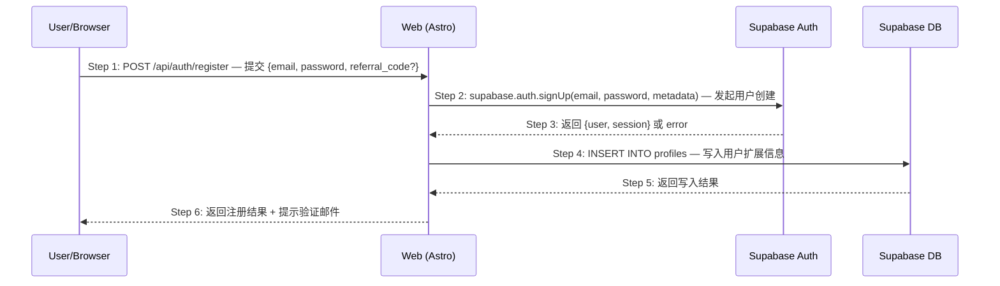

# Skill: Scenario Architect

> 从业务场景出发进行技术建模，绘制时序图，让 API 设计自然浮现，并设计完整的异常用例。

## 触发条件

- 用户要求画时序图、设计业务场景或进行场景建模
- 用户提到 "Phase 3 Step 1"、"场景驱动"、"技术方案设计"
- 已有产品设计文档，需要开始技术实现
- 用户描述了一个业务流程，需要分析其技术实现

## 核心能力

1. 从产品设计文档中识别和提取业务场景
2. 为每个场景绘制 Mermaid 时序图（严格遵循编号规范）
3. 为关键步骤撰写说明文字（解释"为什么"而非"做什么"）
4. 识别每个步骤的异常情况，设计结构化的异常用例
5. 生成场景概览文档（场景地图 + 场景索引）

## 执行步骤

### Step 1: 场景识别

从产品设计文档中提取所有核心业务场景。每个场景是一个完整的用户操作路径：

- **触发条件**：什么情况下进入这个场景
- **参与方**：涉及哪些系统组件
- **主路径**：正常情况下的完整流程
- **终止条件**：场景在什么状态下结束

输出场景清单：

```markdown
| 场景编号 | 场景名称 | 触发条件 | 核心参与方 |
|---------|---------|---------|-----------|
| S01 | 邮箱注册 | 新用户点击注册 | Browser, Web, Supabase Auth, DB |
| S02 | 密码登录 | 已注册用户登录 | Browser, Web, Supabase Auth |
```

### Step 2: 绘制时序图

为每个场景绘制 Mermaid 时序图，**严格遵循以下规范**：

**编号规范**：
- 每个箭头必须带 `Step N:` 编号前缀
- 编号从 1 开始连续递增
- 每个箭头附一行行为描述：`HTTP方法 /api/路径 — 一句话说明`

**参与方规范**：
- 使用短别名：`U`（User/Browser）、`W`（Web/Frontend）、`SB`（Supabase）、`DB`（Database）
- 每个参与方的全名在 `participant` 声明中注明

**格式示例**：



### Step 3: 撰写步骤说明

为每个关键 Step 撰写说明文字。**重点解释"为什么这样设计"**：

```markdown
#### Step 2: supabase.auth.signUp

选择在服务端调用 Supabase Auth 而非客户端直连，原因：
1. referral_code 的验证逻辑在服务端完成，避免客户端伪造
2. 可以在创建用户前做额外校验（如邮箱黑名单）
3. metadata 中的敏感信息不暴露到客户端
```

**说明文字的原则**：
- 不要重复描述"做了什么"（时序图已经说了）
- 重点解释"为什么选择这种方式"
- 标注重要的设计决策和取舍
- 标注影响安全性或性能的关键点

### Step 4: 设计异常用例

为时序图中每个步骤识别可能的异常情况，使用结构化格式：

```markdown
#### 异常用例

##### EX-2.1: 邮箱已注册
- **触发条件**：提交的 email 已存在于 auth.users 表
- **期望响应**：HTTP 409 `{ code: "EMAIL_EXISTS", message: "邮箱已注册" }`
- **副作用**：不创建任何记录，不发送邮件

##### EX-2.2: Supabase Auth 服务不可用
- **触发条件**：Supabase Auth 服务超时或返回 5xx
- **期望响应**：HTTP 503 `{ code: "AUTH_SERVICE_UNAVAILABLE", message: "认证服务暂时不可用" }`
- **副作用**：记录错误日志，触发告警

##### EX-4.1: profiles 写入失败
- **触发条件**：INSERT INTO profiles 违反唯一约束或 RLS 拒绝
- **期望响应**：HTTP 500 `{ code: "PROFILE_CREATE_FAILED", message: "用户配置创建失败" }`
- **副作用**：auth.users 中的记录已创建但 profiles 未创建（需要补偿机制）
```

**异常用例编号规则**：`EX-{步骤编号}.{序号}`

### Step 5: 生成场景概览文档

汇总所有场景，生成概览文档：

```markdown
# 业务场景概览

## 场景地图
[用表格列出所有场景及其状态]

## 场景依赖关系
[说明场景之间的前置/后置关系]

## 场景索引
[每个场景的文件链接]
```

## 输出规范

- **场景概览**：`resources/prd/3-technical-plan/2-scenario-implementation/00-scenario-overview.md`
- **场景文档**：`resources/prd/3-technical-plan/2-scenario-implementation/{序号}-{场景名}.md`
- 时序图使用 Mermaid 格式（可在 Markdown 中直接渲染）
- 异常用例使用 `EX-N.M` 编号，全局唯一
- 每个场景文档包含：时序图 + 步骤说明 + 异常用例

## 实践经验

- **场景 ≠ 功能**：一个功能可能涉及多个场景，一个场景可能跨多个功能。场景是"用户视角的完整路径"
- **先画主路径再补异常**：不要试图在第一遍就画出所有分支，先把主路径画清楚
- **异常用例的覆盖策略**：每个涉及外部调用（数据库、第三方服务）的步骤至少 1 个异常用例
- **步骤编号维护**：当需要在中间插入步骤时，重新编号所有后续步骤，并同步更新所有 EX 引用
- **参与方粒度**：在微服务架构中，每个服务是一个参与方；在单体应用中，按逻辑层划分（Web、Auth、DB）
- **时序图是 API 的来源**：时序图中跨系统边界的箭头就是需要设计的 API——如果一个 API 在时序图中找不到出处，它很可能不应该存在
