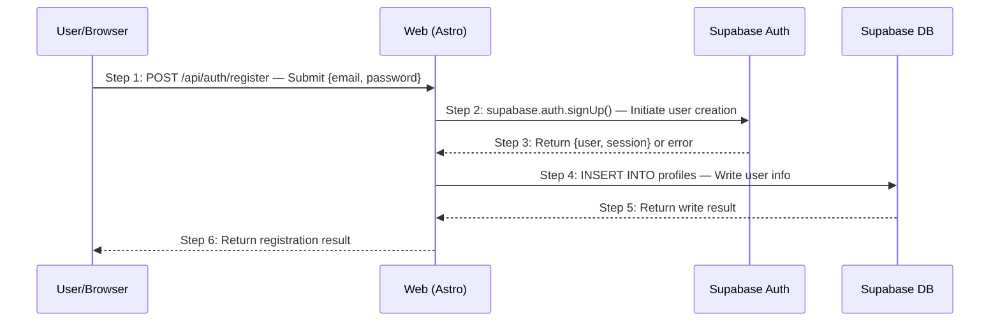

Expand business scenarios defined in Phase 1/2 into technical sequence diagrams, letting API design emerge naturally, and design comprehensive exception cases. Scenario numbering follows Phase 1 definitions.

## Phase & Trigger

- **Phase**: Phase 3 — HOW (Implementation), Step 1
- **Trigger conditions**:
  - User requests sequence diagrams or technical scenario modeling
  - User mentions "Phase 3 Step 1", "scenario-driven", "technical plan"
  - Requirements, product design, and architecture documents exist

## Prerequisites

- Requirements documents with scenario definitions (`S01`, `S02`...)
- Product design documents with interaction flows
- Architecture overview with system components and tech stack

## What It Does

1. Read scenario definitions from Phase 1/2 as input (never invent new scenarios)
2. Draw Mermaid sequence diagrams for each scenario with numbered steps
3. Write step-by-step narratives explaining each step
4. Identify exception conditions and design structured EX cases
5. Generate a scenario overview document (scenario map + index)

## Scenario Granularity Pre-Check

Before drawing any sequence diagram, verify that Phase 1 scenarios have proper granularity. Check for:

- **One-API scenarios**: Main path only has 1–2 steps → too fine-grained
- **CRUD fragmentation**: Separate "Create X", "Read X", "Update X", "Delete X" for the same entity → merge by goals
- **No business goal**: Outcome is just "data was written/read" → lacks real user goal

If detected, recommend returning to Phase 1 before proceeding.

## Sequence Diagram Conventions

- Every arrow has a `Step N:` number prefix, starting at 1
- Each arrow includes: `HTTP_METHOD /api/path — brief explanation`
- Participant aliases: `U` (User), `W` (Web/Frontend), `API` (Server), `DB` (Database)
- One scenario per file, numbered to correspond with Phase 1

## Step Narratives

After each diagram, a consecutively numbered list describes all steps:

- **Every step must be written out** — no skipping, no omitting
- **Every step has a clear subject** — the reader never guesses "who is acting"
- **Normal flow and exceptions are separate** — normal flow only contains `→ see EX-N.M` references

## Exception Case Design

Exception cases use `EX-{step number}.{sequence}` numbering and contain:

- **Trigger condition**: Which step triggers it and under what circumstances
- **Expected response**: HTTP status code, error code, error message
- **Side effects**: What data was or wasn't modified

Sources: Phase 1/2 exception acceptance criteria + technical exceptions (service unavailable, DB write failure, etc.).

## Outputs

| File | Location |
|------|----------|
| Scenario overview | `logos/resources/prd/3-technical-plan/2-scenario-implementation/00-scenario-overview.md` |
| Scenario documents | `logos/resources/prd/3-technical-plan/2-scenario-implementation/{number}-{name}.md` |

Each document contains: sequence diagram + step descriptions + exception cases.

## Best Practices

- **Do not identify scenarios from scratch** — all scenarios come from Phase 1
- **Phase 1/2 exceptions are inputs** — expand them into technical specs with HTTP status codes
- **Draw the main path first, then add exceptions** — get the normal flow clear first
- **Every external call step needs ≥1 exception case** (DB, third-party service)
- **Sequence diagrams are the source of APIs** — if an API can't trace back to a diagram, it shouldn't exist

## Related Skills

- Previous: [`architecture-designer`](/skills/architecture-designer) — design architecture
- Next: [`api-designer`](/skills/api-designer) — design API specifications
