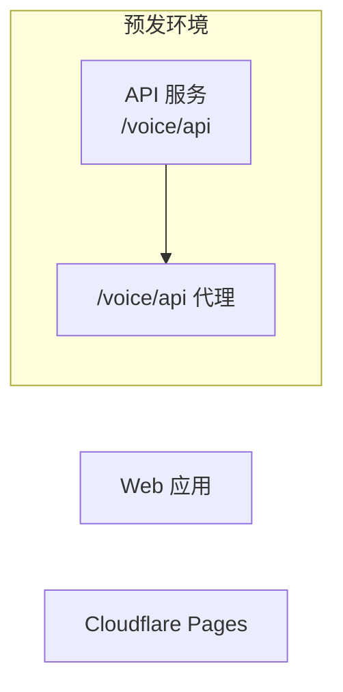

在深入每个场景的技术实现之前，先确立项目的技术全局视图 —— 系统架构、技术选型、部署拓扑与非功能性约束。确保后续的时序图、API 设计与代码生成都在一致的架构约束下进行。

## Phase 与触发条件

- **Phase**：Phase 3 — HOW（实现），Step 0
- **触发条件**：
  - 用户请求技术架构设计或技术选型
  - 用户提到「Phase 3 Step 0」「架构设计」「技术方案」
  - Phase 2 产品设计已完成

## 前置条件

- 需求文档已存在（`logos/resources/prd/1-product-requirements/`）
- 产品设计文档已存在（`logos/resources/prd/2-product-design/`）

## 它做了什么

1. 阅读 Phase 1/2 文档以理解完整的产品全貌
2. 根据产品复杂度推荐合适的系统架构
3. 为每项技术选择提供选型理由与备选方案对比
4. 绘制系统架构图（Mermaid）与部署拓扑图
5. 定义非功能性约束（性能、安全、可扩展性）
6. 梳理外部依赖并为每项定义测试策略
7. 更新 `logos-project.yaml` 中的 `tech_stack` 与 `external_dependencies`

## 按复杂度划分的架构

| 复杂度 | 模式 | 示例 |
|-----------|---------|---------|
| 简单 | 单体 + 单数据库 | 个人 SaaS、工具类产品 |
| 中等 | 前后端分离 + 单体后端 | 团队 SaaS、多角色系统 |
| 复杂 | 微服务 / 模块化单体 | 高并发、多平台 |

## Mermaid 语法安全

架构图使用 Mermaid `graph` / `flowchart`。节点标签只要包含空格、API 路径、端口、中文、`<br/>`，或 `/`、`(`、`)`、`:`、`#`、`{}`、`[]` 等符号，就应使用双引号文本。

普通组件标签使用 `ID["标签文本"]`：



避免 `PROXY[/voice/api 代理]` 这类未加引号写法；`[/` 是 Mermaid 形状语法，标签里再出现 `/` 时容易导致渲染失败。子图名称含空格、中文或符号时使用 `subgraph "名称"`。

## 技术选型格式

每个技术维度都包含选择、理由与备选：

```markdown
| Dimension | Selection | Rationale | Alternatives |
|-----------|-----------|-----------|-------------|
| Language | TypeScript | Unified frontend/backend, type safety | Go (when performance is priority) |
| Frontend | Next.js 15 | SSR + RSC, mature ecosystem | Astro (content sites) |
| Backend | Hono | Lightweight, edge-first, native TS | Express (ecosystem) |
| Database | PostgreSQL | Feature-rich, JSONB, RLS | MySQL (simple scenarios) |
```

## 外部依赖与测试策略

所有外部服务依赖（邮件、支付、OAuth 等）都必须在架构阶段定义测试策略：

| 策略 | 说明 | 典型场景 |
|----------|-------------|-----------------|
| `test-api` | 测试环境提供后门 API | 邮件/短信验证码 |
| `fixed-value` | 特定测试数据使用固定值 | 测试手机号的固定验证码 |
| `env-disable` | 环境变量禁用该功能 | 图形验证码、滑块验证 |
| `mock-callback` | 编排调用模拟回调 | 支付回调、Webhook |
| `mock-service` | 本地 mock 服务作为替代 | OAuth Provider |

这些策略会写入 `logos-project.yaml` 的 `external_dependencies`，并由 [`test-orchestrator`](/zh/skills/test-orchestrator) Skill 消费。

## 产出

| 文件 | 位置 |
|------|----------|
| 架构概览 | `logos/resources/prd/3-technical-plan/1-architecture/01-architecture-overview.md` |
| 更新后的配置 | `logos-project.yaml`（`tech_stack`、`external_dependencies`） |

## 最佳实践

- **不要过度设计** —— 对于独立开发者，单体 + PostgreSQL + Vercel 已足够
- **选型理由 > 选型本身** —— 记录「为什么」比「是什么」更有价值
- **架构图是时序图的前提** —— 系统组件会成为后续图中的参与者
- **`tech_stack` 是 AI 的锚点** —— 后续 AI 代码生成会从 `logos-project.yaml` 读取它
- **测试策略必须现在确定** —— 若推迟到编排测试阶段，后门 API 往往会缺失

## 相关 Skill

- 上一步：[`product-designer`](/zh/skills/product-designer) —— 创建产品设计
- 下一步：[`scenario-architect`](/zh/skills/scenario-architect) —— 将场景展开为时序图
