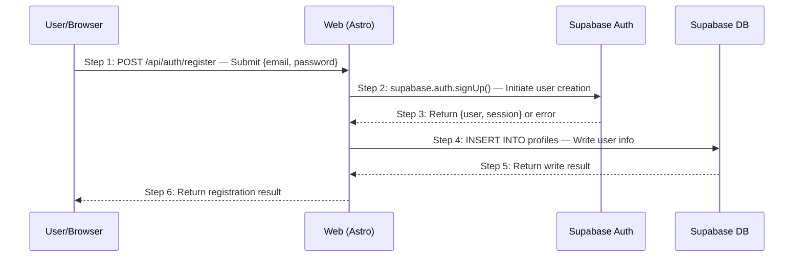

将 Phase 1/2 中定义的业务场景展开为技术时序图，让 API 设计自然浮现，并设计全面的异常情况。场景编号沿用 Phase 1 的定义。

## Phase 与触发条件

- **Phase**：Phase 3 — HOW（实现），Step 1
- **触发条件**：
  - 用户请求时序图或技术场景建模
  - 用户提到「Phase 3 Step 1」「场景驱动」「技术方案」
  - 需求、产品设计与架构文档均已存在

## 前置条件

- 包含场景定义（`S01`、`S02`……）的需求文档
- 包含交互流程的产品设计文档
- 包含系统组件与技术栈的架构概览

## 它做了什么

1. 读取 Phase 1/2 的场景定义作为输入（绝不臆造新场景）
2. 为每个场景绘制带步骤编号的 Mermaid 时序图
3. 编写逐步叙述，解释每个步骤
4. 识别异常条件并设计结构化的 EX 情况
5. 生成场景概览文档（场景地图 + 索引）

## 场景粒度预检查

在绘制任何时序图之前，先验证 Phase 1 场景是否具备合适的粒度。检查：

- **单 API 场景**：主路径只有 1–2 步 → 粒度过细
- **CRUD 碎片化**：同一实体拆出独立的「Create X」「Read X」「Update X」「Delete X」 → 按目标合并
- **无业务目标**：结果仅仅是「写入/读取了数据」 → 缺乏真正的用户目标

如检测到，建议先返回 Phase 1 再继续。

## 时序图约定

- 每个箭头都带 `Step N:` 编号前缀，从 1 开始
- 每个箭头包含：`HTTP_METHOD /api/path — 简要说明`
- 参与者别名：`U`（用户）、`W`（Web/前端）、`API`（服务端）、`DB`（数据库）
- 一个场景一个文件，编号与 Phase 1 对应
- 每条箭头消息必须保持单行
- 参与方别名使用短 ASCII 标识；长显示名、JSON、错误响应、字段解释和副作用说明放到图下方的步骤叙述

为保证 Mermaid 语法安全，时序图只表达调用顺序。消息里可以写 `POST /api/path`，但多行 JSON、长错误码列表、Markdown 表格、HTML 或复杂括号嵌套应放到**步骤叙述**或**异常情况设计**中。

## 步骤叙述

每张图之后，用一个连续编号的列表描述所有步骤：

- **每个步骤都必须写出来** —— 不跳过、不省略
- **每个步骤都有明确的主语** —— 读者无需猜测「谁在动作」
- **正常流程与异常分离** —— 正常流程只包含 `→ 见 EX-N.M` 引用

## 异常情况设计

异常情况使用 `EX-{步骤编号}.{序号}` 编号，包含：

- **触发条件**：哪一步、在什么情况下触发
- **预期响应**：HTTP 状态码、错误码、错误消息
- **副作用**：哪些数据被修改或未被修改

来源：Phase 1/2 的异常验收标准 + 技术异常（服务不可用、DB 写入失败等）。

## 产出

| 文件 | 位置 |
|------|----------|
| 场景概览 | `logos/resources/prd/3-technical-plan/2-scenario-implementation/00-scenario-overview.md` |
| 场景文档 | `logos/resources/prd/3-technical-plan/2-scenario-implementation/{number}-{name}.md` |

每份文档包含：时序图 + 步骤说明 + 异常情况。

## 最佳实践

- **不要从零识别场景** —— 所有场景都来自 Phase 1
- **Phase 1/2 的异常是输入** —— 将其展开为带 HTTP 状态码的技术规格
- **先画主路径，再补异常** —— 先把正常流程理清楚
- **每个外部调用步骤都需要 ≥1 个异常情况**（DB、第三方服务）
- **时序图是 API 的源头** —— 若某个 API 无法追溯到图，它就不应存在

## 相关 Skill

- 上一步：[`architecture-designer`](/zh/skills/architecture-designer) —— 设计架构
- 下一步：[`api-designer`](/zh/skills/api-designer) —— 设计 API 规格
